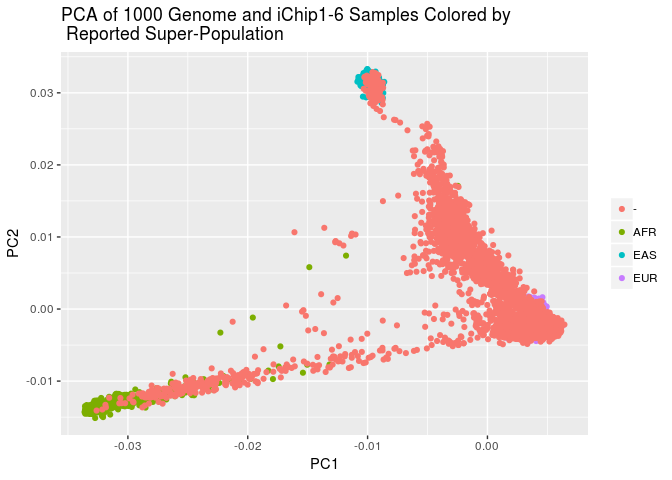
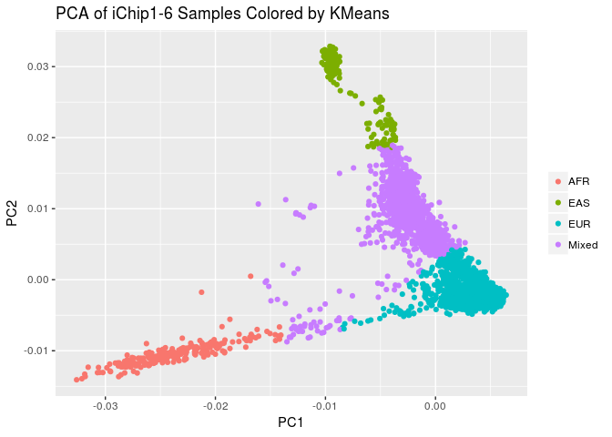

Estimating Ethnicity in the iChip 1-6 Dataset
================
Translational Genomics Group
04 September, 2018

Goals
-----

The principle goal of this notebook is to provide an ancestry estimate for each subject in the iChip1t6 dataset dataset that can later be used for sub-setting to more homogenous populations.

Ancestry estimation will be performed using the ADMIXTURE tool. Allele frequencies will first be learned in a supervised manner from labeled data provided by 1000 Genomes samples belonging to the EUR, AFR and EAS populations. Then ancestry proportions will then be estimated for the iChip 1 -6 samples.

1. Preapre iChip 1 to 6 Dataset
-------------------------------

### A. Download Immuno\_BeadChip\_11419691\_B Strand Files for iChip 1 to 6 and Ref/Alt File

``` bash
wget http://www.well.ox.ac.uk/~wrayner/strand/Immuno_BeadChip_11419691_B-b37-strand.zip -O temp.zip; unzip temp.zip; rm temp.zip &>/dev/null

wget http://www.well.ox.ac.uk/~wrayner/strand/RefAlt/Immuno_BeadChip_11419691_B-b37.strand.RefAlt.zip -O temp.zip; unzip temp.zip; rm temp.zip &>/dev/null
```

### B. Create List of SNPs to Flip

``` r
strand <- read_tsv("immuno_beadchip_11419691_b-b37.strand", 
                   col_names = c("SNP", "Chr", "BP", "Match", "Strand", "Allele"))
```

    ## Parsed with column specification:
    ## cols(
    ##   SNP = col_character(),
    ##   Chr = col_character(),
    ##   BP = col_integer(),
    ##   Match = col_double(),
    ##   Strand = col_character(),
    ##   Allele = col_character()
    ## )

``` r
strand %>%
  filter(Strand == "-") %>%
  select(SNP) %>%
  write_tsv("temp_flip_ichip1t6.tsv", col_names = FALSE)
```

### C. Flip SNPs to Convert TOP to Forward/Ref in Plink

``` bash
plink \
--bfile ../1.split_cohorts/cohort_split_ichip1t6 \
--flip temp_flip_ichip1t6.tsv \
--make-bed \
--out temp_ichip1t6
```

    ## PLINK v1.90b5.4 64-bit (10 Apr 2018)           www.cog-genomics.org/plink/1.9/
    ## (C) 2005-2018 Shaun Purcell, Christopher Chang   GNU General Public License v3
    ## Logging to temp_ichip1t6.log.
    ## Options in effect:
    ##   --bfile ../1.split_cohorts/cohort_split_ichip1t6
    ##   --flip temp_flip_ichip1t6.tsv
    ##   --make-bed
    ##   --out temp_ichip1t6
    ## 
    ## 128908 MB RAM detected; reserving 64454 MB for main workspace.
    ## 268093 variants loaded from .bim file.
    ## 9971 people (4912 males, 5054 females, 5 ambiguous) loaded from .fam.
    ## Ambiguous sex IDs written to temp_ichip1t6.nosex .
    ## --flip: 90474 SNPs flipped, 7219 SNP IDs not present.
    ## Using 1 thread (no multithreaded calculations invoked).
    ## Before main variant filters, 9971 founders and 0 nonfounders present.
    ## Calculating allele frequencies... 0%1%2%3%4%5%6%7%8%9%10%11%12%13%14%15%16%17%18%19%20%21%22%23%24%25%26%27%28%29%30%31%32%33%34%35%36%37%38%39%40%41%42%43%44%45%46%47%48%49%50%51%52%53%54%55%56%57%58%59%60%61%62%63%64%65%66%67%68%69%70%71%72%73%74%75%76%77%78%79%80%81%82%83%84%85%86%87%88%89%90%91%92%93%94%95%96%97%98%99% done.
    ## Total genotyping rate is 0.560781.
    ## 268093 variants and 9971 people pass filters and QC.
    ## Note: No phenotypes present.
    ## --make-bed to temp_ichip1t6.bed + temp_ichip1t6.bim + temp_ichip1t6.fam ...
    ## 0%1%2%3%4%5%6%7%8%9%10%11%12%13%14%15%16%17%18%19%20%21%22%23%24%25%26%27%28%29%30%31%32%33%34%35%36%37%38%39%40%41%42%43%44%45%46%47%48%49%50%51%52%53%54%55%56%57%58%59%60%61%62%63%64%65%66%67%68%69%70%71%72%73%74%75%76%77%78%79%80%81%82%83%84%85%86%87%88%89%90%91%92%93%94%95%96%97%98%99%done.

### D. Set Ref/Alt Allele

``` bash
plink \
--bfile temp_ichip1t6 \
--reference-allele Immuno_BeadChip_11419691_B-b37.strand.RefAlt 2 \
--make-bed \
--out temp2_ichip1t6
```

    ## PLINK v1.90b5.4 64-bit (10 Apr 2018)           www.cog-genomics.org/plink/1.9/
    ## (C) 2005-2018 Shaun Purcell, Christopher Chang   GNU General Public License v3
    ## Logging to temp2_ichip1t6.log.
    ## Options in effect:
    ##   --a1-allele Immuno_BeadChip_11419691_B-b37.strand.RefAlt 2
    ##   --bfile temp_ichip1t6
    ##   --make-bed
    ##   --out temp2_ichip1t6
    ## 
    ## 128908 MB RAM detected; reserving 64454 MB for main workspace.
    ## 268093 variants loaded from .bim file.
    ## 9971 people (4912 males, 5054 females, 5 ambiguous) loaded from .fam.
    ## Ambiguous sex IDs written to temp2_ichip1t6.nosex .
    ## Using 1 thread (no multithreaded calculations invoked).
    ## Before main variant filters, 9971 founders and 0 nonfounders present.
    ## Calculating allele frequencies... 0%1%2%3%4%5%6%7%8%9%10%11%12%13%14%15%16%17%18%19%20%21%22%23%24%25%26%27%28%29%30%31%32%33%34%35%36%37%38%39%40%41%42%43%44%45%46%47%48%49%50%51%52%53%54%55%56%57%58%59%60%61%62%63%64%65%66%67%68%69%70%71%72%73%74%75%76%77%78%79%80%81%82%83%84%85%86%87%88%89%90%91%92%93%94%95%96%97%98%99% done.
    ## Total genotyping rate is 0.560781.
    ## --a1-allele: 179340 assignments made.
    ## 268093 variants and 9971 people pass filters and QC.
    ## Note: No phenotypes present.
    ## --make-bed to temp2_ichip1t6.bed + temp2_ichip1t6.bim + temp2_ichip1t6.fam ...
    ## 0%1%2%3%4%5%6%7%8%9%10%11%12%13%14%15%16%17%18%19%20%21%22%23%24%25%26%27%28%29%30%31%32%33%34%35%36%37%38%39%40%41%42%43%44%45%46%47%48%49%50%51%52%53%54%55%56%57%58%59%60%61%62%63%64%65%66%67%68%69%70%71%72%73%74%75%76%77%78%79%80%81%82%83%84%85%86%87%88%89%90%91%92%93%94%95%96%97%98%99%done.

### D. Download 1000G Check Tool

``` bash
wget http://www.well.ox.ac.uk/~wrayner/tools/HRC-1000G-check-bim-v4.2.9.zip -O temp.zip; unzip temp.zip; rm temp.zip
```

### E. Download 1000 Genome Reference

This is a large file ~10GB and needs to be unzipped. A local copy has already been downloaded to: /mnt/share6/SHARED\_DATASETS/1000\_genomes/reference\_file/1000GP\_Phase3\_combined.legend

``` bash
wget http://www.well.ox.ac.uk/~wrayner/tools/1000GP_Phase3_combined.legend.gz ; gunzip -k 1000GP_Phase3_combined.legend.gz; rm 1000GP_Phase3_combined.legend.gz
```

### F. Filter to high quality SNPs For Ancestry Estimation

``` bash
plink \
--bfile temp2_ichip1t6 \
--geno 0.03 \
--maf 0.01 \
--hwe 0.000001 \
--keep-allele-order \
--make-bed \
--out temp3_ichip1t6
```

    ## PLINK v1.90b5.4 64-bit (10 Apr 2018)           www.cog-genomics.org/plink/1.9/
    ## (C) 2005-2018 Shaun Purcell, Christopher Chang   GNU General Public License v3
    ## Logging to temp3_ichip1t6.log.
    ## Options in effect:
    ##   --bfile temp2_ichip1t6
    ##   --geno 0.03
    ##   --hwe 0.000001
    ##   --keep-allele-order
    ##   --maf 0.01
    ##   --make-bed
    ##   --out temp3_ichip1t6
    ## 
    ## 128908 MB RAM detected; reserving 64454 MB for main workspace.
    ## 268093 variants loaded from .bim file.
    ## 9971 people (4912 males, 5054 females, 5 ambiguous) loaded from .fam.
    ## Ambiguous sex IDs written to temp3_ichip1t6.nosex .
    ## Using 1 thread (no multithreaded calculations invoked).
    ## Before main variant filters, 9971 founders and 0 nonfounders present.
    ## Calculating allele frequencies... 0%1%2%3%4%5%6%7%8%9%10%11%12%13%14%15%16%17%18%19%20%21%22%23%24%25%26%27%28%29%30%31%32%33%34%35%36%37%38%39%40%41%42%43%44%45%46%47%48%49%50%51%52%53%54%55%56%57%58%59%60%61%62%63%64%65%66%67%68%69%70%71%72%73%74%75%76%77%78%79%80%81%82%83%84%85%86%87%88%89%90%91%92%93%94%95%96%97%98%99% done.
    ## Total genotyping rate is 0.560781.
    ## 135747 variants removed due to missing genotype data (--geno).
    ## --hwe: 10364 variants removed due to Hardy-Weinberg exact test.
    ## 15042 variants removed due to minor allele threshold(s)
    ## (--maf/--max-maf/--mac/--max-mac).
    ## 106940 variants and 9971 people pass filters and QC.
    ## Note: No phenotypes present.
    ## --make-bed to temp3_ichip1t6.bed + temp3_ichip1t6.bim + temp3_ichip1t6.fam ...
    ## 0%1%2%3%4%5%6%7%8%9%10%11%12%13%14%15%16%17%18%19%20%21%22%23%24%25%26%27%28%29%30%31%32%33%34%35%36%37%38%39%40%41%42%43%44%45%46%47%48%49%50%51%52%53%54%55%56%57%58%59%60%61%62%63%64%65%66%67%68%69%70%71%72%73%74%75%76%77%78%79%80%81%82%83%84%85%86%87%88%89%90%91%92%93%94%95%96%97%98%99%done.

### Calcualte Allele Frequency

``` bash
plink \
--bfile temp3_ichip1t6 \
--keep-allele-order \
--freq \
--out temp3_ichip1t6
```

    ## PLINK v1.90b5.4 64-bit (10 Apr 2018)           www.cog-genomics.org/plink/1.9/
    ## (C) 2005-2018 Shaun Purcell, Christopher Chang   GNU General Public License v3
    ## Logging to temp3_ichip1t6.log.
    ## Options in effect:
    ##   --bfile temp3_ichip1t6
    ##   --freq
    ##   --keep-allele-order
    ##   --out temp3_ichip1t6
    ## 
    ## 128908 MB RAM detected; reserving 64454 MB for main workspace.
    ## 106940 variants loaded from .bim file.
    ## 9971 people (4912 males, 5054 females, 5 ambiguous) loaded from .fam.
    ## Ambiguous sex IDs written to temp3_ichip1t6.nosex .
    ## Using 1 thread (no multithreaded calculations invoked).
    ## Before main variant filters, 9971 founders and 0 nonfounders present.
    ## Calculating allele frequencies... 0%1%2%3%4%5%6%7%8%9%10%11%12%13%14%15%16%17%18%19%20%21%22%23%24%25%26%27%28%29%30%31%32%33%34%35%36%37%38%39%40%41%42%43%44%45%46%47%48%49%50%51%52%53%54%55%56%57%58%59%60%61%62%63%64%65%66%67%68%69%70%71%72%73%74%75%76%77%78%79%80%81%82%83%84%85%86%87%88%89%90%91%92%93%94%95%96%97%98%99% done.
    ## Total genotyping rate is 0.999749.
    ## --freq: Allele frequencies (founders only) written to temp3_ichip1t6.frq .

### Run 1000G Checks

This takes ~30 minutes.

``` bash
perl HRC-1000G-check-bim.pl \
-b temp3_ichip1t6.bim \
-f temp3_ichip1t6.frq \
-r /mnt/share6/SHARED_DATASETS/1000_genomes/reference_file/1000GP_Phase3_combined.legend \
-g
```

#### Exlude SNPs

``` bash
plink2 \
--bfile temp3_ichip1t6 \
--exclude Exclude-temp3_ichip1t6-1000G.txt \
--set-all-var-ids @:#[hg19] \
--keep-allele-order \
--make-bed \
--out temp4_ichip1t6
```

    ## PLINK v2.00a2LM 64-bit Intel (28 Apr 2018)     www.cog-genomics.org/plink/2.0/
    ## (C) 2005-2018 Shaun Purcell, Christopher Chang   GNU General Public License v3
    ## Logging to temp4_ichip1t6.log.
    ## Options in effect:
    ##   --bfile temp3_ichip1t6
    ##   --exclude Exclude-temp3_ichip1t6-1000G.txt
    ##   --keep-allele-order
    ##   --make-bed
    ##   --out temp4_ichip1t6
    ##   --set-all-var-ids @:#[hg19]
    ## 
    ## Start time: Tue Sep  4 18:10:18 2018
    ## Note: --keep-allele-order no longer has any effect.
    ## 128908 MiB RAM detected; reserving 64454 MiB for main workspace.
    ## Using up to 48 threads (change this with --threads).
    ## 9971 samples (5054 females, 4912 males, 5 ambiguous; 9971 founders) loaded from
    ## temp3_ichip1t6.fam.
    ## 106940 variants loaded from temp3_ichip1t6.bim.
    ## Note: No phenotype data present.
    ## --exclude: 106940 variants remaining.
    ## 106940 variants remaining after main filters.
    ## Writing temp4_ichip1t6.bed ... 0%61%done.
    ## Writing temp4_ichip1t6.bim ... done.
    ## Writing temp4_ichip1t6.fam ... done.
    ## End time: Tue Sep  4 18:10:18 2018

Process 1000 Genomes Data
-------------------------

### Download Raw Data for Chr 1 - 22

``` bash
for i in {1..22}; do
       wget ftp://ftp-trace.ncbi.nih.gov/1000genomes/ftp/release/20130502/ALL.chr${i}.phase3_shapeit2_mvncall_integrated_v5a.20130502.genotypes.vcf.gz
done
```

### Get list of CHR and Position from Marker names to be used to extract subset of 1000 Genome

``` r
snplist <- read_table2("temp4_ichip1t6.bim", col_names = c("Chr", "SNP", "Pos", "BP", "A1", "A2"))

snplist %>%
  select(Chr, BP) %>%
  write_tsv("temp_site_list.txt", col_names = FALSE)
```

### Extract Markers from 1000Genome with Chrom and Position that Match Share iCHIP

``` bash
for i in {1..22}; do
      vcftools --gzvcf /mnt/share6/SHARED_DATASETS/1000_genomes/ALL.chr${i}.phase3_shapeit2_mvncall_integrated_v5a.20130502.genotypes.vcf.gz \
               --positions temp_site_list.txt \
               --recode \
               --recode-INFO-all \
               --out ichip1t6_1000G_markers/chr${i}.1000g.ichip_sites &
done
```

### Concatenate chromosome VCFs into one VCF

``` bash
bcftools concat -f ../../original_data/ordered_filenames.txt -o ichip1t6_1000G_markers/chrall_1000g_ichip_sites.vcf
```

### Get List of 1000 Genome Samples Filtered for EUR, AFR, EAS superpopulation samples

``` r
onek_samples <- read_tsv("../../original_data/igsr_samples.tsv")
colnames(onek_samples) <- make.names(colnames(onek_samples))

onek_samples %>%
  filter(Superpopulation.code %in% c("EUR", "AFR", "EAS")) %>%
  mutate(FID = 0) %>%
  select(FID, Sample.name) %>% 
  write_tsv("temp_onek_samples_3_pops.tsv", col_names = FALSE)
```

### Read Combined Chromosomes 1000 Genomes Samples with only Share Markers into PLINK and Set Names and Exclude not 3 Population Samples

``` bash
plink2 \
--vcf ichip1t6_1000G_markers/chrall_1000g_ichip_sites.vcf \
--set-all-var-ids @:#[hg19] \
--new-id-max-allele-len 23 'truncate' \
--keep temp_onek_samples_3_pops.tsv \
--make-bed \
--out temp_chrall_1000g_ichip_sites
```

    ## PLINK v2.00a2LM 64-bit Intel (28 Apr 2018)     www.cog-genomics.org/plink/2.0/
    ## (C) 2005-2018 Shaun Purcell, Christopher Chang   GNU General Public License v3
    ## Logging to temp_chrall_1000g_ichip_sites.log.
    ## Options in effect:
    ##   --keep temp_onek_samples_3_pops.tsv
    ##   --make-bed
    ##   --new-id-max-allele-len 23 truncate
    ##   --out temp_chrall_1000g_ichip_sites
    ##   --set-all-var-ids @:#[hg19]
    ##   --vcf ichip1t6_1000G_markers/chrall_1000g_ichip_sites.vcf
    ## 
    ## Start time: Tue Sep  4 18:10:19 2018
    ## 128908 MiB RAM detected; reserving 64454 MiB for main workspace.
    ## Using up to 48 threads (change this with --threads).
    ## 
    --vcf: 1k variants scanned.
    --vcf: 2k variants scanned.
    --vcf: 3k variants scanned.
    --vcf: 4k variants scanned.
    --vcf: 5k variants scanned.
    --vcf: 6k variants scanned.
    --vcf: 7k variants scanned.
    --vcf: 8k variants scanned.
    --vcf: 9k variants scanned.
    --vcf: 10k variants scanned.
    --vcf: 11k variants scanned.
    --vcf: 12k variants scanned.
    --vcf: 13k variants scanned.
    --vcf: 14k variants scanned.
    --vcf: 15k variants scanned.
    --vcf: 16k variants scanned.
    --vcf: 17k variants scanned.
    --vcf: 18k variants scanned.
    --vcf: 19k variants scanned.
    --vcf: 20k variants scanned.
    --vcf: 21k variants scanned.
    --vcf: 22k variants scanned.
    --vcf: 23k variants scanned.
    --vcf: 24k variants scanned.
    --vcf: 25k variants scanned.
    --vcf: 26k variants scanned.
    --vcf: 27k variants scanned.
    --vcf: 28k variants scanned.
    --vcf: 29k variants scanned.
    --vcf: 30k variants scanned.
    --vcf: 31k variants scanned.
    --vcf: 32k variants scanned.
    --vcf: 33k variants scanned.
    --vcf: 34k variants scanned.
    --vcf: 35k variants scanned.
    --vcf: 36k variants scanned.
    --vcf: 37k variants scanned.
    --vcf: 38k variants scanned.
    --vcf: 39k variants scanned.
    --vcf: 40k variants scanned.
    --vcf: 41k variants scanned.
    --vcf: 42k variants scanned.
    --vcf: 43k variants scanned.
    --vcf: 44k variants scanned.
    --vcf: 45k variants scanned.
    --vcf: 46k variants scanned.
    --vcf: 47k variants scanned.
    --vcf: 48k variants scanned.
    --vcf: 49k variants scanned.
    --vcf: 50k variants scanned.
    --vcf: 51k variants scanned.
    --vcf: 52k variants scanned.
    --vcf: 53k variants scanned.
    --vcf: 54k variants scanned.
    --vcf: 55k variants scanned.
    --vcf: 56k variants scanned.
    --vcf: 57k variants scanned.
    --vcf: 58k variants scanned.
    --vcf: 59k variants scanned.
    --vcf: 60k variants scanned.
    --vcf: 61k variants scanned.
    --vcf: 62k variants scanned.
    --vcf: 63k variants scanned.
    --vcf: 64k variants scanned.
    --vcf: 65k variants scanned.
    --vcf: 66k variants scanned.
    --vcf: 67k variants scanned.
    --vcf: 68k variants scanned.
    --vcf: 69k variants scanned.
    --vcf: 70k variants scanned.
    --vcf: 71k variants scanned.
    --vcf: 72k variants scanned.
    --vcf: 73k variants scanned.
    --vcf: 74k variants scanned.
    --vcf: 75k variants scanned.
    --vcf: 76k variants scanned.
    --vcf: 77k variants scanned.
    --vcf: 78k variants scanned.
    --vcf: 79k variants scanned.
    --vcf: 80k variants scanned.
    --vcf: 81k variants scanned.
    --vcf: 82k variants scanned.
    --vcf: 83k variants scanned.
    --vcf: 84k variants scanned.
    --vcf: 85k variants scanned.
    --vcf: 86k variants scanned.
    --vcf: 87k variants scanned.
    --vcf: 88k variants scanned.
    --vcf: 89k variants scanned.
    --vcf: 90k variants scanned.
    --vcf: 91k variants scanned.
    --vcf: 92k variants scanned.
    --vcf: 93k variants scanned.
    --vcf: 94k variants scanned.
    --vcf: 95k variants scanned.
    --vcf: 96k variants scanned.
    --vcf: 97k variants scanned.
    --vcf: 98k variants scanned.
    --vcf: 99k variants scanned.
    --vcf: 100k variants scanned.
    --vcf: 101k variants scanned.
    --vcf: 102k variants scanned.
    --vcf: 102506 variants scanned.
    ## 
    --vcf: 1k variants converted.
    --vcf: 2k variants converted.
    --vcf: 3k variants converted.
    --vcf: 4k variants converted.
    --vcf: 5k variants converted.
    --vcf: 6k variants converted.
    --vcf: 7k variants converted.
    --vcf: 8k variants converted.
    --vcf: 9k variants converted.
    --vcf: 10k variants converted.
    --vcf: 11k variants converted.
    --vcf: 12k variants converted.
    --vcf: 13k variants converted.
    --vcf: 14k variants converted.
    --vcf: 15k variants converted.
    --vcf: 16k variants converted.
    --vcf: 17k variants converted.
    --vcf: 18k variants converted.
    --vcf: 19k variants converted.
    --vcf: 20k variants converted.
    --vcf: 21k variants converted.
    --vcf: 22k variants converted.
    --vcf: 23k variants converted.
    --vcf: 24k variants converted.
    --vcf: 25k variants converted.
    --vcf: 26k variants converted.
    --vcf: 27k variants converted.
    --vcf: 28k variants converted.
    --vcf: 29k variants converted.
    --vcf: 30k variants converted.
    --vcf: 31k variants converted.
    --vcf: 32k variants converted.
    --vcf: 33k variants converted.
    --vcf: 34k variants converted.
    --vcf: 35k variants converted.
    --vcf: 36k variants converted.
    --vcf: 37k variants converted.
    --vcf: 38k variants converted.
    --vcf: 39k variants converted.
    --vcf: 40k variants converted.
    --vcf: 41k variants converted.
    --vcf: 42k variants converted.
    --vcf: 43k variants converted.
    --vcf: 44k variants converted.
    --vcf: 45k variants converted.
    --vcf: 46k variants converted.
    --vcf: 47k variants converted.
    --vcf: 48k variants converted.
    --vcf: 49k variants converted.
    --vcf: 50k variants converted.
    --vcf: 51k variants converted.
    --vcf: 52k variants converted.
    --vcf: 53k variants converted.
    --vcf: 54k variants converted.
    --vcf: 55k variants converted.
    --vcf: 56k variants converted.
    --vcf: 57k variants converted.
    --vcf: 58k variants converted.
    --vcf: 59k variants converted.
    --vcf: 60k variants converted.
    --vcf: 61k variants converted.
    --vcf: 62k variants converted.
    --vcf: 63k variants converted.
    --vcf: 64k variants converted.
    --vcf: 65k variants converted.
    --vcf: 66k variants converted.
    --vcf: 67k variants converted.
    --vcf: 68k variants converted.
    --vcf: 69k variants converted.
    --vcf: 70k variants converted.
    --vcf: 71k variants converted.
    --vcf: 72k variants converted.
    --vcf: 73k variants converted.
    --vcf: 74k variants converted.
    --vcf: 75k variants converted.
    --vcf: 76k variants converted.
    --vcf: 77k variants converted.
    --vcf: 78k variants converted.
    --vcf: 79k variants converted.
    --vcf: 80k variants converted.
    --vcf: 81k variants converted.
    --vcf: 82k variants converted.
    --vcf: 83k variants converted.
    --vcf: 84k variants converted.
    --vcf: 85k variants converted.
    --vcf: 86k variants converted.
    --vcf: 87k variants converted.
    --vcf: 88k variants converted.
    --vcf: 89k variants converted.
    --vcf: 90k variants converted.
    --vcf: 91k variants converted.
    --vcf: 92k variants converted.
    --vcf: 93k variants converted.
    --vcf: 94k variants converted.
    --vcf: 95k variants converted.
    --vcf: 96k variants converted.
    --vcf: 97k variants converted.
    --vcf: 98k variants converted.
    --vcf: 99k variants converted.
    --vcf: 100k variants converted.
    --vcf: 101k variants converted.
    --vcf: 102k variants converted.
    --vcf: temp_chrall_1000g_ichip_sites-temporary.pgen +
    ## temp_chrall_1000g_ichip_sites-temporary.pvar +
    ## temp_chrall_1000g_ichip_sites-temporary.psam written.
    ## 2504 samples (0 females, 0 males, 2504 ambiguous; 2504 founders) loaded from
    ## temp_chrall_1000g_ichip_sites-temporary.psam.
    ## 102506 variants loaded from temp_chrall_1000g_ichip_sites-temporary.pvar.
    ## Note: No phenotype data present.
    ## --keep: 1668 samples remaining.
    ## 1668 samples (0 females, 0 males, 1668 ambiguous; 1668 founders) remaining
    ## after main filters.
    ## Writing temp_chrall_1000g_ichip_sites.bed ... 0%63%done.
    ## Writing temp_chrall_1000g_ichip_sites.bim ... done.
    ## Writing temp_chrall_1000g_ichip_sites.fam ... done.
    ## End time: Tue Sep  4 18:10:24 2018

Merge iCHIP and 1000 Genomes
----------------------------

``` bash
plink \
--bfile temp4_ichip1t6 \
--bmerge temp_chrall_1000g_ichip_sites \
--merge-mode 6 \
--keep-allele-order \
--out ichip1t6_1000g_ichip_sites_merged
```

### Remove Non Bi-allelic SNPs iCHIP

``` bash
plink \
--bfile temp4_ichip1t6 \
--exclude ichip1t6_1000g_ichip_sites_merged.missnp \
--make-bed \
--keep-allele-order \
--out temp5_ichip1t6
```

    ## PLINK v1.90b5.4 64-bit (10 Apr 2018)           www.cog-genomics.org/plink/1.9/
    ## (C) 2005-2018 Shaun Purcell, Christopher Chang   GNU General Public License v3
    ## Logging to temp5_ichip1t6.log.
    ## Options in effect:
    ##   --bfile temp4_ichip1t6
    ##   --exclude ichip1t6_1000g_ichip_sites_merged.missnp
    ##   --keep-allele-order
    ##   --make-bed
    ##   --out temp5_ichip1t6
    ## 
    ## 128908 MB RAM detected; reserving 64454 MB for main workspace.
    ## 106940 variants loaded from .bim file.
    ## 9971 people (4912 males, 5054 females, 5 ambiguous) loaded from .fam.
    ## Ambiguous sex IDs written to temp5_ichip1t6.nosex .
    ## --exclude: 106855 variants remaining.
    ## Using 1 thread (no multithreaded calculations invoked).
    ## Before main variant filters, 9971 founders and 0 nonfounders present.
    ## Calculating allele frequencies... 0%1%2%3%4%5%6%7%8%9%10%11%12%13%14%15%16%17%18%19%20%21%22%23%24%25%26%27%28%29%30%31%32%33%34%35%36%37%38%39%40%41%42%43%44%45%46%47%48%49%50%51%52%53%54%55%56%57%58%59%60%61%62%63%64%65%66%67%68%69%70%71%72%73%74%75%76%77%78%79%80%81%82%83%84%85%86%87%88%89%90%91%92%93%94%95%96%97%98%99% done.
    ## Total genotyping rate is 0.999749.
    ## 106855 variants and 9971 people pass filters and QC.
    ## Note: No phenotypes present.
    ## --make-bed to temp5_ichip1t6.bed + temp5_ichip1t6.bim + temp5_ichip1t6.fam ...
    ## 0%1%2%3%4%5%6%7%8%9%10%11%12%13%14%15%16%17%18%19%20%21%22%23%24%25%26%27%28%29%30%31%32%33%34%35%36%37%38%39%40%41%42%43%44%45%46%47%48%49%50%51%52%53%54%55%56%57%58%59%60%61%62%63%64%65%66%67%68%69%70%71%72%73%74%75%76%77%78%79%80%81%82%83%84%85%86%87%88%89%90%91%92%93%94%95%96%97%98%99%done.

### Remove Non Bi-allelic SNPs 1000 Genome

``` bash
plink \
--bfile temp_chrall_1000g_ichip_sites \
--exclude ichip1t6_1000g_ichip_sites_merged.missnp \
--make-bed \
--keep-allele-order \
--out temp1_chrall_1000g_ichip_sites
```

    ## PLINK v1.90b5.4 64-bit (10 Apr 2018)           www.cog-genomics.org/plink/1.9/
    ## (C) 2005-2018 Shaun Purcell, Christopher Chang   GNU General Public License v3
    ## Logging to temp1_chrall_1000g_ichip_sites.log.
    ## Options in effect:
    ##   --bfile temp_chrall_1000g_ichip_sites
    ##   --exclude ichip1t6_1000g_ichip_sites_merged.missnp
    ##   --keep-allele-order
    ##   --make-bed
    ##   --out temp1_chrall_1000g_ichip_sites
    ## 
    ## 128908 MB RAM detected; reserving 64454 MB for main workspace.
    ## 102506 variants loaded from .bim file.
    ## 1668 people (0 males, 0 females, 1668 ambiguous) loaded from .fam.
    ## Ambiguous sex IDs written to temp1_chrall_1000g_ichip_sites.nosex .
    ## --exclude: 102426 variants remaining.
    ## Using 1 thread (no multithreaded calculations invoked).
    ## Before main variant filters, 1668 founders and 0 nonfounders present.
    ## Calculating allele frequencies... 0%1%2%3%4%5%6%7%8%9%10%11%12%13%14%15%16%17%18%19%20%21%22%23%24%25%26%27%28%29%30%31%32%33%34%35%36%37%38%39%40%41%42%43%44%45%46%47%48%49%50%51%52%53%54%55%56%57%58%59%60%61%62%63%64%65%66%67%68%69%70%71%72%73%74%75%76%77%78%79%80%81%82%83%84%85%86%87%88%89%90%91%92%93%94%95%96%97%98%99% done.
    ## 102426 variants and 1668 people pass filters and QC.
    ## Note: No phenotypes present.
    ## --make-bed to temp1_chrall_1000g_ichip_sites.bed +
    ## temp1_chrall_1000g_ichip_sites.bim + temp1_chrall_1000g_ichip_sites.fam ...
    ## 0%1%2%3%4%5%6%7%8%9%10%11%12%13%14%15%16%17%18%19%20%21%22%23%24%25%26%27%28%29%30%31%32%33%34%35%36%37%38%39%40%41%42%43%44%45%46%47%48%49%50%51%52%53%54%55%56%57%58%59%60%61%62%63%64%65%66%67%68%69%70%71%72%73%74%75%76%77%78%79%80%81%82%83%84%85%86%87%88%89%90%91%92%93%94%95%96%97%98%99%done.

### Merge

``` bash
plink \
--bfile temp5_ichip1t6 \
--bmerge temp1_chrall_1000g_ichip_sites \
--keep-allele-order \
--out temp_ichip_1000g_sites_merged
```

    ## PLINK v1.90b5.4 64-bit (10 Apr 2018)           www.cog-genomics.org/plink/1.9/
    ## (C) 2005-2018 Shaun Purcell, Christopher Chang   GNU General Public License v3
    ## Logging to temp_ichip_1000g_sites_merged.log.
    ## Options in effect:
    ##   --bfile temp5_ichip1t6
    ##   --bmerge temp1_chrall_1000g_ichip_sites
    ##   --keep-allele-order
    ##   --out temp_ichip_1000g_sites_merged
    ## 
    ## 128908 MB RAM detected; reserving 64454 MB for main workspace.
    ## 9971 people loaded from temp5_ichip1t6.fam.
    ## 1668 people to be merged from temp1_chrall_1000g_ichip_sites.fam.
    ## Of these, 1668 are new, while 0 are present in the base dataset.
    ## 106280 markers loaded from temp5_ichip1t6.bim.
    ## 102426 markers to be merged from temp1_chrall_1000g_ichip_sites.bim.
    ## Of these, 0 are new, while 102426 are present in the base dataset.
    ## Performing single-pass merge (11639 people, 106280 variants).
    ## 
    Pass 1: fileset #1 complete.
                                                  
    Merged fileset written to temp_ichip_1000g_sites_merged.bed +
    ## temp_ichip_1000g_sites_merged.bim + temp_ichip_1000g_sites_merged.fam .

Prune Combined dataset
----------------------

``` bash
plink \
--bfile temp_ichip_1000g_sites_merged \
--exclude range ../../original_data/highLDregions.txt \
--indep 50 5 1.8 \
--geno .03 \
--maf .01 \
--keep-allele-order \
--out temp_ichip_1000g_sites_merged
```

    ## PLINK v1.90b5.4 64-bit (10 Apr 2018)           www.cog-genomics.org/plink/1.9/
    ## (C) 2005-2018 Shaun Purcell, Christopher Chang   GNU General Public License v3
    ## Logging to temp_ichip_1000g_sites_merged.log.
    ## Options in effect:
    ##   --bfile temp_ichip_1000g_sites_merged
    ##   --exclude range ../../original_data/highLDregions.txt
    ##   --geno .03
    ##   --indep 50 5 1.8
    ##   --keep-allele-order
    ##   --maf .01
    ##   --out temp_ichip_1000g_sites_merged
    ## 
    ## 128908 MB RAM detected; reserving 64454 MB for main workspace.
    ## 106280 variants loaded from .bim file.
    ## 11639 people (4912 males, 5054 females, 1673 ambiguous) loaded from .fam.
    ## Ambiguous sex IDs written to temp_ichip_1000g_sites_merged.nosex .
    ## --exclude range: 9213 variants excluded.
    ## --exclude range: 97067 variants remaining.
    ## Using 1 thread (no multithreaded calculations invoked).
    ## Before main variant filters, 11639 founders and 0 nonfounders present.
    ## Calculating allele frequencies... 0%1%2%3%4%5%6%7%8%9%10%11%12%13%14%15%16%17%18%19%20%21%22%23%24%25%26%27%28%29%30%31%32%33%34%35%36%37%38%39%40%41%42%43%44%45%46%47%48%49%50%51%52%53%54%55%56%57%58%59%60%61%62%63%64%65%66%67%68%69%70%71%72%73%74%75%76%77%78%79%80%81%82%83%84%85%86%87%88%89%90%91%92%93%94%95%96%97%98%99% done.
    ## Total genotyping rate is 0.994601.
    ## 3513 variants removed due to missing genotype data (--geno).
    ## 450 variants removed due to minor allele threshold(s)
    ## (--maf/--max-maf/--mac/--max-mac).
    ## 93104 variants and 11639 people pass filters and QC.
    ## Note: No phenotypes present.
    ## 
    1%
    1%
    2%
    3%
    4%
    5%
    5%
    6%
    6%
    7%
    7%
    8%
    9%
    10%
    11%
    12%
    13%
    13%
    14%
    15%
    16%
    17%
    18%
    19%
    19%
    20%
    20%
    21%
    22%
    23%
    24%
    25%
    26%
    27%
    27%
    28%
    29%
    30%
    31%
    31%
    32%
    33%
    33%
    34%
    35%
    36%
    37%
    38%
    39%
    40%
    41%
    42%
    43%
    44%
    45%
    46%
    46%
    47%
    48%
    49%
    49%
    50%
    51%
    52%
    53%
    54%
    55%
    56%
    56%
    57%
    57%
    58%
    58%
    59%
    60%
    61%
    62%
    63%
    64%
    65%
    66%
    67%
    67%
    68%
    68%
    69%
    70%
    70%
    71%
    72%
    73%
    74%
    74%
    75%
    76%
    77%
    78%
    79%
    80%
    81%
    82%
    83%
    84%
    84%
    85%
    86%
    87%
    88%
    88%
    89%
    90%
    91%
    92%
    93%
    94%
    95%
    96%
    96%
    97%
    97%
    98%
    99%
    Pruned 7854 variants from chromosome 1, leaving 3142.
    ## 
    1%
    2%
    3%
    4%
    5%
    6%
    7%
    8%
    9%
    9%
    10%
    11%
    12%
    13%
    13%
    14%
    15%
    16%
    17%
    18%
    19%
    20%
    21%
    22%
    23%
    24%
    25%
    26%
    27%
    28%
    28%
    29%
    29%
    30%
    30%
    31%
    32%
    33%
    33%
    34%
    35%
    36%
    37%
    38%
    39%
    40%
    41%
    42%
    43%
    44%
    45%
    46%
    47%
    48%
    49%
    50%
    51%
    52%
    52%
    53%
    54%
    55%
    56%
    56%
    57%
    58%
    58%
    59%
    60%
    61%
    61%
    62%
    63%
    64%
    65%
    66%
    75%
    76%
    77%
    78%
    78%
    79%
    80%
    81%
    82%
    83%
    84%
    85%
    85%
    86%
    86%
    87%
    88%
    89%
    90%
    91%
    92%
    93%
    94%
    95%
    96%
    97%
    98%
    98%
    99%
    Pruned 7336 variants from chromosome 2, leaving 2827.
    ## 
    1%
    2%
    3%
    4%
    5%
    6%
    7%
    8%
    9%
    10%
    11%
    12%
    12%
    13%
    14%
    15%
    15%
    16%
    16%
    17%
    17%
    18%
    19%
    19%
    20%
    21%
    22%
    23%
    24%
    24%
    25%
    26%
    26%
    27%
    27%
    28%
    29%
    30%
    31%
    32%
    33%
    34%
    35%
    36%
    37%
    38%
    38%
    39%
    49%
    50%
    51%
    52%
    53%
    54%
    55%
    56%
    57%
    58%
    59%
    59%
    60%
    61%
    61%
    62%
    62%
    63%
    63%
    64%
    65%
    65%
    66%
    67%
    67%
    68%
    69%
    69%
    70%
    70%
    71%
    72%
    73%
    74%
    75%
    76%
    77%
    78%
    79%
    79%
    80%
    81%
    82%
    83%
    84%
    84%
    85%
    86%
    87%
    88%
    89%
    89%
    90%
    91%
    91%
    92%
    93%
    93%
    94%
    95%
    96%
    97%
    97%
    98%
    99%
    Pruned 4376 variants from chromosome 3, leaving 1826.
    ## 
    1%
    2%
    3%
    4%
    5%
    5%
    6%
    7%
    8%
    9%
    10%
    11%
    12%
    13%
    14%
    15%
    16%
    17%
    18%
    19%
    20%
    21%
    21%
    22%
    23%
    24%
    25%
    26%
    27%
    28%
    28%
    29%
    29%
    30%
    30%
    31%
    32%
    33%
    34%
    35%
    35%
    36%
    36%
    37%
    38%
    39%
    40%
    41%
    41%
    42%
    43%
    43%
    44%
    45%
    46%
    47%
    48%
    48%
    49%
    50%
    51%
    52%
    52%
    53%
    53%
    54%
    54%
    55%
    55%
    56%
    56%
    57%
    58%
    59%
    59%
    60%
    60%
    61%
    62%
    63%
    64%
    65%
    65%
    66%
    66%
    67%
    68%
    69%
    70%
    71%
    72%
    73%
    74%
    75%
    75%
    76%
    76%
    77%
    78%
    79%
    80%
    81%
    82%
    83%
    84%
    85%
    86%
    87%
    88%
    89%
    90%
    91%
    92%
    93%
    94%
    95%
    96%
    97%
    98%
    99%
    Pruned 1957 variants from chromosome 4, leaving 1445.
    ## 
    1%
    2%
    2%
    3%
    3%
    4%
    4%
    5%
    6%
    7%
    8%
    9%
    10%
    11%
    12%
    12%
    13%
    14%
    14%
    15%
    16%
    17%
    18%
    19%
    20%
    21%
    22%
    23%
    24%
    24%
    25%
    26%
    27%
    28%
    29%
    30%
    31%
    32%
    33%
    34%
    35%
    36%
    36%
    37%
    38%
    39%
    40%
    41%
    42%
    42%
    43%
    44%
    45%
    46%
    47%
    48%
    49%
    49%
    50%
    51%
    52%
    53%
    54%
    63%
    64%
    65%
    66%
    67%
    67%
    68%
    69%
    70%
    70%
    71%
    71%
    72%
    73%
    74%
    75%
    75%
    76%
    77%
    78%
    79%
    80%
    81%
    82%
    83%
    83%
    84%
    84%
    85%
    86%
    87%
    87%
    88%
    89%
    90%
    90%
    91%
    91%
    92%
    93%
    93%
    94%
    95%
    95%
    96%
    97%
    98%
    99%
    Pruned 4599 variants from chromosome 5, leaving 1950.
    ## 
    1%
    2%
    3%
    3%
    4%
    4%
    5%
    6%
    7%
    8%
    9%
    49%
    50%
    51%
    52%
    53%
    54%
    54%
    55%
    56%
    56%
    57%
    58%
    59%
    60%
    60%
    61%
    62%
    63%
    64%
    65%
    66%
    67%
    68%
    69%
    69%
    70%
    71%
    71%
    72%
    73%
    74%
    75%
    76%
    77%
    78%
    79%
    80%
    81%
    82%
    83%
    84%
    85%
    86%
    87%
    88%
    89%
    89%
    90%
    91%
    92%
    93%
    94%
    95%
    96%
    97%
    97%
    98%
    99%
    Pruned 4822 variants from chromosome 6, leaving 2016.
    ## 
    1%
    2%
    2%
    3%
    4%
    5%
    6%
    7%
    8%
    9%
    10%
    11%
    12%
    12%
    13%
    14%
    15%
    16%
    17%
    18%
    19%
    20%
    21%
    22%
    22%
    23%
    24%
    25%
    26%
    27%
    28%
    28%
    29%
    30%
    31%
    32%
    32%
    33%
    34%
    35%
    36%
    37%
    37%
    38%
    39%
    40%
    41%
    42%
    43%
    44%
    44%
    45%
    46%
    47%
    47%
    48%
    49%
    50%
    51%
    51%
    52%
    53%
    54%
    55%
    56%
    57%
    58%
    59%
    60%
    61%
    61%
    62%
    63%
    64%
    65%
    66%
    67%
    68%
    68%
    69%
    70%
    71%
    72%
    73%
    74%
    75%
    76%
    76%
    77%
    78%
    78%
    79%
    80%
    80%
    81%
    82%
    83%
    84%
    85%
    86%
    87%
    88%
    88%
    89%
    90%
    91%
    92%
    93%
    94%
    95%
    96%
    97%
    98%
    99%
    Pruned 2740 variants from chromosome 7, leaving 1462.
    ## 
    1%
    2%
    3%
    37%
    38%
    39%
    40%
    41%
    41%
    42%
    43%
    44%
    45%
    46%
    47%
    48%
    48%
    49%
    50%
    51%
    52%
    53%
    54%
    55%
    56%
    57%
    58%
    59%
    60%
    61%
    62%
    62%
    63%
    64%
    65%
    66%
    67%
    68%
    69%
    70%
    71%
    71%
    72%
    73%
    74%
    75%
    76%
    76%
    77%
    78%
    79%
    80%
    80%
    81%
    82%
    83%
    83%
    84%
    85%
    86%
    87%
    88%
    89%
    90%
    90%
    91%
    91%
    92%
    93%
    94%
    95%
    96%
    97%
    98%
    99%
    Pruned 1855 variants from chromosome 8, leaving 1207.
    ## 
    1%
    2%
    3%
    3%
    4%
    5%
    6%
    6%
    7%
    8%
    9%
    10%
    11%
    11%
    12%
    13%
    14%
    14%
    15%
    16%
    16%
    17%
    18%
    19%
    19%
    20%
    21%
    21%
    22%
    22%
    23%
    24%
    25%
    26%
    27%
    27%
    28%
    29%
    29%
    30%
    31%
    32%
    33%
    34%
    35%
    36%
    37%
    38%
    39%
    40%
    41%
    41%
    42%
    42%
    43%
    44%
    45%
    46%
    47%
    48%
    49%
    50%
    51%
    52%
    52%
    53%
    54%
    54%
    55%
    56%
    56%
    57%
    58%
    59%
    60%
    61%
    61%
    62%
    63%
    64%
    65%
    66%
    67%
    68%
    69%
    70%
    71%
    72%
    73%
    74%
    75%
    76%
    77%
    78%
    79%
    80%
    81%
    82%
    83%
    84%
    84%
    85%
    86%
    87%
    88%
    89%
    89%
    90%
    91%
    91%
    92%
    93%
    94%
    95%
    96%
    97%
    98%
    99%
    Pruned 2407 variants from chromosome 9, leaving 1245.
    ## 
    1%
    2%
    3%
    4%
    5%
    6%
    7%
    8%
    8%
    9%
    10%
    11%
    12%
    13%
    14%
    15%
    16%
    17%
    17%
    18%
    19%
    20%
    21%
    22%
    23%
    24%
    25%
    26%
    27%
    27%
    28%
    29%
    30%
    31%
    32%
    33%
    34%
    35%
    36%
    36%
    37%
    38%
    39%
    40%
    41%
    42%
    43%
    44%
    45%
    46%
    47%
    48%
    49%
    50%
    50%
    51%
    52%
    53%
    54%
    55%
    56%
    57%
    57%
    58%
    58%
    59%
    60%
    61%
    62%
    63%
    64%
    65%
    66%
    67%
    68%
    69%
    70%
    71%
    71%
    72%
    73%
    74%
    75%
    76%
    77%
    77%
    78%
    79%
    80%
    80%
    81%
    81%
    82%
    83%
    84%
    85%
    85%
    86%
    87%
    88%
    89%
    90%
    91%
    91%
    92%
    92%
    93%
    94%
    94%
    95%
    96%
    97%
    98%
    99%
    Pruned 4117 variants from chromosome 10, leaving 1734.
    ## 
    1%
    2%
    2%
    3%
    4%
    5%
    5%
    6%
    7%
    8%
    8%
    9%
    10%
    10%
    11%
    11%
    12%
    13%
    14%
    14%
    15%
    16%
    16%
    17%
    17%
    18%
    18%
    19%
    20%
    21%
    21%
    22%
    22%
    23%
    24%
    25%
    26%
    27%
    28%
    29%
    30%
    31%
    32%
    33%
    34%
    34%
    35%
    36%
    37%
    38%
    39%
    40%
    41%
    42%
    43%
    43%
    44%
    45%
    46%
    47%
    48%
    49%
    50%
    51%
    52%
    53%
    54%
    55%
    56%
    57%
    58%
    59%
    60%
    60%
    61%
    62%
    63%
    64%
    65%
    65%
    66%
    67%
    68%
    69%
    70%
    70%
    71%
    71%
    72%
    72%
    73%
    74%
    74%
    75%
    76%
    77%
    78%
    79%
    80%
    81%
    82%
    82%
    83%
    84%
    85%
    85%
    86%
    87%
    88%
    88%
    89%
    90%
    90%
    91%
    92%
    93%
    94%
    95%
    96%
    97%
    98%
    99%
    Pruned 2991 variants from chromosome 11, leaving 1476.
    ## 
    0%
    1%
    2%
    3%
    4%
    5%
    6%
    7%
    8%
    9%
    9%
    10%
    11%
    12%
    12%
    13%
    14%
    15%
    16%
    17%
    17%
    18%
    18%
    19%
    19%
    20%
    20%
    21%
    21%
    22%
    22%
    23%
    24%
    25%
    26%
    27%
    27%
    28%
    29%
    30%
    31%
    32%
    33%
    34%
    35%
    36%
    37%
    38%
    39%
    40%
    41%
    42%
    43%
    44%
    45%
    45%
    46%
    47%
    48%
    49%
    50%
    51%
    52%
    53%
    54%
    55%
    56%
    57%
    58%
    59%
    59%
    60%
    61%
    62%
    63%
    64%
    65%
    66%
    67%
    68%
    69%
    70%
    71%
    72%
    73%
    74%
    75%
    76%
    78%
    79%
    80%
    81%
    82%
    82%
    83%
    84%
    85%
    85%
    86%
    87%
    88%
    89%
    90%
    91%
    92%
    93%
    94%
    95%
    96%
    97%
    98%
    98%
    99%
    Pruned 3277 variants from chromosome 12, leaving 1507.
    ## 
    1%
    2%
    2%
    3%
    3%
    4%
    5%
    6%
    7%
    8%
    9%
    10%
    11%
    12%
    13%
    13%
    14%
    15%
    16%
    17%
    18%
    18%
    19%
    20%
    21%
    21%
    22%
    23%
    24%
    25%
    26%
    27%
    28%
    29%
    30%
    31%
    31%
    32%
    33%
    34%
    35%
    36%
    37%
    38%
    39%
    40%
    41%
    42%
    43%
    44%
    45%
    46%
    47%
    48%
    49%
    50%
    51%
    52%
    53%
    54%
    55%
    55%
    56%
    57%
    58%
    58%
    59%
    60%
    61%
    62%
    62%
    63%
    64%
    65%
    66%
    66%
    67%
    68%
    69%
    70%
    71%
    72%
    73%
    74%
    74%
    75%
    76%
    77%
    77%
    78%
    79%
    80%
    80%
    81%
    82%
    83%
    84%
    85%
    86%
    87%
    88%
    89%
    90%
    91%
    92%
    93%
    94%
    95%
    95%
    96%
    96%
    97%
    98%
    99%
    Pruned 1453 variants from chromosome 13, leaving 907.
    ## 
    1%
    1%
    2%
    3%
    4%
    5%
    6%
    6%
    7%
    8%
    9%
    10%
    11%
    12%
    12%
    13%
    14%
    14%
    15%
    16%
    16%
    17%
    18%
    19%
    19%
    20%
    21%
    22%
    23%
    24%
    25%
    26%
    27%
    28%
    29%
    30%
    30%
    31%
    31%
    32%
    33%
    34%
    35%
    36%
    37%
    38%
    39%
    40%
    41%
    41%
    42%
    43%
    43%
    44%
    45%
    45%
    46%
    47%
    47%
    48%
    49%
    50%
    50%
    51%
    52%
    53%
    54%
    55%
    56%
    57%
    58%
    59%
    60%
    61%
    62%
    63%
    64%
    65%
    66%
    67%
    68%
    69%
    70%
    70%
    71%
    72%
    72%
    73%
    74%
    75%
    76%
    77%
    77%
    78%
    79%
    79%
    80%
    81%
    82%
    83%
    84%
    85%
    86%
    87%
    88%
    89%
    90%
    91%
    92%
    92%
    93%
    94%
    95%
    96%
    97%
    98%
    99%
    Pruned 2625 variants from chromosome 14, leaving 1019.
    ## 
    1%
    2%
    3%
    4%
    4%
    5%
    5%
    6%
    6%
    7%
    8%
    9%
    10%
    11%
    12%
    13%
    14%
    15%
    16%
    17%
    18%
    19%
    20%
    21%
    22%
    23%
    24%
    25%
    26%
    26%
    27%
    27%
    28%
    29%
    30%
    31%
    32%
    33%
    34%
    35%
    36%
    37%
    38%
    39%
    40%
    41%
    42%
    43%
    44%
    45%
    45%
    46%
    47%
    48%
    49%
    50%
    51%
    52%
    53%
    54%
    54%
    55%
    56%
    57%
    58%
    59%
    59%
    60%
    61%
    62%
    63%
    64%
    65%
    66%
    67%
    68%
    69%
    70%
    71%
    72%
    73%
    74%
    75%
    76%
    77%
    77%
    78%
    79%
    80%
    81%
    81%
    82%
    82%
    83%
    83%
    84%
    85%
    86%
    87%
    88%
    89%
    90%
    91%
    92%
    92%
    93%
    93%
    94%
    95%
    95%
    96%
    97%
    98%
    99%
    Pruned 789 variants from chromosome 15, leaving 740.
    ## 
    0%
    1%
    2%
    2%
    3%
    4%
    5%
    6%
    7%
    8%
    9%
    10%
    11%
    12%
    13%
    14%
    15%
    16%
    17%
    18%
    19%
    20%
    21%
    22%
    23%
    24%
    25%
    26%
    27%
    28%
    29%
    30%
    31%
    32%
    33%
    34%
    35%
    36%
    37%
    38%
    39%
    40%
    40%
    41%
    42%
    42%
    43%
    44%
    45%
    46%
    47%
    48%
    48%
    49%
    50%
    51%
    52%
    53%
    54%
    55%
    56%
    57%
    58%
    59%
    60%
    61%
    62%
    62%
    63%
    64%
    64%
    65%
    66%
    66%
    67%
    68%
    69%
    70%
    71%
    72%
    72%
    73%
    74%
    75%
    76%
    77%
    78%
    79%
    80%
    81%
    82%
    83%
    84%
    85%
    86%
    86%
    87%
    88%
    89%
    90%
    91%
    92%
    93%
    94%
    95%
    96%
    96%
    97%
    98%
    99%
    Pruned 2508 variants from chromosome 16, leaving 1181.
    ## 
    1%
    1%
    2%
    2%
    3%
    3%
    4%
    5%
    6%
    7%
    7%
    8%
    9%
    10%
    11%
    11%
    12%
    13%
    14%
    15%
    16%
    17%
    17%
    18%
    19%
    20%
    20%
    21%
    22%
    23%
    24%
    25%
    25%
    26%
    27%
    27%
    28%
    29%
    29%
    30%
    31%
    32%
    33%
    34%
    35%
    35%
    36%
    37%
    37%
    38%
    39%
    40%
    40%
    41%
    42%
    43%
    44%
    45%
    46%
    47%
    47%
    48%
    49%
    50%
    51%
    52%
    53%
    53%
    54%
    55%
    56%
    57%
    58%
    58%
    59%
    60%
    60%
    61%
    62%
    63%
    64%
    65%
    66%
    67%
    67%
    68%
    69%
    70%
    71%
    71%
    72%
    73%
    74%
    75%
    75%
    76%
    77%
    78%
    78%
    79%
    80%
    81%
    81%
    82%
    83%
    84%
    85%
    86%
    87%
    88%
    89%
    90%
    91%
    92%
    92%
    93%
    94%
    94%
    95%
    96%
    97%
    98%
    99%
    Pruned 1822 variants from chromosome 17, leaving 919.
    ## 
    1%
    2%
    3%
    4%
    5%
    5%
    6%
    7%
    8%
    9%
    10%
    11%
    12%
    12%
    13%
    14%
    14%
    15%
    16%
    16%
    17%
    18%
    18%
    19%
    20%
    21%
    22%
    22%
    23%
    24%
    25%
    26%
    26%
    27%
    28%
    29%
    30%
    31%
    32%
    33%
    33%
    34%
    35%
    36%
    37%
    38%
    38%
    39%
    40%
    41%
    41%
    42%
    43%
    44%
    45%
    46%
    46%
    47%
    48%
    48%
    49%
    50%
    51%
    52%
    53%
    54%
    55%
    56%
    56%
    57%
    58%
    59%
    60%
    61%
    62%
    63%
    63%
    64%
    65%
    66%
    67%
    67%
    68%
    69%
    70%
    70%
    71%
    72%
    72%
    73%
    74%
    74%
    75%
    76%
    77%
    78%
    79%
    80%
    81%
    82%
    83%
    84%
    85%
    86%
    87%
    88%
    89%
    90%
    90%
    91%
    92%
    92%
    93%
    94%
    95%
    95%
    96%
    97%
    98%
    99%
    Pruned 1050 variants from chromosome 18, leaving 721.
    ## 
    1%
    2%
    3%
    4%
    4%
    5%
    6%
    7%
    8%
    9%
    10%
    11%
    12%
    13%
    14%
    15%
    15%
    16%
    17%
    18%
    19%
    20%
    21%
    22%
    23%
    24%
    25%
    25%
    26%
    27%
    27%
    28%
    28%
    29%
    30%
    30%
    31%
    32%
    32%
    33%
    34%
    35%
    36%
    37%
    38%
    39%
    40%
    41%
    42%
    43%
    44%
    45%
    46%
    47%
    48%
    49%
    50%
    51%
    51%
    52%
    53%
    54%
    55%
    56%
    57%
    58%
    58%
    59%
    59%
    60%
    61%
    62%
    63%
    64%
    65%
    66%
    66%
    67%
    68%
    69%
    70%
    70%
    71%
    71%
    72%
    73%
    74%
    75%
    76%
    77%
    78%
    79%
    79%
    80%
    81%
    81%
    82%
    82%
    83%
    84%
    84%
    85%
    86%
    87%
    88%
    89%
    90%
    91%
    92%
    93%
    94%
    94%
    95%
    96%
    97%
    98%
    99%
    Pruned 1499 variants from chromosome 19, leaving 799.
    ## 
    1%
    1%
    2%
    3%
    4%
    4%
    5%
    6%
    7%
    8%
    9%
    9%
    10%
    11%
    12%
    12%
    13%
    14%
    15%
    15%
    16%
    17%
    18%
    19%
    20%
    21%
    21%
    22%
    23%
    24%
    25%
    26%
    26%
    27%
    28%
    29%
    31%
    31%
    32%
    33%
    33%
    34%
    35%
    36%
    37%
    38%
    38%
    39%
    40%
    40%
    41%
    42%
    42%
    43%
    44%
    45%
    45%
    46%
    47%
    48%
    49%
    50%
    51%
    52%
    53%
    54%
    55%
    55%
    56%
    57%
    58%
    59%
    60%
    60%
    61%
    62%
    63%
    64%
    65%
    66%
    66%
    67%
    67%
    68%
    69%
    70%
    71%
    72%
    73%
    74%
    75%
    76%
    76%
    77%
    78%
    79%
    80%
    81%
    82%
    83%
    84%
    85%
    86%
    87%
    87%
    88%
    89%
    90%
    91%
    92%
    92%
    93%
    94%
    95%
    95%
    96%
    97%
    98%
    99%
    Pruned 1435 variants from chromosome 20, leaving 785.
    ## 
    0%
    1%
    2%
    3%
    4%
    5%
    6%
    6%
    7%
    8%
    9%
    10%
    11%
    12%
    13%
    14%
    15%
    16%
    16%
    17%
    18%
    19%
    20%
    21%
    22%
    22%
    23%
    24%
    25%
    26%
    26%
    27%
    27%
    28%
    29%
    29%
    30%
    31%
    32%
    33%
    34%
    34%
    35%
    36%
    37%
    38%
    39%
    40%
    41%
    42%
    43%
    44%
    45%
    46%
    47%
    47%
    48%
    49%
    50%
    51%
    52%
    53%
    54%
    55%
    56%
    56%
    57%
    58%
    59%
    60%
    61%
    62%
    62%
    63%
    63%
    64%
    65%
    66%
    66%
    67%
    68%
    69%
    70%
    70%
    71%
    72%
    73%
    74%
    75%
    76%
    77%
    78%
    79%
    80%
    80%
    81%
    82%
    83%
    84%
    85%
    86%
    86%
    87%
    88%
    89%
    90%
    91%
    92%
    93%
    94%
    94%
    95%
    95%
    96%
    97%
    97%
    98%
    99%
    Pruned 653 variants from chromosome 21, leaving 394.
    ## 
    1%
    2%
    2%
    3%
    4%
    5%
    5%
    6%
    7%
    8%
    9%
    9%
    10%
    11%
    12%
    13%
    14%
    14%
    15%
    16%
    17%
    18%
    19%
    20%
    21%
    22%
    23%
    24%
    25%
    26%
    27%
    28%
    29%
    30%
    30%
    31%
    32%
    33%
    34%
    35%
    36%
    36%
    37%
    37%
    38%
    39%
    40%
    41%
    42%
    42%
    43%
    44%
    45%
    46%
    47%
    48%
    49%
    50%
    51%
    52%
    52%
    53%
    54%
    55%
    56%
    57%
    58%
    59%
    60%
    61%
    61%
    62%
    63%
    64%
    65%
    66%
    66%
    67%
    68%
    69%
    69%
    70%
    71%
    72%
    72%
    73%
    74%
    75%
    76%
    77%
    78%
    79%
    80%
    81%
    82%
    82%
    83%
    84%
    85%
    86%
    86%
    87%
    88%
    89%
    90%
    91%
    91%
    92%
    93%
    94%
    95%
    96%
    97%
    98%
    98%
    99%
    Pruned 1111 variants from chromosome 22, leaving 526.
    ## Pruning complete.  63276 of 93104 variants removed.
    ## Writing...
    Marker lists written to temp_ichip_1000g_sites_merged.prune.in and
    ## temp_ichip_1000g_sites_merged.prune.out .

#### Extarct Pruned SNP in Merged Dataset

``` bash
plink \
--bfile temp_ichip_1000g_sites_merged \
--extract temp_ichip_1000g_sites_merged.prune.in \
--keep-allele-order \
--make-bed \
--out temp1_ichip_1000g_sites_merged
```

    ## PLINK v1.90b5.4 64-bit (10 Apr 2018)           www.cog-genomics.org/plink/1.9/
    ## (C) 2005-2018 Shaun Purcell, Christopher Chang   GNU General Public License v3
    ## Logging to temp1_ichip_1000g_sites_merged.log.
    ## Options in effect:
    ##   --bfile temp_ichip_1000g_sites_merged
    ##   --extract temp_ichip_1000g_sites_merged.prune.in
    ##   --keep-allele-order
    ##   --make-bed
    ##   --out temp1_ichip_1000g_sites_merged
    ## 
    ## 128908 MB RAM detected; reserving 64454 MB for main workspace.
    ## 106280 variants loaded from .bim file.
    ## 11639 people (4912 males, 5054 females, 1673 ambiguous) loaded from .fam.
    ## Ambiguous sex IDs written to temp1_ichip_1000g_sites_merged.nosex .
    ## --extract: 29828 variants remaining.
    ## Using 1 thread (no multithreaded calculations invoked).
    ## Before main variant filters, 11639 founders and 0 nonfounders present.
    ## Calculating allele frequencies... 0%1%2%3%4%5%6%7%8%9%10%11%12%13%14%15%16%17%18%19%20%21%22%23%24%25%26%27%28%29%30%31%32%33%34%35%36%37%38%39%40%41%42%43%44%45%46%47%48%49%50%51%52%53%54%55%56%57%58%59%60%61%62%63%64%65%66%67%68%69%70%71%72%73%74%75%76%77%78%79%80%81%82%83%84%85%86%87%88%89%90%91%92%93%94%95%96%97%98%99% done.
    ## Total genotyping rate is 0.999811.
    ## 29828 variants and 11639 people pass filters and QC.
    ## Note: No phenotypes present.
    ## --make-bed to temp1_ichip_1000g_sites_merged.bed +
    ## temp1_ichip_1000g_sites_merged.bim + temp1_ichip_1000g_sites_merged.fam ...
    ## 0%1%2%3%4%5%6%7%8%9%10%11%12%13%14%15%16%17%18%19%20%21%22%23%24%25%26%27%28%29%30%31%32%33%34%35%36%37%38%39%40%41%42%43%44%45%46%47%48%49%50%51%52%53%54%55%56%57%58%59%60%61%62%63%64%65%66%67%68%69%70%71%72%73%74%75%76%77%78%79%80%81%82%83%84%85%86%87%88%89%90%91%92%93%94%95%96%97%98%99%done.

Estimate Ancestry Using ADMIXTURE Supervised Learning with 4 1000 Genome Reference Populations
----------------------------------------------------------------------------------------------

### Create .pop File for Identifying 1000 Genome Reference Samples

``` r
merged_fam <- read_table2("temp1_ichip_1000g_sites_merged.fam", col_names = c("FAM", "IID", "ID_F", "ID_M", "SEX", "PHENOTYPE"), col_types = 
                            list(FAM = col_character(),
                                  IID = col_character(),
                                  ID_F = col_integer(),
                                  ID_M = col_integer(),
                                  SEX = col_integer(),
                                  PHENOTYPE = col_integer()))

merged_fam <- merged_fam %>%
  mutate(FAM = ifelse(FAM == "0", IID, FAM))

merged_pop_file <- left_join(merged_fam, onek_samples, by = c("FAM" = "Sample.name")) 

merged_pop_file <- merged_pop_file %>%
  select(FAM, IID, Superpopulation.code) %>%
  mutate(Superpopulation.code = if_else(is.na(Superpopulation.code), "-", Superpopulation.code))

merged_pop_file %>%
  select(Superpopulation.code) %>%
  write_tsv("temp1_ichip_1000g_sites_merged.pop", col_names = FALSE)
```

### Run ADMIXTURE Supervised

This takes &gt; 1 hour using 48 cores

``` bash
admixture temp1_ichip_1000g_sites_merged.bed 3 -j48 --supervised 
```

``` bash
cp temp1_ichip_1000g_sites_merged.3.Q admix_ichip1t6_merged.3.Q
cp temp1_ichip_1000g_sites_merged.3.P admix_ichip1t6_merged.3.P
```

### Assign Clusters by KMeans, PAM, and &gt;75%

``` r
merged_admix <- read_table2("admix_ichip1t6_merged.3.Q", col_names = FALSE) 
set.seed(1234)
kmeans_out_merged <- kmeans(merged_admix, centers = 4, nstart = 100)

merged_admix_pop <- bind_cols(merged_admix, merged_pop_file)
merged_admix_pop <- merged_admix_pop %>%
  rename(EUR = X1, EAS = X2, AFR = X3) %>%
  mutate(kmeans_cluster = kmeans_out_merged$cluster) %>%
  mutate(cedars_75_class = if_else(EUR >= 0.75, "EUR",
                                    if_else(EAS >= 0.75, "EAS",
                                                    if_else(AFR >= 0.75, "AFR", "Mixed")))) %>%
  mutate(kmeans_class = if_else(kmeans_cluster == 1, "Mixed",
                                if_else(kmeans_cluster == 2, "AFR",
                                        if_else(kmeans_cluster == 3, "EUR",
                                                if_else(kmeans_cluster == 4, "EAS", "wilson")))))

merged_admix_pop %>%
  filter(Superpopulation.code == "-") %>%
  group_by(cedars_75_class) %>%
  summarise(n = n()) %>%
  kable()
```

| cedars\_75\_class |     n|
|:------------------|-----:|
| AFR               |   159|
| EAS               |   193|
| EUR               |  8286|
| Mixed             |  1333|

``` r
merged_admix_pop %>%
  filter(Superpopulation.code == "-") %>%
  group_by(kmeans_class) %>%
  summarise(n = n()) %>%
  kable()
```

| kmeans\_class |     n|
|:--------------|-----:|
| AFR           |   229|
| EAS           |   226|
| EUR           |  8313|
| Mixed         |  1203|

``` r
merged_admix_pop %>%
  filter(Superpopulation.code == "-") %>%
  arrange(desc(EUR), desc(AFR), desc(EAS)) %>%
  rownames_to_column() %>%
  mutate(rowname = as.integer(rowname)) %>%
  select(FAM, EUR, AFR, EAS, rowname) %>%
  gather(key = "ancestry", value = "proportion", -FAM, -rowname) %>%
  ggplot(aes(x = reorder(FAM, rowname), y = proportion, fill = ancestry)) + 
  geom_bar(stat = "identity") +
  scale_y_continuous(limits = c(NA, 1.05)) +
  theme(axis.text.x=element_blank(),
        axis.ticks.x=element_blank()) +
  labs(y = "Estimated Proportion", x = "Sample", title = "Estimated Ancestry Proportion of iChip1-6 Samples by Supervised Admixture") + scale_fill_discrete(name="Population")
```


### Perform PCA

``` bash
plink \
--bfile temp1_ichip_1000g_sites_merged \
--pca header tabs \
--out temp1_ichip_1000g_sites_merged
```

    ## PLINK v1.90b5.4 64-bit (10 Apr 2018)           www.cog-genomics.org/plink/1.9/
    ## (C) 2005-2018 Shaun Purcell, Christopher Chang   GNU General Public License v3
    ## Logging to temp1_ichip_1000g_sites_merged.log.
    ## Options in effect:
    ##   --bfile temp1_ichip_1000g_sites_merged
    ##   --out temp1_ichip_1000g_sites_merged
    ##   --pca header tabs
    ## 
    ## 128908 MB RAM detected; reserving 64454 MB for main workspace.
    ## 29828 variants loaded from .bim file.
    ## 11639 people (4912 males, 5054 females, 1673 ambiguous) loaded from .fam.
    ## Ambiguous sex IDs written to temp1_ichip_1000g_sites_merged.nosex .
    ## Using up to 47 threads (change this with --threads).
    ## Before main variant filters, 11639 founders and 0 nonfounders present.
    ## Calculating allele frequencies... 0%1%2%3%4%5%6%7%8%9%10%11%12%13%14%15%16%17%18%19%20%21%22%23%24%25%26%27%28%29%30%31%32%33%34%35%36%37%38%39%40%41%42%43%44%45%46%47%48%49%50%51%52%53%54%55%56%57%58%59%60%61%62%63%64%65%66%67%68%69%70%71%72%73%74%75%76%77%78%79%80%81%82%83%84%85%86%87%88%89%90%91%92%93%94%95%96%97%98%99% done.
    ## Total genotyping rate is 0.999811.
    ## 29828 variants and 11639 people pass filters and QC.
    ## Note: No phenotypes present.
    ## 
    60 markers complete.
    120 markers complete.
    180 markers complete.
    240 markers complete.
    300 markers complete.
    360 markers complete.
    420 markers complete.
    480 markers complete.
    540 markers complete.
    600 markers complete.
    660 markers complete.
    720 markers complete.
    780 markers complete.
    840 markers complete.
    900 markers complete.
    960 markers complete.
    1020 markers complete.
    1080 markers complete.
    1140 markers complete.
    1200 markers complete.
    1260 markers complete.
    1320 markers complete.
    1380 markers complete.
    1440 markers complete.
    1500 markers complete.
    1560 markers complete.
    1620 markers complete.
    1680 markers complete.
    1740 markers complete.
    1800 markers complete.
    1860 markers complete.
    1920 markers complete.
    1980 markers complete.
    2040 markers complete.
    2100 markers complete.
    2160 markers complete.
    2220 markers complete.
    2280 markers complete.
    2340 markers complete.
    2400 markers complete.
    2460 markers complete.
    2520 markers complete.
    2580 markers complete.
    2640 markers complete.
    2700 markers complete.
    2760 markers complete.
    2820 markers complete.
    2880 markers complete.
    2940 markers complete.
    3000 markers complete.
    3060 markers complete.
    3120 markers complete.
    3180 markers complete.
    3240 markers complete.
    3300 markers complete.
    3360 markers complete.
    3420 markers complete.
    3480 markers complete.
    3540 markers complete.
    3600 markers complete.
    3660 markers complete.
    3720 markers complete.
    3780 markers complete.
    3840 markers complete.
    3900 markers complete.
    3960 markers complete.
    4020 markers complete.
    4080 markers complete.
    4140 markers complete.
    4200 markers complete.
    4260 markers complete.
    4320 markers complete.
    4380 markers complete.
    4440 markers complete.
    4500 markers complete.
    4560 markers complete.
    4620 markers complete.
    4680 markers complete.
    4740 markers complete.
    4800 markers complete.
    4860 markers complete.
    4920 markers complete.
    4980 markers complete.
    5040 markers complete.
    5100 markers complete.
    5160 markers complete.
    5220 markers complete.
    5280 markers complete.
    5340 markers complete.
    5400 markers complete.
    5460 markers complete.
    5520 markers complete.
    5580 markers complete.
    5640 markers complete.
    5700 markers complete.
    5760 markers complete.
    5820 markers complete.
    5880 markers complete.
    5940 markers complete.
    6000 markers complete.
    6060 markers complete.
    6120 markers complete.
    6180 markers complete.
    6240 markers complete.
    6300 markers complete.
    6360 markers complete.
    6420 markers complete.
    6480 markers complete.
    6540 markers complete.
    6600 markers complete.
    6660 markers complete.
    6720 markers complete.
    6780 markers complete.
    6840 markers complete.
    6900 markers complete.
    6960 markers complete.
    7020 markers complete.
    7080 markers complete.
    7140 markers complete.
    7200 markers complete.
    7260 markers complete.
    7320 markers complete.
    7380 markers complete.
    7440 markers complete.
    7500 markers complete.
    7560 markers complete.
    7620 markers complete.
    7680 markers complete.
    7740 markers complete.
    7800 markers complete.
    7860 markers complete.
    7920 markers complete.
    7980 markers complete.
    8040 markers complete.
    8100 markers complete.
    8160 markers complete.
    8220 markers complete.
    8280 markers complete.
    8340 markers complete.
    8400 markers complete.
    8460 markers complete.
    8520 markers complete.
    8580 markers complete.
    8640 markers complete.
    8700 markers complete.
    8760 markers complete.
    8820 markers complete.
    8880 markers complete.
    8940 markers complete.
    9000 markers complete.
    9060 markers complete.
    9120 markers complete.
    9180 markers complete.
    9240 markers complete.
    9300 markers complete.
    9360 markers complete.
    9420 markers complete.
    9480 markers complete.
    9540 markers complete.
    9600 markers complete.
    9660 markers complete.
    9720 markers complete.
    9780 markers complete.
    9840 markers complete.
    9900 markers complete.
    9960 markers complete.
    10020 markers complete.
    10080 markers complete.
    10140 markers complete.
    10200 markers complete.
    10260 markers complete.
    10320 markers complete.
    10380 markers complete.
    10440 markers complete.
    10500 markers complete.
    10560 markers complete.
    10620 markers complete.
    10680 markers complete.
    10740 markers complete.
    10800 markers complete.
    10860 markers complete.
    10920 markers complete.
    10980 markers complete.
    11040 markers complete.
    11100 markers complete.
    11160 markers complete.
    11220 markers complete.
    11280 markers complete.
    11340 markers complete.
    11400 markers complete.
    11460 markers complete.
    11520 markers complete.
    11580 markers complete.
    11640 markers complete.
    11700 markers complete.
    11760 markers complete.
    11820 markers complete.
    11880 markers complete.
    11940 markers complete.
    12000 markers complete.
    12060 markers complete.
    12120 markers complete.
    12180 markers complete.
    12240 markers complete.
    12300 markers complete.
    12360 markers complete.
    12420 markers complete.
    12480 markers complete.
    12540 markers complete.
    12600 markers complete.
    12660 markers complete.
    12720 markers complete.
    12780 markers complete.
    12840 markers complete.
    12900 markers complete.
    12960 markers complete.
    13020 markers complete.
    13080 markers complete.
    13140 markers complete.
    13200 markers complete.
    13260 markers complete.
    13320 markers complete.
    13380 markers complete.
    13440 markers complete.
    13500 markers complete.
    13560 markers complete.
    13620 markers complete.
    13680 markers complete.
    13740 markers complete.
    13800 markers complete.
    13860 markers complete.
    13920 markers complete.
    13980 markers complete.
    14040 markers complete.
    14100 markers complete.
    14160 markers complete.
    14220 markers complete.
    14280 markers complete.
    14340 markers complete.
    14400 markers complete.
    14460 markers complete.
    14520 markers complete.
    14580 markers complete.
    14640 markers complete.
    14700 markers complete.
    14760 markers complete.
    14820 markers complete.
    14880 markers complete.
    14940 markers complete.
    15000 markers complete.
    15060 markers complete.
    15120 markers complete.
    15180 markers complete.
    15240 markers complete.
    15300 markers complete.
    15360 markers complete.
    15420 markers complete.
    15480 markers complete.
    15540 markers complete.
    15600 markers complete.
    15660 markers complete.
    15720 markers complete.
    15780 markers complete.
    15840 markers complete.
    15900 markers complete.
    15960 markers complete.
    16020 markers complete.
    16080 markers complete.
    16140 markers complete.
    16200 markers complete.
    16260 markers complete.
    16320 markers complete.
    16380 markers complete.
    16440 markers complete.
    16500 markers complete.
    16560 markers complete.
    16620 markers complete.
    16680 markers complete.
    16740 markers complete.
    16800 markers complete.
    16860 markers complete.
    16920 markers complete.
    16980 markers complete.
    17040 markers complete.
    17100 markers complete.
    17160 markers complete.
    17220 markers complete.
    17280 markers complete.
    17340 markers complete.
    17400 markers complete.
    17460 markers complete.
    17520 markers complete.
    17580 markers complete.
    17640 markers complete.
    17700 markers complete.
    17760 markers complete.
    17820 markers complete.
    17880 markers complete.
    17940 markers complete.
    18000 markers complete.
    18060 markers complete.
    18120 markers complete.
    18180 markers complete.
    18240 markers complete.
    18300 markers complete.
    18360 markers complete.
    18420 markers complete.
    18480 markers complete.
    18540 markers complete.
    18600 markers complete.
    18660 markers complete.
    18720 markers complete.
    18780 markers complete.
    18840 markers complete.
    18900 markers complete.
    18960 markers complete.
    19020 markers complete.
    19080 markers complete.
    19140 markers complete.
    19200 markers complete.
    19260 markers complete.
    19320 markers complete.
    19380 markers complete.
    19440 markers complete.
    19500 markers complete.
    19560 markers complete.
    19620 markers complete.
    19680 markers complete.
    19740 markers complete.
    19800 markers complete.
    19860 markers complete.
    19920 markers complete.
    19980 markers complete.
    20040 markers complete.
    20100 markers complete.
    20160 markers complete.
    20220 markers complete.
    20280 markers complete.
    20340 markers complete.
    20400 markers complete.
    20460 markers complete.
    20520 markers complete.
    20580 markers complete.
    20640 markers complete.
    20700 markers complete.
    20760 markers complete.
    20820 markers complete.
    20880 markers complete.
    20940 markers complete.
    21000 markers complete.
    21060 markers complete.
    21120 markers complete.
    21180 markers complete.
    21240 markers complete.
    21300 markers complete.
    21360 markers complete.
    21420 markers complete.
    21480 markers complete.
    21540 markers complete.
    21600 markers complete.
    21660 markers complete.
    21720 markers complete.
    21780 markers complete.
    21840 markers complete.
    21900 markers complete.
    21960 markers complete.
    22020 markers complete.
    22080 markers complete.
    22140 markers complete.
    22200 markers complete.
    22260 markers complete.
    22320 markers complete.
    22380 markers complete.
    22440 markers complete.
    22500 markers complete.
    22560 markers complete.
    22620 markers complete.
    22680 markers complete.
    22740 markers complete.
    22800 markers complete.
    22860 markers complete.
    22920 markers complete.
    22980 markers complete.
    23040 markers complete.
    23100 markers complete.
    23160 markers complete.
    23220 markers complete.
    23280 markers complete.
    23340 markers complete.
    23400 markers complete.
    23460 markers complete.
    23520 markers complete.
    23580 markers complete.
    23640 markers complete.
    23700 markers complete.
    23760 markers complete.
    23820 markers complete.
    23880 markers complete.
    23940 markers complete.
    24000 markers complete.
    24060 markers complete.
    24120 markers complete.
    24180 markers complete.
    24240 markers complete.
    24300 markers complete.
    24360 markers complete.
    24420 markers complete.
    24480 markers complete.
    24540 markers complete.
    24600 markers complete.
    24660 markers complete.
    24720 markers complete.
    24780 markers complete.
    24840 markers complete.
    24900 markers complete.
    24960 markers complete.
    25020 markers complete.
    25080 markers complete.
    25140 markers complete.
    25200 markers complete.
    25260 markers complete.
    25320 markers complete.
    25380 markers complete.
    25440 markers complete.
    25500 markers complete.
    25560 markers complete.
    25620 markers complete.
    25680 markers complete.
    25740 markers complete.
    25800 markers complete.
    25860 markers complete.
    25920 markers complete.
    25980 markers complete.
    26040 markers complete.
    26100 markers complete.
    26160 markers complete.
    26220 markers complete.
    26280 markers complete.
    26340 markers complete.
    26400 markers complete.
    26460 markers complete.
    26520 markers complete.
    26580 markers complete.
    26640 markers complete.
    26700 markers complete.
    26760 markers complete.
    26820 markers complete.
    26880 markers complete.
    26940 markers complete.
    27000 markers complete.
    27060 markers complete.
    27120 markers complete.
    27180 markers complete.
    27240 markers complete.
    27300 markers complete.
    27360 markers complete.
    27420 markers complete.
    27480 markers complete.
    27540 markers complete.
    27600 markers complete.
    27660 markers complete.
    27720 markers complete.
    27780 markers complete.
    27840 markers complete.
    27900 markers complete.
    27960 markers complete.
    28020 markers complete.
    28080 markers complete.
    28140 markers complete.
    28200 markers complete.
    28260 markers complete.
    28320 markers complete.
    28380 markers complete.
    28440 markers complete.
    28500 markers complete.
    28560 markers complete.
    28620 markers complete.
    28680 markers complete.
    28740 markers complete.
    28800 markers complete.
    28860 markers complete.
    28920 markers complete.
    28980 markers complete.
    29040 markers complete.
    29100 markers complete.
    29160 markers complete.
    29220 markers complete.
    29280 markers complete.
    29340 markers complete.
    29400 markers complete.
    29460 markers complete.
    29520 markers complete.
    29580 markers complete.
    29640 markers complete.
    29700 markers complete.
    29760 markers complete.
    29820 markers complete.
    29828 markers complete.
    Relationship matrix calculation complete.
    ## [extracting eigenvalues and eigenvectors]
    --pca: Results saved to temp1_ichip_1000g_sites_merged.eigenval and
    ## temp1_ichip_1000g_sites_merged.eigenvec .

### Plot PCAs

``` r
merged_pca <- read_table2("temp1_ichip_1000g_sites_merged.eigenvec") 

merged_pca <- merged_pca %>%
  mutate(FID = ifelse(FID == 0, IID, FID))

merged_admix_pop_pca <- left_join(merged_admix_pop, merged_pca, by = c("FAM" = "FID", "IID" = "IID"))
merged_admix_pop_pca <- merged_admix_pop_pca %>% 
  distinct(FID, .keep_all = TRUE)

merged_admix_pop_pca %>%
  filter(Superpopulation.code != "-") %>%
  ggplot(aes(x = PC1, y = PC2, color = as.factor(Superpopulation.code))) +
  geom_point() +
  labs(title = "PCA of 1000 Genome Samples (merged with iChip1-6) Colored by \n reported Super-Population") +
  theme(legend.title=element_blank())
```


``` r
merged_admix_pop_pca %>%
  ggplot(aes(x = PC1, y = PC2, color = as.factor(Superpopulation.code))) +
  geom_point() +
  labs(title = "PCA of 1000 Genome and iChip1-6 Samples Colored by \n Reported Super-Population") +
  theme(legend.title=element_blank())
```



``` r
merged_admix_pop_pca %>%
  filter(Superpopulation.code == "-") %>%
  ggplot(aes(x = PC1, y = PC2, color = as.factor(kmeans_class))) +
  geom_point() +
  labs(title = "PCA of iChip1-6 Samples Colored by KMeans") +
  theme(legend.title=element_blank())
```



``` r
merged_admix_pop_pca %>%
  filter(Superpopulation.code == "-") %>%
  ggplot(aes(x = PC1, y = PC2, color = as.factor(cedars_75_class))) +
  geom_point() +
  labs(title = "PCA of iChip1-6 Samples Colored by 75%") +
  theme(legend.title=element_blank())
```


### Write Assigned

``` r
merged_admix_pop_pca %>% 
  filter(!FAM %in% onek_samples$Sample.name) %>%
  filter(cedars_75_class == "EUR") %>%
  select(FAM, IID) %>%
  write_tsv(path = "ichip1t6_eur_samples.tsv", col_names = FALSE)
```

### Split Cohort by Ethnicity

``` bash
plink \
--bfile ../1.split_cohorts/cohort_split_ichip1t6 \
--keep ichip1t6_eur_samples.tsv \
--make-bed \
--out eur_cohort_split_ichip1t6
```

    ## PLINK v1.90b5.4 64-bit (10 Apr 2018)           www.cog-genomics.org/plink/1.9/
    ## (C) 2005-2018 Shaun Purcell, Christopher Chang   GNU General Public License v3
    ## Logging to eur_cohort_split_ichip1t6.log.
    ## Options in effect:
    ##   --bfile ../1.split_cohorts/cohort_split_ichip1t6
    ##   --keep ichip1t6_eur_samples.tsv
    ##   --make-bed
    ##   --out eur_cohort_split_ichip1t6
    ## 
    ## 128908 MB RAM detected; reserving 64454 MB for main workspace.
    ## 268093 variants loaded from .bim file.
    ## 9971 people (4912 males, 5054 females, 5 ambiguous) loaded from .fam.
    ## Ambiguous sex IDs written to eur_cohort_split_ichip1t6.nosex .
    ## --keep: 8286 people remaining.
    ## Warning: At least 11 duplicate IDs in --keep file.
    ## Using 1 thread (no multithreaded calculations invoked).
    ## Before main variant filters, 8286 founders and 0 nonfounders present.
    ## Calculating allele frequencies... 0%1%2%3%4%5%6%7%8%9%10%11%12%13%14%15%16%17%18%19%20%21%22%23%24%25%26%27%28%29%30%31%32%33%34%35%36%37%38%39%40%41%42%43%44%45%46%47%48%49%50%51%52%53%54%55%56%57%58%59%60%61%62%63%64%65%66%67%68%69%70%71%72%73%74%75%76%77%78%79%80%81%82%83%84%85%86%87%88%89%90%91%92%93%94%95%96%97%98%99% done.
    ## Total genotyping rate in remaining samples is 0.558598.
    ## 268093 variants and 8286 people pass filters and QC.
    ## Note: No phenotypes present.
    ## --make-bed to eur_cohort_split_ichip1t6.bed + eur_cohort_split_ichip1t6.bim +
    ## eur_cohort_split_ichip1t6.fam ... 0%1%2%3%4%5%6%7%8%9%10%11%12%13%14%15%16%17%18%19%20%21%22%23%24%25%26%27%28%29%30%31%32%33%34%35%36%37%38%39%40%41%42%43%44%45%46%47%48%49%50%51%52%53%54%55%56%57%58%59%60%61%62%63%64%65%66%67%68%69%70%71%72%73%74%75%76%77%78%79%80%81%82%83%84%85%86%87%88%89%90%91%92%93%94%95%96%97%98%99%done.

Clean Up
--------

``` r
file.remove(list.files(pattern = "^temp", full.names = TRUE))
```

    ##  [1] TRUE TRUE TRUE TRUE TRUE TRUE TRUE TRUE TRUE TRUE TRUE TRUE TRUE TRUE
    ## [15] TRUE TRUE TRUE TRUE TRUE TRUE TRUE TRUE TRUE TRUE TRUE TRUE TRUE TRUE
    ## [29] TRUE TRUE TRUE TRUE TRUE TRUE TRUE TRUE TRUE TRUE TRUE TRUE TRUE TRUE
    ## [43] TRUE TRUE TRUE TRUE TRUE TRUE TRUE TRUE TRUE TRUE
