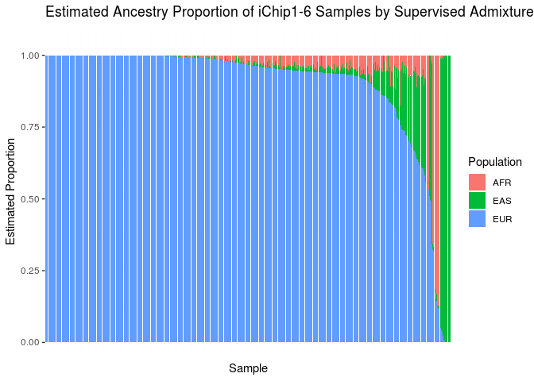
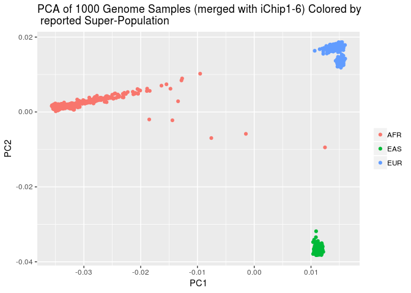
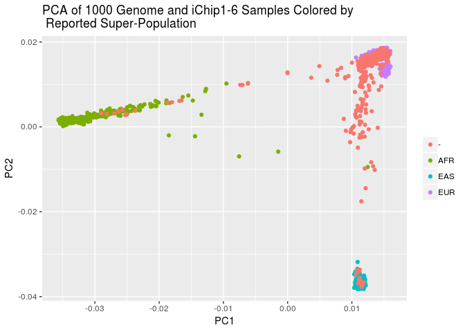
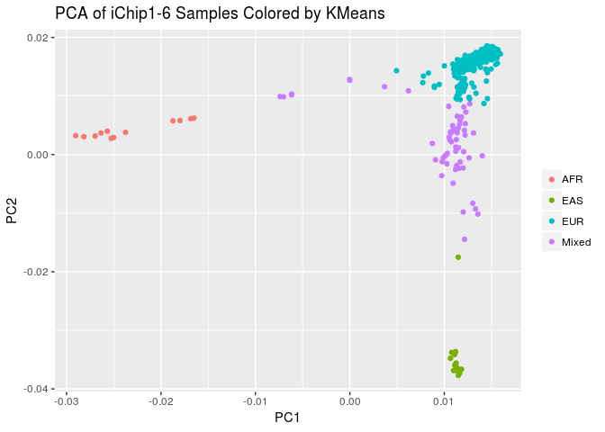
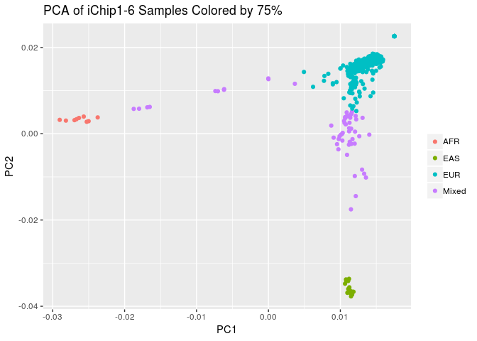

Estimating Ethnicity in the iChip 7 Dataset
================
Translational Genomics Group
05 September, 2018

2. Preapre iChip 7 Dataset
--------------------------

### A. Download InfiniumImmunoArray-24v2-0\_A-b37Strand Files for iChip 7 and Ref/Alt File

``` bash
wget http://www.well.ox.ac.uk/~wrayner/strand/InfiniumImmunoArray-24v2-0_A-b37-strand.zip -O temp.zip; unzip temp.zip; rm temp.zip &>/dev/null

wget http://www.well.ox.ac.uk/~wrayner/strand/RefAlt/InfiniumImmunoArray-24v2-0_A-b37.strand.RefAlt.zip -O temp.zip; unzip temp.zip; rm temp.zip &>/dev/null
```

### B. Create List of SNPs to Flip

``` r
strand <- read_tsv("InfiniumImmunoArray-24v2-0_A-b37.strand", 
                   col_names = c("SNP", "Chr", "BP", "Match", "Strand", "Allele"))
```

    ## Parsed with column specification:
    ## cols(
    ##   SNP = col_character(),
    ##   Chr = col_character(),
    ##   BP = col_integer(),
    ##   Match = col_double(),
    ##   Strand = col_character(),
    ##   Allele = col_character()
    ## )

``` r
strand %>%
  filter(Strand == "-") %>%
  select(SNP) %>%
  write_tsv("temp_flip_ichip7.tsv", col_names = FALSE)
```

### C. Flip SNPs to Convert TOP to Forward/Ref in Plink

``` bash
plink \
--bfile ../1.split_cohorts/cohort_split_ichip7 \
--flip temp_flip_ichip7.tsv \
--make-bed \
--out temp_ichip7
```

    ## PLINK v1.90b5.4 64-bit (10 Apr 2018)           www.cog-genomics.org/plink/1.9/
    ## (C) 2005-2018 Shaun Purcell, Christopher Chang   GNU General Public License v3
    ## Logging to temp_ichip7.log.
    ## Options in effect:
    ##   --bfile ../1.split_cohorts/cohort_split_ichip7
    ##   --flip temp_flip_ichip7.tsv
    ##   --make-bed
    ##   --out temp_ichip7
    ## 
    ## 128908 MB RAM detected; reserving 64454 MB for main workspace.
    ## 268093 variants loaded from .bim file.
    ## 661 people (313 males, 314 females, 34 ambiguous) loaded from .fam.
    ## Ambiguous sex IDs written to temp_ichip7.nosex .
    ## --flip: 122854 SNPs flipped, 3139 SNP IDs not present.
    ## Using 1 thread (no multithreaded calculations invoked).
    ## Before main variant filters, 661 founders and 0 nonfounders present.
    ## Calculating allele frequencies... 0%1%2%3%4%5%6%7%8%9%10%11%12%13%14%15%16%17%18%19%20%21%22%23%24%25%26%27%28%29%30%31%32%33%34%35%36%37%38%39%40%41%42%43%44%45%46%47%48%49%50%51%52%53%54%55%56%57%58%59%60%61%62%63%64%65%66%67%68%69%70%71%72%73%74%75%76%77%78%79%80%81%82%83%84%85%86%87%88%89%90%91%92%93%94%95%96%97%98%99% done.
    ## Total genotyping rate is 0.914994.
    ## 268093 variants and 661 people pass filters and QC.
    ## Note: No phenotypes present.
    ## --make-bed to temp_ichip7.bed + temp_ichip7.bim + temp_ichip7.fam ... 0%1%2%3%4%5%6%7%8%9%10%11%12%13%14%15%16%17%18%19%20%21%22%23%24%25%26%27%28%29%30%31%32%33%34%35%36%37%38%39%40%41%42%43%44%45%46%47%48%49%50%51%52%53%54%55%56%57%58%59%60%61%62%63%64%65%66%67%68%69%70%71%72%73%74%75%76%77%78%79%80%81%82%83%84%85%86%87%88%89%90%91%92%93%94%95%96%97%98%99%done.

### D. Set Ref/Alt Allele

``` bash
plink \
--bfile temp_ichip7 \
--reference-allele InfiniumImmunoArray-24v2-0_A.b37.RefAlt 2 \
--make-bed \
--out temp2_ichip7
```

    ## PLINK v1.90b5.4 64-bit (10 Apr 2018)           www.cog-genomics.org/plink/1.9/
    ## (C) 2005-2018 Shaun Purcell, Christopher Chang   GNU General Public License v3
    ## Logging to temp2_ichip7.log.
    ## Options in effect:
    ##   --a1-allele InfiniumImmunoArray-24v2-0_A.b37.RefAlt 2
    ##   --bfile temp_ichip7
    ##   --make-bed
    ##   --out temp2_ichip7
    ## 
    ## 128908 MB RAM detected; reserving 64454 MB for main workspace.
    ## 268093 variants loaded from .bim file.
    ## 661 people (313 males, 314 females, 34 ambiguous) loaded from .fam.
    ## Ambiguous sex IDs written to temp2_ichip7.nosex .
    ## Using 1 thread (no multithreaded calculations invoked).
    ## Before main variant filters, 661 founders and 0 nonfounders present.
    ## Calculating allele frequencies... 0%1%2%3%4%5%6%7%8%9%10%11%12%13%14%15%16%17%18%19%20%21%22%23%24%25%26%27%28%29%30%31%32%33%34%35%36%37%38%39%40%41%42%43%44%45%46%47%48%49%50%51%52%53%54%55%56%57%58%59%60%61%62%63%64%65%66%67%68%69%70%71%72%73%74%75%76%77%78%79%80%81%82%83%84%85%86%87%88%89%90%91%92%93%94%95%96%97%98%99% done.
    ## Total genotyping rate is 0.914994.
    ## --a1-allele: 240891 assignments made.
    ## 268093 variants and 661 people pass filters and QC.
    ## Note: No phenotypes present.
    ## --make-bed to temp2_ichip7.bed + temp2_ichip7.bim + temp2_ichip7.fam ... 0%1%2%3%4%5%6%7%8%9%10%11%12%13%14%15%16%17%18%19%20%21%22%23%24%25%26%27%28%29%30%31%32%33%34%35%36%37%38%39%40%41%42%43%44%45%46%47%48%49%50%51%52%53%54%55%56%57%58%59%60%61%62%63%64%65%66%67%68%69%70%71%72%73%74%75%76%77%78%79%80%81%82%83%84%85%86%87%88%89%90%91%92%93%94%95%96%97%98%99%done.

### D. Download 1000G Check Tool

``` bash
wget http://www.well.ox.ac.uk/~wrayner/tools/HRC-1000G-check-bim-v4.2.9.zip -O temp.zip; unzip temp.zip; rm temp.zip
```

### E. Download 1000 Genome Reference

This is a large file ~10GB and needs to be unzipped. A local copy has already been downloaded to: /mnt/share6/SHARED\_DATASETS/1000\_genomes/reference\_file/1000GP\_Phase3\_combined.legend

``` bash
wget http://www.well.ox.ac.uk/~wrayner/tools/1000GP_Phase3_combined.legend.gz ; gunzip -k 1000GP_Phase3_combined.legend.gz; rm 1000GP_Phase3_combined.legend.gz
```

### F. Filter to high quality SNPs For Ancestry Estimation

``` bash
plink \
--bfile temp2_ichip7 \
--geno 0.03 \
--maf 0.01 \
--hwe 0.000001 \
--keep-allele-order \
--make-bed \
--out temp3_ichip7
```

    ## PLINK v1.90b5.4 64-bit (10 Apr 2018)           www.cog-genomics.org/plink/1.9/
    ## (C) 2005-2018 Shaun Purcell, Christopher Chang   GNU General Public License v3
    ## Logging to temp3_ichip7.log.
    ## Options in effect:
    ##   --bfile temp2_ichip7
    ##   --geno 0.03
    ##   --hwe 0.000001
    ##   --keep-allele-order
    ##   --maf 0.01
    ##   --make-bed
    ##   --out temp3_ichip7
    ## 
    ## 128908 MB RAM detected; reserving 64454 MB for main workspace.
    ## 268093 variants loaded from .bim file.
    ## 661 people (313 males, 314 females, 34 ambiguous) loaded from .fam.
    ## Ambiguous sex IDs written to temp3_ichip7.nosex .
    ## Using 1 thread (no multithreaded calculations invoked).
    ## Before main variant filters, 661 founders and 0 nonfounders present.
    ## Calculating allele frequencies... 0%1%2%3%4%5%6%7%8%9%10%11%12%13%14%15%16%17%18%19%20%21%22%23%24%25%26%27%28%29%30%31%32%33%34%35%36%37%38%39%40%41%42%43%44%45%46%47%48%49%50%51%52%53%54%55%56%57%58%59%60%61%62%63%64%65%66%67%68%69%70%71%72%73%74%75%76%77%78%79%80%81%82%83%84%85%86%87%88%89%90%91%92%93%94%95%96%97%98%99% done.
    ## Total genotyping rate is 0.914994.
    ## 22716 variants removed due to missing genotype data (--geno).
    ## --hwe: 1515 variants removed due to Hardy-Weinberg exact test.
    ## 33365 variants removed due to minor allele threshold(s)
    ## (--maf/--max-maf/--mac/--max-mac).
    ## 210497 variants and 661 people pass filters and QC.
    ## Note: No phenotypes present.
    ## --make-bed to temp3_ichip7.bed + temp3_ichip7.bim + temp3_ichip7.fam ... 0%1%2%3%4%5%6%7%8%9%10%11%12%13%14%15%16%17%18%19%20%21%22%23%24%25%26%27%28%29%30%31%32%33%34%35%36%37%38%39%40%41%42%43%44%45%46%47%48%49%50%51%52%53%54%55%56%57%58%59%60%61%62%63%64%65%66%67%68%69%70%71%72%73%74%75%76%77%78%79%80%81%82%83%84%85%86%87%88%89%90%91%92%93%94%95%96%97%98%99%done.

### Calcualte Allele Frequency

``` bash
plink \
--bfile temp3_ichip7 \
--keep-allele-order \
--freq \
--out temp3_ichip7
```

    ## PLINK v1.90b5.4 64-bit (10 Apr 2018)           www.cog-genomics.org/plink/1.9/
    ## (C) 2005-2018 Shaun Purcell, Christopher Chang   GNU General Public License v3
    ## Logging to temp3_ichip7.log.
    ## Options in effect:
    ##   --bfile temp3_ichip7
    ##   --freq
    ##   --keep-allele-order
    ##   --out temp3_ichip7
    ## 
    ## 128908 MB RAM detected; reserving 64454 MB for main workspace.
    ## 210497 variants loaded from .bim file.
    ## 661 people (313 males, 314 females, 34 ambiguous) loaded from .fam.
    ## Ambiguous sex IDs written to temp3_ichip7.nosex .
    ## Using 1 thread (no multithreaded calculations invoked).
    ## Before main variant filters, 661 founders and 0 nonfounders present.
    ## Calculating allele frequencies... 0%1%2%3%4%5%6%7%8%9%10%11%12%13%14%15%16%17%18%19%20%21%22%23%24%25%26%27%28%29%30%31%32%33%34%35%36%37%38%39%40%41%42%43%44%45%46%47%48%49%50%51%52%53%54%55%56%57%58%59%60%61%62%63%64%65%66%67%68%69%70%71%72%73%74%75%76%77%78%79%80%81%82%83%84%85%86%87%88%89%90%91%92%93%94%95%96%97%98%99% done.
    ## Total genotyping rate is 0.999651.
    ## --freq: Allele frequencies (founders only) written to temp3_ichip7.frq .

### Run 1000G Checks

This takes ~30 minutes.

``` bash
perl HRC-1000G-check-bim.pl \
-b temp3_ichip7.bim \
-f temp3_ichip7.frq \
-r /mnt/share6/SHARED_DATASETS/1000_genomes/reference_file/1000GP_Phase3_combined.legend \
-g
```

#### Exlude SNPs

``` bash
plink2 \
--bfile temp3_ichip7 \
--exclude Exclude-temp3_ichip7-1000G.txt \
--set-all-var-ids @:#[hg19] \
--keep-allele-order \
--make-bed \
--out temp4_ichip7
```

    ## PLINK v2.00a2LM 64-bit Intel (28 Apr 2018)     www.cog-genomics.org/plink/2.0/
    ## (C) 2005-2018 Shaun Purcell, Christopher Chang   GNU General Public License v3
    ## Logging to temp4_ichip7.log.
    ## Options in effect:
    ##   --bfile temp3_ichip7
    ##   --exclude Exclude-temp3_ichip7-1000G.txt
    ##   --keep-allele-order
    ##   --make-bed
    ##   --out temp4_ichip7
    ##   --set-all-var-ids @:#[hg19]
    ## 
    ## Start time: Wed Sep  5 09:43:42 2018
    ## Note: --keep-allele-order no longer has any effect.
    ## 128908 MiB RAM detected; reserving 64454 MiB for main workspace.
    ## Using up to 48 threads (change this with --threads).
    ## 661 samples (314 females, 313 males, 34 ambiguous; 661 founders) loaded from
    ## temp3_ichip7.fam.
    ## 210497 variants loaded from temp3_ichip7.bim.
    ## Note: No phenotype data present.
    ## --exclude: 210497 variants remaining.
    ## 210497 variants remaining after main filters.
    ## Writing temp4_ichip7.bed ... 0%31%62%93%done.
    ## Writing temp4_ichip7.bim ... done.
    ## Writing temp4_ichip7.fam ... done.
    ## End time: Wed Sep  5 09:43:42 2018

Process 1000 Genomes Data
-------------------------

### Download Raw Data for Chr 1 - 22

``` bash
for i in {1..22}; do
       wget ftp://ftp-trace.ncbi.nih.gov/1000genomes/ftp/release/20130502/ALL.chr${i}.phase3_shapeit2_mvncall_integrated_v5a.20130502.genotypes.vcf.gz
done
```

### Get list of CHR and Position from Marker names to be used to extract subset of 1000 Genome

``` r
snplist <- read_table2("temp4_ichip7.bim", col_names = c("Chr", "SNP", "Pos", "BP", "A1", "A2"))

snplist %>%
  select(Chr, BP) %>%
  write_tsv("temp_site_list.txt", col_names = FALSE)
```

### Extract Markers from 1000Genome with Chrom and Position that Match Share iCHIP

``` bash
for i in {1..22}; do
      vcftools --gzvcf /mnt/share6/SHARED_DATASETS/1000_genomes/ALL.chr${i}.phase3_shapeit2_mvncall_integrated_v5a.20130502.genotypes.vcf.gz \
               --positions temp_site_list.txt \
               --recode \
               --recode-INFO-all \
               --out ichip7_1000G_markers/chr${i}.1000g.ichip_sites &
done
```

### Concatenate chromosome VCFs into one VCF

``` bash
bcftools concat -f ../../original_data/ordered_filenames_ichip7.txt -o ichip7_1000G_markers/chrall_1000g_ichip_sites.vcf
```

### Get List of 1000 Genome Samples Filtered for EUR, AFR, EAS superpopulation samples

``` r
onek_samples <- read_tsv("../../original_data/igsr_samples.tsv")
colnames(onek_samples) <- make.names(colnames(onek_samples))

onek_samples %>%
  filter(Superpopulation.code %in% c("EUR", "AFR", "EAS")) %>%
  mutate(FID = 0) %>%
  select(FID, Sample.name) %>% 
  write_tsv("temp_onek_samples_3_pops.tsv", col_names = FALSE)
```

### Read Combined Chromosomes 1000 Genomes Samples with only Share Markers into PLINK and Set Names and Exclude not 3 Population Samples

``` bash
plink2 \
--vcf ichip7_1000G_markers/chrall_1000g_ichip_sites.vcf \
--set-all-var-ids @:#[hg19] \
--new-id-max-allele-len 23 'truncate' \
--keep temp_onek_samples_3_pops.tsv \
--make-bed \
--out temp_chrall_1000g_ichip_sites > /dev/null
```

    ## Warning: 1286 multiallelic variants skipped (not yet supported).

Merge iCHIP and 1000 Genomes
----------------------------

``` bash
plink \
--bfile temp4_ichip7 \
--bmerge temp_chrall_1000g_ichip_sites \
--merge-mode 6 \
--keep-allele-order \
--out ichip7_1000g_ichip_sites_merged
```

### Remove Non Bi-allelic SNPs iCHIP

``` bash
plink \
--bfile temp4_ichip7 \
--exclude ichip7_1000g_ichip_sites_merged.missnp \
--make-bed \
--keep-allele-order \
--out temp5_ichip7
```

    ## PLINK v1.90b5.4 64-bit (10 Apr 2018)           www.cog-genomics.org/plink/1.9/
    ## (C) 2005-2018 Shaun Purcell, Christopher Chang   GNU General Public License v3
    ## Logging to temp5_ichip7.log.
    ## Options in effect:
    ##   --bfile temp4_ichip7
    ##   --exclude ichip7_1000g_ichip_sites_merged.missnp
    ##   --keep-allele-order
    ##   --make-bed
    ##   --out temp5_ichip7
    ## 
    ## 128908 MB RAM detected; reserving 64454 MB for main workspace.
    ## 210497 variants loaded from .bim file.
    ## 661 people (313 males, 314 females, 34 ambiguous) loaded from .fam.
    ## Ambiguous sex IDs written to temp5_ichip7.nosex .
    ## --exclude: 210248 variants remaining.
    ## Using 1 thread (no multithreaded calculations invoked).
    ## Before main variant filters, 661 founders and 0 nonfounders present.
    ## Calculating allele frequencies... 0%1%2%3%4%5%6%7%8%9%10%11%12%13%14%15%16%17%18%19%20%21%22%23%24%25%26%27%28%29%30%31%32%33%34%35%36%37%38%39%40%41%42%43%44%45%46%47%48%49%50%51%52%53%54%55%56%57%58%59%60%61%62%63%64%65%66%67%68%69%70%71%72%73%74%75%76%77%78%79%80%81%82%83%84%85%86%87%88%89%90%91%92%93%94%95%96%97%98%99% done.
    ## Total genotyping rate is 0.999651.
    ## 210248 variants and 661 people pass filters and QC.
    ## Note: No phenotypes present.
    ## --make-bed to temp5_ichip7.bed + temp5_ichip7.bim + temp5_ichip7.fam ... 0%1%2%3%4%5%6%7%8%9%10%11%12%13%14%15%16%17%18%19%20%21%22%23%24%25%26%27%28%29%30%31%32%33%34%35%36%37%38%39%40%41%42%43%44%45%46%47%48%49%50%51%52%53%54%55%56%57%58%59%60%61%62%63%64%65%66%67%68%69%70%71%72%73%74%75%76%77%78%79%80%81%82%83%84%85%86%87%88%89%90%91%92%93%94%95%96%97%98%99%done.

### Remove Non Bi-allelic SNPs 1000 Genome

``` bash
plink \
--bfile temp_chrall_1000g_ichip_sites \
--exclude ichip7_1000g_ichip_sites_merged.missnp \
--make-bed \
--keep-allele-order \
--out temp1_chrall_1000g_ichip_sites
```

    ## PLINK v1.90b5.4 64-bit (10 Apr 2018)           www.cog-genomics.org/plink/1.9/
    ## (C) 2005-2018 Shaun Purcell, Christopher Chang   GNU General Public License v3
    ## Logging to temp1_chrall_1000g_ichip_sites.log.
    ## Options in effect:
    ##   --bfile temp_chrall_1000g_ichip_sites
    ##   --exclude ichip7_1000g_ichip_sites_merged.missnp
    ##   --keep-allele-order
    ##   --make-bed
    ##   --out temp1_chrall_1000g_ichip_sites
    ## 
    ## 128908 MB RAM detected; reserving 64454 MB for main workspace.
    ## 203684 variants loaded from .bim file.
    ## 1668 people (0 males, 0 females, 1668 ambiguous) loaded from .fam.
    ## Ambiguous sex IDs written to temp1_chrall_1000g_ichip_sites.nosex .
    ## --exclude: 203426 variants remaining.
    ## Using 1 thread (no multithreaded calculations invoked).
    ## Before main variant filters, 1668 founders and 0 nonfounders present.
    ## Calculating allele frequencies... 0%1%2%3%4%5%6%7%8%9%10%11%12%13%14%15%16%17%18%19%20%21%22%23%24%25%26%27%28%29%30%31%32%33%34%35%36%37%38%39%40%41%42%43%44%45%46%47%48%49%50%51%52%53%54%55%56%57%58%59%60%61%62%63%64%65%66%67%68%69%70%71%72%73%74%75%76%77%78%79%80%81%82%83%84%85%86%87%88%89%90%91%92%93%94%95%96%97%98%99% done.
    ## 203426 variants and 1668 people pass filters and QC.
    ## Note: No phenotypes present.
    ## --make-bed to temp1_chrall_1000g_ichip_sites.bed +
    ## temp1_chrall_1000g_ichip_sites.bim + temp1_chrall_1000g_ichip_sites.fam ...
    ## 0%1%2%3%4%5%6%7%8%9%10%11%12%13%14%15%16%17%18%19%20%21%22%23%24%25%26%27%28%29%30%31%32%33%34%35%36%37%38%39%40%41%42%43%44%45%46%47%48%49%50%51%52%53%54%55%56%57%58%59%60%61%62%63%64%65%66%67%68%69%70%71%72%73%74%75%76%77%78%79%80%81%82%83%84%85%86%87%88%89%90%91%92%93%94%95%96%97%98%99%done.

### Merge

``` bash
plink \
--bfile temp5_ichip7 \
--bmerge temp1_chrall_1000g_ichip_sites \
--keep-allele-order \
--out temp_ichip_1000g_sites_merged
```

    ## PLINK v1.90b5.4 64-bit (10 Apr 2018)           www.cog-genomics.org/plink/1.9/
    ## (C) 2005-2018 Shaun Purcell, Christopher Chang   GNU General Public License v3
    ## Logging to temp_ichip_1000g_sites_merged.log.
    ## Options in effect:
    ##   --bfile temp5_ichip7
    ##   --bmerge temp1_chrall_1000g_ichip_sites
    ##   --keep-allele-order
    ##   --out temp_ichip_1000g_sites_merged
    ## 
    ## 128908 MB RAM detected; reserving 64454 MB for main workspace.
    ## 661 people loaded from temp5_ichip7.fam.
    ## 1668 people to be merged from temp1_chrall_1000g_ichip_sites.fam.
    ## Of these, 1668 are new, while 0 are present in the base dataset.
    ## 205951 markers loaded from temp5_ichip7.bim.
    ## 203426 markers to be merged from temp1_chrall_1000g_ichip_sites.bim.
    ## Of these, 0 are new, while 203426 are present in the base dataset.
    ## Performing single-pass merge (2329 people, 205951 variants).
    ## 
    Pass 1: fileset #1 complete.
                                                  
    Merged fileset written to temp_ichip_1000g_sites_merged.bed +
    ## temp_ichip_1000g_sites_merged.bim + temp_ichip_1000g_sites_merged.fam .

Prune Combined dataset
----------------------

``` bash
plink \
--bfile temp_ichip_1000g_sites_merged \
--exclude range ../../original_data/highLDregions.txt \
--indep 50 5 1.8 \
--geno .03 \
--maf .01 \
--keep-allele-order \
--out temp_ichip_1000g_sites_merged > /dev/null
```

#### Extarct Pruned SNP in Merged Dataset

``` bash
plink \
--bfile temp_ichip_1000g_sites_merged \
--extract temp_ichip_1000g_sites_merged.prune.in \
--keep-allele-order \
--make-bed \
--out temp1_ichip_1000g_sites_merged
```

    ## PLINK v1.90b5.4 64-bit (10 Apr 2018)           www.cog-genomics.org/plink/1.9/
    ## (C) 2005-2018 Shaun Purcell, Christopher Chang   GNU General Public License v3
    ## Logging to temp1_ichip_1000g_sites_merged.log.
    ## Options in effect:
    ##   --bfile temp_ichip_1000g_sites_merged
    ##   --extract temp_ichip_1000g_sites_merged.prune.in
    ##   --keep-allele-order
    ##   --make-bed
    ##   --out temp1_ichip_1000g_sites_merged
    ## 
    ## 128908 MB RAM detected; reserving 64454 MB for main workspace.
    ## 205951 variants loaded from .bim file.
    ## 2329 people (313 males, 314 females, 1702 ambiguous) loaded from .fam.
    ## Ambiguous sex IDs written to temp1_ichip_1000g_sites_merged.nosex .
    ## --extract: 68507 variants remaining.
    ## Using 1 thread (no multithreaded calculations invoked).
    ## Before main variant filters, 2329 founders and 0 nonfounders present.
    ## Calculating allele frequencies... 0%1%2%3%4%5%6%7%8%9%10%11%12%13%14%15%16%17%18%19%20%21%22%23%24%25%26%27%28%29%30%31%32%33%34%35%36%37%38%39%40%41%42%43%44%45%46%47%48%49%50%51%52%53%54%55%56%57%58%59%60%61%62%63%64%65%66%67%68%69%70%71%72%73%74%75%76%77%78%79%80%81%82%83%84%85%86%87%88%89%90%91%92%93%94%95%96%97%98%99% done.
    ## Total genotyping rate is 0.999913.
    ## 68507 variants and 2329 people pass filters and QC.
    ## Note: No phenotypes present.
    ## --make-bed to temp1_ichip_1000g_sites_merged.bed +
    ## temp1_ichip_1000g_sites_merged.bim + temp1_ichip_1000g_sites_merged.fam ...
    ## 0%1%2%3%4%5%6%7%8%9%10%11%12%13%14%15%16%17%18%19%20%21%22%23%24%25%26%27%28%29%30%31%32%33%34%35%36%37%38%39%40%41%42%43%44%45%46%47%48%49%50%51%52%53%54%55%56%57%58%59%60%61%62%63%64%65%66%67%68%69%70%71%72%73%74%75%76%77%78%79%80%81%82%83%84%85%86%87%88%89%90%91%92%93%94%95%96%97%98%99%done.

Estimate Ancestry Using ADMIXTURE Supervised Learning with 4 1000 Genome Reference Populations
----------------------------------------------------------------------------------------------

### Create .pop File for Identifying 1000 Genome Reference Samples

``` r
merged_fam <- read_table2("temp1_ichip_1000g_sites_merged.fam", col_names = c("FAM", "IID", "ID_F", "ID_M", "SEX", "PHENOTYPE"), col_types = 
                            list(FAM = col_character(),
                                  IID = col_character(),
                                  ID_F = col_integer(),
                                  ID_M = col_integer(),
                                  SEX = col_integer(),
                                  PHENOTYPE = col_integer()))

merged_fam <- merged_fam %>%
  mutate(FAM = ifelse(FAM == "0", IID, FAM))

merged_pop_file <- left_join(merged_fam, onek_samples, by = c("FAM" = "Sample.name")) 

merged_pop_file <- merged_pop_file %>%
  select(FAM, IID, Superpopulation.code) %>%
  mutate(Superpopulation.code = if_else(is.na(Superpopulation.code), "-", Superpopulation.code))

merged_pop_file %>%
  select(Superpopulation.code) %>%
  write_tsv("temp1_ichip_1000g_sites_merged.pop", col_names = FALSE)
```

### Run ADMIXTURE Supervised

This takes &gt; 1 hour using 48 cores

``` bash
admixture temp1_ichip_1000g_sites_merged.bed 3 -j48 --supervised 
```

``` bash
cp temp1_ichip_1000g_sites_merged.3.Q admix_ichip7_merged.3.Q
cp temp1_ichip_1000g_sites_merged.3.P admix_ichip7_merged.3.P
```

### Assign Clusters by KMeans, PAM, and &gt;75%

``` r
merged_admix <- read_table2("admix_ichip7_merged.3.Q", col_names = FALSE) 
set.seed(1234)
kmeans_out_merged <- kmeans(merged_admix, centers = 4, nstart = 100)

merged_admix_pop <- bind_cols(merged_admix, merged_pop_file)
merged_admix_pop <- merged_admix_pop %>%
  rename(EUR = X1, EAS = X2, AFR = X3) %>%
  mutate(kmeans_cluster = kmeans_out_merged$cluster) %>%
  mutate(cedars_75_class = if_else(EUR >= 0.75, "EUR",
                                    if_else(EAS >= 0.75, "EAS",
                                                    if_else(AFR >= 0.75, "AFR", "Mixed")))) %>%
  mutate(kmeans_class = if_else(kmeans_cluster == 1, "Mixed",
                                if_else(kmeans_cluster == 2, "EAS",
                                        if_else(kmeans_cluster == 3, "AFR",
                                                if_else(kmeans_cluster == 4, "EUR", "wilson")))))

merged_admix_pop %>%
  filter(Superpopulation.code == "-") %>%
  group_by(cedars_75_class) %>%
  summarise(n = n()) %>%
  kable()
```

| cedars\_75\_class |    n|
|:------------------|----:|
| AFR               |    9|
| EAS               |   17|
| EUR               |  580|
| Mixed             |   55|

``` r
merged_admix_pop %>%
  filter(Superpopulation.code == "-") %>%
  group_by(kmeans_class) %>%
  summarise(n = n()) %>%
  kable()
```

| kmeans\_class |    n|
|:--------------|----:|
| AFR           |   13|
| EAS           |   18|
| EUR           |  571|
| Mixed         |   59|

``` r
merged_admix_pop %>%
  filter(Superpopulation.code == "-") %>%
  arrange(desc(EUR), desc(AFR), desc(EAS)) %>%
  rownames_to_column() %>%
  mutate(rowname = as.integer(rowname)) %>%
  select(FAM, EUR, AFR, EAS, rowname) %>%
  gather(key = "ancestry", value = "proportion", -FAM, -rowname) %>%
  ggplot(aes(x = reorder(FAM, rowname), y = proportion, fill = ancestry)) + 
  geom_bar(stat = "identity") +
  scale_y_continuous(limits = c(NA, 1.05)) +
  theme(axis.text.x=element_blank(),
        axis.ticks.x=element_blank()) +
  labs(y = "Estimated Proportion", x = "Sample", title = "Estimated Ancestry Proportion of iChip1-6 Samples by Supervised Admixture") + scale_fill_discrete(name="Population")
```



### Perform PCA

``` bash
plink \
--bfile temp1_ichip_1000g_sites_merged \
--pca header tabs \
--out temp1_ichip_1000g_sites_merged > /dev/null
```

### Plot PCAs

``` r
merged_pca <- read_table2("temp1_ichip_1000g_sites_merged.eigenvec", col_types = cols(.default = "c")) 

merged_pca <- merged_pca %>%
  mutate(FID = ifelse(FID == "0", IID, FID)) %>%
  mutate(PC1 = as.double(PC1)) %>%
  mutate(PC2 = as.double(PC2))

merged_admix_pop_pca <- left_join(merged_admix_pop, merged_pca, by = c("FAM" = "FID", "IID" = "IID"))

merged_admix_pop_pca %>%
  filter(Superpopulation.code != "-") %>%
  ggplot(aes(x = PC1, y = PC2, color = as.factor(Superpopulation.code))) +
  geom_point() +
  labs(title = "PCA of 1000 Genome Samples (merged with iChip1-6) Colored by \n reported Super-Population") +
  theme(legend.title=element_blank())
```



``` r
merged_admix_pop_pca %>%
  ggplot(aes(x = PC1, y = PC2, color = as.factor(Superpopulation.code))) +
  geom_point() +
  labs(title = "PCA of 1000 Genome and iChip1-6 Samples Colored by \n Reported Super-Population") +
  theme(legend.title=element_blank())
```



``` r
merged_admix_pop_pca %>%
  filter(Superpopulation.code == "-") %>%
  ggplot(aes(x = PC1, y = PC2, color = as.factor(kmeans_class))) +
  geom_point() +
  labs(title = "PCA of iChip1-6 Samples Colored by KMeans") +
  theme(legend.title=element_blank())
```



``` r
merged_admix_pop_pca %>%
  filter(Superpopulation.code == "-") %>%
  ggplot(aes(x = PC1, y = PC2, color = as.factor(cedars_75_class))) +
  geom_point() +
  labs(title = "PCA of iChip1-6 Samples Colored by 75%") +
  theme(legend.title=element_blank())
```



### Write Assigned

``` r
merged_admix_pop_pca %>% 
  filter(!FAM %in% onek_samples$Sample.name) %>%
  filter(cedars_75_class == "EUR") %>%
  select(FAM, IID) %>%
  write_tsv(path = "ichip7_eur_samples.tsv", col_names = FALSE)
```

### Split Cohort by Ethnicity

``` bash
plink \
--bfile ../1.split_cohorts/cohort_split_ichip7 \
--keep ichip7_eur_samples.tsv \
--make-bed \
--out eur_cohort_split_ichip7
```

    ## PLINK v1.90b5.4 64-bit (10 Apr 2018)           www.cog-genomics.org/plink/1.9/
    ## (C) 2005-2018 Shaun Purcell, Christopher Chang   GNU General Public License v3
    ## Logging to eur_cohort_split_ichip7.log.
    ## Options in effect:
    ##   --bfile ../1.split_cohorts/cohort_split_ichip7
    ##   --keep ichip7_eur_samples.tsv
    ##   --make-bed
    ##   --out eur_cohort_split_ichip7
    ## 
    ## 128908 MB RAM detected; reserving 64454 MB for main workspace.
    ## 268093 variants loaded from .bim file.
    ## 661 people (313 males, 314 females, 34 ambiguous) loaded from .fam.
    ## Ambiguous sex IDs written to eur_cohort_split_ichip7.nosex .
    ## --keep: 580 people remaining.
    ## Using 1 thread (no multithreaded calculations invoked).
    ## Before main variant filters, 580 founders and 0 nonfounders present.
    ## Calculating allele frequencies... 0%1%2%3%4%5%6%7%8%9%10%11%12%13%14%15%16%17%18%19%20%21%22%23%24%25%26%27%28%29%30%31%32%33%34%35%36%37%38%39%40%41%42%43%44%45%46%47%48%49%50%51%52%53%54%55%56%57%58%59%60%61%62%63%64%65%66%67%68%69%70%71%72%73%74%75%76%77%78%79%80%81%82%83%84%85%86%87%88%89%90%91%92%93%94%95%96%97%98%99% done.
    ## Total genotyping rate in remaining samples is 0.914988.
    ## 268093 variants and 580 people pass filters and QC.
    ## Note: No phenotypes present.
    ## --make-bed to eur_cohort_split_ichip7.bed + eur_cohort_split_ichip7.bim +
    ## eur_cohort_split_ichip7.fam ... 0%1%2%3%4%5%6%7%8%9%10%11%12%13%14%15%16%17%18%19%20%21%22%23%24%25%26%27%28%29%30%31%32%33%34%35%36%37%38%39%40%41%42%43%44%45%46%47%48%49%50%51%52%53%54%55%56%57%58%59%60%61%62%63%64%65%66%67%68%69%70%71%72%73%74%75%76%77%78%79%80%81%82%83%84%85%86%87%88%89%90%91%92%93%94%95%96%97%98%99%done.

Clean Up
--------

``` r
file.remove(list.files(pattern = "^temp", full.names = TRUE))
```

    ##  [1] TRUE TRUE TRUE TRUE TRUE TRUE TRUE TRUE TRUE TRUE TRUE TRUE TRUE TRUE
    ## [15] TRUE TRUE TRUE TRUE TRUE TRUE TRUE TRUE TRUE TRUE TRUE TRUE TRUE TRUE
    ## [29] TRUE TRUE TRUE TRUE TRUE TRUE TRUE TRUE TRUE TRUE TRUE TRUE TRUE TRUE
    ## [43] TRUE TRUE TRUE TRUE TRUE TRUE TRUE TRUE TRUE TRUE
