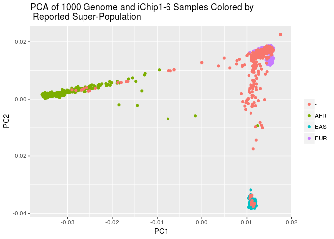
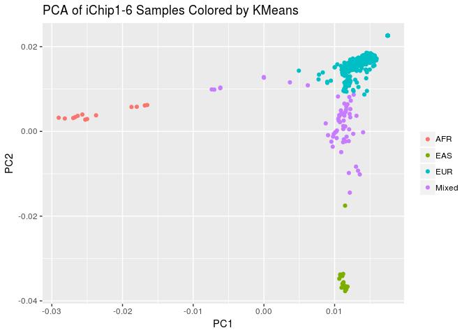

Estimating Ethnicity in the iChip 7 Dataset
================
Translational Genomics Group
04 September, 2018

2. Preapre iChip 7 Dataset
--------------------------

### A. Download InfiniumImmunoArray-24v2-0\_A-b37Strand Files for iChip 7 and Ref/Alt File

``` bash
wget http://www.well.ox.ac.uk/~wrayner/strand/InfiniumImmunoArray-24v2-0_A-b37-strand.zip -O temp.zip; unzip temp.zip; rm temp.zip &>/dev/null

wget http://www.well.ox.ac.uk/~wrayner/strand/RefAlt/InfiniumImmunoArray-24v2-0_A-b37.strand.RefAlt.zip -O temp.zip; unzip temp.zip; rm temp.zip &>/dev/null
```

### B. Create List of SNPs to Flip

``` r
strand <- read_tsv("InfiniumImmunoArray-24v2-0_A-b37.strand", 
                   col_names = c("SNP", "Chr", "BP", "Match", "Strand", "Allele"))
```

    ## Parsed with column specification:
    ## cols(
    ##   SNP = col_character(),
    ##   Chr = col_character(),
    ##   BP = col_integer(),
    ##   Match = col_double(),
    ##   Strand = col_character(),
    ##   Allele = col_character()
    ## )

``` r
strand %>%
  filter(Strand == "-") %>%
  select(SNP) %>%
  write_tsv("temp_flip_ichip7.tsv", col_names = FALSE)
```

### C. Flip SNPs to Convert TOP to Forward/Ref in Plink

``` bash
plink \
--bfile ../1.split_cohorts/cohort_split_ichip7 \
--flip temp_flip_ichip7.tsv \
--make-bed \
--out temp_ichip7
```

    ## PLINK v1.90b5.4 64-bit (10 Apr 2018)           www.cog-genomics.org/plink/1.9/
    ## (C) 2005-2018 Shaun Purcell, Christopher Chang   GNU General Public License v3
    ## Logging to temp_ichip7.log.
    ## Options in effect:
    ##   --bfile ../1.split_cohorts/cohort_split_ichip7
    ##   --flip temp_flip_ichip7.tsv
    ##   --make-bed
    ##   --out temp_ichip7
    ## 
    ## 128908 MB RAM detected; reserving 64454 MB for main workspace.
    ## 268093 variants loaded from .bim file.
    ## 661 people (313 males, 314 females, 34 ambiguous) loaded from .fam.
    ## Ambiguous sex IDs written to temp_ichip7.nosex .
    ## --flip: 122854 SNPs flipped, 3139 SNP IDs not present.
    ## Using 1 thread (no multithreaded calculations invoked).
    ## Before main variant filters, 661 founders and 0 nonfounders present.
    ## Calculating allele frequencies... 0%1%2%3%4%5%6%7%8%9%10%11%12%13%14%15%16%17%18%19%20%21%22%23%24%25%26%27%28%29%30%31%32%33%34%35%36%37%38%39%40%41%42%43%44%45%46%47%48%49%50%51%52%53%54%55%56%57%58%59%60%61%62%63%64%65%66%67%68%69%70%71%72%73%74%75%76%77%78%79%80%81%82%83%84%85%86%87%88%89%90%91%92%93%94%95%96%97%98%99% done.
    ## Total genotyping rate is 0.914994.
    ## 268093 variants and 661 people pass filters and QC.
    ## Note: No phenotypes present.
    ## --make-bed to temp_ichip7.bed + temp_ichip7.bim + temp_ichip7.fam ... 0%1%2%3%4%5%6%7%8%9%10%11%12%13%14%15%16%17%18%19%20%21%22%23%24%25%26%27%28%29%30%31%32%33%34%35%36%37%38%39%40%41%42%43%44%45%46%47%48%49%50%51%52%53%54%55%56%57%58%59%60%61%62%63%64%65%66%67%68%69%70%71%72%73%74%75%76%77%78%79%80%81%82%83%84%85%86%87%88%89%90%91%92%93%94%95%96%97%98%99%done.

### D. Set Ref/Alt Allele

``` bash
plink \
--bfile temp_ichip7 \
--reference-allele InfiniumImmunoArray-24v2-0_A.b37.RefAlt 2 \
--make-bed \
--out temp2_ichip7
```

    ## PLINK v1.90b5.4 64-bit (10 Apr 2018)           www.cog-genomics.org/plink/1.9/
    ## (C) 2005-2018 Shaun Purcell, Christopher Chang   GNU General Public License v3
    ## Logging to temp2_ichip7.log.
    ## Options in effect:
    ##   --a1-allele InfiniumImmunoArray-24v2-0_A.b37.RefAlt 2
    ##   --bfile temp_ichip7
    ##   --make-bed
    ##   --out temp2_ichip7
    ## 
    ## 128908 MB RAM detected; reserving 64454 MB for main workspace.
    ## 268093 variants loaded from .bim file.
    ## 661 people (313 males, 314 females, 34 ambiguous) loaded from .fam.
    ## Ambiguous sex IDs written to temp2_ichip7.nosex .
    ## Using 1 thread (no multithreaded calculations invoked).
    ## Before main variant filters, 661 founders and 0 nonfounders present.
    ## Calculating allele frequencies... 0%1%2%3%4%5%6%7%8%9%10%11%12%13%14%15%16%17%18%19%20%21%22%23%24%25%26%27%28%29%30%31%32%33%34%35%36%37%38%39%40%41%42%43%44%45%46%47%48%49%50%51%52%53%54%55%56%57%58%59%60%61%62%63%64%65%66%67%68%69%70%71%72%73%74%75%76%77%78%79%80%81%82%83%84%85%86%87%88%89%90%91%92%93%94%95%96%97%98%99% done.
    ## Total genotyping rate is 0.914994.
    ## --a1-allele: 240891 assignments made.
    ## 268093 variants and 661 people pass filters and QC.
    ## Note: No phenotypes present.
    ## --make-bed to temp2_ichip7.bed + temp2_ichip7.bim + temp2_ichip7.fam ... 0%1%2%3%4%5%6%7%8%9%10%11%12%13%14%15%16%17%18%19%20%21%22%23%24%25%26%27%28%29%30%31%32%33%34%35%36%37%38%39%40%41%42%43%44%45%46%47%48%49%50%51%52%53%54%55%56%57%58%59%60%61%62%63%64%65%66%67%68%69%70%71%72%73%74%75%76%77%78%79%80%81%82%83%84%85%86%87%88%89%90%91%92%93%94%95%96%97%98%99%done.

### D. Download 1000G Check Tool

``` bash
wget http://www.well.ox.ac.uk/~wrayner/tools/HRC-1000G-check-bim-v4.2.9.zip -O temp.zip; unzip temp.zip; rm temp.zip
```

### E. Download 1000 Genome Reference

This is a large file ~10GB and needs to be unzipped. A local copy has already been downloaded to: /mnt/share6/SHARED\_DATASETS/1000\_genomes/reference\_file/1000GP\_Phase3\_combined.legend

``` bash
wget http://www.well.ox.ac.uk/~wrayner/tools/1000GP_Phase3_combined.legend.gz ; gunzip -k 1000GP_Phase3_combined.legend.gz; rm 1000GP_Phase3_combined.legend.gz
```

### F. Filter to high quality SNPs For Ancestry Estimation

``` bash
plink \
--bfile temp2_ichip7 \
--geno 0.03 \
--maf 0.01 \
--hwe 0.000001 \
--keep-allele-order \
--make-bed \
--out temp3_ichip7
```

    ## PLINK v1.90b5.4 64-bit (10 Apr 2018)           www.cog-genomics.org/plink/1.9/
    ## (C) 2005-2018 Shaun Purcell, Christopher Chang   GNU General Public License v3
    ## Logging to temp3_ichip7.log.
    ## Options in effect:
    ##   --bfile temp2_ichip7
    ##   --geno 0.03
    ##   --hwe 0.000001
    ##   --keep-allele-order
    ##   --maf 0.01
    ##   --make-bed
    ##   --out temp3_ichip7
    ## 
    ## 128908 MB RAM detected; reserving 64454 MB for main workspace.
    ## 268093 variants loaded from .bim file.
    ## 661 people (313 males, 314 females, 34 ambiguous) loaded from .fam.
    ## Ambiguous sex IDs written to temp3_ichip7.nosex .
    ## Using 1 thread (no multithreaded calculations invoked).
    ## Before main variant filters, 661 founders and 0 nonfounders present.
    ## Calculating allele frequencies... 0%1%2%3%4%5%6%7%8%9%10%11%12%13%14%15%16%17%18%19%20%21%22%23%24%25%26%27%28%29%30%31%32%33%34%35%36%37%38%39%40%41%42%43%44%45%46%47%48%49%50%51%52%53%54%55%56%57%58%59%60%61%62%63%64%65%66%67%68%69%70%71%72%73%74%75%76%77%78%79%80%81%82%83%84%85%86%87%88%89%90%91%92%93%94%95%96%97%98%99% done.
    ## Total genotyping rate is 0.914994.
    ## 22716 variants removed due to missing genotype data (--geno).
    ## --hwe: 1515 variants removed due to Hardy-Weinberg exact test.
    ## 33365 variants removed due to minor allele threshold(s)
    ## (--maf/--max-maf/--mac/--max-mac).
    ## 210497 variants and 661 people pass filters and QC.
    ## Note: No phenotypes present.
    ## --make-bed to temp3_ichip7.bed + temp3_ichip7.bim + temp3_ichip7.fam ... 0%1%2%3%4%5%6%7%8%9%10%11%12%13%14%15%16%17%18%19%20%21%22%23%24%25%26%27%28%29%30%31%32%33%34%35%36%37%38%39%40%41%42%43%44%45%46%47%48%49%50%51%52%53%54%55%56%57%58%59%60%61%62%63%64%65%66%67%68%69%70%71%72%73%74%75%76%77%78%79%80%81%82%83%84%85%86%87%88%89%90%91%92%93%94%95%96%97%98%99%done.

### Calcualte Allele Frequency

``` bash
plink \
--bfile temp3_ichip7 \
--keep-allele-order \
--freq \
--out temp3_ichip7
```

    ## PLINK v1.90b5.4 64-bit (10 Apr 2018)           www.cog-genomics.org/plink/1.9/
    ## (C) 2005-2018 Shaun Purcell, Christopher Chang   GNU General Public License v3
    ## Logging to temp3_ichip7.log.
    ## Options in effect:
    ##   --bfile temp3_ichip7
    ##   --freq
    ##   --keep-allele-order
    ##   --out temp3_ichip7
    ## 
    ## 128908 MB RAM detected; reserving 64454 MB for main workspace.
    ## 210497 variants loaded from .bim file.
    ## 661 people (313 males, 314 females, 34 ambiguous) loaded from .fam.
    ## Ambiguous sex IDs written to temp3_ichip7.nosex .
    ## Using 1 thread (no multithreaded calculations invoked).
    ## Before main variant filters, 661 founders and 0 nonfounders present.
    ## Calculating allele frequencies... 0%1%2%3%4%5%6%7%8%9%10%11%12%13%14%15%16%17%18%19%20%21%22%23%24%25%26%27%28%29%30%31%32%33%34%35%36%37%38%39%40%41%42%43%44%45%46%47%48%49%50%51%52%53%54%55%56%57%58%59%60%61%62%63%64%65%66%67%68%69%70%71%72%73%74%75%76%77%78%79%80%81%82%83%84%85%86%87%88%89%90%91%92%93%94%95%96%97%98%99% done.
    ## Total genotyping rate is 0.999651.
    ## --freq: Allele frequencies (founders only) written to temp3_ichip7.frq .

### Run 1000G Checks

This takes ~30 minutes.

``` bash
perl HRC-1000G-check-bim.pl \
-b temp3_ichip7.bim \
-f temp3_ichip7.frq \
-r /mnt/share6/SHARED_DATASETS/1000_genomes/reference_file/1000GP_Phase3_combined.legend \
-g
```

#### Exlude SNPs

``` bash
plink2 \
--bfile temp3_ichip7 \
--exclude Exclude-temp3_ichip7-1000G.txt \
--set-all-var-ids @:#[hg19] \
--keep-allele-order \
--make-bed \
--out temp4_ichip7
```

    ## PLINK v2.00a2LM 64-bit Intel (28 Apr 2018)     www.cog-genomics.org/plink/2.0/
    ## (C) 2005-2018 Shaun Purcell, Christopher Chang   GNU General Public License v3
    ## Logging to temp4_ichip7.log.
    ## Options in effect:
    ##   --bfile temp3_ichip7
    ##   --exclude Exclude-temp3_ichip7-1000G.txt
    ##   --keep-allele-order
    ##   --make-bed
    ##   --out temp4_ichip7
    ##   --set-all-var-ids @:#[hg19]
    ## 
    ## Start time: Tue Sep  4 18:25:18 2018
    ## Note: --keep-allele-order no longer has any effect.
    ## 128908 MiB RAM detected; reserving 64454 MiB for main workspace.
    ## Using up to 48 threads (change this with --threads).
    ## 661 samples (314 females, 313 males, 34 ambiguous; 661 founders) loaded from
    ## temp3_ichip7.fam.
    ## 210497 variants loaded from temp3_ichip7.bim.
    ## Note: No phenotype data present.
    ## --exclude: 210497 variants remaining.
    ## 210497 variants remaining after main filters.
    ## Writing temp4_ichip7.bed ... 0%31%62%93%done.
    ## Writing temp4_ichip7.bim ... done.
    ## Writing temp4_ichip7.fam ... done.
    ## End time: Tue Sep  4 18:25:18 2018

Process 1000 Genomes Data
-------------------------

### Download Raw Data for Chr 1 - 22

``` bash
for i in {1..22}; do
       wget ftp://ftp-trace.ncbi.nih.gov/1000genomes/ftp/release/20130502/ALL.chr${i}.phase3_shapeit2_mvncall_integrated_v5a.20130502.genotypes.vcf.gz
done
```

### Get list of CHR and Position from Marker names to be used to extract subset of 1000 Genome

``` r
snplist <- read_table2("temp4_ichip7.bim", col_names = c("Chr", "SNP", "Pos", "BP", "A1", "A2"))

snplist %>%
  select(Chr, BP) %>%
  write_tsv("temp_site_list.txt", col_names = FALSE)
```

### Extract Markers from 1000Genome with Chrom and Position that Match Share iCHIP

``` bash
for i in {1..22}; do
      vcftools --gzvcf /mnt/share6/SHARED_DATASETS/1000_genomes/ALL.chr${i}.phase3_shapeit2_mvncall_integrated_v5a.20130502.genotypes.vcf.gz \
               --positions temp_site_list.txt \
               --recode \
               --recode-INFO-all \
               --out ichip7_1000G_markers/chr${i}.1000g.ichip_sites &
done
```

### Concatenate chromosome VCFs into one VCF

``` bash
bcftools concat -f ../../original_data/ordered_filenames_ichip7.txt -o ichip7_1000G_markers/chrall_1000g_ichip_sites.vcf
```

### Get List of 1000 Genome Samples Filtered for EUR, AFR, EAS superpopulation samples

``` r
onek_samples <- read_tsv("../../original_data/igsr_samples.tsv")
colnames(onek_samples) <- make.names(colnames(onek_samples))

onek_samples %>%
  filter(Superpopulation.code %in% c("EUR", "AFR", "EAS")) %>%
  mutate(FID = 0) %>%
  select(FID, Sample.name) %>% 
  write_tsv("temp_onek_samples_3_pops.tsv", col_names = FALSE)
```

### Read Combined Chromosomes 1000 Genomes Samples with only Share Markers into PLINK and Set Names and Exclude not 3 Population Samples

``` bash
plink2 \
--vcf ichip7_1000G_markers/chrall_1000g_ichip_sites.vcf \
--set-all-var-ids @:#[hg19] \
--new-id-max-allele-len 23 'truncate' \
--keep temp_onek_samples_3_pops.tsv \
--make-bed \
--out temp_chrall_1000g_ichip_sites
```

    ## PLINK v2.00a2LM 64-bit Intel (28 Apr 2018)     www.cog-genomics.org/plink/2.0/
    ## (C) 2005-2018 Shaun Purcell, Christopher Chang   GNU General Public License v3
    ## Logging to temp_chrall_1000g_ichip_sites.log.
    ## Options in effect:
    ##   --keep temp_onek_samples_3_pops.tsv
    ##   --make-bed
    ##   --new-id-max-allele-len 23 truncate
    ##   --out temp_chrall_1000g_ichip_sites
    ##   --set-all-var-ids @:#[hg19]
    ##   --vcf ichip7_1000G_markers/chrall_1000g_ichip_sites.vcf
    ## 
    ## Start time: Tue Sep  4 18:25:19 2018
    ## 128908 MiB RAM detected; reserving 64454 MiB for main workspace.
    ## Using up to 48 threads (change this with --threads).
    ## 
    --vcf: 1k variants scanned.
    --vcf: 2k variants scanned.
    --vcf: 3k variants scanned.
    --vcf: 4k variants scanned.
    --vcf: 5k variants scanned.
    --vcf: 6k variants scanned.
    --vcf: 7k variants scanned.
    --vcf: 8k variants scanned.
    --vcf: 9k variants scanned.
    --vcf: 10k variants scanned.
    --vcf: 11k variants scanned.
    --vcf: 12k variants scanned.
    --vcf: 13k variants scanned.
    --vcf: 14k variants scanned.
    --vcf: 15k variants scanned.
    --vcf: 16k variants scanned.
    --vcf: 17k variants scanned.
    --vcf: 18k variants scanned.
    --vcf: 19k variants scanned.
    --vcf: 20k variants scanned.
    --vcf: 21k variants scanned.
    --vcf: 22k variants scanned.
    --vcf: 23k variants scanned.
    --vcf: 24k variants scanned.
    --vcf: 25k variants scanned.
    --vcf: 26k variants scanned.
    --vcf: 27k variants scanned.
    --vcf: 28k variants scanned.
    --vcf: 29k variants scanned.
    --vcf: 30k variants scanned.
    --vcf: 31k variants scanned.
    --vcf: 32k variants scanned.
    --vcf: 33k variants scanned.
    --vcf: 34k variants scanned.
    --vcf: 35k variants scanned.
    --vcf: 36k variants scanned.
    --vcf: 37k variants scanned.
    --vcf: 38k variants scanned.
    --vcf: 39k variants scanned.
    --vcf: 40k variants scanned.
    --vcf: 41k variants scanned.
    --vcf: 42k variants scanned.
    --vcf: 43k variants scanned.
    --vcf: 44k variants scanned.
    --vcf: 45k variants scanned.
    --vcf: 46k variants scanned.
    --vcf: 47k variants scanned.
    --vcf: 48k variants scanned.
    --vcf: 49k variants scanned.
    --vcf: 50k variants scanned.
    --vcf: 51k variants scanned.
    --vcf: 52k variants scanned.
    --vcf: 53k variants scanned.
    --vcf: 54k variants scanned.
    --vcf: 55k variants scanned.
    --vcf: 56k variants scanned.
    --vcf: 57k variants scanned.
    --vcf: 58k variants scanned.
    --vcf: 59k variants scanned.
    --vcf: 60k variants scanned.
    --vcf: 61k variants scanned.
    --vcf: 62k variants scanned.
    --vcf: 63k variants scanned.
    --vcf: 64k variants scanned.
    --vcf: 65k variants scanned.
    --vcf: 66k variants scanned.
    --vcf: 67k variants scanned.
    --vcf: 68k variants scanned.
    --vcf: 69k variants scanned.
    --vcf: 70k variants scanned.
    --vcf: 71k variants scanned.
    --vcf: 72k variants scanned.
    --vcf: 73k variants scanned.
    --vcf: 74k variants scanned.
    --vcf: 75k variants scanned.
    --vcf: 76k variants scanned.
    --vcf: 77k variants scanned.
    --vcf: 78k variants scanned.
    --vcf: 79k variants scanned.
    --vcf: 80k variants scanned.
    --vcf: 81k variants scanned.
    --vcf: 82k variants scanned.
    --vcf: 83k variants scanned.
    --vcf: 84k variants scanned.
    --vcf: 85k variants scanned.
    --vcf: 86k variants scanned.
    --vcf: 87k variants scanned.
    --vcf: 88k variants scanned.
    --vcf: 89k variants scanned.
    --vcf: 90k variants scanned.
    --vcf: 91k variants scanned.
    --vcf: 92k variants scanned.
    --vcf: 93k variants scanned.
    --vcf: 94k variants scanned.
    --vcf: 95k variants scanned.
    --vcf: 96k variants scanned.
    --vcf: 97k variants scanned.
    --vcf: 98k variants scanned.
    --vcf: 99k variants scanned.
    --vcf: 100k variants scanned.
    --vcf: 101k variants scanned.
    --vcf: 102k variants scanned.
    --vcf: 103k variants scanned.
    --vcf: 104k variants scanned.
    --vcf: 105k variants scanned.
    --vcf: 106k variants scanned.
    --vcf: 107k variants scanned.
    --vcf: 108k variants scanned.
    --vcf: 109k variants scanned.
    --vcf: 110k variants scanned.
    --vcf: 111k variants scanned.
    --vcf: 112k variants scanned.
    --vcf: 113k variants scanned.
    --vcf: 114k variants scanned.
    --vcf: 115k variants scanned.
    --vcf: 116k variants scanned.
    --vcf: 117k variants scanned.
    --vcf: 118k variants scanned.
    --vcf: 119k variants scanned.
    --vcf: 120k variants scanned.
    --vcf: 121k variants scanned.
    --vcf: 122k variants scanned.
    --vcf: 123k variants scanned.
    --vcf: 124k variants scanned.
    --vcf: 125k variants scanned.
    --vcf: 126k variants scanned.
    --vcf: 127k variants scanned.
    --vcf: 128k variants scanned.
    --vcf: 129k variants scanned.
    --vcf: 130k variants scanned.
    --vcf: 131k variants scanned.
    --vcf: 132k variants scanned.
    --vcf: 133k variants scanned.
    --vcf: 134k variants scanned.
    --vcf: 135k variants scanned.
    --vcf: 136k variants scanned.
    --vcf: 137k variants scanned.
    --vcf: 138k variants scanned.
    --vcf: 139k variants scanned.
    --vcf: 140k variants scanned.
    --vcf: 141k variants scanned.
    --vcf: 142k variants scanned.
    --vcf: 143k variants scanned.
    --vcf: 144k variants scanned.
    --vcf: 145k variants scanned.
    --vcf: 146k variants scanned.
    --vcf: 147k variants scanned.
    --vcf: 148k variants scanned.
    --vcf: 149k variants scanned.
    --vcf: 150k variants scanned.
    --vcf: 151k variants scanned.
    --vcf: 152k variants scanned.
    --vcf: 153k variants scanned.
    --vcf: 154k variants scanned.
    --vcf: 155k variants scanned.
    --vcf: 156k variants scanned.
    --vcf: 157k variants scanned.
    --vcf: 158k variants scanned.
    --vcf: 159k variants scanned.
    --vcf: 160k variants scanned.
    --vcf: 161k variants scanned.
    --vcf: 162k variants scanned.
    --vcf: 163k variants scanned.
    --vcf: 164k variants scanned.
    --vcf: 165k variants scanned.
    --vcf: 166k variants scanned.
    --vcf: 167k variants scanned.
    --vcf: 168k variants scanned.
    --vcf: 169k variants scanned.
    --vcf: 170k variants scanned.
    --vcf: 171k variants scanned.
    --vcf: 172k variants scanned.
    --vcf: 173k variants scanned.
    --vcf: 174k variants scanned.
    --vcf: 175k variants scanned.
    --vcf: 176k variants scanned.
    --vcf: 177k variants scanned.
    --vcf: 178k variants scanned.
    --vcf: 179k variants scanned.
    --vcf: 180k variants scanned.
    --vcf: 181k variants scanned.
    --vcf: 182k variants scanned.
    --vcf: 183k variants scanned.
    --vcf: 184k variants scanned.
    --vcf: 185k variants scanned.
    --vcf: 186k variants scanned.
    --vcf: 187k variants scanned.
    --vcf: 188k variants scanned.
    --vcf: 189k variants scanned.
    --vcf: 190k variants scanned.
    --vcf: 191k variants scanned.
    --vcf: 192k variants scanned.
    --vcf: 193k variants scanned.
    --vcf: 194k variants scanned.
    --vcf: 195k variants scanned.
    --vcf: 196k variants scanned.
    --vcf: 197k variants scanned.
    --vcf: 198k variants scanned.
    --vcf: 199k variants scanned.
    --vcf: 200k variants scanned.
    --vcf: 201k variants scanned.
    --vcf: 202k variants scanned.
    --vcf: 203k variants scanned.
    --vcf: 203684 variants scanned.
    ## Warning: 1286 multiallelic variants skipped (not yet supported).
    ## 
    --vcf: 1k variants converted.
    --vcf: 2k variants converted.
    --vcf: 3k variants converted.
    --vcf: 4k variants converted.
    --vcf: 5k variants converted.
    --vcf: 6k variants converted.
    --vcf: 7k variants converted.
    --vcf: 8k variants converted.
    --vcf: 9k variants converted.
    --vcf: 10k variants converted.
    --vcf: 11k variants converted.
    --vcf: 12k variants converted.
    --vcf: 13k variants converted.
    --vcf: 14k variants converted.
    --vcf: 15k variants converted.
    --vcf: 16k variants converted.
    --vcf: 17k variants converted.
    --vcf: 18k variants converted.
    --vcf: 19k variants converted.
    --vcf: 20k variants converted.
    --vcf: 21k variants converted.
    --vcf: 22k variants converted.
    --vcf: 23k variants converted.
    --vcf: 24k variants converted.
    --vcf: 25k variants converted.
    --vcf: 26k variants converted.
    --vcf: 27k variants converted.
    --vcf: 28k variants converted.
    --vcf: 29k variants converted.
    --vcf: 30k variants converted.
    --vcf: 31k variants converted.
    --vcf: 32k variants converted.
    --vcf: 33k variants converted.
    --vcf: 34k variants converted.
    --vcf: 35k variants converted.
    --vcf: 36k variants converted.
    --vcf: 37k variants converted.
    --vcf: 38k variants converted.
    --vcf: 39k variants converted.
    --vcf: 40k variants converted.
    --vcf: 41k variants converted.
    --vcf: 42k variants converted.
    --vcf: 43k variants converted.
    --vcf: 44k variants converted.
    --vcf: 45k variants converted.
    --vcf: 46k variants converted.
    --vcf: 47k variants converted.
    --vcf: 48k variants converted.
    --vcf: 49k variants converted.
    --vcf: 50k variants converted.
    --vcf: 51k variants converted.
    --vcf: 52k variants converted.
    --vcf: 53k variants converted.
    --vcf: 54k variants converted.
    --vcf: 55k variants converted.
    --vcf: 56k variants converted.
    --vcf: 57k variants converted.
    --vcf: 58k variants converted.
    --vcf: 59k variants converted.
    --vcf: 60k variants converted.
    --vcf: 61k variants converted.
    --vcf: 62k variants converted.
    --vcf: 63k variants converted.
    --vcf: 64k variants converted.
    --vcf: 65k variants converted.
    --vcf: 66k variants converted.
    --vcf: 67k variants converted.
    --vcf: 68k variants converted.
    --vcf: 69k variants converted.
    --vcf: 70k variants converted.
    --vcf: 71k variants converted.
    --vcf: 72k variants converted.
    --vcf: 73k variants converted.
    --vcf: 74k variants converted.
    --vcf: 75k variants converted.
    --vcf: 76k variants converted.
    --vcf: 77k variants converted.
    --vcf: 78k variants converted.
    --vcf: 79k variants converted.
    --vcf: 80k variants converted.
    --vcf: 81k variants converted.
    --vcf: 82k variants converted.
    --vcf: 83k variants converted.
    --vcf: 84k variants converted.
    --vcf: 85k variants converted.
    --vcf: 86k variants converted.
    --vcf: 87k variants converted.
    --vcf: 88k variants converted.
    --vcf: 89k variants converted.
    --vcf: 90k variants converted.
    --vcf: 91k variants converted.
    --vcf: 92k variants converted.
    --vcf: 93k variants converted.
    --vcf: 94k variants converted.
    --vcf: 95k variants converted.
    --vcf: 96k variants converted.
    --vcf: 97k variants converted.
    --vcf: 98k variants converted.
    --vcf: 99k variants converted.
    --vcf: 100k variants converted.
    --vcf: 101k variants converted.
    --vcf: 102k variants converted.
    --vcf: 103k variants converted.
    --vcf: 104k variants converted.
    --vcf: 105k variants converted.
    --vcf: 106k variants converted.
    --vcf: 107k variants converted.
    --vcf: 108k variants converted.
    --vcf: 109k variants converted.
    --vcf: 110k variants converted.
    --vcf: 111k variants converted.
    --vcf: 112k variants converted.
    --vcf: 113k variants converted.
    --vcf: 114k variants converted.
    --vcf: 115k variants converted.
    --vcf: 116k variants converted.
    --vcf: 117k variants converted.
    --vcf: 118k variants converted.
    --vcf: 119k variants converted.
    --vcf: 120k variants converted.
    --vcf: 121k variants converted.
    --vcf: 122k variants converted.
    --vcf: 123k variants converted.
    --vcf: 124k variants converted.
    --vcf: 125k variants converted.
    --vcf: 126k variants converted.
    --vcf: 127k variants converted.
    --vcf: 128k variants converted.
    --vcf: 129k variants converted.
    --vcf: 130k variants converted.
    --vcf: 131k variants converted.
    --vcf: 132k variants converted.
    --vcf: 133k variants converted.
    --vcf: 134k variants converted.
    --vcf: 135k variants converted.
    --vcf: 136k variants converted.
    --vcf: 137k variants converted.
    --vcf: 138k variants converted.
    --vcf: 139k variants converted.
    --vcf: 140k variants converted.
    --vcf: 141k variants converted.
    --vcf: 142k variants converted.
    --vcf: 143k variants converted.
    --vcf: 144k variants converted.
    --vcf: 145k variants converted.
    --vcf: 146k variants converted.
    --vcf: 147k variants converted.
    --vcf: 148k variants converted.
    --vcf: 149k variants converted.
    --vcf: 150k variants converted.
    --vcf: 151k variants converted.
    --vcf: 152k variants converted.
    --vcf: 153k variants converted.
    --vcf: 154k variants converted.
    --vcf: 155k variants converted.
    --vcf: 156k variants converted.
    --vcf: 157k variants converted.
    --vcf: 158k variants converted.
    --vcf: 159k variants converted.
    --vcf: 160k variants converted.
    --vcf: 161k variants converted.
    --vcf: 162k variants converted.
    --vcf: 163k variants converted.
    --vcf: 164k variants converted.
    --vcf: 165k variants converted.
    --vcf: 166k variants converted.
    --vcf: 167k variants converted.
    --vcf: 168k variants converted.
    --vcf: 169k variants converted.
    --vcf: 170k variants converted.
    --vcf: 171k variants converted.
    --vcf: 172k variants converted.
    --vcf: 173k variants converted.
    --vcf: 174k variants converted.
    --vcf: 175k variants converted.
    --vcf: 176k variants converted.
    --vcf: 177k variants converted.
    --vcf: 178k variants converted.
    --vcf: 179k variants converted.
    --vcf: 180k variants converted.
    --vcf: 181k variants converted.
    --vcf: 182k variants converted.
    --vcf: 183k variants converted.
    --vcf: 184k variants converted.
    --vcf: 185k variants converted.
    --vcf: 186k variants converted.
    --vcf: 187k variants converted.
    --vcf: 188k variants converted.
    --vcf: 189k variants converted.
    --vcf: 190k variants converted.
    --vcf: 191k variants converted.
    --vcf: 192k variants converted.
    --vcf: 193k variants converted.
    --vcf: 194k variants converted.
    --vcf: 195k variants converted.
    --vcf: 196k variants converted.
    --vcf: 197k variants converted.
    --vcf: 198k variants converted.
    --vcf: 199k variants converted.
    --vcf: 200k variants converted.
    --vcf: 201k variants converted.
    --vcf: 202k variants converted.
    --vcf: 203k variants converted.
    --vcf: temp_chrall_1000g_ichip_sites-temporary.pgen +
    ## temp_chrall_1000g_ichip_sites-temporary.pvar +
    ## temp_chrall_1000g_ichip_sites-temporary.psam written.
    ## 2504 samples (0 females, 0 males, 2504 ambiguous; 2504 founders) loaded from
    ## temp_chrall_1000g_ichip_sites-temporary.psam.
    ## 203684 variants loaded from temp_chrall_1000g_ichip_sites-temporary.pvar.
    ## Note: No phenotype data present.
    ## --keep: 1668 samples remaining.
    ## 1668 samples (0 females, 0 males, 1668 ambiguous; 1668 founders) remaining
    ## after main filters.
    ## Writing temp_chrall_1000g_ichip_sites.bed ... 0%32%64%96%done.
    ## Writing temp_chrall_1000g_ichip_sites.bim ... done.
    ## Writing temp_chrall_1000g_ichip_sites.fam ... done.
    ## End time: Tue Sep  4 18:25:28 2018

Merge iCHIP and 1000 Genomes
----------------------------

``` bash
plink \
--bfile temp4_ichip7 \
--bmerge temp_chrall_1000g_ichip_sites \
--merge-mode 6 \
--keep-allele-order \
--out ichip7_1000g_ichip_sites_merged
```

### Remove Non Bi-allelic SNPs iCHIP

``` bash
plink \
--bfile temp4_ichip7 \
--exclude ichip7_1000g_ichip_sites_merged.missnp \
--make-bed \
--keep-allele-order \
--out temp5_ichip7
```

    ## PLINK v1.90b5.4 64-bit (10 Apr 2018)           www.cog-genomics.org/plink/1.9/
    ## (C) 2005-2018 Shaun Purcell, Christopher Chang   GNU General Public License v3
    ## Logging to temp5_ichip7.log.
    ## Options in effect:
    ##   --bfile temp4_ichip7
    ##   --exclude ichip7_1000g_ichip_sites_merged.missnp
    ##   --keep-allele-order
    ##   --make-bed
    ##   --out temp5_ichip7
    ## 
    ## 128908 MB RAM detected; reserving 64454 MB for main workspace.
    ## 210497 variants loaded from .bim file.
    ## 661 people (313 males, 314 females, 34 ambiguous) loaded from .fam.
    ## Ambiguous sex IDs written to temp5_ichip7.nosex .
    ## --exclude: 210248 variants remaining.
    ## Using 1 thread (no multithreaded calculations invoked).
    ## Before main variant filters, 661 founders and 0 nonfounders present.
    ## Calculating allele frequencies... 0%1%2%3%4%5%6%7%8%9%10%11%12%13%14%15%16%17%18%19%20%21%22%23%24%25%26%27%28%29%30%31%32%33%34%35%36%37%38%39%40%41%42%43%44%45%46%47%48%49%50%51%52%53%54%55%56%57%58%59%60%61%62%63%64%65%66%67%68%69%70%71%72%73%74%75%76%77%78%79%80%81%82%83%84%85%86%87%88%89%90%91%92%93%94%95%96%97%98%99% done.
    ## Total genotyping rate is 0.999651.
    ## 210248 variants and 661 people pass filters and QC.
    ## Note: No phenotypes present.
    ## --make-bed to temp5_ichip7.bed + temp5_ichip7.bim + temp5_ichip7.fam ... 0%1%2%3%4%5%6%7%8%9%10%11%12%13%14%15%16%17%18%19%20%21%22%23%24%25%26%27%28%29%30%31%32%33%34%35%36%37%38%39%40%41%42%43%44%45%46%47%48%49%50%51%52%53%54%55%56%57%58%59%60%61%62%63%64%65%66%67%68%69%70%71%72%73%74%75%76%77%78%79%80%81%82%83%84%85%86%87%88%89%90%91%92%93%94%95%96%97%98%99%done.

### Remove Non Bi-allelic SNPs 1000 Genome

``` bash
plink \
--bfile temp_chrall_1000g_ichip_sites \
--exclude ichip7_1000g_ichip_sites_merged.missnp \
--make-bed \
--keep-allele-order \
--out temp1_chrall_1000g_ichip_sites
```

    ## PLINK v1.90b5.4 64-bit (10 Apr 2018)           www.cog-genomics.org/plink/1.9/
    ## (C) 2005-2018 Shaun Purcell, Christopher Chang   GNU General Public License v3
    ## Logging to temp1_chrall_1000g_ichip_sites.log.
    ## Options in effect:
    ##   --bfile temp_chrall_1000g_ichip_sites
    ##   --exclude ichip7_1000g_ichip_sites_merged.missnp
    ##   --keep-allele-order
    ##   --make-bed
    ##   --out temp1_chrall_1000g_ichip_sites
    ## 
    ## 128908 MB RAM detected; reserving 64454 MB for main workspace.
    ## 203684 variants loaded from .bim file.
    ## 1668 people (0 males, 0 females, 1668 ambiguous) loaded from .fam.
    ## Ambiguous sex IDs written to temp1_chrall_1000g_ichip_sites.nosex .
    ## --exclude: 203426 variants remaining.
    ## Using 1 thread (no multithreaded calculations invoked).
    ## Before main variant filters, 1668 founders and 0 nonfounders present.
    ## Calculating allele frequencies... 0%1%2%3%4%5%6%7%8%9%10%11%12%13%14%15%16%17%18%19%20%21%22%23%24%25%26%27%28%29%30%31%32%33%34%35%36%37%38%39%40%41%42%43%44%45%46%47%48%49%50%51%52%53%54%55%56%57%58%59%60%61%62%63%64%65%66%67%68%69%70%71%72%73%74%75%76%77%78%79%80%81%82%83%84%85%86%87%88%89%90%91%92%93%94%95%96%97%98%99% done.
    ## 203426 variants and 1668 people pass filters and QC.
    ## Note: No phenotypes present.
    ## --make-bed to temp1_chrall_1000g_ichip_sites.bed +
    ## temp1_chrall_1000g_ichip_sites.bim + temp1_chrall_1000g_ichip_sites.fam ...
    ## 0%1%2%3%4%5%6%7%8%9%10%11%12%13%14%15%16%17%18%19%20%21%22%23%24%25%26%27%28%29%30%31%32%33%34%35%36%37%38%39%40%41%42%43%44%45%46%47%48%49%50%51%52%53%54%55%56%57%58%59%60%61%62%63%64%65%66%67%68%69%70%71%72%73%74%75%76%77%78%79%80%81%82%83%84%85%86%87%88%89%90%91%92%93%94%95%96%97%98%99%done.

### Merge

``` bash
plink \
--bfile temp5_ichip7 \
--bmerge temp1_chrall_1000g_ichip_sites \
--keep-allele-order \
--out temp_ichip_1000g_sites_merged
```

    ## PLINK v1.90b5.4 64-bit (10 Apr 2018)           www.cog-genomics.org/plink/1.9/
    ## (C) 2005-2018 Shaun Purcell, Christopher Chang   GNU General Public License v3
    ## Logging to temp_ichip_1000g_sites_merged.log.
    ## Options in effect:
    ##   --bfile temp5_ichip7
    ##   --bmerge temp1_chrall_1000g_ichip_sites
    ##   --keep-allele-order
    ##   --out temp_ichip_1000g_sites_merged
    ## 
    ## 128908 MB RAM detected; reserving 64454 MB for main workspace.
    ## 661 people loaded from temp5_ichip7.fam.
    ## 1668 people to be merged from temp1_chrall_1000g_ichip_sites.fam.
    ## Of these, 1668 are new, while 0 are present in the base dataset.
    ## 205951 markers loaded from temp5_ichip7.bim.
    ## 203426 markers to be merged from temp1_chrall_1000g_ichip_sites.bim.
    ## Of these, 0 are new, while 203426 are present in the base dataset.
    ## Performing single-pass merge (2329 people, 205951 variants).
    ## 
    Pass 1: fileset #1 complete.
                                                  
    Merged fileset written to temp_ichip_1000g_sites_merged.bed +
    ## temp_ichip_1000g_sites_merged.bim + temp_ichip_1000g_sites_merged.fam .

Prune Combined dataset
----------------------

``` bash
plink \
--bfile temp_ichip_1000g_sites_merged \
--exclude range ../../original_data/highLDregions.txt \
--indep 50 5 1.8 \
--geno .03 \
--maf .01 \
--keep-allele-order \
--out temp_ichip_1000g_sites_merged
```

    ## PLINK v1.90b5.4 64-bit (10 Apr 2018)           www.cog-genomics.org/plink/1.9/
    ## (C) 2005-2018 Shaun Purcell, Christopher Chang   GNU General Public License v3
    ## Logging to temp_ichip_1000g_sites_merged.log.
    ## Options in effect:
    ##   --bfile temp_ichip_1000g_sites_merged
    ##   --exclude range ../../original_data/highLDregions.txt
    ##   --geno .03
    ##   --indep 50 5 1.8
    ##   --keep-allele-order
    ##   --maf .01
    ##   --out temp_ichip_1000g_sites_merged
    ## 
    ## 128908 MB RAM detected; reserving 64454 MB for main workspace.
    ## 205951 variants loaded from .bim file.
    ## 2329 people (313 males, 314 females, 1702 ambiguous) loaded from .fam.
    ## Ambiguous sex IDs written to temp_ichip_1000g_sites_merged.nosex .
    ## --exclude range: 15510 variants excluded.
    ## --exclude range: 190441 variants remaining.
    ## Using 1 thread (no multithreaded calculations invoked).
    ## Before main variant filters, 2329 founders and 0 nonfounders present.
    ## Calculating allele frequencies... 0%1%2%3%4%5%6%7%8%9%10%11%12%13%14%15%16%17%18%19%20%21%22%23%24%25%26%27%28%29%30%31%32%33%34%35%36%37%38%39%40%41%42%43%44%45%46%47%48%49%50%51%52%53%54%55%56%57%58%59%60%61%62%63%64%65%66%67%68%69%70%71%72%73%74%75%76%77%78%79%80%81%82%83%84%85%86%87%88%89%90%91%92%93%94%95%96%97%98%99% done.
    ## Total genotyping rate is 0.991315.
    ## 2284 variants removed due to missing genotype data (--geno).
    ## 3342 variants removed due to minor allele threshold(s)
    ## (--maf/--max-maf/--mac/--max-mac).
    ## 184815 variants and 2329 people pass filters and QC.
    ## Note: No phenotypes present.
    ## 
    0%
    1%
    1%
    2%
    3%
    4%
    5%
    6%
    7%
    7%
    8%
    9%
    10%
    11%
    11%
    12%
    13%
    14%
    15%
    16%
    16%
    17%
    18%
    18%
    19%
    20%
    21%
    22%
    22%
    23%
    24%
    25%
    26%
    27%
    28%
    29%
    30%
    31%
    32%
    32%
    33%
    34%
    35%
    36%
    37%
    38%
    39%
    40%
    41%
    42%
    43%
    44%
    45%
    46%
    47%
    48%
    49%
    50%
    51%
    52%
    53%
    54%
    55%
    56%
    57%
    58%
    59%
    60%
    61%
    62%
    63%
    64%
    65%
    66%
    67%
    68%
    69%
    70%
    71%
    72%
    73%
    73%
    74%
    75%
    76%
    76%
    77%
    78%
    79%
    79%
    80%
    81%
    82%
    83%
    84%
    85%
    86%
    86%
    87%
    88%
    89%
    90%
    91%
    91%
    92%
    93%
    94%
    94%
    95%
    96%
    97%
    98%
    99%
    Pruned 13174 variants from chromosome 1, leaving 6405.
    ## 
    1%
    2%
    3%
    4%
    5%
    6%
    7%
    8%
    9%
    10%
    10%
    11%
    12%
    13%
    13%
    14%
    15%
    15%
    16%
    17%
    18%
    19%
    20%
    21%
    22%
    23%
    24%
    25%
    26%
    27%
    27%
    28%
    29%
    30%
    31%
    32%
    34%
    34%
    35%
    35%
    36%
    37%
    38%
    39%
    40%
    40%
    41%
    42%
    43%
    44%
    45%
    46%
    46%
    47%
    47%
    48%
    49%
    50%
    51%
    52%
    54%
    55%
    56%
    57%
    57%
    58%
    58%
    59%
    59%
    60%
    60%
    61%
    62%
    63%
    64%
    65%
    66%
    66%
    67%
    68%
    69%
    76%
    77%
    77%
    78%
    79%
    79%
    80%
    81%
    82%
    83%
    84%
    85%
    86%
    87%
    88%
    88%
    89%
    90%
    91%
    92%
    93%
    93%
    94%
    94%
    95%
    96%
    96%
    97%
    98%
    99%
    Pruned 11733 variants from chromosome 2, leaving 5634.
    ## 
    1%
    1%
    2%
    3%
    4%
    4%
    5%
    6%
    7%
    8%
    8%
    9%
    9%
    10%
    11%
    12%
    13%
    14%
    15%
    15%
    16%
    17%
    18%
    19%
    20%
    21%
    21%
    22%
    23%
    24%
    25%
    26%
    27%
    28%
    29%
    30%
    31%
    31%
    32%
    33%
    39%
    40%
    41%
    42%
    43%
    44%
    45%
    46%
    47%
    48%
    49%
    50%
    51%
    52%
    53%
    53%
    54%
    54%
    55%
    56%
    57%
    58%
    59%
    60%
    61%
    62%
    63%
    64%
    65%
    66%
    67%
    68%
    68%
    69%
    70%
    71%
    72%
    73%
    74%
    75%
    76%
    77%
    78%
    79%
    80%
    81%
    82%
    83%
    84%
    85%
    86%
    87%
    88%
    89%
    89%
    90%
    91%
    92%
    93%
    94%
    95%
    96%
    97%
    97%
    98%
    99%
    Pruned 8516 variants from chromosome 3, leaving 4505.
    ## 
    1%
    2%
    3%
    4%
    4%
    5%
    5%
    6%
    7%
    8%
    9%
    10%
    11%
    12%
    13%
    14%
    15%
    16%
    17%
    18%
    19%
    20%
    21%
    21%
    22%
    23%
    23%
    24%
    25%
    26%
    27%
    28%
    28%
    29%
    30%
    30%
    31%
    32%
    33%
    34%
    35%
    36%
    37%
    38%
    39%
    40%
    41%
    42%
    42%
    43%
    44%
    45%
    45%
    46%
    47%
    47%
    48%
    49%
    50%
    51%
    52%
    53%
    53%
    54%
    55%
    56%
    57%
    58%
    58%
    59%
    60%
    61%
    62%
    63%
    64%
    65%
    66%
    67%
    67%
    68%
    68%
    69%
    70%
    71%
    72%
    73%
    74%
    75%
    76%
    77%
    78%
    79%
    80%
    81%
    82%
    83%
    84%
    84%
    85%
    86%
    86%
    87%
    88%
    89%
    89%
    90%
    91%
    92%
    93%
    94%
    95%
    96%
    97%
    98%
    99%
    Pruned 4872 variants from chromosome 4, leaving 3823.
    ## 
    1%
    2%
    2%
    3%
    4%
    5%
    5%
    6%
    7%
    8%
    9%
    10%
    11%
    12%
    13%
    14%
    14%
    15%
    16%
    17%
    18%
    19%
    20%
    21%
    22%
    23%
    24%
    25%
    25%
    26%
    27%
    28%
    28%
    29%
    30%
    31%
    32%
    33%
    34%
    35%
    36%
    37%
    38%
    39%
    40%
    41%
    42%
    43%
    44%
    44%
    45%
    46%
    47%
    48%
    49%
    50%
    51%
    52%
    53%
    54%
    55%
    56%
    57%
    57%
    58%
    64%
    65%
    66%
    67%
    68%
    69%
    70%
    71%
    72%
    73%
    73%
    74%
    74%
    75%
    75%
    76%
    77%
    78%
    79%
    80%
    81%
    82%
    83%
    84%
    85%
    86%
    87%
    88%
    88%
    89%
    90%
    91%
    92%
    92%
    93%
    94%
    95%
    96%
    97%
    98%
    99%
    Pruned 7840 variants from chromosome 5, leaving 4221.
    ## 
    1%
    2%
    2%
    3%
    4%
    5%
    6%
    7%
    7%
    8%
    9%
    10%
    11%
    49%
    50%
    51%
    52%
    53%
    54%
    55%
    56%
    57%
    58%
    59%
    60%
    61%
    62%
    63%
    64%
    65%
    66%
    67%
    67%
    68%
    69%
    70%
    71%
    72%
    73%
    74%
    75%
    76%
    77%
    78%
    79%
    80%
    80%
    81%
    81%
    82%
    83%
    84%
    85%
    86%
    87%
    88%
    89%
    90%
    91%
    92%
    93%
    94%
    95%
    96%
    97%
    98%
    99%
    Pruned 8116 variants from chromosome 6, leaving 4243.
    ## 
    1%
    1%
    2%
    2%
    3%
    4%
    5%
    5%
    6%
    7%
    8%
    8%
    9%
    10%
    10%
    11%
    11%
    12%
    12%
    13%
    14%
    15%
    16%
    16%
    17%
    18%
    18%
    19%
    20%
    21%
    21%
    22%
    23%
    24%
    25%
    26%
    27%
    27%
    28%
    29%
    30%
    31%
    32%
    33%
    34%
    35%
    36%
    37%
    38%
    38%
    39%
    39%
    40%
    40%
    41%
    41%
    42%
    43%
    44%
    45%
    46%
    47%
    48%
    49%
    50%
    51%
    51%
    52%
    53%
    54%
    54%
    55%
    56%
    57%
    58%
    59%
    60%
    60%
    61%
    62%
    63%
    63%
    64%
    65%
    66%
    67%
    68%
    69%
    69%
    70%
    71%
    72%
    73%
    74%
    75%
    76%
    77%
    78%
    79%
    80%
    81%
    82%
    83%
    84%
    85%
    85%
    86%
    86%
    87%
    87%
    88%
    89%
    90%
    91%
    92%
    93%
    94%
    95%
    95%
    96%
    97%
    98%
    99%
    Pruned 5285 variants from chromosome 7, leaving 3498.
    ## 
    0%
    1%
    2%
    3%
    4%
    5%
    5%
    30%
    31%
    32%
    32%
    33%
    34%
    35%
    36%
    37%
    37%
    38%
    39%
    40%
    41%
    41%
    42%
    43%
    44%
    45%
    46%
    46%
    47%
    48%
    49%
    50%
    51%
    52%
    53%
    53%
    54%
    55%
    56%
    57%
    58%
    59%
    60%
    61%
    61%
    62%
    63%
    64%
    65%
    66%
    67%
    68%
    69%
    70%
    71%
    71%
    72%
    73%
    73%
    74%
    75%
    75%
    76%
    77%
    78%
    79%
    80%
    81%
    82%
    82%
    83%
    84%
    84%
    85%
    86%
    87%
    88%
    89%
    89%
    90%
    91%
    92%
    93%
    93%
    94%
    95%
    96%
    97%
    98%
    99%
    Pruned 4339 variants from chromosome 8, leaving 3231.
    ## 
    1%
    1%
    2%
    3%
    4%
    5%
    6%
    6%
    7%
    7%
    8%
    9%
    10%
    11%
    12%
    13%
    14%
    15%
    15%
    16%
    17%
    18%
    19%
    20%
    21%
    21%
    22%
    23%
    24%
    25%
    25%
    26%
    27%
    28%
    28%
    29%
    30%
    31%
    32%
    32%
    33%
    34%
    35%
    36%
    36%
    37%
    38%
    39%
    40%
    41%
    42%
    43%
    44%
    45%
    46%
    47%
    47%
    48%
    49%
    50%
    51%
    51%
    52%
    53%
    54%
    55%
    56%
    57%
    58%
    59%
    60%
    61%
    62%
    63%
    63%
    64%
    65%
    66%
    67%
    68%
    69%
    70%
    71%
    72%
    73%
    74%
    75%
    75%
    76%
    77%
    78%
    79%
    80%
    81%
    82%
    83%
    84%
    84%
    85%
    85%
    86%
    86%
    87%
    88%
    88%
    89%
    90%
    91%
    92%
    93%
    94%
    95%
    96%
    96%
    97%
    98%
    98%
    99%
    Pruned 5051 variants from chromosome 9, leaving 3171.
    ## 
    0%
    1%
    1%
    2%
    3%
    4%
    4%
    5%
    6%
    6%
    7%
    8%
    9%
    10%
    11%
    12%
    13%
    14%
    15%
    16%
    17%
    18%
    19%
    20%
    21%
    22%
    23%
    24%
    25%
    26%
    27%
    28%
    29%
    29%
    30%
    31%
    32%
    33%
    34%
    34%
    35%
    36%
    37%
    37%
    38%
    39%
    40%
    41%
    42%
    43%
    44%
    45%
    46%
    47%
    48%
    49%
    50%
    51%
    52%
    53%
    54%
    54%
    55%
    56%
    57%
    58%
    58%
    59%
    59%
    60%
    61%
    61%
    62%
    62%
    63%
    64%
    65%
    66%
    67%
    67%
    68%
    68%
    69%
    70%
    71%
    72%
    73%
    74%
    75%
    76%
    77%
    78%
    79%
    80%
    81%
    82%
    83%
    84%
    85%
    86%
    87%
    88%
    89%
    90%
    91%
    91%
    92%
    92%
    93%
    93%
    94%
    95%
    96%
    97%
    98%
    99%
    Pruned 7163 variants from chromosome 10, leaving 4014.
    ## 
    1%
    2%
    3%
    3%
    4%
    5%
    6%
    7%
    8%
    9%
    9%
    10%
    11%
    12%
    12%
    13%
    14%
    15%
    16%
    16%
    17%
    18%
    19%
    19%
    20%
    21%
    21%
    22%
    23%
    23%
    24%
    25%
    26%
    27%
    28%
    29%
    30%
    31%
    32%
    32%
    33%
    35%
    35%
    36%
    37%
    38%
    39%
    40%
    41%
    42%
    43%
    44%
    45%
    45%
    46%
    47%
    48%
    48%
    49%
    50%
    51%
    52%
    52%
    53%
    54%
    54%
    55%
    56%
    57%
    58%
    59%
    60%
    61%
    62%
    63%
    64%
    65%
    66%
    66%
    67%
    68%
    69%
    70%
    71%
    72%
    73%
    74%
    74%
    75%
    76%
    77%
    78%
    79%
    79%
    80%
    81%
    82%
    83%
    84%
    85%
    86%
    87%
    88%
    89%
    89%
    90%
    91%
    91%
    92%
    93%
    94%
    95%
    96%
    97%
    98%
    99%
    Pruned 5600 variants from chromosome 11, leaving 3277.
    ## 
    1%
    1%
    2%
    3%
    4%
    5%
    5%
    6%
    7%
    8%
    9%
    10%
    11%
    12%
    13%
    14%
    15%
    16%
    16%
    17%
    18%
    19%
    20%
    20%
    21%
    21%
    22%
    22%
    23%
    24%
    25%
    25%
    26%
    27%
    28%
    29%
    29%
    30%
    31%
    31%
    32%
    33%
    34%
    34%
    35%
    36%
    37%
    38%
    39%
    40%
    41%
    41%
    42%
    42%
    43%
    44%
    44%
    45%
    46%
    47%
    48%
    49%
    50%
    50%
    51%
    51%
    52%
    53%
    54%
    54%
    55%
    56%
    57%
    58%
    59%
    59%
    60%
    61%
    61%
    62%
    63%
    64%
    65%
    66%
    67%
    68%
    68%
    69%
    69%
    70%
    71%
    72%
    73%
    73%
    74%
    75%
    75%
    76%
    77%
    80%
    81%
    82%
    83%
    84%
    85%
    85%
    86%
    87%
    88%
    88%
    89%
    90%
    90%
    91%
    92%
    93%
    94%
    95%
    96%
    97%
    98%
    99%
    Pruned 6015 variants from chromosome 12, leaving 3452.
    ## 
    0%
    1%
    2%
    3%
    4%
    5%
    6%
    7%
    8%
    9%
    10%
    11%
    12%
    13%
    14%
    15%
    16%
    17%
    18%
    19%
    20%
    21%
    21%
    22%
    22%
    23%
    24%
    25%
    26%
    27%
    28%
    29%
    30%
    31%
    32%
    33%
    33%
    34%
    35%
    36%
    36%
    37%
    38%
    39%
    39%
    40%
    41%
    42%
    42%
    43%
    44%
    45%
    46%
    47%
    48%
    49%
    50%
    51%
    52%
    53%
    54%
    55%
    56%
    57%
    58%
    59%
    60%
    61%
    62%
    62%
    63%
    63%
    64%
    64%
    65%
    65%
    66%
    66%
    67%
    68%
    69%
    70%
    71%
    72%
    73%
    74%
    75%
    76%
    77%
    78%
    79%
    80%
    81%
    82%
    83%
    84%
    84%
    85%
    86%
    86%
    87%
    87%
    88%
    88%
    89%
    90%
    91%
    92%
    93%
    94%
    95%
    96%
    97%
    98%
    98%
    99%
    Pruned 3118 variants from chromosome 13, leaving 2292.
    ## 
    0%
    1%
    2%
    3%
    4%
    5%
    6%
    7%
    8%
    9%
    10%
    11%
    12%
    13%
    14%
    15%
    15%
    16%
    17%
    18%
    18%
    19%
    19%
    20%
    21%
    21%
    22%
    22%
    23%
    23%
    24%
    25%
    26%
    27%
    28%
    29%
    30%
    31%
    32%
    33%
    34%
    35%
    36%
    37%
    38%
    39%
    40%
    41%
    42%
    43%
    44%
    45%
    46%
    47%
    48%
    49%
    50%
    51%
    51%
    52%
    53%
    54%
    55%
    56%
    57%
    57%
    58%
    59%
    60%
    61%
    62%
    63%
    64%
    64%
    65%
    65%
    66%
    67%
    67%
    68%
    68%
    69%
    70%
    71%
    72%
    73%
    74%
    75%
    76%
    77%
    78%
    79%
    80%
    81%
    81%
    82%
    83%
    84%
    85%
    86%
    87%
    88%
    88%
    89%
    90%
    91%
    91%
    92%
    93%
    94%
    95%
    96%
    97%
    98%
    99%
    Pruned 4769 variants from chromosome 14, leaving 2489.
    ## 
    1%
    2%
    2%
    3%
    4%
    5%
    5%
    6%
    7%
    8%
    9%
    9%
    10%
    11%
    12%
    13%
    14%
    15%
    16%
    17%
    18%
    19%
    20%
    21%
    22%
    23%
    23%
    24%
    25%
    26%
    27%
    28%
    29%
    30%
    31%
    32%
    33%
    33%
    34%
    35%
    36%
    37%
    38%
    38%
    39%
    40%
    41%
    41%
    42%
    43%
    44%
    44%
    45%
    46%
    47%
    48%
    49%
    50%
    51%
    52%
    53%
    54%
    54%
    55%
    56%
    57%
    57%
    58%
    59%
    60%
    61%
    62%
    63%
    64%
    65%
    66%
    67%
    68%
    69%
    69%
    70%
    71%
    72%
    73%
    74%
    75%
    75%
    76%
    77%
    78%
    79%
    80%
    81%
    82%
    83%
    84%
    85%
    86%
    86%
    87%
    88%
    89%
    90%
    90%
    91%
    92%
    93%
    94%
    94%
    95%
    96%
    97%
    98%
    98%
    99%
    Pruned 2293 variants from chromosome 15, leaving 2016.
    ## 
    1%
    2%
    3%
    4%
    5%
    6%
    7%
    7%
    8%
    8%
    9%
    10%
    11%
    12%
    13%
    14%
    15%
    16%
    17%
    18%
    19%
    20%
    21%
    22%
    22%
    23%
    23%
    24%
    25%
    26%
    27%
    28%
    29%
    30%
    31%
    31%
    32%
    32%
    33%
    34%
    34%
    35%
    35%
    36%
    37%
    38%
    38%
    39%
    40%
    41%
    42%
    42%
    43%
    44%
    45%
    46%
    47%
    48%
    48%
    49%
    50%
    51%
    52%
    53%
    54%
    55%
    56%
    57%
    58%
    59%
    60%
    61%
    62%
    63%
    63%
    64%
    65%
    65%
    66%
    66%
    67%
    68%
    69%
    70%
    70%
    71%
    71%
    72%
    73%
    74%
    75%
    75%
    76%
    77%
    78%
    79%
    80%
    80%
    81%
    81%
    82%
    82%
    83%
    84%
    85%
    85%
    86%
    87%
    88%
    89%
    90%
    91%
    92%
    93%
    93%
    94%
    95%
    96%
    96%
    97%
    97%
    98%
    98%
    99%
    Pruned 4252 variants from chromosome 16, leaving 2487.
    ## 
    1%
    2%
    3%
    4%
    5%
    6%
    7%
    8%
    9%
    10%
    11%
    12%
    13%
    14%
    15%
    15%
    16%
    17%
    18%
    19%
    20%
    21%
    22%
    23%
    23%
    24%
    25%
    25%
    26%
    27%
    27%
    28%
    29%
    30%
    31%
    32%
    32%
    33%
    34%
    35%
    36%
    36%
    37%
    38%
    39%
    40%
    41%
    42%
    43%
    44%
    45%
    46%
    47%
    48%
    49%
    50%
    51%
    52%
    53%
    54%
    54%
    55%
    56%
    57%
    58%
    59%
    60%
    61%
    61%
    62%
    63%
    64%
    65%
    66%
    67%
    68%
    69%
    70%
    71%
    72%
    73%
    73%
    74%
    75%
    76%
    77%
    78%
    79%
    80%
    81%
    82%
    83%
    84%
    85%
    86%
    87%
    87%
    88%
    89%
    90%
    91%
    92%
    92%
    93%
    94%
    94%
    95%
    96%
    97%
    97%
    98%
    99%
    Pruned 3169 variants from chromosome 17, leaving 2027.
    ## 
    0%
    1%
    2%
    3%
    4%
    4%
    5%
    6%
    6%
    7%
    8%
    9%
    10%
    11%
    12%
    13%
    13%
    14%
    15%
    16%
    16%
    17%
    18%
    18%
    19%
    20%
    21%
    22%
    23%
    24%
    25%
    26%
    26%
    27%
    28%
    29%
    30%
    31%
    32%
    33%
    34%
    35%
    36%
    37%
    38%
    39%
    40%
    41%
    42%
    43%
    43%
    44%
    44%
    45%
    46%
    46%
    47%
    48%
    49%
    50%
    51%
    52%
    53%
    54%
    55%
    55%
    56%
    56%
    57%
    58%
    59%
    60%
    61%
    61%
    62%
    63%
    64%
    64%
    65%
    66%
    67%
    67%
    68%
    69%
    70%
    71%
    72%
    73%
    74%
    75%
    76%
    76%
    77%
    77%
    78%
    78%
    79%
    80%
    81%
    82%
    83%
    84%
    85%
    86%
    87%
    88%
    89%
    90%
    91%
    92%
    93%
    94%
    95%
    95%
    96%
    96%
    97%
    97%
    98%
    98%
    99%
    Pruned 2523 variants from chromosome 18, leaving 1957.
    ## 
    1%
    2%
    3%
    4%
    5%
    5%
    6%
    7%
    8%
    9%
    9%
    10%
    11%
    12%
    13%
    14%
    15%
    16%
    16%
    17%
    18%
    19%
    20%
    20%
    21%
    21%
    22%
    23%
    24%
    25%
    25%
    26%
    27%
    28%
    29%
    30%
    31%
    32%
    32%
    33%
    33%
    34%
    35%
    35%
    36%
    36%
    37%
    37%
    38%
    39%
    40%
    41%
    42%
    43%
    43%
    44%
    45%
    46%
    47%
    48%
    49%
    50%
    51%
    52%
    52%
    53%
    54%
    55%
    56%
    57%
    58%
    59%
    60%
    61%
    62%
    63%
    64%
    65%
    66%
    66%
    67%
    67%
    68%
    69%
    70%
    70%
    71%
    72%
    73%
    74%
    75%
    75%
    76%
    76%
    77%
    78%
    79%
    79%
    80%
    80%
    81%
    82%
    82%
    83%
    83%
    84%
    85%
    86%
    87%
    88%
    89%
    90%
    91%
    92%
    93%
    94%
    94%
    95%
    95%
    96%
    97%
    98%
    99%
    Pruned 2399 variants from chromosome 19, leaving 1636.
    ## 
    1%
    2%
    3%
    4%
    5%
    5%
    6%
    7%
    8%
    9%
    10%
    10%
    11%
    11%
    12%
    13%
    14%
    15%
    16%
    17%
    17%
    18%
    19%
    20%
    21%
    22%
    23%
    23%
    24%
    24%
    25%
    25%
    26%
    26%
    27%
    28%
    29%
    30%
    31%
    32%
    33%
    33%
    34%
    35%
    37%
    37%
    38%
    39%
    40%
    41%
    42%
    43%
    44%
    44%
    45%
    46%
    47%
    48%
    48%
    49%
    50%
    51%
    52%
    53%
    54%
    55%
    56%
    57%
    58%
    59%
    60%
    61%
    62%
    63%
    64%
    64%
    65%
    66%
    67%
    68%
    69%
    70%
    71%
    72%
    73%
    73%
    74%
    75%
    76%
    77%
    78%
    79%
    79%
    80%
    81%
    82%
    83%
    84%
    85%
    85%
    86%
    87%
    88%
    89%
    90%
    91%
    92%
    93%
    94%
    95%
    95%
    96%
    97%
    98%
    99%
    Pruned 2555 variants from chromosome 20, leaving 1828.
    ## 
    1%
    2%
    2%
    3%
    4%
    5%
    6%
    7%
    8%
    9%
    9%
    10%
    11%
    12%
    13%
    14%
    14%
    15%
    16%
    17%
    18%
    19%
    19%
    20%
    21%
    22%
    22%
    23%
    24%
    25%
    26%
    27%
    27%
    28%
    29%
    30%
    31%
    32%
    33%
    33%
    34%
    35%
    36%
    36%
    37%
    38%
    39%
    40%
    41%
    42%
    42%
    43%
    44%
    45%
    46%
    47%
    47%
    48%
    49%
    50%
    51%
    52%
    52%
    53%
    54%
    55%
    56%
    57%
    58%
    59%
    60%
    61%
    62%
    63%
    63%
    64%
    65%
    66%
    67%
    68%
    68%
    69%
    70%
    71%
    72%
    72%
    73%
    73%
    74%
    75%
    76%
    77%
    78%
    79%
    79%
    80%
    81%
    82%
    82%
    83%
    84%
    85%
    85%
    86%
    87%
    88%
    89%
    90%
    91%
    92%
    93%
    94%
    95%
    95%
    96%
    97%
    98%
    99%
    Pruned 1555 variants from chromosome 21, leaving 1079.
    ## 
    1%
    1%
    2%
    3%
    3%
    4%
    5%
    5%
    6%
    7%
    7%
    8%
    9%
    9%
    10%
    11%
    12%
    12%
    13%
    14%
    14%
    15%
    16%
    16%
    17%
    18%
    19%
    20%
    21%
    22%
    23%
    24%
    25%
    25%
    26%
    26%
    27%
    28%
    29%
    29%
    30%
    31%
    32%
    33%
    33%
    34%
    35%
    35%
    36%
    37%
    38%
    38%
    39%
    39%
    40%
    41%
    41%
    42%
    43%
    44%
    45%
    46%
    47%
    48%
    49%
    50%
    51%
    52%
    53%
    54%
    55%
    56%
    57%
    58%
    59%
    60%
    61%
    62%
    63%
    64%
    64%
    65%
    66%
    67%
    68%
    68%
    69%
    70%
    70%
    71%
    72%
    73%
    74%
    75%
    76%
    77%
    78%
    79%
    80%
    81%
    82%
    82%
    83%
    84%
    84%
    85%
    86%
    87%
    88%
    89%
    90%
    91%
    92%
    92%
    93%
    94%
    94%
    95%
    96%
    96%
    97%
    98%
    99%
    Pruned 1971 variants from chromosome 22, leaving 1222.
    ## Pruning complete.  116308 of 184815 variants removed.
    ## Writing...
    Marker lists written to temp_ichip_1000g_sites_merged.prune.in and
    ## temp_ichip_1000g_sites_merged.prune.out .

#### Extarct Pruned SNP in Merged Dataset

``` bash
plink \
--bfile temp_ichip_1000g_sites_merged \
--extract temp_ichip_1000g_sites_merged.prune.in \
--keep-allele-order \
--make-bed \
--out temp1_ichip_1000g_sites_merged
```

    ## PLINK v1.90b5.4 64-bit (10 Apr 2018)           www.cog-genomics.org/plink/1.9/
    ## (C) 2005-2018 Shaun Purcell, Christopher Chang   GNU General Public License v3
    ## Logging to temp1_ichip_1000g_sites_merged.log.
    ## Options in effect:
    ##   --bfile temp_ichip_1000g_sites_merged
    ##   --extract temp_ichip_1000g_sites_merged.prune.in
    ##   --keep-allele-order
    ##   --make-bed
    ##   --out temp1_ichip_1000g_sites_merged
    ## 
    ## 128908 MB RAM detected; reserving 64454 MB for main workspace.
    ## 205951 variants loaded from .bim file.
    ## 2329 people (313 males, 314 females, 1702 ambiguous) loaded from .fam.
    ## Ambiguous sex IDs written to temp1_ichip_1000g_sites_merged.nosex .
    ## --extract: 68507 variants remaining.
    ## Using 1 thread (no multithreaded calculations invoked).
    ## Before main variant filters, 2329 founders and 0 nonfounders present.
    ## Calculating allele frequencies... 0%1%2%3%4%5%6%7%8%9%10%11%12%13%14%15%16%17%18%19%20%21%22%23%24%25%26%27%28%29%30%31%32%33%34%35%36%37%38%39%40%41%42%43%44%45%46%47%48%49%50%51%52%53%54%55%56%57%58%59%60%61%62%63%64%65%66%67%68%69%70%71%72%73%74%75%76%77%78%79%80%81%82%83%84%85%86%87%88%89%90%91%92%93%94%95%96%97%98%99% done.
    ## Total genotyping rate is 0.999913.
    ## 68507 variants and 2329 people pass filters and QC.
    ## Note: No phenotypes present.
    ## --make-bed to temp1_ichip_1000g_sites_merged.bed +
    ## temp1_ichip_1000g_sites_merged.bim + temp1_ichip_1000g_sites_merged.fam ...
    ## 0%1%2%3%4%5%6%7%8%9%10%11%12%13%14%15%16%17%18%19%20%21%22%23%24%25%26%27%28%29%30%31%32%33%34%35%36%37%38%39%40%41%42%43%44%45%46%47%48%49%50%51%52%53%54%55%56%57%58%59%60%61%62%63%64%65%66%67%68%69%70%71%72%73%74%75%76%77%78%79%80%81%82%83%84%85%86%87%88%89%90%91%92%93%94%95%96%97%98%99%done.

Estimate Ancestry Using ADMIXTURE Supervised Learning with 4 1000 Genome Reference Populations
----------------------------------------------------------------------------------------------

### Create .pop File for Identifying 1000 Genome Reference Samples

``` r
merged_fam <- read_table2("temp1_ichip_1000g_sites_merged.fam", col_names = c("FAM", "IID", "ID_F", "ID_M", "SEX", "PHENOTYPE"), col_types = 
                            list(FAM = col_character(),
                                  IID = col_character(),
                                  ID_F = col_integer(),
                                  ID_M = col_integer(),
                                  SEX = col_integer(),
                                  PHENOTYPE = col_integer()))

merged_fam <- merged_fam %>%
  mutate(FAM = ifelse(FAM == "0", IID, FAM))

merged_pop_file <- left_join(merged_fam, onek_samples, by = c("FAM" = "Sample.name")) 

merged_pop_file <- merged_pop_file %>%
  select(FAM, IID, Superpopulation.code) %>%
  mutate(Superpopulation.code = if_else(is.na(Superpopulation.code), "-", Superpopulation.code))

merged_pop_file %>%
  select(Superpopulation.code) %>%
  write_tsv("temp1_ichip_1000g_sites_merged.pop", col_names = FALSE)
```

### Run ADMIXTURE Supervised

This takes &gt; 1 hour using 48 cores

``` bash
admixture temp1_ichip_1000g_sites_merged.bed 3 -j48 --supervised 
```

``` bash
cp temp1_ichip_1000g_sites_merged.3.Q admix_ichip7_merged.3.Q
cp temp1_ichip_1000g_sites_merged.3.P admix_ichip7_merged.3.P
```

### Assign Clusters by KMeans, PAM, and &gt;75%

``` r
merged_admix <- read_table2("admix_ichip7_merged.3.Q", col_names = FALSE) 
set.seed(1234)
kmeans_out_merged <- kmeans(merged_admix, centers = 4, nstart = 100)

merged_admix_pop <- bind_cols(merged_admix, merged_pop_file)
merged_admix_pop <- merged_admix_pop %>%
  rename(EUR = X1, EAS = X2, AFR = X3) %>%
  mutate(kmeans_cluster = kmeans_out_merged$cluster) %>%
  mutate(cedars_75_class = if_else(EUR >= 0.75, "EUR",
                                    if_else(EAS >= 0.75, "EAS",
                                                    if_else(AFR >= 0.75, "AFR", "Mixed")))) %>%
  mutate(kmeans_class = if_else(kmeans_cluster == 1, "Mixed",
                                if_else(kmeans_cluster == 2, "EAS",
                                        if_else(kmeans_cluster == 3, "AFR",
                                                if_else(kmeans_cluster == 4, "EUR", "wilson")))))

merged_admix_pop %>%
  filter(Superpopulation.code == "-") %>%
  group_by(cedars_75_class) %>%
  summarise(n = n()) %>%
  kable()
```

| cedars\_75\_class |    n|
|:------------------|----:|
| AFR               |    9|
| EAS               |   17|
| EUR               |  580|
| Mixed             |   55|

``` r
merged_admix_pop %>%
  filter(Superpopulation.code == "-") %>%
  group_by(kmeans_class) %>%
  summarise(n = n()) %>%
  kable()
```

| kmeans\_class |    n|
|:--------------|----:|
| AFR           |   13|
| EAS           |   18|
| EUR           |  571|
| Mixed         |   59|

``` r
merged_admix_pop %>%
  filter(Superpopulation.code == "-") %>%
  arrange(desc(EUR), desc(AFR), desc(EAS)) %>%
  rownames_to_column() %>%
  mutate(rowname = as.integer(rowname)) %>%
  select(FAM, EUR, AFR, EAS, rowname) %>%
  gather(key = "ancestry", value = "proportion", -FAM, -rowname) %>%
  ggplot(aes(x = reorder(FAM, rowname), y = proportion, fill = ancestry)) + 
  geom_bar(stat = "identity") +
  scale_y_continuous(limits = c(NA, 1.05)) +
  theme(axis.text.x=element_blank(),
        axis.ticks.x=element_blank()) +
  labs(y = "Estimated Proportion", x = "Sample", title = "Estimated Ancestry Proportion of iChip1-6 Samples by Supervised Admixture") + scale_fill_discrete(name="Population")
```


### Perform PCA

``` bash
plink \
--bfile temp1_ichip_1000g_sites_merged \
--pca header tabs \
--out temp1_ichip_1000g_sites_merged
```

    ## PLINK v1.90b5.4 64-bit (10 Apr 2018)           www.cog-genomics.org/plink/1.9/
    ## (C) 2005-2018 Shaun Purcell, Christopher Chang   GNU General Public License v3
    ## Logging to temp1_ichip_1000g_sites_merged.log.
    ## Options in effect:
    ##   --bfile temp1_ichip_1000g_sites_merged
    ##   --out temp1_ichip_1000g_sites_merged
    ##   --pca header tabs
    ## 
    ## 128908 MB RAM detected; reserving 64454 MB for main workspace.
    ## 68507 variants loaded from .bim file.
    ## 2329 people (313 males, 314 females, 1702 ambiguous) loaded from .fam.
    ## Ambiguous sex IDs written to temp1_ichip_1000g_sites_merged.nosex .
    ## Using up to 47 threads (change this with --threads).
    ## Before main variant filters, 2329 founders and 0 nonfounders present.
    ## Calculating allele frequencies... 0%1%2%3%4%5%6%7%8%9%10%11%12%13%14%15%16%17%18%19%20%21%22%23%24%25%26%27%28%29%30%31%32%33%34%35%36%37%38%39%40%41%42%43%44%45%46%47%48%49%50%51%52%53%54%55%56%57%58%59%60%61%62%63%64%65%66%67%68%69%70%71%72%73%74%75%76%77%78%79%80%81%82%83%84%85%86%87%88%89%90%91%92%93%94%95%96%97%98%99% done.
    ## Total genotyping rate is 0.999913.
    ## 68507 variants and 2329 people pass filters and QC.
    ## Note: No phenotypes present.
    ## 
    60 markers complete.
    120 markers complete.
    180 markers complete.
    240 markers complete.
    300 markers complete.
    360 markers complete.
    420 markers complete.
    480 markers complete.
    540 markers complete.
    600 markers complete.
    660 markers complete.
    720 markers complete.
    780 markers complete.
    840 markers complete.
    900 markers complete.
    960 markers complete.
    1020 markers complete.
    1080 markers complete.
    1140 markers complete.
    1200 markers complete.
    1260 markers complete.
    1320 markers complete.
    1380 markers complete.
    1440 markers complete.
    1500 markers complete.
    1560 markers complete.
    1620 markers complete.
    1680 markers complete.
    1740 markers complete.
    1800 markers complete.
    1860 markers complete.
    1920 markers complete.
    1980 markers complete.
    2040 markers complete.
    2100 markers complete.
    2160 markers complete.
    2220 markers complete.
    2280 markers complete.
    2340 markers complete.
    2400 markers complete.
    2460 markers complete.
    2520 markers complete.
    2580 markers complete.
    2640 markers complete.
    2700 markers complete.
    2760 markers complete.
    2820 markers complete.
    2880 markers complete.
    2940 markers complete.
    3000 markers complete.
    3060 markers complete.
    3120 markers complete.
    3180 markers complete.
    3240 markers complete.
    3300 markers complete.
    3360 markers complete.
    3420 markers complete.
    3480 markers complete.
    3540 markers complete.
    3600 markers complete.
    3660 markers complete.
    3720 markers complete.
    3780 markers complete.
    3840 markers complete.
    3900 markers complete.
    3960 markers complete.
    4020 markers complete.
    4080 markers complete.
    4140 markers complete.
    4200 markers complete.
    4260 markers complete.
    4320 markers complete.
    4380 markers complete.
    4440 markers complete.
    4500 markers complete.
    4560 markers complete.
    4620 markers complete.
    4680 markers complete.
    4740 markers complete.
    4800 markers complete.
    4860 markers complete.
    4920 markers complete.
    4980 markers complete.
    5040 markers complete.
    5100 markers complete.
    5160 markers complete.
    5220 markers complete.
    5280 markers complete.
    5340 markers complete.
    5400 markers complete.
    5460 markers complete.
    5520 markers complete.
    5580 markers complete.
    5640 markers complete.
    5700 markers complete.
    5760 markers complete.
    5820 markers complete.
    5880 markers complete.
    5940 markers complete.
    6000 markers complete.
    6060 markers complete.
    6120 markers complete.
    6180 markers complete.
    6240 markers complete.
    6300 markers complete.
    6360 markers complete.
    6420 markers complete.
    6480 markers complete.
    6540 markers complete.
    6600 markers complete.
    6660 markers complete.
    6720 markers complete.
    6780 markers complete.
    6840 markers complete.
    6900 markers complete.
    6960 markers complete.
    7020 markers complete.
    7080 markers complete.
    7140 markers complete.
    7200 markers complete.
    7260 markers complete.
    7320 markers complete.
    7380 markers complete.
    7440 markers complete.
    7500 markers complete.
    7560 markers complete.
    7620 markers complete.
    7680 markers complete.
    7740 markers complete.
    7800 markers complete.
    7860 markers complete.
    7920 markers complete.
    7980 markers complete.
    8040 markers complete.
    8100 markers complete.
    8160 markers complete.
    8220 markers complete.
    8280 markers complete.
    8340 markers complete.
    8400 markers complete.
    8460 markers complete.
    8520 markers complete.
    8580 markers complete.
    8640 markers complete.
    8700 markers complete.
    8760 markers complete.
    8820 markers complete.
    8880 markers complete.
    8940 markers complete.
    9000 markers complete.
    9060 markers complete.
    9120 markers complete.
    9180 markers complete.
    9240 markers complete.
    9300 markers complete.
    9360 markers complete.
    9420 markers complete.
    9480 markers complete.
    9540 markers complete.
    9600 markers complete.
    9660 markers complete.
    9720 markers complete.
    9780 markers complete.
    9840 markers complete.
    9900 markers complete.
    9960 markers complete.
    10020 markers complete.
    10080 markers complete.
    10140 markers complete.
    10200 markers complete.
    10260 markers complete.
    10320 markers complete.
    10380 markers complete.
    10440 markers complete.
    10500 markers complete.
    10560 markers complete.
    10620 markers complete.
    10680 markers complete.
    10740 markers complete.
    10800 markers complete.
    10860 markers complete.
    10920 markers complete.
    10980 markers complete.
    11040 markers complete.
    11100 markers complete.
    11160 markers complete.
    11220 markers complete.
    11280 markers complete.
    11340 markers complete.
    11400 markers complete.
    11460 markers complete.
    11520 markers complete.
    11580 markers complete.
    11640 markers complete.
    11700 markers complete.
    11760 markers complete.
    11820 markers complete.
    11880 markers complete.
    11940 markers complete.
    12000 markers complete.
    12060 markers complete.
    12120 markers complete.
    12180 markers complete.
    12240 markers complete.
    12300 markers complete.
    12360 markers complete.
    12420 markers complete.
    12480 markers complete.
    12540 markers complete.
    12600 markers complete.
    12660 markers complete.
    12720 markers complete.
    12780 markers complete.
    12840 markers complete.
    12900 markers complete.
    12960 markers complete.
    13020 markers complete.
    13080 markers complete.
    13140 markers complete.
    13200 markers complete.
    13260 markers complete.
    13320 markers complete.
    13380 markers complete.
    13440 markers complete.
    13500 markers complete.
    13560 markers complete.
    13620 markers complete.
    13680 markers complete.
    13740 markers complete.
    13800 markers complete.
    13860 markers complete.
    13920 markers complete.
    13980 markers complete.
    14040 markers complete.
    14100 markers complete.
    14160 markers complete.
    14220 markers complete.
    14280 markers complete.
    14340 markers complete.
    14400 markers complete.
    14460 markers complete.
    14520 markers complete.
    14580 markers complete.
    14640 markers complete.
    14700 markers complete.
    14760 markers complete.
    14820 markers complete.
    14880 markers complete.
    14940 markers complete.
    15000 markers complete.
    15060 markers complete.
    15120 markers complete.
    15180 markers complete.
    15240 markers complete.
    15300 markers complete.
    15360 markers complete.
    15420 markers complete.
    15480 markers complete.
    15540 markers complete.
    15600 markers complete.
    15660 markers complete.
    15720 markers complete.
    15780 markers complete.
    15840 markers complete.
    15900 markers complete.
    15960 markers complete.
    16020 markers complete.
    16080 markers complete.
    16140 markers complete.
    16200 markers complete.
    16260 markers complete.
    16320 markers complete.
    16380 markers complete.
    16440 markers complete.
    16500 markers complete.
    16560 markers complete.
    16620 markers complete.
    16680 markers complete.
    16740 markers complete.
    16800 markers complete.
    16860 markers complete.
    16920 markers complete.
    16980 markers complete.
    17040 markers complete.
    17100 markers complete.
    17160 markers complete.
    17220 markers complete.
    17280 markers complete.
    17340 markers complete.
    17400 markers complete.
    17460 markers complete.
    17520 markers complete.
    17580 markers complete.
    17640 markers complete.
    17700 markers complete.
    17760 markers complete.
    17820 markers complete.
    17880 markers complete.
    17940 markers complete.
    18000 markers complete.
    18060 markers complete.
    18120 markers complete.
    18180 markers complete.
    18240 markers complete.
    18300 markers complete.
    18360 markers complete.
    18420 markers complete.
    18480 markers complete.
    18540 markers complete.
    18600 markers complete.
    18660 markers complete.
    18720 markers complete.
    18780 markers complete.
    18840 markers complete.
    18900 markers complete.
    18960 markers complete.
    19020 markers complete.
    19080 markers complete.
    19140 markers complete.
    19200 markers complete.
    19260 markers complete.
    19320 markers complete.
    19380 markers complete.
    19440 markers complete.
    19500 markers complete.
    19560 markers complete.
    19620 markers complete.
    19680 markers complete.
    19740 markers complete.
    19800 markers complete.
    19860 markers complete.
    19920 markers complete.
    19980 markers complete.
    20040 markers complete.
    20100 markers complete.
    20160 markers complete.
    20220 markers complete.
    20280 markers complete.
    20340 markers complete.
    20400 markers complete.
    20460 markers complete.
    20520 markers complete.
    20580 markers complete.
    20640 markers complete.
    20700 markers complete.
    20760 markers complete.
    20820 markers complete.
    20880 markers complete.
    20940 markers complete.
    21000 markers complete.
    21060 markers complete.
    21120 markers complete.
    21180 markers complete.
    21240 markers complete.
    21300 markers complete.
    21360 markers complete.
    21420 markers complete.
    21480 markers complete.
    21540 markers complete.
    21600 markers complete.
    21660 markers complete.
    21720 markers complete.
    21780 markers complete.
    21840 markers complete.
    21900 markers complete.
    21960 markers complete.
    22020 markers complete.
    22080 markers complete.
    22140 markers complete.
    22200 markers complete.
    22260 markers complete.
    22320 markers complete.
    22380 markers complete.
    22440 markers complete.
    22500 markers complete.
    22560 markers complete.
    22620 markers complete.
    22680 markers complete.
    22740 markers complete.
    22800 markers complete.
    22860 markers complete.
    22920 markers complete.
    22980 markers complete.
    23040 markers complete.
    23100 markers complete.
    23160 markers complete.
    23220 markers complete.
    23280 markers complete.
    23340 markers complete.
    23400 markers complete.
    23460 markers complete.
    23520 markers complete.
    23580 markers complete.
    23640 markers complete.
    23700 markers complete.
    23760 markers complete.
    23820 markers complete.
    23880 markers complete.
    23940 markers complete.
    24000 markers complete.
    24060 markers complete.
    24120 markers complete.
    24180 markers complete.
    24240 markers complete.
    24300 markers complete.
    24360 markers complete.
    24420 markers complete.
    24480 markers complete.
    24540 markers complete.
    24600 markers complete.
    24660 markers complete.
    24720 markers complete.
    24780 markers complete.
    24840 markers complete.
    24900 markers complete.
    24960 markers complete.
    25020 markers complete.
    25080 markers complete.
    25140 markers complete.
    25200 markers complete.
    25260 markers complete.
    25320 markers complete.
    25380 markers complete.
    25440 markers complete.
    25500 markers complete.
    25560 markers complete.
    25620 markers complete.
    25680 markers complete.
    25740 markers complete.
    25800 markers complete.
    25860 markers complete.
    25920 markers complete.
    25980 markers complete.
    26040 markers complete.
    26100 markers complete.
    26160 markers complete.
    26220 markers complete.
    26280 markers complete.
    26340 markers complete.
    26400 markers complete.
    26460 markers complete.
    26520 markers complete.
    26580 markers complete.
    26640 markers complete.
    26700 markers complete.
    26760 markers complete.
    26820 markers complete.
    26880 markers complete.
    26940 markers complete.
    27000 markers complete.
    27060 markers complete.
    27120 markers complete.
    27180 markers complete.
    27240 markers complete.
    27300 markers complete.
    27360 markers complete.
    27420 markers complete.
    27480 markers complete.
    27540 markers complete.
    27600 markers complete.
    27660 markers complete.
    27720 markers complete.
    27780 markers complete.
    27840 markers complete.
    27900 markers complete.
    27960 markers complete.
    28020 markers complete.
    28080 markers complete.
    28140 markers complete.
    28200 markers complete.
    28260 markers complete.
    28320 markers complete.
    28380 markers complete.
    28440 markers complete.
    28500 markers complete.
    28560 markers complete.
    28620 markers complete.
    28680 markers complete.
    28740 markers complete.
    28800 markers complete.
    28860 markers complete.
    28920 markers complete.
    28980 markers complete.
    29040 markers complete.
    29100 markers complete.
    29160 markers complete.
    29220 markers complete.
    29280 markers complete.
    29340 markers complete.
    29400 markers complete.
    29460 markers complete.
    29520 markers complete.
    29580 markers complete.
    29640 markers complete.
    29700 markers complete.
    29760 markers complete.
    29820 markers complete.
    29880 markers complete.
    29940 markers complete.
    30000 markers complete.
    30060 markers complete.
    30120 markers complete.
    30180 markers complete.
    30240 markers complete.
    30300 markers complete.
    30360 markers complete.
    30420 markers complete.
    30480 markers complete.
    30540 markers complete.
    30600 markers complete.
    30660 markers complete.
    30720 markers complete.
    30780 markers complete.
    30840 markers complete.
    30900 markers complete.
    30960 markers complete.
    31020 markers complete.
    31080 markers complete.
    31140 markers complete.
    31200 markers complete.
    31260 markers complete.
    31320 markers complete.
    31380 markers complete.
    31440 markers complete.
    31500 markers complete.
    31560 markers complete.
    31620 markers complete.
    31680 markers complete.
    31740 markers complete.
    31800 markers complete.
    31860 markers complete.
    31920 markers complete.
    31980 markers complete.
    32040 markers complete.
    32100 markers complete.
    32160 markers complete.
    32220 markers complete.
    32280 markers complete.
    32340 markers complete.
    32400 markers complete.
    32460 markers complete.
    32520 markers complete.
    32580 markers complete.
    32640 markers complete.
    32700 markers complete.
    32760 markers complete.
    32820 markers complete.
    32880 markers complete.
    32940 markers complete.
    33000 markers complete.
    33060 markers complete.
    33120 markers complete.
    33180 markers complete.
    33240 markers complete.
    33300 markers complete.
    33360 markers complete.
    33420 markers complete.
    33480 markers complete.
    33540 markers complete.
    33600 markers complete.
    33660 markers complete.
    33720 markers complete.
    33780 markers complete.
    33840 markers complete.
    33900 markers complete.
    33960 markers complete.
    34020 markers complete.
    34080 markers complete.
    34140 markers complete.
    34200 markers complete.
    34260 markers complete.
    34320 markers complete.
    34380 markers complete.
    34440 markers complete.
    34500 markers complete.
    34560 markers complete.
    34620 markers complete.
    34680 markers complete.
    34740 markers complete.
    34800 markers complete.
    34860 markers complete.
    34920 markers complete.
    34980 markers complete.
    35040 markers complete.
    35100 markers complete.
    35160 markers complete.
    35220 markers complete.
    35280 markers complete.
    35340 markers complete.
    35400 markers complete.
    35460 markers complete.
    35520 markers complete.
    35580 markers complete.
    35640 markers complete.
    35700 markers complete.
    35760 markers complete.
    35820 markers complete.
    35880 markers complete.
    35940 markers complete.
    36000 markers complete.
    36060 markers complete.
    36120 markers complete.
    36180 markers complete.
    36240 markers complete.
    36300 markers complete.
    36360 markers complete.
    36420 markers complete.
    36480 markers complete.
    36540 markers complete.
    36600 markers complete.
    36660 markers complete.
    36720 markers complete.
    36780 markers complete.
    36840 markers complete.
    36900 markers complete.
    36960 markers complete.
    37020 markers complete.
    37080 markers complete.
    37140 markers complete.
    37200 markers complete.
    37260 markers complete.
    37320 markers complete.
    37380 markers complete.
    37440 markers complete.
    37500 markers complete.
    37560 markers complete.
    37620 markers complete.
    37680 markers complete.
    37740 markers complete.
    37800 markers complete.
    37860 markers complete.
    37920 markers complete.
    37980 markers complete.
    38040 markers complete.
    38100 markers complete.
    38160 markers complete.
    38220 markers complete.
    38280 markers complete.
    38340 markers complete.
    38400 markers complete.
    38460 markers complete.
    38520 markers complete.
    38580 markers complete.
    38640 markers complete.
    38700 markers complete.
    38760 markers complete.
    38820 markers complete.
    38880 markers complete.
    38940 markers complete.
    39000 markers complete.
    39060 markers complete.
    39120 markers complete.
    39180 markers complete.
    39240 markers complete.
    39300 markers complete.
    39360 markers complete.
    39420 markers complete.
    39480 markers complete.
    39540 markers complete.
    39600 markers complete.
    39660 markers complete.
    39720 markers complete.
    39780 markers complete.
    39840 markers complete.
    39900 markers complete.
    39960 markers complete.
    40020 markers complete.
    40080 markers complete.
    40140 markers complete.
    40200 markers complete.
    40260 markers complete.
    40320 markers complete.
    40380 markers complete.
    40440 markers complete.
    40500 markers complete.
    40560 markers complete.
    40620 markers complete.
    40680 markers complete.
    40740 markers complete.
    40800 markers complete.
    40860 markers complete.
    40920 markers complete.
    40980 markers complete.
    41040 markers complete.
    41100 markers complete.
    41160 markers complete.
    41220 markers complete.
    41280 markers complete.
    41340 markers complete.
    41400 markers complete.
    41460 markers complete.
    41520 markers complete.
    41580 markers complete.
    41640 markers complete.
    41700 markers complete.
    41760 markers complete.
    41820 markers complete.
    41880 markers complete.
    41940 markers complete.
    42000 markers complete.
    42060 markers complete.
    42120 markers complete.
    42180 markers complete.
    42240 markers complete.
    42300 markers complete.
    42360 markers complete.
    42420 markers complete.
    42480 markers complete.
    42540 markers complete.
    42600 markers complete.
    42660 markers complete.
    42720 markers complete.
    42780 markers complete.
    42840 markers complete.
    42900 markers complete.
    42960 markers complete.
    43020 markers complete.
    43080 markers complete.
    43140 markers complete.
    43200 markers complete.
    43260 markers complete.
    43320 markers complete.
    43380 markers complete.
    43440 markers complete.
    43500 markers complete.
    43560 markers complete.
    43620 markers complete.
    43680 markers complete.
    43740 markers complete.
    43800 markers complete.
    43860 markers complete.
    43920 markers complete.
    43980 markers complete.
    44040 markers complete.
    44100 markers complete.
    44160 markers complete.
    44220 markers complete.
    44280 markers complete.
    44340 markers complete.
    44400 markers complete.
    44460 markers complete.
    44520 markers complete.
    44580 markers complete.
    44640 markers complete.
    44700 markers complete.
    44760 markers complete.
    44820 markers complete.
    44880 markers complete.
    44940 markers complete.
    45000 markers complete.
    45060 markers complete.
    45120 markers complete.
    45180 markers complete.
    45240 markers complete.
    45300 markers complete.
    45360 markers complete.
    45420 markers complete.
    45480 markers complete.
    45540 markers complete.
    45600 markers complete.
    45660 markers complete.
    45720 markers complete.
    45780 markers complete.
    45840 markers complete.
    45900 markers complete.
    45960 markers complete.
    46020 markers complete.
    46080 markers complete.
    46140 markers complete.
    46200 markers complete.
    46260 markers complete.
    46320 markers complete.
    46380 markers complete.
    46440 markers complete.
    46500 markers complete.
    46560 markers complete.
    46620 markers complete.
    46680 markers complete.
    46740 markers complete.
    46800 markers complete.
    46860 markers complete.
    46920 markers complete.
    46980 markers complete.
    47040 markers complete.
    47100 markers complete.
    47160 markers complete.
    47220 markers complete.
    47280 markers complete.
    47340 markers complete.
    47400 markers complete.
    47460 markers complete.
    47520 markers complete.
    47580 markers complete.
    47640 markers complete.
    47700 markers complete.
    47760 markers complete.
    47820 markers complete.
    47880 markers complete.
    47940 markers complete.
    48000 markers complete.
    48060 markers complete.
    48120 markers complete.
    48180 markers complete.
    48240 markers complete.
    48300 markers complete.
    48360 markers complete.
    48420 markers complete.
    48480 markers complete.
    48540 markers complete.
    48600 markers complete.
    48660 markers complete.
    48720 markers complete.
    48780 markers complete.
    48840 markers complete.
    48900 markers complete.
    48960 markers complete.
    49020 markers complete.
    49080 markers complete.
    49140 markers complete.
    49200 markers complete.
    49260 markers complete.
    49320 markers complete.
    49380 markers complete.
    49440 markers complete.
    49500 markers complete.
    49560 markers complete.
    49620 markers complete.
    49680 markers complete.
    49740 markers complete.
    49800 markers complete.
    49860 markers complete.
    49920 markers complete.
    49980 markers complete.
    50040 markers complete.
    50100 markers complete.
    50160 markers complete.
    50220 markers complete.
    50280 markers complete.
    50340 markers complete.
    50400 markers complete.
    50460 markers complete.
    50520 markers complete.
    50580 markers complete.
    50640 markers complete.
    50700 markers complete.
    50760 markers complete.
    50820 markers complete.
    50880 markers complete.
    50940 markers complete.
    51000 markers complete.
    51060 markers complete.
    51120 markers complete.
    51180 markers complete.
    51240 markers complete.
    51300 markers complete.
    51360 markers complete.
    51420 markers complete.
    51480 markers complete.
    51540 markers complete.
    51600 markers complete.
    51660 markers complete.
    51720 markers complete.
    51780 markers complete.
    51840 markers complete.
    51900 markers complete.
    51960 markers complete.
    52020 markers complete.
    52080 markers complete.
    52140 markers complete.
    52200 markers complete.
    52260 markers complete.
    52320 markers complete.
    52380 markers complete.
    52440 markers complete.
    52500 markers complete.
    52560 markers complete.
    52620 markers complete.
    52680 markers complete.
    52740 markers complete.
    52800 markers complete.
    52860 markers complete.
    52920 markers complete.
    52980 markers complete.
    53040 markers complete.
    53100 markers complete.
    53160 markers complete.
    53220 markers complete.
    53280 markers complete.
    53340 markers complete.
    53400 markers complete.
    53460 markers complete.
    53520 markers complete.
    53580 markers complete.
    53640 markers complete.
    53700 markers complete.
    53760 markers complete.
    53820 markers complete.
    53880 markers complete.
    53940 markers complete.
    54000 markers complete.
    54060 markers complete.
    54120 markers complete.
    54180 markers complete.
    54240 markers complete.
    54300 markers complete.
    54360 markers complete.
    54420 markers complete.
    54480 markers complete.
    54540 markers complete.
    54600 markers complete.
    54660 markers complete.
    54720 markers complete.
    54780 markers complete.
    54840 markers complete.
    54900 markers complete.
    54960 markers complete.
    55020 markers complete.
    55080 markers complete.
    55140 markers complete.
    55200 markers complete.
    55260 markers complete.
    55320 markers complete.
    55380 markers complete.
    55440 markers complete.
    55500 markers complete.
    55560 markers complete.
    55620 markers complete.
    55680 markers complete.
    55740 markers complete.
    55800 markers complete.
    55860 markers complete.
    55920 markers complete.
    55980 markers complete.
    56040 markers complete.
    56100 markers complete.
    56160 markers complete.
    56220 markers complete.
    56280 markers complete.
    56340 markers complete.
    56400 markers complete.
    56460 markers complete.
    56520 markers complete.
    56580 markers complete.
    56640 markers complete.
    56700 markers complete.
    56760 markers complete.
    56820 markers complete.
    56880 markers complete.
    56940 markers complete.
    57000 markers complete.
    57060 markers complete.
    57120 markers complete.
    57180 markers complete.
    57240 markers complete.
    57300 markers complete.
    57360 markers complete.
    57420 markers complete.
    57480 markers complete.
    57540 markers complete.
    57600 markers complete.
    57660 markers complete.
    57720 markers complete.
    57780 markers complete.
    57840 markers complete.
    57900 markers complete.
    57960 markers complete.
    58020 markers complete.
    58080 markers complete.
    58140 markers complete.
    58200 markers complete.
    58260 markers complete.
    58320 markers complete.
    58380 markers complete.
    58440 markers complete.
    58500 markers complete.
    58560 markers complete.
    58620 markers complete.
    58680 markers complete.
    58740 markers complete.
    58800 markers complete.
    58860 markers complete.
    58920 markers complete.
    58980 markers complete.
    59040 markers complete.
    59100 markers complete.
    59160 markers complete.
    59220 markers complete.
    59280 markers complete.
    59340 markers complete.
    59400 markers complete.
    59460 markers complete.
    59520 markers complete.
    59580 markers complete.
    59640 markers complete.
    59700 markers complete.
    59760 markers complete.
    59820 markers complete.
    59880 markers complete.
    59940 markers complete.
    60000 markers complete.
    60060 markers complete.
    60120 markers complete.
    60180 markers complete.
    60240 markers complete.
    60300 markers complete.
    60360 markers complete.
    60420 markers complete.
    60480 markers complete.
    60540 markers complete.
    60600 markers complete.
    60660 markers complete.
    60720 markers complete.
    60780 markers complete.
    60840 markers complete.
    60900 markers complete.
    60960 markers complete.
    61020 markers complete.
    61080 markers complete.
    61140 markers complete.
    61200 markers complete.
    61260 markers complete.
    61320 markers complete.
    61380 markers complete.
    61440 markers complete.
    61500 markers complete.
    61560 markers complete.
    61620 markers complete.
    61680 markers complete.
    61740 markers complete.
    61800 markers complete.
    61860 markers complete.
    61920 markers complete.
    61980 markers complete.
    62040 markers complete.
    62100 markers complete.
    62160 markers complete.
    62220 markers complete.
    62280 markers complete.
    62340 markers complete.
    62400 markers complete.
    62460 markers complete.
    62520 markers complete.
    62580 markers complete.
    62640 markers complete.
    62700 markers complete.
    62760 markers complete.
    62820 markers complete.
    62880 markers complete.
    62940 markers complete.
    63000 markers complete.
    63060 markers complete.
    63120 markers complete.
    63180 markers complete.
    63240 markers complete.
    63300 markers complete.
    63360 markers complete.
    63420 markers complete.
    63480 markers complete.
    63540 markers complete.
    63600 markers complete.
    63660 markers complete.
    63720 markers complete.
    63780 markers complete.
    63840 markers complete.
    63900 markers complete.
    63960 markers complete.
    64020 markers complete.
    64080 markers complete.
    64140 markers complete.
    64200 markers complete.
    64260 markers complete.
    64320 markers complete.
    64380 markers complete.
    64440 markers complete.
    64500 markers complete.
    64560 markers complete.
    64620 markers complete.
    64680 markers complete.
    64740 markers complete.
    64800 markers complete.
    64860 markers complete.
    64920 markers complete.
    64980 markers complete.
    65040 markers complete.
    65100 markers complete.
    65160 markers complete.
    65220 markers complete.
    65280 markers complete.
    65340 markers complete.
    65400 markers complete.
    65460 markers complete.
    65520 markers complete.
    65580 markers complete.
    65640 markers complete.
    65700 markers complete.
    65760 markers complete.
    65820 markers complete.
    65880 markers complete.
    65940 markers complete.
    66000 markers complete.
    66060 markers complete.
    66120 markers complete.
    66180 markers complete.
    66240 markers complete.
    66300 markers complete.
    66360 markers complete.
    66420 markers complete.
    66480 markers complete.
    66540 markers complete.
    66600 markers complete.
    66660 markers complete.
    66720 markers complete.
    66780 markers complete.
    66840 markers complete.
    66900 markers complete.
    66960 markers complete.
    67020 markers complete.
    67080 markers complete.
    67140 markers complete.
    67200 markers complete.
    67260 markers complete.
    67320 markers complete.
    67380 markers complete.
    67440 markers complete.
    67500 markers complete.
    67560 markers complete.
    67620 markers complete.
    67680 markers complete.
    67740 markers complete.
    67800 markers complete.
    67860 markers complete.
    67920 markers complete.
    67980 markers complete.
    68040 markers complete.
    68100 markers complete.
    68160 markers complete.
    68220 markers complete.
    68280 markers complete.
    68340 markers complete.
    68400 markers complete.
    68460 markers complete.
    68507 markers complete.
    Relationship matrix calculation complete.
    ## [extracting eigenvalues and eigenvectors]
    --pca: Results saved to temp1_ichip_1000g_sites_merged.eigenval and
    ## temp1_ichip_1000g_sites_merged.eigenvec .

### Plot PCAs

``` r
merged_pca <- read_table2("temp1_ichip_1000g_sites_merged.eigenvec") 

merged_pca <- merged_pca %>%
  mutate(FID = ifelse(FID == 0, IID, FID))

merged_admix_pop_pca <- left_join(merged_admix_pop, merged_pca, by = c("FAM" = "FID", "IID" = "IID"))
merged_admix_pop_pca <- merged_admix_pop_pca %>% 
  distinct(FID, .keep_all = TRUE)

merged_admix_pop_pca %>%
  filter(Superpopulation.code != "-") %>%
  ggplot(aes(x = PC1, y = PC2, color = as.factor(Superpopulation.code))) +
  geom_point() +
  labs(title = "PCA of 1000 Genome Samples (merged with iChip1-6) Colored by \n reported Super-Population") +
  theme(legend.title=element_blank())
```


``` r
merged_admix_pop_pca %>%
  ggplot(aes(x = PC1, y = PC2, color = as.factor(Superpopulation.code))) +
  geom_point() +
  labs(title = "PCA of 1000 Genome and iChip1-6 Samples Colored by \n Reported Super-Population") +
  theme(legend.title=element_blank())
```



``` r
merged_admix_pop_pca %>%
  filter(Superpopulation.code == "-") %>%
  ggplot(aes(x = PC1, y = PC2, color = as.factor(kmeans_class))) +
  geom_point() +
  labs(title = "PCA of iChip1-6 Samples Colored by KMeans") +
  theme(legend.title=element_blank())
```



``` r
merged_admix_pop_pca %>%
  filter(Superpopulation.code == "-") %>%
  ggplot(aes(x = PC1, y = PC2, color = as.factor(cedars_75_class))) +
  geom_point() +
  labs(title = "PCA of iChip1-6 Samples Colored by 75%") +
  theme(legend.title=element_blank())
```


### Write Assigned

``` r
merged_admix_pop_pca %>% 
  filter(!FAM %in% onek_samples$Sample.name) %>%
  filter(cedars_75_class == "EUR") %>%
  select(FAM, IID) %>%
  write_tsv(path = "ichip7_eur_samples.tsv", col_names = FALSE)
```

### Split Cohort by Ethnicity

``` bash
plink \
--bfile ../1.split_cohorts/cohort_split_ichip7 \
--keep ichip7_eur_samples.tsv \
--make-bed \
--out eur_cohort_split_ichip7
```

    ## PLINK v1.90b5.4 64-bit (10 Apr 2018)           www.cog-genomics.org/plink/1.9/
    ## (C) 2005-2018 Shaun Purcell, Christopher Chang   GNU General Public License v3
    ## Logging to eur_cohort_split_ichip7.log.
    ## Options in effect:
    ##   --bfile ../1.split_cohorts/cohort_split_ichip7
    ##   --keep ichip7_eur_samples.tsv
    ##   --make-bed
    ##   --out eur_cohort_split_ichip7
    ## 
    ## 128908 MB RAM detected; reserving 64454 MB for main workspace.
    ## 268093 variants loaded from .bim file.
    ## 661 people (313 males, 314 females, 34 ambiguous) loaded from .fam.
    ## Ambiguous sex IDs written to eur_cohort_split_ichip7.nosex .
    ## --keep: 580 people remaining.
    ## Using 1 thread (no multithreaded calculations invoked).
    ## Before main variant filters, 580 founders and 0 nonfounders present.
    ## Calculating allele frequencies... 0%1%2%3%4%5%6%7%8%9%10%11%12%13%14%15%16%17%18%19%20%21%22%23%24%25%26%27%28%29%30%31%32%33%34%35%36%37%38%39%40%41%42%43%44%45%46%47%48%49%50%51%52%53%54%55%56%57%58%59%60%61%62%63%64%65%66%67%68%69%70%71%72%73%74%75%76%77%78%79%80%81%82%83%84%85%86%87%88%89%90%91%92%93%94%95%96%97%98%99% done.
    ## Total genotyping rate in remaining samples is 0.914988.
    ## 268093 variants and 580 people pass filters and QC.
    ## Note: No phenotypes present.
    ## --make-bed to eur_cohort_split_ichip7.bed + eur_cohort_split_ichip7.bim +
    ## eur_cohort_split_ichip7.fam ... 0%1%2%3%4%5%6%7%8%9%10%11%12%13%14%15%16%17%18%19%20%21%22%23%24%25%26%27%28%29%30%31%32%33%34%35%36%37%38%39%40%41%42%43%44%45%46%47%48%49%50%51%52%53%54%55%56%57%58%59%60%61%62%63%64%65%66%67%68%69%70%71%72%73%74%75%76%77%78%79%80%81%82%83%84%85%86%87%88%89%90%91%92%93%94%95%96%97%98%99%done.

Clean Up
--------

``` r
file.remove(list.files(pattern = "^temp", full.names = TRUE))
```

    ##  [1] TRUE TRUE TRUE TRUE TRUE TRUE TRUE TRUE TRUE TRUE TRUE TRUE TRUE TRUE
    ## [15] TRUE TRUE TRUE TRUE TRUE TRUE TRUE TRUE TRUE TRUE TRUE TRUE TRUE TRUE
    ## [29] TRUE TRUE TRUE TRUE TRUE TRUE TRUE TRUE TRUE TRUE TRUE TRUE TRUE TRUE
    ## [43] TRUE TRUE TRUE TRUE TRUE TRUE TRUE TRUE TRUE TRUE
