BBC QC
================
Translational Genomics Group
08 September, 2018

Set-up
------

This document is broken down into three parts. - Part 1 Identifies QC issues - Part 2 Fixes and applies QC parameters - Part 3 Re-Checks genotype data post QC Changes

Source Data
-----------

BBC Samples already all EUR, TOP Allele Called and aligned to HG19.

Part 1 - Identify QC Issues
===========================

Identification of individuals with discordant sex information WITH --geno and --maf filters
-------------------------------------------------------------------------------------------

-   Plink uses chrX data to determine sex (based on heterozygosity rates).
-   Default PLINK thresholds of .2 for Females and .8 for Males when assessing homozygosity rates, but use .4 and .8.
-   When the homozygosity rate is more than 0.4 but less than 0.8, the genotype data are inconclusive regarding the sex of an individual and these are marked in column 4 with a 0.
-   maf and geno filter added with check-sex run
-   PEDSEX=sex as recorded in pedfile (1=male, 2=female)
-   SNPSEX=sex as predicted based on genetic data (1=male, 2=female, 0=unknown)
-   If needed, compare with GenomeStudio gender estimates to ID true problems
-   We suggest running --check-sex once without parameters, eyeballing the distribution of F estimates (there should be a clear gap between a very tight male clump at the right side of the distribution and the females everywhere else), and then rerunning with parameters corresponding to the empirical gap.

``` bash
plink \
--bfile ../1.split_cohorts/cohort_split_bbc \
--geno 0.03 \
--maf 0.05 \
--check-sex .4 .8 \
--out temp_cohort_split_bbc
```

    ## PLINK v1.90b5.4 64-bit (10 Apr 2018)           www.cog-genomics.org/plink/1.9/
    ## (C) 2005-2018 Shaun Purcell, Christopher Chang   GNU General Public License v3
    ## Logging to temp_cohort_split_bbc.log.
    ## Options in effect:
    ##   --bfile ../1.split_cohorts/cohort_split_bbc
    ##   --check-sex .4 .8
    ##   --geno 0.03
    ##   --maf 0.05
    ##   --out temp_cohort_split_bbc
    ## 
    ## 128908 MB RAM detected; reserving 64454 MB for main workspace.
    ## 128192 variants loaded from .bim file.
    ## 4224 people (1983 males, 2241 females) loaded from .fam.
    ## 4224 phenotype values loaded from .fam.
    ## Using 1 thread (no multithreaded calculations invoked).
    ## Before main variant filters, 4224 founders and 0 nonfounders present.
    ## Calculating allele frequencies... 0%1%2%3%4%5%6%7%8%9%10%11%12%13%14%15%16%17%18%19%20%21%22%23%24%25%26%27%28%29%30%31%32%33%34%35%36%37%38%39%40%41%42%43%44%45%46%47%48%49%50%51%52%53%54%55%56%57%58%59%60%61%62%63%64%65%66%67%68%69%70%71%72%73%74%75%76%77%78%79%80%81%82%83%84%85%86%87%88%89%90%91%92%93%94%95%96%97%98%99% done.
    ## Warning: 6114 het. haploid genotypes present (see temp_cohort_split_bbc.hh );
    ## many commands treat these as missing.
    ## Total genotyping rate is 0.999883.
    ## 0 variants removed due to missing genotype data (--geno).
    ## 32366 variants removed due to minor allele threshold(s)
    ## (--maf/--max-maf/--mac/--max-mac).
    ## 95826 variants and 4224 people pass filters and QC.
    ## Among remaining phenotypes, 0 are cases and 4224 are controls.
    ## --check-sex: 636 Xchr and 0 Ychr variant(s) scanned, 1 problem detected. Report
    ## written to temp_cohort_split_bbc.sexcheck .

Using 636 Xchr variants to check sex; 1 problem detected

``` r
sexcheck <- read_table2(file = "temp_cohort_split_bbc.sexcheck")
sexcheck %>%
  filter(STATUS == "PROBLEM") %>%
  kable(caption = "List of Individuals with Sex Check Problems")
```

|      FID|  IID|  PEDSEX|  SNPSEX| STATUS  |       F|
|--------:|----:|-------:|-------:|:--------|-------:|
|  7852213|    1|       2|       0| PROBLEM |  0.4014|

1 sex problem came from a reported PEDSEX of Female but an F &gt; 0.4.

``` r
sexcheck %>%
  ggplot(aes(x = F)) +
  geom_density() +
  labs(title = "Heterozygoisty Rates for Samples Filtered with geno/maf included") 
```

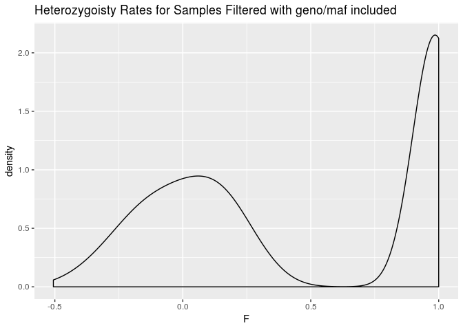

Plotting F from check-sex based on chrX heterozygosity rates (F&lt;0.4, M&gt;0.8 expected). We can see that they nicely seperate as expected.

Identification of individuals with elevated missing data rates or outlying heterozygosity rate
----------------------------------------------------------------------------------------------

### Number of missing SNPS and Proportion of Missings SNPs per Individual

-   no filters included here
-   {output.imiss} for individuals (F\_MISS will give proportion of missing SNPs per individual)
-   {output.lmiss} for snps (F\_MISS will give proportion of samples missing per SNP)
-   stricter missingness should apply for low MAF snps
-   evaluate SNP missingness rates per cohort, genotyping batch, case-control status

``` bash
plink \
--bfile ../1.split_cohorts/cohort_split_bbc \
--missing \
--out temp_cohort_split_bbc 
```

    ## PLINK v1.90b5.4 64-bit (10 Apr 2018)           www.cog-genomics.org/plink/1.9/
    ## (C) 2005-2018 Shaun Purcell, Christopher Chang   GNU General Public License v3
    ## Logging to temp_cohort_split_bbc.log.
    ## Options in effect:
    ##   --bfile ../1.split_cohorts/cohort_split_bbc
    ##   --missing
    ##   --out temp_cohort_split_bbc
    ## 
    ## 128908 MB RAM detected; reserving 64454 MB for main workspace.
    ## 128192 variants loaded from .bim file.
    ## 4224 people (1983 males, 2241 females) loaded from .fam.
    ## 4224 phenotype values loaded from .fam.
    ## Using 1 thread (no multithreaded calculations invoked).
    ## Before main variant filters, 4224 founders and 0 nonfounders present.
    ## Calculating allele frequencies... 0%1%2%3%4%5%6%7%8%9%10%11%12%13%14%15%16%17%18%19%20%21%22%23%24%25%26%27%28%29%30%31%32%33%34%35%36%37%38%39%40%41%42%43%44%45%46%47%48%49%50%51%52%53%54%55%56%57%58%59%60%61%62%63%64%65%66%67%68%69%70%71%72%73%74%75%76%77%78%79%80%81%82%83%84%85%86%87%88%89%90%91%92%93%94%95%96%97%98%99% done.
    ## Warning: 6114 het. haploid genotypes present (see temp_cohort_split_bbc.hh );
    ## many commands treat these as missing.
    ## Total genotyping rate is 0.999883.
    ## --missing: Sample missing data report written to temp_cohort_split_bbc.imiss,
    ## and variant-based missing data report written to temp_cohort_split_bbc.lmiss.

Total genotyping rate is 0.999883. The batches have aready been filtered for SNPs in common that passed QC at each run.

``` r
lmiss <- read_table("temp_cohort_split_bbc.lmiss")
lmiss %>%
  ggplot(aes(x = F_MISS)) +
  geom_density() +
  labs(title = "SNP Level Missingess")
```

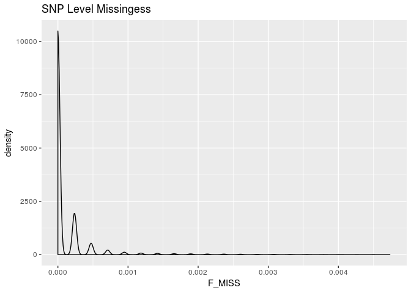

Low missingness.

``` r
imiss <- read_table("temp_cohort_split_bbc.imiss")
imiss %>%
  ggplot(aes(x = F_MISS)) +
  geom_histogram(bins = 100) +
  labs(title = "Sample Level Missingess")
```

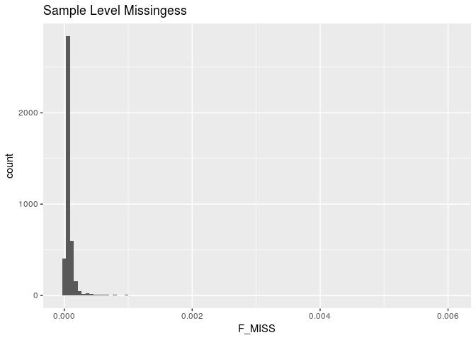

Small amount of missingness

``` r
imiss %>%
  filter(F_MISS >= 0.03) 
```

    ## # A tibble: 0 x 6
    ## # ... with 6 variables: FID <int>, IID <int>, MISS_PHENO <chr>,
    ## #   N_MISS <int>, N_GENO <int>, F_MISS <dbl>

No samples with &gt; 3% missingness.

### Samples with outlying heterozygosity rates

-   To calculate individual inbreeding F / heterozygosity With whole genome data, can be applied to pruned subset plink output includes:
-   O(HOM) Observed number of homozygotes
-   E(HOM) Expected number of homozygotes
-   N(NM) Number of non-missing genotypes
-   F F inbreeding coefficient estimate
-   approx norm range: -0.2 to 0.2, mode around zero
-   Low heterozygosity (high F; positive value) may indicate inbreeding;
-   high heterozygosity (low F; negative value) may indicate contamination.

``` bash
plink \
--bfile ../1.split_cohorts/cohort_split_bbc \
--het \
--out temp_cohort_split_bbc
```

    ## PLINK v1.90b5.4 64-bit (10 Apr 2018)           www.cog-genomics.org/plink/1.9/
    ## (C) 2005-2018 Shaun Purcell, Christopher Chang   GNU General Public License v3
    ## Logging to temp_cohort_split_bbc.log.
    ## Options in effect:
    ##   --bfile ../1.split_cohorts/cohort_split_bbc
    ##   --het
    ##   --out temp_cohort_split_bbc
    ## 
    ## 128908 MB RAM detected; reserving 64454 MB for main workspace.
    ## 128192 variants loaded from .bim file.
    ## 4224 people (1983 males, 2241 females) loaded from .fam.
    ## 4224 phenotype values loaded from .fam.
    ## Using 1 thread (no multithreaded calculations invoked).
    ## Before main variant filters, 4224 founders and 0 nonfounders present.
    ## Calculating allele frequencies... 0%1%2%3%4%5%6%7%8%9%10%11%12%13%14%15%16%17%18%19%20%21%22%23%24%25%26%27%28%29%30%31%32%33%34%35%36%37%38%39%40%41%42%43%44%45%46%47%48%49%50%51%52%53%54%55%56%57%58%59%60%61%62%63%64%65%66%67%68%69%70%71%72%73%74%75%76%77%78%79%80%81%82%83%84%85%86%87%88%89%90%91%92%93%94%95%96%97%98%99% done.
    ## Warning: 6114 het. haploid genotypes present (see temp_cohort_split_bbc.hh );
    ## many commands treat these as missing.
    ## Total genotyping rate is 0.999883.
    ## 128192 variants and 4224 people pass filters and QC.
    ## Among remaining phenotypes, 0 are cases and 4224 are controls.
    ## --het: 127437 variants scanned, report written to temp_cohort_split_bbc.het .

``` r
het <- read_table("temp_cohort_split_bbc.het") 
het <- het %>%
  mutate(obs_het_rate = (`N(NM)` - `O(HOM)`)/`E(HOM)`)
imiss_het <- left_join(imiss, het, by = "FID")

ggplot(imiss_het, aes(x = F_MISS, y = obs_het_rate)) +
  geom_point(color = densCols(log10(imiss_het$F_MISS), imiss_het$obs_het_rate)) +
  labs(x = "Proportion of missing genotypes", y = "Heterozygosity rate") +
  scale_x_log10(limits = c(0.001, 1), minor_breaks = c(0.01, 0.1)) +
  scale_y_continuous(limits = c(0, .5)) +
  geom_vline(xintercept = 0.03, color = "red") +
  geom_hline(yintercept = (mean(imiss_het$obs_het_rate)+(3*sd(imiss_het$obs_het_rate))), color = "red") +
  geom_hline(yintercept = (mean(imiss_het$obs_het_rate)-(3*sd(imiss_het$obs_het_rate))), color = "red")
```

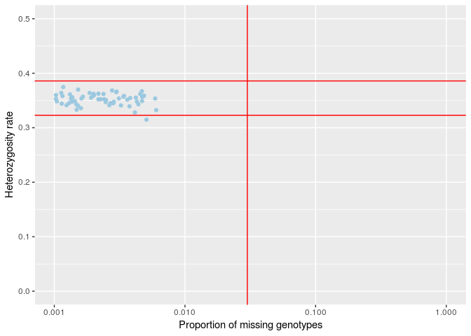

### Identify het outliers

``` r
imiss_het %>%
  filter(obs_het_rate >= (mean(imiss_het$obs_het_rate)+(4*sd(imiss_het$obs_het_rate))) |
           obs_het_rate <= (mean(imiss_het$obs_het_rate)-(4*sd(imiss_het$obs_het_rate)))) %>%
  kable(caption = "Samples That Fail Het Check")
```

Table: Samples That Fail Het Check

FID IID.x MISS\_PHENO N\_MISS N\_GENO F\_MISS IID.y O(HOM) E(HOM) N(NM) F obs\_het\_rate ---- ------ ----------- ------- ------- ------- ------ ------- ------- ------ --- -------------

``` r
imiss_het %>%
  filter(obs_het_rate >= (mean(imiss_het$obs_het_rate)+(4*sd(imiss_het$obs_het_rate))) |
           obs_het_rate <= (mean(imiss_het$obs_het_rate)-(4*sd(imiss_het$obs_het_rate)))) %>%
  dplyr::select(FID, IID.x) %>%
  write_tsv("fail-het-outlier.txt", col_names = FALSE)
```

0 samples failed het check. They are overalll pretty good. Using 4 SD due to large sample.

Calculate Overall project MAF before Filtering
----------------------------------------------

``` bash
plink \
--bfile ../1.split_cohorts/cohort_split_bbc \
--freq \
--out temp_cohort_split_bbc
```

    ## PLINK v1.90b5.4 64-bit (10 Apr 2018)           www.cog-genomics.org/plink/1.9/
    ## (C) 2005-2018 Shaun Purcell, Christopher Chang   GNU General Public License v3
    ## Logging to temp_cohort_split_bbc.log.
    ## Options in effect:
    ##   --bfile ../1.split_cohorts/cohort_split_bbc
    ##   --freq
    ##   --out temp_cohort_split_bbc
    ## 
    ## 128908 MB RAM detected; reserving 64454 MB for main workspace.
    ## 128192 variants loaded from .bim file.
    ## 4224 people (1983 males, 2241 females) loaded from .fam.
    ## 4224 phenotype values loaded from .fam.
    ## Using 1 thread (no multithreaded calculations invoked).
    ## Before main variant filters, 4224 founders and 0 nonfounders present.
    ## Calculating allele frequencies... 0%1%2%3%4%5%6%7%8%9%10%11%12%13%14%15%16%17%18%19%20%21%22%23%24%25%26%27%28%29%30%31%32%33%34%35%36%37%38%39%40%41%42%43%44%45%46%47%48%49%50%51%52%53%54%55%56%57%58%59%60%61%62%63%64%65%66%67%68%69%70%71%72%73%74%75%76%77%78%79%80%81%82%83%84%85%86%87%88%89%90%91%92%93%94%95%96%97%98%99% done.
    ## Warning: 6114 het. haploid genotypes present (see temp_cohort_split_bbc.hh );
    ## many commands treat these as missing.
    ## Total genotyping rate is 0.999883.
    ## --freq: Allele frequencies (founders only) written to temp_cohort_split_bbc.frq
    ## .

``` r
maffreq <- read_table2("temp_cohort_split_bbc.frq")
maffreq %>%
  ggplot(aes(x = MAF)) +
  geom_histogram(aes(y =..density..)) +
  geom_density(col=2) +
  labs(title = "Overall MAF Prior to Filtering")
```

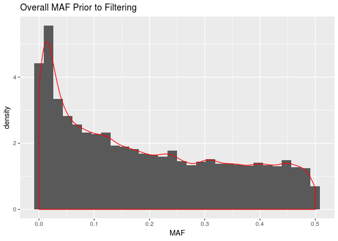

Identification of Duplicated or Related Individuals
---------------------------------------------------

-   Prune dataset for temporary use of calculating cryptic relatedness and PCA as both work best under assumption of no LD among SNPs
-   Prior to calcuating identity by state, IBS, prune SNPs to only independent SNPs and remove regions with extended linkage disequiblibirum such as HLA region. The below removes snps within a 50kb window, with an r2 &gt; .2 and variant count to shift the window at the end of each step of 5kb.

``` bash
plink \
--bfile ../1.split_cohorts/cohort_split_bbc \
--exclude range ../../original_data/highLDregions.txt \
--indep 50 5 1.8 \
--out temp_cohort_split_bbc &>/dev/null
```

Pruning complete. 12622 variants excluded removed in high ld. 75373 of 115570 variants removed variants removed. I will keep only the prune.in snps for the subsequent analysis.

-   Can add --min 0.12 to identify minimum pihat for genome output to manage size of output dataset (will only output pihat &gt;0.12)
-   PIHAT 1.0 = monozygotic twins or known replicates
-   PIHAT 0.5 = 1st degree relatives: P-C, sibs
-   PIHAT 0.25= 2nd degree relatives: half-sib, grandparents
-   PIHAT 0.125= 3rd degree relatives: full cousins

``` bash
plink \
--bfile ../1.split_cohorts/cohort_split_bbc \
--extract temp_cohort_split_bbc.prune.in \
--genome \
--min 0.12 \
--out temp_cohort_split_bbc &>/dev/null
```

``` r
genome <- read_table2("temp_cohort_split_bbc.genome")

genome <- genome %>%
  mutate(PI_HAT = as.double(PI_HAT)) %>%
  mutate(color = if_else(PI_HAT <.15, "~3rd degree",
                         if_else(PI_HAT >=.15 & PI_HAT <.35, "~2nd degree",
                                 if_else(PI_HAT >= .35 & PI_HAT < .65, "~1st degree",
                                         if_else(PI_HAT > .65, "~Replicates or twins", "???")))))

genome %>%
  ggplot(aes(x = as.double(Z0), y = as.double(Z1), color = color)) +
  geom_point(alpha = 1) +
  guides(colour = guide_legend(override.aes = list(alpha = 1)))+
  labs(x = "Z0 the proportion of loci where the pair shares zero alleles", 
       y = "Z1 the proportion of loci where the pair shares one allele") 
```

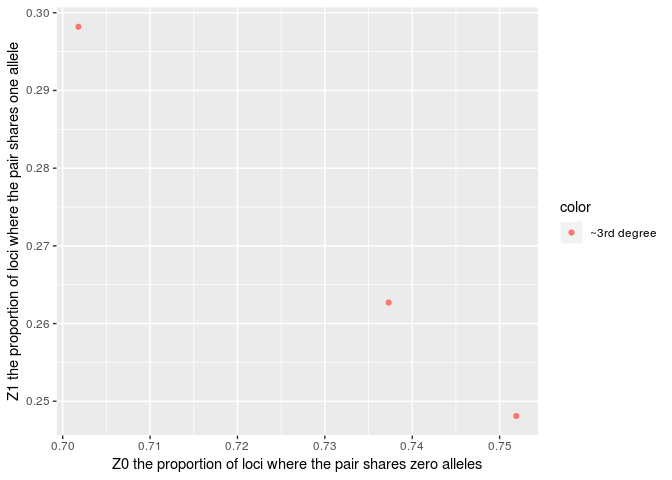

Largely independent cohort. No samples to remove.

``` r
genome %>%
  ggplot(aes(x = as.double(PI_HAT), fill = color)) +
  geom_histogram(bins = 100) +
  labs(title = "Distribution of PI_HAT for Related Individuals >0.12", x = "PI_HAT", y = "Count (non-unique)")
```

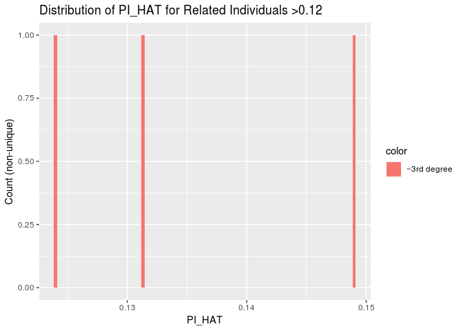

``` r
genome %>%
  filter(PI_HAT > 0.8)
```

    ## # A tibble: 0 x 15
    ## # ... with 15 variables: FID1 <int>, IID1 <int>, FID2 <int>, IID2 <int>,
    ## #   RT <chr>, EZ <chr>, Z0 <dbl>, Z1 <dbl>, Z2 <dbl>, PI_HAT <dbl>,
    ## #   PHE <int>, DST <dbl>, PPC <dbl>, RATIO <dbl>, color <chr>

``` r
genome %>%
  filter(PI_HAT > 0.8) %>%
  write_tsv("possible_duplicates.tsv")
```

Since I am only interested in removing duplicates, will set a PI-HAT threshold of 0.8. IN alter analysis, we might want to restrict to non-relateds.

Part 2 Apply QC Filters and Fix Errors
======================================

Clean Sexes and remove samples and SNPs that fail heterozygoisty, genotyping, sex-checks and IBD &gt;= 0.8/
-----------------------------------------------------------------------------------------------------------

### Clean Sexs

#### First update sex for subjects with PEDSEX == 0 and approriate F stat

No samples to update

#### Create List of Subjects that Fail Sex Check After Update

``` r
sexcheck %>%
  filter(PEDSEX == 1 & SNPSEX == 2 |
           PEDSEX == 2 & SNPSEX == 1 |
           PEDSEX == 2 & SNPSEX == 0 & F > 0.4 |
           PEDSEX == 1 & SNPSEX == 0 & F < 0.8) %>%
  kable(caption = "Subjects that Fail Sex Check")
```

|      FID|  IID|  PEDSEX|  SNPSEX| STATUS  |       F|
|--------:|----:|-------:|-------:|:--------|-------:|
|  7852213|    1|       2|       0| PROBLEM |  0.4014|

``` r
sexcheck %>%
  filter(PEDSEX == 1 & SNPSEX == 2 |
           PEDSEX == 2 & SNPSEX == 1 |
           PEDSEX == 2 & SNPSEX == 0 & F > 0.4 |
           PEDSEX == 1 & SNPSEX == 0 & F < 0.8) %>%
  dplyr::select(FID, IID) %>%
  write_tsv(path = "fail-updated-sex-check.txt", col_names = FALSE)
```

There is 1 female sample, that have out of range but quasi-reasonable F. I will remove. Disucssed with Talin.

#### Update Sex in PLINK

``` bash
plink \
--bfile ../1.split_cohorts/cohort_split_bbc \
--remove fail-updated-sex-check.txt \
--make-bed \
--out temp1_cohort_split_bbc
```

    ## PLINK v1.90b5.4 64-bit (10 Apr 2018)           www.cog-genomics.org/plink/1.9/
    ## (C) 2005-2018 Shaun Purcell, Christopher Chang   GNU General Public License v3
    ## Logging to temp1_cohort_split_bbc.log.
    ## Options in effect:
    ##   --bfile ../1.split_cohorts/cohort_split_bbc
    ##   --make-bed
    ##   --out temp1_cohort_split_bbc
    ##   --remove fail-updated-sex-check.txt
    ## 
    ## 128908 MB RAM detected; reserving 64454 MB for main workspace.
    ## 128192 variants loaded from .bim file.
    ## 4224 people (1983 males, 2241 females) loaded from .fam.
    ## 4224 phenotype values loaded from .fam.
    ## --remove: 4223 people remaining.
    ## Using 1 thread (no multithreaded calculations invoked).
    ## Before main variant filters, 4223 founders and 0 nonfounders present.
    ## Calculating allele frequencies... 0%1%2%3%4%5%6%7%8%9%10%11%12%13%14%15%16%17%18%19%20%21%22%23%24%25%26%27%28%29%30%31%32%33%34%35%36%37%38%39%40%41%42%43%44%45%46%47%48%49%50%51%52%53%54%55%56%57%58%59%60%61%62%63%64%65%66%67%68%69%70%71%72%73%74%75%76%77%78%79%80%81%82%83%84%85%86%87%88%89%90%91%92%93%94%95%96%97%98%99% done.
    ## Warning: 6114 het. haploid genotypes present (see temp1_cohort_split_bbc.hh );
    ## many commands treat these as missing.
    ## Total genotyping rate in remaining samples is 0.999883.
    ## 128192 variants and 4223 people pass filters and QC.
    ## Among remaining phenotypes, 0 are cases and 4223 are controls.
    ## --make-bed to temp1_cohort_split_bbc.bed + temp1_cohort_split_bbc.bim +
    ## temp1_cohort_split_bbc.fam ... 0%1%2%3%4%5%6%7%8%9%10%11%12%13%14%15%16%17%18%19%20%21%22%23%24%25%26%27%28%29%30%31%32%33%34%35%36%37%38%39%40%41%42%43%44%45%46%47%48%49%50%51%52%53%54%55%56%57%58%59%60%61%62%63%64%65%66%67%68%69%70%71%72%73%74%75%76%77%78%79%80%81%82%83%84%85%86%87%88%89%90%91%92%93%94%95%96%97%98%99%done.

--Removed 1 sample. Went from 4224 to 4223 subjects. All F

### Exclude Samples with IBD &gt; 0.8

Not needed. All samples not related. .

### Failed SNPs missingness or Sample Missingness at &gt;97% and MAF 1%, and HWE 10^-6

``` bash
plink \
--bfile temp1_cohort_split_bbc \
--geno 0.03 \
--maf 0.01 \
--hwe 0.000001 \
--mind 0.03 \
--make-bed \
--out qc_cohort_split_bbc 
```

    ## PLINK v1.90b5.4 64-bit (10 Apr 2018)           www.cog-genomics.org/plink/1.9/
    ## (C) 2005-2018 Shaun Purcell, Christopher Chang   GNU General Public License v3
    ## Logging to qc_cohort_split_bbc.log.
    ## Options in effect:
    ##   --bfile temp1_cohort_split_bbc
    ##   --geno 0.03
    ##   --hwe 0.000001
    ##   --maf 0.01
    ##   --make-bed
    ##   --mind 0.03
    ##   --out qc_cohort_split_bbc
    ## 
    ## 128908 MB RAM detected; reserving 64454 MB for main workspace.
    ## 128192 variants loaded from .bim file.
    ## 4223 people (1983 males, 2240 females) loaded from .fam.
    ## 4223 phenotype values loaded from .fam.
    ## 0 people removed due to missing genotype data (--mind).
    ## Using 1 thread (no multithreaded calculations invoked).
    ## Before main variant filters, 4223 founders and 0 nonfounders present.
    ## Calculating allele frequencies... 0%1%2%3%4%5%6%7%8%9%10%11%12%13%14%15%16%17%18%19%20%21%22%23%24%25%26%27%28%29%30%31%32%33%34%35%36%37%38%39%40%41%42%43%44%45%46%47%48%49%50%51%52%53%54%55%56%57%58%59%60%61%62%63%64%65%66%67%68%69%70%71%72%73%74%75%76%77%78%79%80%81%82%83%84%85%86%87%88%89%90%91%92%93%94%95%96%97%98%99% done.
    ## Warning: 6114 het. haploid genotypes present (see qc_cohort_split_bbc.hh );
    ## many commands treat these as missing.
    ## Total genotyping rate is 0.999883.
    ## 0 variants removed due to missing genotype data (--geno).
    ## Warning: --hwe observation counts vary by more than 10%, due to the X
    ## chromosome.  You may want to use a less stringent --hwe p-value threshold for X
    ## chromosome variants.
    ## --hwe: 90 variants removed due to Hardy-Weinberg exact test.
    ## 11004 variants removed due to minor allele threshold(s)
    ## (--maf/--max-maf/--mac/--max-mac).
    ## 117098 variants and 4223 people pass filters and QC.
    ## Among remaining phenotypes, 0 are cases and 4223 are controls.
    ## --make-bed to qc_cohort_split_bbc.bed + qc_cohort_split_bbc.bim +
    ## qc_cohort_split_bbc.fam ... 0%1%2%3%4%5%6%7%8%9%10%11%12%13%14%15%16%17%18%19%20%21%22%23%24%25%26%27%28%29%30%31%32%33%34%35%36%37%38%39%40%41%42%43%44%45%46%47%48%49%50%51%52%53%54%55%56%57%58%59%60%61%62%63%64%65%66%67%68%69%70%71%72%73%74%75%76%77%78%79%80%81%82%83%84%85%86%87%88%89%90%91%92%93%94%95%96%97%98%99%done.

0 variants removed due to missing genotype data (--geno). 90 variants removed due to Hardy-Weinberg exact test (--hwe) 11004 variants removed due to minor allele threshold(s)(--maf) 0 people removed due to missing genotype data (--mind)

### Remove samples that fail het check

No samples failed het check.

Part 3 Re-Check File Post QC
============================

Recheck Missingess and Sex with Cleaned File
--------------------------------------------

``` bash
plink \
--bfile qc_cohort_split_bbc \
--missing \
--out qc_cohort_split_bbc
```

    ## PLINK v1.90b5.4 64-bit (10 Apr 2018)           www.cog-genomics.org/plink/1.9/
    ## (C) 2005-2018 Shaun Purcell, Christopher Chang   GNU General Public License v3
    ## Logging to qc_cohort_split_bbc.log.
    ## Options in effect:
    ##   --bfile qc_cohort_split_bbc
    ##   --missing
    ##   --out qc_cohort_split_bbc
    ## 
    ## 128908 MB RAM detected; reserving 64454 MB for main workspace.
    ## 117098 variants loaded from .bim file.
    ## 4223 people (1983 males, 2240 females) loaded from .fam.
    ## 4223 phenotype values loaded from .fam.
    ## Using 1 thread (no multithreaded calculations invoked).
    ## Before main variant filters, 4223 founders and 0 nonfounders present.
    ## Calculating allele frequencies... 0%1%2%3%4%5%6%7%8%9%10%11%12%13%14%15%16%17%18%19%20%21%22%23%24%25%26%27%28%29%30%31%32%33%34%35%36%37%38%39%40%41%42%43%44%45%46%47%48%49%50%51%52%53%54%55%56%57%58%59%60%61%62%63%64%65%66%67%68%69%70%71%72%73%74%75%76%77%78%79%80%81%82%83%84%85%86%87%88%89%90%91%92%93%94%95%96%97%98%99% done.
    ## Warning: 6094 het. haploid genotypes present (see qc_cohort_split_bbc.hh );
    ## many commands treat these as missing.
    ## Total genotyping rate is 0.999884.
    ## --missing: Sample missing data report written to qc_cohort_split_bbc.imiss, and
    ## variant-based missing data report written to qc_cohort_split_bbc.lmiss.

``` r
lmiss <- read_table("qc_cohort_split_bbc.lmiss")
lmiss %>%
  ggplot(aes(x = F_MISS)) +
  geom_histogram(bins = 10) +
  labs(title = "SNP Level Missingess after SNP level Filtering")
```

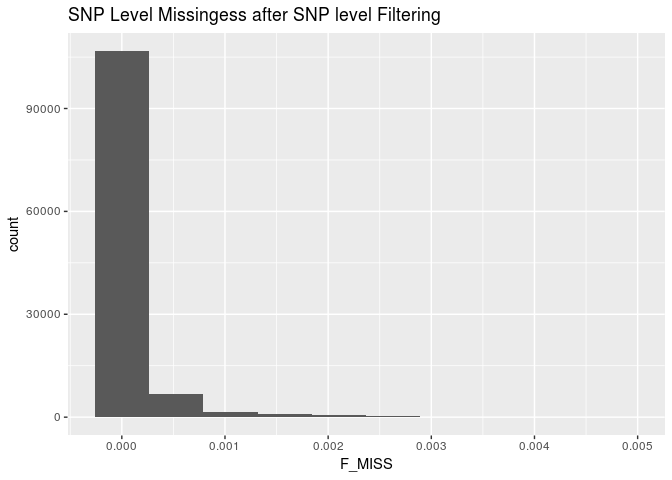

``` r
imiss <- read_table("qc_cohort_split_bbc.imiss")
imiss %>%
  ggplot(aes(x = F_MISS)) +
  geom_histogram(bins = 100) +
  labs(title = "Sample Level Missingess after Sample Level Filtering")
```

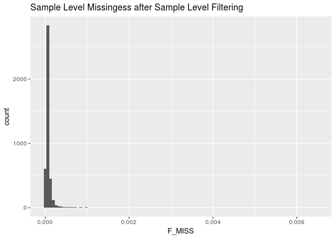 Batch effect resolved.

Re-Check Hets
-------------

``` bash
plink \
--bfile qc_cohort_split_bbc \
--het \
--out qc_cohort_split_bbc
```

    ## PLINK v1.90b5.4 64-bit (10 Apr 2018)           www.cog-genomics.org/plink/1.9/
    ## (C) 2005-2018 Shaun Purcell, Christopher Chang   GNU General Public License v3
    ## Logging to qc_cohort_split_bbc.log.
    ## Options in effect:
    ##   --bfile qc_cohort_split_bbc
    ##   --het
    ##   --out qc_cohort_split_bbc
    ## 
    ## 128908 MB RAM detected; reserving 64454 MB for main workspace.
    ## 117098 variants loaded from .bim file.
    ## 4223 people (1983 males, 2240 females) loaded from .fam.
    ## 4223 phenotype values loaded from .fam.
    ## Using 1 thread (no multithreaded calculations invoked).
    ## Before main variant filters, 4223 founders and 0 nonfounders present.
    ## Calculating allele frequencies... 0%1%2%3%4%5%6%7%8%9%10%11%12%13%14%15%16%17%18%19%20%21%22%23%24%25%26%27%28%29%30%31%32%33%34%35%36%37%38%39%40%41%42%43%44%45%46%47%48%49%50%51%52%53%54%55%56%57%58%59%60%61%62%63%64%65%66%67%68%69%70%71%72%73%74%75%76%77%78%79%80%81%82%83%84%85%86%87%88%89%90%91%92%93%94%95%96%97%98%99% done.
    ## Warning: 6094 het. haploid genotypes present (see qc_cohort_split_bbc.hh );
    ## many commands treat these as missing.
    ## Total genotyping rate is 0.999884.
    ## 117098 variants and 4223 people pass filters and QC.
    ## Among remaining phenotypes, 0 are cases and 4223 are controls.
    ## --het: 116386 variants scanned, report written to qc_cohort_split_bbc.het .

``` r
imiss <- read_table("qc_cohort_split_bbc.imiss")
het <- read_table("qc_cohort_split_bbc.het") %>%
  mutate(obs_het_rate = (`N(NM)` - `O(HOM)`)/`E(HOM)`)
imiss_het <- left_join(imiss, het, by = "FID")

ggplot(imiss_het, aes(x = F_MISS, y = obs_het_rate)) +
  geom_point(color = densCols(log10(imiss_het$F_MISS), imiss_het$obs_het_rate)) +
  labs(x = "Proportion of missing genotypes", y = "Heterozygosity rate") +
  scale_x_log10(limits = c(0.001, 1), minor_breaks = c(0.01, 0.1)) +
  scale_y_continuous(limits = c(0, .5)) +
  geom_vline(xintercept = 0.03, color = "red") +
  geom_hline(yintercept = (mean(imiss_het$obs_het_rate)+(3*sd(imiss_het$obs_het_rate))), color = "red") +
  geom_hline(yintercept = (mean(imiss_het$obs_het_rate)-(3*sd(imiss_het$obs_het_rate))), color = "red")
```

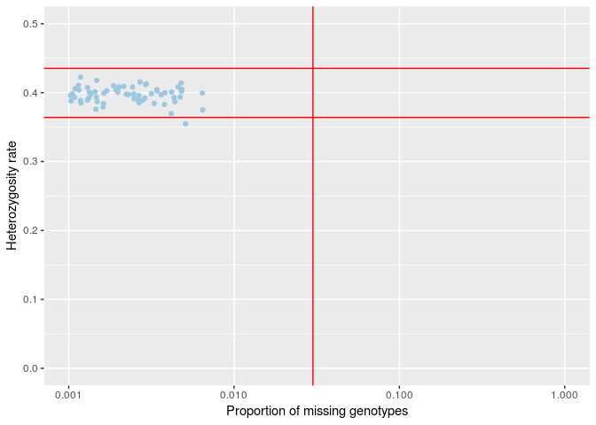 Looks great.

Calculate Overall project MAF Adter Filtering
---------------------------------------------

``` bash
plink \
--bfile qc_cohort_split_bbc \
--freq \
--out qc_cohort_split_bbc
```

    ## PLINK v1.90b5.4 64-bit (10 Apr 2018)           www.cog-genomics.org/plink/1.9/
    ## (C) 2005-2018 Shaun Purcell, Christopher Chang   GNU General Public License v3
    ## Logging to qc_cohort_split_bbc.log.
    ## Options in effect:
    ##   --bfile qc_cohort_split_bbc
    ##   --freq
    ##   --out qc_cohort_split_bbc
    ## 
    ## 128908 MB RAM detected; reserving 64454 MB for main workspace.
    ## 117098 variants loaded from .bim file.
    ## 4223 people (1983 males, 2240 females) loaded from .fam.
    ## 4223 phenotype values loaded from .fam.
    ## Using 1 thread (no multithreaded calculations invoked).
    ## Before main variant filters, 4223 founders and 0 nonfounders present.
    ## Calculating allele frequencies... 0%1%2%3%4%5%6%7%8%9%10%11%12%13%14%15%16%17%18%19%20%21%22%23%24%25%26%27%28%29%30%31%32%33%34%35%36%37%38%39%40%41%42%43%44%45%46%47%48%49%50%51%52%53%54%55%56%57%58%59%60%61%62%63%64%65%66%67%68%69%70%71%72%73%74%75%76%77%78%79%80%81%82%83%84%85%86%87%88%89%90%91%92%93%94%95%96%97%98%99% done.
    ## Warning: 6094 het. haploid genotypes present (see qc_cohort_split_bbc.hh );
    ## many commands treat these as missing.
    ## Total genotyping rate is 0.999884.
    ## --freq: Allele frequencies (founders only) written to qc_cohort_split_bbc.frq .

``` r
maffreq <- read_table2("qc_cohort_split_bbc.frq")
maffreq %>%
  ggplot(aes(x = MAF)) +
  geom_histogram(aes(y =..density..)) +
  geom_density(col=2) +
  labs(title = "Overall MAF After Filtering")
```

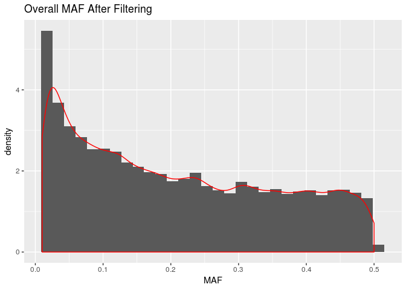

Identification of Duplicated or Related Individuals
---------------------------------------------------

-   Prune dataset for temporary use of calculating cryptic relatedness and PCA as both work best under assumption of no LD among SNPs
-   Prior to calcuating identity by state, IBS, prune SNPs to only independent SNPs and remove regions with extended linkage disequiblibirum such as HLA region. The below removes snps within a 50kb window, with an r2 &gt; .2 and variant count to shift the window at the end of each step of 5kb.

``` bash
plink \
--bfile qc_cohort_split_bbc \
--exclude ../../original_data/highLDregions.txt \
--range \
--indep 50 5 1.8 \
--out qc_cohort_split_bbc &>/dev/null
```

``` bash
plink \
--bfile qc_cohort_split_bbc \
--extract qc_cohort_split_bbc.prune.in \
--genome \
--min 0.12 \
--out qc_cohort_split_bbc &>/dev/null
```

``` r
genome <- read_table2("qc_cohort_split_bbc.genome")

genome <- genome %>%
  mutate(PI_HAT = as.double(PI_HAT)) %>%
  mutate(color = if_else(PI_HAT <.15, "~3rd degree",
                         if_else(PI_HAT >=.15 & PI_HAT <.35, "~2nd degree",
                                 if_else(PI_HAT >= .35 & PI_HAT < .65, "~1st degree",
                                         if_else(PI_HAT > .65, "~Replicates or twins", "???")))))

genome %>%
  ggplot(aes(x = as.double(Z0), y = as.double(Z1), color = color)) +
  geom_point(alpha = 1) +
  guides(colour = guide_legend(override.aes = list(alpha = 1)))+
  labs(x = "Z0 the proportion of loci where the pair shares zero alleles", 
       y = "Z1 the proportion of loci where the pair shares one allele") 
```

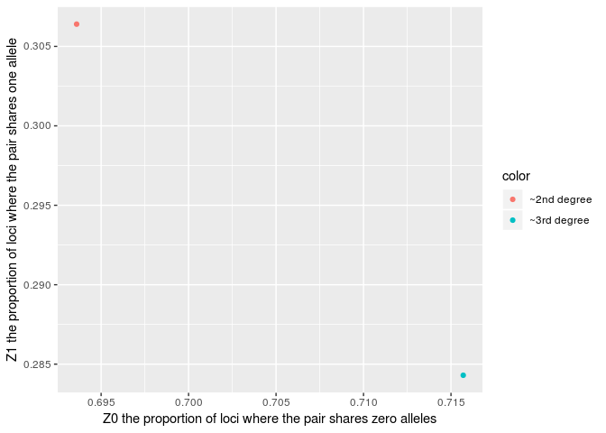

Replicates (purple) removed

``` r
genome %>%
  ggplot(aes(x = as.double(PI_HAT), fill = color)) +
  geom_histogram(bins = 100) +
  labs(title = "Distribution of PI_HAT for Related Individuals >0.12", x = "PI_HAT", y = "Count (non-unique)")
```

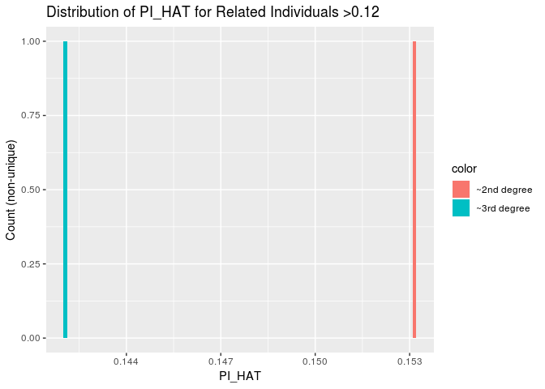

``` r
file.remove(list.files(pattern = "^temp", full.names = TRUE))
```

    ##  [1] TRUE TRUE TRUE TRUE TRUE TRUE TRUE TRUE TRUE TRUE TRUE TRUE TRUE TRUE
    ## [15] TRUE
