iChip 1 through 6 European QC
================
Translational Genomics Group
07 September, 2018

Set-up
------

This document is broken down into three parts. - Part 1 Identifies QC issues - Part 2 Fixes and applies QC parameters - Part 3 Re-Checks genotype data post QC Changes

Source Data
-----------

IBD IChip, Runs 1-6, Illumina's TOP Allele Called, including GOLDR removed BBC, filtered to SNPS in common, and aligned to HG19.

Part 1 - Identify QC Issues
===========================

Identification of individuals with discordant sex information WITH --geno and --maf filters
-------------------------------------------------------------------------------------------

-   Plink uses chrX data to determine sex (based on heterozygosity rates).
-   Default PLINK thresholds of .2 for Females and .8 for Males when assessing homozygosity rates, but use .4 and .8.
-   When the homozygosity rate is more than 0.4 but less than 0.8, the genotype data are inconclusive regarding the sex of an individual and these are marked in column 4 with a 0.
-   maf and geno filter added with check-sex run
-   PEDSEX=sex as recorded in pedfile (1=male, 2=female)
-   SNPSEX=sex as predicted based on genetic data (1=male, 2=female, 0=unknown)
-   If needed, compare with GenomeStudio gender estimates to ID true problems
-   We suggest running --check-sex once without parameters, eyeballing the distribution of F estimates (there should be a clear gap between a very tight male clump at the right side of the distribution and the females everywhere else), and then rerunning with parameters corresponding to the empirical gap.

``` bash
plink \
--bfile ../2.estimate_ancestry/eur_cohort_split_ichip1t6 \
--geno 0.03 \
--maf 0.05 \
--check-sex .4 .8 \
--out temp_eur_cohort_split_ichip1t6
```

    ## PLINK v1.90b5.4 64-bit (10 Apr 2018)           www.cog-genomics.org/plink/1.9/
    ## (C) 2005-2018 Shaun Purcell, Christopher Chang   GNU General Public License v3
    ## Logging to temp_eur_cohort_split_ichip1t6.log.
    ## Options in effect:
    ##   --bfile ../2.estimate_ancestry/eur_cohort_split_ichip1t6
    ##   --check-sex .4 .8
    ##   --geno 0.03
    ##   --maf 0.05
    ##   --out temp_eur_cohort_split_ichip1t6
    ## 
    ## 128908 MB RAM detected; reserving 64454 MB for main workspace.
    ## 133250 variants loaded from .bim file.
    ## 8295 people (4182 males, 4112 females, 1 ambiguous) loaded from .fam.
    ## Ambiguous sex ID written to temp_eur_cohort_split_ichip1t6.nosex .
    ## Using 1 thread (no multithreaded calculations invoked).
    ## Before main variant filters, 8295 founders and 0 nonfounders present.
    ## Calculating allele frequencies... 0%1%2%3%4%5%6%7%8%9%10%11%12%13%14%15%16%17%18%19%20%21%22%23%24%25%26%27%28%29%30%31%32%33%34%35%36%37%38%39%40%41%42%43%44%45%46%47%48%49%50%51%52%53%54%55%56%57%58%59%60%61%62%63%64%65%66%67%68%69%70%71%72%73%74%75%76%77%78%79%80%81%82%83%84%85%86%87%88%89%90%91%92%93%94%95%96%97%98%99% done.
    ## Warning: 44 het. haploid genotypes present (see
    ## temp_eur_cohort_split_ichip1t6.hh ); many commands treat these as missing.
    ## Total genotyping rate is 0.999198.
    ## 512 variants removed due to missing genotype data (--geno).
    ## 37354 variants removed due to minor allele threshold(s)
    ## (--maf/--max-maf/--mac/--max-mac).
    ## 95384 variants and 8295 people pass filters and QC.
    ## Note: No phenotypes present.
    ## --check-sex: 593 Xchr and 0 Ychr variant(s) scanned, 4 problems detected.
    ## Report written to temp_eur_cohort_split_ichip1t6.sexcheck .

Using 593 Xchr variants to check sex; 4 problems detected

``` r
sexcheck <- read_table2(file = "temp_eur_cohort_split_ichip1t6.sexcheck")
sexcheck %>%
  filter(STATUS == "PROBLEM") %>%
  kable(caption = "List of Individuals with Sex Check Problems")
```

| FID     |  IID|  PEDSEX|  SNPSEX| STATUS  |       F|
|:--------|----:|-------:|-------:|:--------|-------:|
| 0201354 |   11|       2|       0| PROBLEM |  0.4217|
| 0201478 |   11|       2|       0| PROBLEM |  0.4110|
| 1101662 |   11|       0|       1| PROBLEM |  1.0000|
| 1400397 |    1|       2|       0| PROBLEM |  0.4265|

``` r
sexcheck %>%
  filter(STATUS == "PROBLEM") %>%
  filter(PEDSEX != 0) %>%
  kable(caption = "Sex Problems with a Reported Sex in Ped")
```

| FID     |  IID|  PEDSEX|  SNPSEX| STATUS  |       F|
|:--------|----:|-------:|-------:|:--------|-------:|
| 0201354 |   11|       2|       0| PROBLEM |  0.4217|
| 0201478 |   11|       2|       0| PROBLEM |  0.4110|
| 1400397 |    1|       2|       0| PROBLEM |  0.4265|

3 of 4 sex problems come from a reported PEDSEX of Female but an F &gt; 0.4.

``` r
sexcheck %>%
  filter(STATUS == "PROBLEM") %>%
  filter(PEDSEX == 0) %>%
  kable(caption = "Sex Probelms without Sex Recorded in Ped")
```

| FID     |  IID|  PEDSEX|  SNPSEX| STATUS  |    F|
|:--------|----:|-------:|-------:|:--------|----:|
| 1101662 |   11|       0|       1| PROBLEM |    1|

The remaining 1 problem comes from a sample without a reported PEDSEX, but is classified as Male.

``` r
sexcheck %>%
  ggplot(aes(x = F)) +
  geom_density() +
  labs(title = "Heterozygoisty Rates for Samples Filtered with geno/maf included") 
```

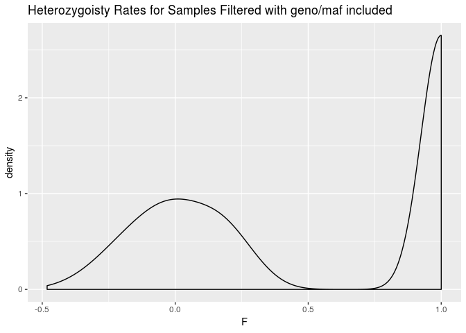

Plotting F from check-sex based on chrX heterozygosity rates (F&lt;0.4, M&gt;0.8 expected). We can see that they nicely seperate as expected.

Identification of individuals with elevated missing data rates or outlying heterozygosity rate
----------------------------------------------------------------------------------------------

### Number of missing SNPS and Proportion of Missings SNPs per Individual

-   no filters included here
-   {output.imiss} for individuals (F\_MISS will give proportion of missing SNPs per individual)
-   {output.lmiss} for snps (F\_MISS will give proportion of samples missing per SNP)
-   stricter missingness should apply for low MAF snps
-   evaluate SNP missingness rates per cohort, genotyping batch, case-control status

``` bash
plink \
--bfile ../2.estimate_ancestry/eur_cohort_split_ichip1t6 \
--missing \
--out temp_eur_cohort_split_ichip1t6 
```

    ## PLINK v1.90b5.4 64-bit (10 Apr 2018)           www.cog-genomics.org/plink/1.9/
    ## (C) 2005-2018 Shaun Purcell, Christopher Chang   GNU General Public License v3
    ## Logging to temp_eur_cohort_split_ichip1t6.log.
    ## Options in effect:
    ##   --bfile ../2.estimate_ancestry/eur_cohort_split_ichip1t6
    ##   --missing
    ##   --out temp_eur_cohort_split_ichip1t6
    ## 
    ## 128908 MB RAM detected; reserving 64454 MB for main workspace.
    ## 133250 variants loaded from .bim file.
    ## 8295 people (4182 males, 4112 females, 1 ambiguous) loaded from .fam.
    ## Ambiguous sex ID written to temp_eur_cohort_split_ichip1t6.nosex .
    ## Using 1 thread (no multithreaded calculations invoked).
    ## Before main variant filters, 8295 founders and 0 nonfounders present.
    ## Calculating allele frequencies... 0%1%2%3%4%5%6%7%8%9%10%11%12%13%14%15%16%17%18%19%20%21%22%23%24%25%26%27%28%29%30%31%32%33%34%35%36%37%38%39%40%41%42%43%44%45%46%47%48%49%50%51%52%53%54%55%56%57%58%59%60%61%62%63%64%65%66%67%68%69%70%71%72%73%74%75%76%77%78%79%80%81%82%83%84%85%86%87%88%89%90%91%92%93%94%95%96%97%98%99% done.
    ## Warning: 44 het. haploid genotypes present (see
    ## temp_eur_cohort_split_ichip1t6.hh ); many commands treat these as missing.
    ## Total genotyping rate is 0.999198.
    ## --missing: Sample missing data report written to
    ## temp_eur_cohort_split_ichip1t6.imiss, and variant-based missing data report
    ## written to temp_eur_cohort_split_ichip1t6.lmiss.

Total genotyping rate is 0.999198. The batches have aready been filtered for SNPs in common that passed QC at each run.

``` r
lmiss <- read_table("temp_eur_cohort_split_ichip1t6.lmiss")
lmiss %>%
  ggplot(aes(x = F_MISS)) +
  geom_density() +
  labs(title = "SNP Level Missingess")
```

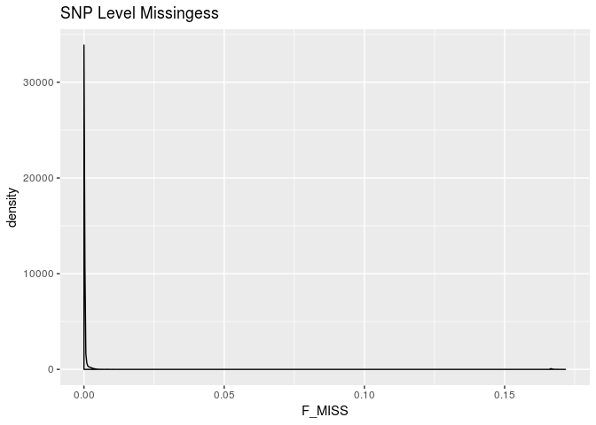

Low missingness across iChip1-6

``` r
imiss <- read_table("temp_eur_cohort_split_ichip1t6.imiss")
imiss %>%
  ggplot(aes(x = F_MISS)) +
  geom_histogram(bins = 100) +
  labs(title = "Sample Level Missingess")
```

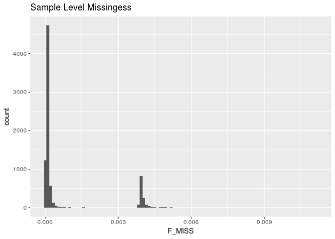

Small amount of missingness, likely batch related due to unique peaks, but still quite low.

``` r
imiss %>%
  filter(F_MISS >= 0.03) 
```

    ## # A tibble: 0 x 6
    ## # ... with 6 variables: FID <chr>, IID <int>, MISS_PHENO <chr>,
    ## #   N_MISS <int>, N_GENO <int>, F_MISS <dbl>

No samples with &gt; 3% missingness.

### Samples with outlying heterozygosity rates

-   To calculate individual inbreeding F / heterozygosity With whole genome data, can be applied to pruned subset plink output includes:
-   O(HOM) Observed number of homozygotes
-   E(HOM) Expected number of homozygotes
-   N(NM) Number of non-missing genotypes
-   F F inbreeding coefficient estimate
-   approx norm range: -0.2 to 0.2, mode around zero
-   Low heterozygosity (high F; positive value) may indicate inbreeding;
-   high heterozygosity (low F; negative value) may indicate contamination.

``` bash
plink \
--bfile ../2.estimate_ancestry/eur_cohort_split_ichip1t6 \
--het \
--out temp_eur_cohort_split_ichip1t6
```

    ## PLINK v1.90b5.4 64-bit (10 Apr 2018)           www.cog-genomics.org/plink/1.9/
    ## (C) 2005-2018 Shaun Purcell, Christopher Chang   GNU General Public License v3
    ## Logging to temp_eur_cohort_split_ichip1t6.log.
    ## Options in effect:
    ##   --bfile ../2.estimate_ancestry/eur_cohort_split_ichip1t6
    ##   --het
    ##   --out temp_eur_cohort_split_ichip1t6
    ## 
    ## 128908 MB RAM detected; reserving 64454 MB for main workspace.
    ## 133250 variants loaded from .bim file.
    ## 8295 people (4182 males, 4112 females, 1 ambiguous) loaded from .fam.
    ## Ambiguous sex ID written to temp_eur_cohort_split_ichip1t6.nosex .
    ## Using 1 thread (no multithreaded calculations invoked).
    ## Before main variant filters, 8295 founders and 0 nonfounders present.
    ## Calculating allele frequencies... 0%1%2%3%4%5%6%7%8%9%10%11%12%13%14%15%16%17%18%19%20%21%22%23%24%25%26%27%28%29%30%31%32%33%34%35%36%37%38%39%40%41%42%43%44%45%46%47%48%49%50%51%52%53%54%55%56%57%58%59%60%61%62%63%64%65%66%67%68%69%70%71%72%73%74%75%76%77%78%79%80%81%82%83%84%85%86%87%88%89%90%91%92%93%94%95%96%97%98%99% done.
    ## Warning: 44 het. haploid genotypes present (see
    ## temp_eur_cohort_split_ichip1t6.hh ); many commands treat these as missing.
    ## Total genotyping rate is 0.999198.
    ## 133250 variants and 8295 people pass filters and QC.
    ## Note: No phenotypes present.
    ## --het: 132271 variants scanned, report written to
    ## temp_eur_cohort_split_ichip1t6.het .

``` r
het <- read_table("temp_eur_cohort_split_ichip1t6.het") 
het <- het %>%
  mutate(obs_het_rate = (`N(NM)` - `O(HOM)`)/`E(HOM)`)
imiss_het <- left_join(imiss, het, by = "FID")

ggplot(imiss_het, aes(x = F_MISS, y = obs_het_rate)) +
  geom_point(color = densCols(log10(imiss_het$F_MISS), imiss_het$obs_het_rate)) +
  labs(x = "Proportion of missing genotypes", y = "Heterozygosity rate") +
  scale_x_log10(limits = c(0.001, 1), minor_breaks = c(0.01, 0.1)) +
  scale_y_continuous(limits = c(0, .5)) +
  geom_vline(xintercept = 0.03, color = "red") +
  geom_hline(yintercept = (mean(imiss_het$obs_het_rate)+(3*sd(imiss_het$obs_het_rate))), color = "red") +
  geom_hline(yintercept = (mean(imiss_het$obs_het_rate)-(3*sd(imiss_het$obs_het_rate))), color = "red")
```

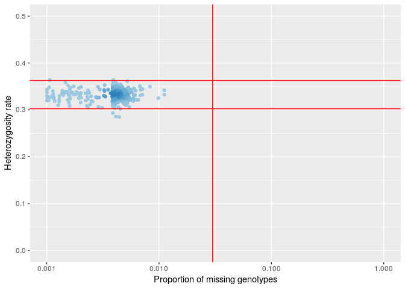

### Identify het outliers

``` r
imiss_het %>%
  filter(obs_het_rate >= (mean(imiss_het$obs_het_rate)+(4*sd(imiss_het$obs_het_rate))) |
           obs_het_rate <= (mean(imiss_het$obs_het_rate)-(4*sd(imiss_het$obs_het_rate)))) %>%
  kable(caption = "Samples That Fail Het Check")
```

| FID     |  IID.x| MISS\_PHENO |  N\_MISS|  N\_GENO|    F\_MISS|  IID.y|  O(HOM)|  E(HOM)|   N(NM)|       F|  obs\_het\_rate|
|:--------|------:|:------------|--------:|--------:|----------:|------:|-------:|-------:|-------:|-------:|---------------:|
| 0401750 |      1| Y           |       18|   133250|  0.0001351|      1|  103637|   99080|  132253|  0.1374|       0.2888171|
| 0602960 |      1| Y           |        5|   133250|  0.0000375|      1|  104505|   99090|  132266|  0.1633|       0.2801595|
| 1000903 |      1| Y           |       18|   133250|  0.0001351|      1|  103453|   99080|  132253|  0.1319|       0.2906742|
| 1200345 |      1| Y           |      590|   133250|  0.0044280|      1|  103584|   98670|  131690|  0.1489|       0.2848485|
| 1400426 |      1| Y           |       18|   133250|  0.0001351|      1|  103647|   99080|  132253|  0.1376|       0.2887162|
| 8900681 |      1| Y           |       17|   133250|  0.0001276|      1|  106194|   99080|  132254|  0.2144|       0.2630198|
| 9400654 |      1| Y           |       18|   133250|  0.0001351|      1|  103461|   99080|  132253|  0.1321|       0.2905935|
| 9400692 |      1| Y           |       24|   133250|  0.0001801|      1|  103571|   99070|  132247|  0.1355|       0.2894519|
| 9500385 |      1| Y           |      549|   133250|  0.0041200|      1|  103511|   98700|  131731|  0.1457|       0.2859169|

``` r
imiss_het %>%
  filter(obs_het_rate >= (mean(imiss_het$obs_het_rate)+(4*sd(imiss_het$obs_het_rate))) |
           obs_het_rate <= (mean(imiss_het$obs_het_rate)-(4*sd(imiss_het$obs_het_rate)))) %>%
  dplyr::select(FID, IID.x) %>%
  write_tsv("fail-het-outlier.txt", col_names = FALSE)
```

9 samples failed het check. They are overalll pretty good. Using 4 SD due to large sample.

Calculate Overall project MAF before Filtering
----------------------------------------------

``` bash
plink \
--bfile ../2.estimate_ancestry/eur_cohort_split_ichip1t6 \
--freq \
--out temp_eur_cohort_split_ichip1t6
```

    ## PLINK v1.90b5.4 64-bit (10 Apr 2018)           www.cog-genomics.org/plink/1.9/
    ## (C) 2005-2018 Shaun Purcell, Christopher Chang   GNU General Public License v3
    ## Logging to temp_eur_cohort_split_ichip1t6.log.
    ## Options in effect:
    ##   --bfile ../2.estimate_ancestry/eur_cohort_split_ichip1t6
    ##   --freq
    ##   --out temp_eur_cohort_split_ichip1t6
    ## 
    ## 128908 MB RAM detected; reserving 64454 MB for main workspace.
    ## 133250 variants loaded from .bim file.
    ## 8295 people (4182 males, 4112 females, 1 ambiguous) loaded from .fam.
    ## Ambiguous sex ID written to temp_eur_cohort_split_ichip1t6.nosex .
    ## Using 1 thread (no multithreaded calculations invoked).
    ## Before main variant filters, 8295 founders and 0 nonfounders present.
    ## Calculating allele frequencies... 0%1%2%3%4%5%6%7%8%9%10%11%12%13%14%15%16%17%18%19%20%21%22%23%24%25%26%27%28%29%30%31%32%33%34%35%36%37%38%39%40%41%42%43%44%45%46%47%48%49%50%51%52%53%54%55%56%57%58%59%60%61%62%63%64%65%66%67%68%69%70%71%72%73%74%75%76%77%78%79%80%81%82%83%84%85%86%87%88%89%90%91%92%93%94%95%96%97%98%99% done.
    ## Warning: 44 het. haploid genotypes present (see
    ## temp_eur_cohort_split_ichip1t6.hh ); many commands treat these as missing.
    ## Total genotyping rate is 0.999198.
    ## --freq: Allele frequencies (founders only) written to
    ## temp_eur_cohort_split_ichip1t6.frq .

``` r
maffreq <- read_table2("temp_eur_cohort_split_ichip1t6.frq")
maffreq %>%
  ggplot(aes(x = MAF)) +
  geom_histogram(aes(y =..density..)) +
  geom_density(col=2) +
  labs(title = "Overall MAF Prior to Filtering")
```

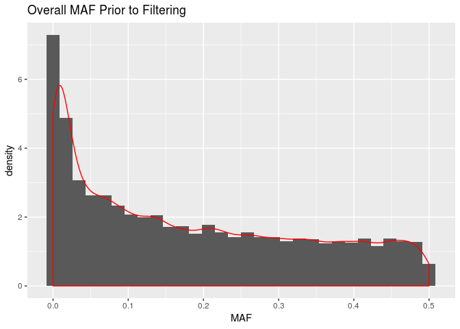

Identification of Duplicated or Related Individuals
---------------------------------------------------

-   Prune dataset for temporary use of calculating cryptic relatedness and PCA as both work best under assumption of no LD among SNPs
-   Prior to calcuating identity by state, IBS, prune SNPs to only independent SNPs and remove regions with extended linkage disequiblibirum such as HLA region. The below removes snps within a 50kb window, with an r2 &gt; .2 and variant count to shift the window at the end of each step of 5kb.

``` bash
plink \
--bfile ../2.estimate_ancestry/eur_cohort_split_ichip1t6 \
--exclude range ../../original_data/highLDregions.txt \
--indep 50 5 1.8 \
--out temp_eur_cohort_split_ichip1t6 &>/dev/null
```

Pruning complete. 12368 variants excluded removed in high ld. 77285 of 121314 variants removed. I will keep only the prune.in snps for the subsequent analysis.

-   Can add --min 0.12 to identify minimum pihat for genome output to manage size of output dataset (will only output pihat &gt;0.12)
-   PIHAT 1.0 = monozygotic twins or known replicates
-   PIHAT 0.5 = 1st degree relatives: P-C, sibs
-   PIHAT 0.25= 2nd degree relatives: half-sib, grandparents
-   PIHAT 0.125= 3rd degree relatives: full cousins

``` bash
plink \
--bfile ../2.estimate_ancestry/eur_cohort_split_ichip1t6 \
--extract temp_eur_cohort_split_ichip1t6.prune.in \
--genome \
--min 0.12 \
--out temp_eur_cohort_split_ichip1t6 &>/dev/null
```

``` r
genome <- read_table2("temp_eur_cohort_split_ichip1t6.genome")

genome <- genome %>%
  mutate(PI_HAT = as.double(PI_HAT)) %>%
  mutate(color = if_else(PI_HAT <.15, "~3rd degree",
                         if_else(PI_HAT >=.15 & PI_HAT <.35, "~2nd degree",
                                 if_else(PI_HAT >= .35 & PI_HAT < .65, "~1st degree",
                                         if_else(PI_HAT > .65, "~Replicates or twins", "???")))))

genome %>%
  ggplot(aes(x = as.double(Z0), y = as.double(Z1), color = color)) +
  geom_point(alpha = 1/20) +
  guides(colour = guide_legend(override.aes = list(alpha = 1)))+
  labs(x = "Z0 the proportion of loci where the pair shares zero alleles", 
       y = "Z1 the proportion of loci where the pair shares one allele") 
```

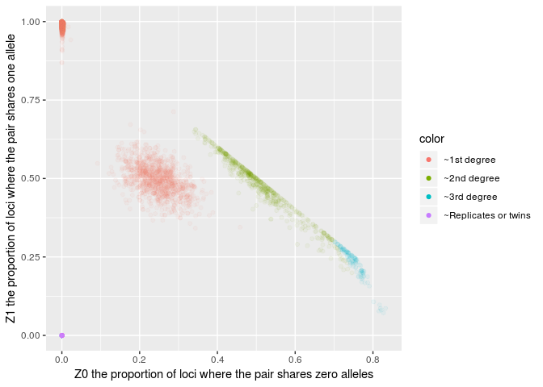

We have a related cohort. The above plot is restricted to samples with a PI\_HAT atleast 0.12. Samples can be represented more than once if multiple relations are found.

``` r
genome %>%
  ggplot(aes(x = as.double(PI_HAT), fill = color)) +
  geom_histogram(bins = 100) +
  labs(title = "Distribution of PI_HAT for Related Individuals >0.12", x = "PI_HAT", y = "Count (non-unique)")
```

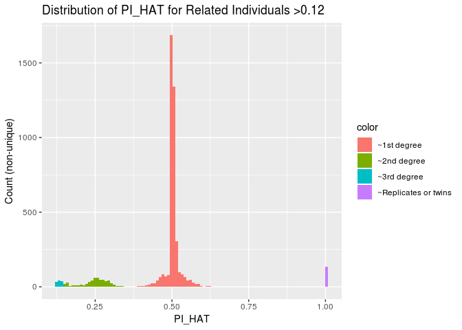

``` r
genome %>%
  filter(PI_HAT > 0.8)
```

    ## # A tibble: 133 x 15
    ##    FID1   IID1 FID2  IID2 RT    EZ       Z0    Z1    Z2 PI_HAT   PHE   DST
    ##    <chr> <int> <ch> <int> <chr> <chr> <dbl> <dbl> <dbl>  <dbl> <int> <dbl>
    ##  1 0000…     1 000…     1 UN    <NA>      0     0     1      1    -1     1
    ##  2 0000…     1 000…     1 UN    <NA>      0     0     1      1    -1     1
    ##  3 0000…     1 000…     1 UN    <NA>      0     0     1      1    -1     1
    ##  4 06003     1 070…     1 UN    <NA>      0     0     1      1    -1     1
    ##  5 06006     1 110…     1 UN    <NA>      0     0     1      1    -1     1
    ##  6 06013     1 110…     1 UN    <NA>      0     0     1      1    -1     1
    ##  7 06015     1 110…     1 UN    <NA>      0     0     1      1    -1     1
    ##  8 06017     1 110…     1 UN    <NA>      0     0     1      1    -1     1
    ##  9 06032     1 110…     1 UN    <NA>      0     0     1      1    -1     1
    ## 10 06037     1 110…     1 UN    <NA>      0     0     1      1    -1     1
    ## # ... with 123 more rows, and 3 more variables: PPC <dbl>, RATIO <dbl>,
    ## #   color <chr>

``` r
genome %>%
  filter(PI_HAT > 0.8) %>%
  write_tsv("possible_duplicates.tsv")
```

Since I am only interested in removing duplicates, will set a PI-HAT threshold of 0.8. IN alter analysis, we might want to restrict to non-relateds.

Part 2 Apply QC Filters and Fix Errors
======================================

Clean Sexes and remove samples and SNPs that fail heterozygoisty, genotyping, sex-checks and IBD &gt;= 0.8/
-----------------------------------------------------------------------------------------------------------

### Clean Sexs

#### First update sex for subjects with PEDSEX == 0 and approriate F stat

If PED sex 0 and F &lt; 0.4 updated PED to Female 2 (not needed in this set) If PED sex 0 and F &gt; 0.8 update PED to male 1 All samples with previously un-assigned PED SEX assigned

``` r
sexcheck %>%
  filter(PEDSEX == 0) %>%
  mutate(PEDSEX = ifelse(F < 0.4, 2,
                          ifelse(F > 0.8, 1, PEDSEX))) %>% 
  filter(PEDSEX != 0) %>%
  dplyr::select(FID, IID, PEDSEX)  %>%
  write_tsv("update-missing-sex.txt", col_names = FALSE)
  
sexcheck %>%
  filter(PEDSEX == 0) %>%
  mutate(PEDSEX = ifelse(F < 0.4, 2,
                          ifelse(F > 0.8, 1, PEDSEX))) %>% 
  filter(PEDSEX != 0) %>%
  dplyr::select(FID, IID, PEDSEX) %>%
  kable(caption = "Subjects to Update Sex")
```

| FID     |  IID|  PEDSEX|
|:--------|----:|-------:|
| 1101662 |   11|       1|

#### Create List of Subjects that Fail Sex Check After Update

``` r
sexcheck %>%
  filter(PEDSEX == 1 & SNPSEX == 2 |
           PEDSEX == 2 & SNPSEX == 1 |
           PEDSEX == 2 & SNPSEX == 0 & F > 0.4 |
           PEDSEX == 1 & SNPSEX == 0 & F < 0.8) %>%
  kable(caption = "Subjects that Fail Sex Check")
```

| FID     |  IID|  PEDSEX|  SNPSEX| STATUS  |       F|
|:--------|----:|-------:|-------:|:--------|-------:|
| 0201354 |   11|       2|       0| PROBLEM |  0.4217|
| 0201478 |   11|       2|       0| PROBLEM |  0.4110|
| 1400397 |    1|       2|       0| PROBLEM |  0.4265|

``` r
sexcheck %>%
  filter(PEDSEX == 1 & SNPSEX == 2 |
           PEDSEX == 2 & SNPSEX == 1 |
           PEDSEX == 2 & SNPSEX == 0 & F > 0.4 |
           PEDSEX == 1 & SNPSEX == 0 & F < 0.8) %>%
  dplyr::select(FID, IID) %>%
  write_tsv(path = "fail-updated-sex-check.txt", col_names = FALSE)
```

These are 3 female samples, that have out of range but quasi-reasonable F. I will remove. Disucssed with Talin.

#### Update Sex in PLINK

``` bash
plink \
--bfile ../2.estimate_ancestry/eur_cohort_split_ichip1t6 \
--update-sex update-missing-sex.txt \
--remove fail-updated-sex-check.txt \
--make-bed \
--out temp1_eur_cohort_split_ichip1t6
```

    ## PLINK v1.90b5.4 64-bit (10 Apr 2018)           www.cog-genomics.org/plink/1.9/
    ## (C) 2005-2018 Shaun Purcell, Christopher Chang   GNU General Public License v3
    ## Logging to temp1_eur_cohort_split_ichip1t6.log.
    ## Options in effect:
    ##   --bfile ../2.estimate_ancestry/eur_cohort_split_ichip1t6
    ##   --make-bed
    ##   --out temp1_eur_cohort_split_ichip1t6
    ##   --remove fail-updated-sex-check.txt
    ##   --update-sex update-missing-sex.txt
    ## 
    ## 128908 MB RAM detected; reserving 64454 MB for main workspace.
    ## 133250 variants loaded from .bim file.
    ## 8295 people (4182 males, 4112 females, 1 ambiguous) loaded from .fam.
    ## Ambiguous sex ID written to temp1_eur_cohort_split_ichip1t6.nosex .
    ## --update-sex: 1 person updated.
    ## --remove: 8292 people remaining.
    ## Using 1 thread (no multithreaded calculations invoked).
    ## Before main variant filters, 8292 founders and 0 nonfounders present.
    ## Calculating allele frequencies... 0%1%2%3%4%5%6%7%8%9%10%11%12%13%14%15%16%17%18%19%20%21%22%23%24%25%26%27%28%29%30%31%32%33%34%35%36%37%38%39%40%41%42%43%44%45%46%47%48%49%50%51%52%53%54%55%56%57%58%59%60%61%62%63%64%65%66%67%68%69%70%71%72%73%74%75%76%77%78%79%80%81%82%83%84%85%86%87%88%89%90%91%92%93%94%95%96%97%98%99% done.
    ## Warning: 44 het. haploid genotypes present (see
    ## temp1_eur_cohort_split_ichip1t6.hh ); many commands treat these as missing.
    ## Total genotyping rate in remaining samples is 0.999198.
    ## 133250 variants and 8292 people pass filters and QC.
    ## Note: No phenotypes present.
    ## --make-bed to temp1_eur_cohort_split_ichip1t6.bed +
    ## temp1_eur_cohort_split_ichip1t6.bim + temp1_eur_cohort_split_ichip1t6.fam ...
    ## 0%1%2%3%4%5%6%7%8%9%10%11%12%13%14%15%16%17%18%19%20%21%22%23%24%25%26%27%28%29%30%31%32%33%34%35%36%37%38%39%40%41%42%43%44%45%46%47%48%49%50%51%52%53%54%55%56%57%58%59%60%61%62%63%64%65%66%67%68%69%70%71%72%73%74%75%76%77%78%79%80%81%82%83%84%85%86%87%88%89%90%91%92%93%94%95%96%97%98%99%done.

--update-sex: 1 people updated. --Removed 3 samples. Went from 8295 to 8292 subjects. All F

### Exclude Samples with IBD &gt; 0.8

For the purposes of this QC, I want to identify all pairs of individuals with an IBD &gt;=0.8 and then remove the individual in the pair with the lower genotyping rate. IN some cases, you will want to remove the individual with the lower genotyping rate dependent on the phenotype. The ID of the individuals with the lower genotype rate will be stored in ‘fail-IBD-QC.txt’ for subsequent removal.

``` r
relateds <- genome %>%
  filter(PI_HAT > 0.8)

compare_missingness <- function(FID1, IID1, FID2, IID2, imiss){
  output <- data.frame(fid1_miss = numeric(length(FID1)),
                       fid2_miss = numeric(length(FID1)))
  for(i in seq_along(FID1)) {
    fid1_miss <- imiss %>%
      filter(FID == FID1[[i]] & IID == IID1[[i]]) %>%
      select(F_MISS) %>%
      unlist() 
    
    fid2_miss <- imiss %>%
      filter(FID == FID2[[i]] & IID == IID2[[i]]) %>%
      select(F_MISS) %>%
      unlist()
    
    output[i,] <- c(fid1_miss, fid2_miss)
  }
  return(output)
}

output <- compare_missingness(relateds$FID1, relateds$IID1, relateds$FID2, relateds$IID2, imiss)

relateds <- relateds %>%
  bind_cols(., output) %>%
  mutate(better_sample = if_else(fid1_miss <= fid2_miss, paste("FID1"), paste("FID2")))

duplicates_to_remove <- relateds %>%
  mutate(remove_fid = if_else(better_sample == "FID1", FID2,
                              if_else(better_sample == "FID2", FID1, "Wilson"))) %>%
  mutate(remove_iid = ifelse(better_sample == "FID1", IID2,
                              ifelse(better_sample == "FID2", IID1, "Wilson"))) %>%
  select(remove_fid, remove_iid) %>%
  write_tsv("fail-IBD-QC.tsv", col_names = FALSE)
```

``` bash
plink \
--bfile temp1_eur_cohort_split_ichip1t6 \
--remove fail-IBD-QC.tsv \
--make-bed \
--out temp2_eur_cohort_split_ichip1t6
```

    ## PLINK v1.90b5.4 64-bit (10 Apr 2018)           www.cog-genomics.org/plink/1.9/
    ## (C) 2005-2018 Shaun Purcell, Christopher Chang   GNU General Public License v3
    ## Logging to temp2_eur_cohort_split_ichip1t6.log.
    ## Options in effect:
    ##   --bfile temp1_eur_cohort_split_ichip1t6
    ##   --make-bed
    ##   --out temp2_eur_cohort_split_ichip1t6
    ##   --remove fail-IBD-QC.tsv
    ## 
    ## 128908 MB RAM detected; reserving 64454 MB for main workspace.
    ## 133250 variants loaded from .bim file.
    ## 8292 people (4183 males, 4109 females) loaded from .fam.
    ## --remove: 8159 people remaining.
    ## Using 1 thread (no multithreaded calculations invoked).
    ## Before main variant filters, 8159 founders and 0 nonfounders present.
    ## Calculating allele frequencies... 0%1%2%3%4%5%6%7%8%9%10%11%12%13%14%15%16%17%18%19%20%21%22%23%24%25%26%27%28%29%30%31%32%33%34%35%36%37%38%39%40%41%42%43%44%45%46%47%48%49%50%51%52%53%54%55%56%57%58%59%60%61%62%63%64%65%66%67%68%69%70%71%72%73%74%75%76%77%78%79%80%81%82%83%84%85%86%87%88%89%90%91%92%93%94%95%96%97%98%99% done.
    ## Warning: 44 het. haploid genotypes present (see
    ## temp2_eur_cohort_split_ichip1t6.hh ); many commands treat these as missing.
    ## Total genotyping rate in remaining samples is 0.999206.
    ## 133250 variants and 8159 people pass filters and QC.
    ## Note: No phenotypes present.
    ## --make-bed to temp2_eur_cohort_split_ichip1t6.bed +
    ## temp2_eur_cohort_split_ichip1t6.bim + temp2_eur_cohort_split_ichip1t6.fam ...
    ## 0%1%2%3%4%5%6%7%8%9%10%11%12%13%14%15%16%17%18%19%20%21%22%23%24%25%26%27%28%29%30%31%32%33%34%35%36%37%38%39%40%41%42%43%44%45%46%47%48%49%50%51%52%53%54%55%56%57%58%59%60%61%62%63%64%65%66%67%68%69%70%71%72%73%74%75%76%77%78%79%80%81%82%83%84%85%86%87%88%89%90%91%92%93%94%95%96%97%98%99%done.

8292 people to 8159 people. 133 duplicates removed.

### Failed SNPs missingness &gt;97% and MAF 1%, and HWE 10^-6

``` bash
plink \
--bfile temp2_eur_cohort_split_ichip1t6 \
--geno 0.03 \
--maf 0.01 \
--hwe 0.000001 \
--make-bed \
--out temp3_eur_cohort_split_ichip1t6 
```

    ## PLINK v1.90b5.4 64-bit (10 Apr 2018)           www.cog-genomics.org/plink/1.9/
    ## (C) 2005-2018 Shaun Purcell, Christopher Chang   GNU General Public License v3
    ## Logging to temp3_eur_cohort_split_ichip1t6.log.
    ## Options in effect:
    ##   --bfile temp2_eur_cohort_split_ichip1t6
    ##   --geno 0.03
    ##   --hwe 0.000001
    ##   --maf 0.01
    ##   --make-bed
    ##   --out temp3_eur_cohort_split_ichip1t6
    ## 
    ## 128908 MB RAM detected; reserving 64454 MB for main workspace.
    ## 133250 variants loaded from .bim file.
    ## 8159 people (4131 males, 4028 females) loaded from .fam.
    ## Using 1 thread (no multithreaded calculations invoked).
    ## Before main variant filters, 8159 founders and 0 nonfounders present.
    ## Calculating allele frequencies... 0%1%2%3%4%5%6%7%8%9%10%11%12%13%14%15%16%17%18%19%20%21%22%23%24%25%26%27%28%29%30%31%32%33%34%35%36%37%38%39%40%41%42%43%44%45%46%47%48%49%50%51%52%53%54%55%56%57%58%59%60%61%62%63%64%65%66%67%68%69%70%71%72%73%74%75%76%77%78%79%80%81%82%83%84%85%86%87%88%89%90%91%92%93%94%95%96%97%98%99% done.
    ## Warning: 44 het. haploid genotypes present (see
    ## temp3_eur_cohort_split_ichip1t6.hh ); many commands treat these as missing.
    ## Total genotyping rate is 0.999206.
    ## 512 variants removed due to missing genotype data (--geno).
    ## Warning: --hwe observation counts vary by more than 10%, due to the X
    ## chromosome.  You may want to use a less stringent --hwe p-value threshold for X
    ## chromosome variants.
    ## --hwe: 557 variants removed due to Hardy-Weinberg exact test.
    ## 18033 variants removed due to minor allele threshold(s)
    ## (--maf/--max-maf/--mac/--max-mac).
    ## 114148 variants and 8159 people pass filters and QC.
    ## Note: No phenotypes present.
    ## --make-bed to temp3_eur_cohort_split_ichip1t6.bed +
    ## temp3_eur_cohort_split_ichip1t6.bim + temp3_eur_cohort_split_ichip1t6.fam ...
    ## 0%1%2%3%4%5%6%7%8%9%10%11%12%13%14%15%16%17%18%19%20%21%22%23%24%25%26%27%28%29%30%31%32%33%34%35%36%37%38%39%40%41%42%43%44%45%46%47%48%49%50%51%52%53%54%55%56%57%58%59%60%61%62%63%64%65%66%67%68%69%70%71%72%73%74%75%76%77%78%79%80%81%82%83%84%85%86%87%88%89%90%91%92%93%94%95%96%97%98%99%done.

512 variants removed due to missing genotype data (--geno). 557 variants removed due to Hardy-Weinberg exact test (--hwe) 18033 variants removed due to minor allele threshold(s)(--maf)

I am not applying a sample level genotype filter at this stage, becuase there may be some batch differences that I frist want to resolve at the SNP level rather than at the sample level. See below

### Failed Sample missingness &gt;97%

``` bash
plink \
--bfile temp3_eur_cohort_split_ichip1t6 \
--mind 0.03 \
--make-bed \
--out temp4_eur_cohort_split_ichip1t6 
```

    ## PLINK v1.90b5.4 64-bit (10 Apr 2018)           www.cog-genomics.org/plink/1.9/
    ## (C) 2005-2018 Shaun Purcell, Christopher Chang   GNU General Public License v3
    ## Logging to temp4_eur_cohort_split_ichip1t6.log.
    ## Options in effect:
    ##   --bfile temp3_eur_cohort_split_ichip1t6
    ##   --make-bed
    ##   --mind 0.03
    ##   --out temp4_eur_cohort_split_ichip1t6
    ## 
    ## 128908 MB RAM detected; reserving 64454 MB for main workspace.
    ## 114148 variants loaded from .bim file.
    ## 8159 people (4131 males, 4028 females) loaded from .fam.
    ## 0 people removed due to missing genotype data (--mind).
    ## Using 1 thread (no multithreaded calculations invoked).
    ## Before main variant filters, 8159 founders and 0 nonfounders present.
    ## Calculating allele frequencies... 0%1%2%3%4%5%6%7%8%9%10%11%12%13%14%15%16%17%18%19%20%21%22%23%24%25%26%27%28%29%30%31%32%33%34%35%36%37%38%39%40%41%42%43%44%45%46%47%48%49%50%51%52%53%54%55%56%57%58%59%60%61%62%63%64%65%66%67%68%69%70%71%72%73%74%75%76%77%78%79%80%81%82%83%84%85%86%87%88%89%90%91%92%93%94%95%96%97%98%99% done.
    ## Warning: 42 het. haploid genotypes present (see
    ## temp4_eur_cohort_split_ichip1t6.hh ); many commands treat these as missing.
    ## Total genotyping rate is 0.999835.
    ## 114148 variants and 8159 people pass filters and QC.
    ## Note: No phenotypes present.
    ## --make-bed to temp4_eur_cohort_split_ichip1t6.bed +
    ## temp4_eur_cohort_split_ichip1t6.bim + temp4_eur_cohort_split_ichip1t6.fam ...
    ## 0%1%2%3%4%5%6%7%8%9%10%11%12%13%14%15%16%17%18%19%20%21%22%23%24%25%26%27%28%29%30%31%32%33%34%35%36%37%38%39%40%41%42%43%44%45%46%47%48%49%50%51%52%53%54%55%56%57%58%59%60%61%62%63%64%65%66%67%68%69%70%71%72%73%74%75%76%77%78%79%80%81%82%83%84%85%86%87%88%89%90%91%92%93%94%95%96%97%98%99%done.

No samples are removed at this stage and overall genotyping rate is quite good. Continuing on with this sub-set of SNPs.

### Remove samples that fail het check

``` bash
plink \
--bfile temp4_eur_cohort_split_ichip1t6 \
--remove fail-het-outlier.txt \
--make-bed \
--out qc_eur_cohort_split_ichip1t6
```

    ## PLINK v1.90b5.4 64-bit (10 Apr 2018)           www.cog-genomics.org/plink/1.9/
    ## (C) 2005-2018 Shaun Purcell, Christopher Chang   GNU General Public License v3
    ## Logging to qc_eur_cohort_split_ichip1t6.log.
    ## Options in effect:
    ##   --bfile temp4_eur_cohort_split_ichip1t6
    ##   --make-bed
    ##   --out qc_eur_cohort_split_ichip1t6
    ##   --remove fail-het-outlier.txt
    ## 
    ## 128908 MB RAM detected; reserving 64454 MB for main workspace.
    ## 114148 variants loaded from .bim file.
    ## 8159 people (4131 males, 4028 females) loaded from .fam.
    ## --remove: 8150 people remaining.
    ## Using 1 thread (no multithreaded calculations invoked).
    ## Before main variant filters, 8150 founders and 0 nonfounders present.
    ## Calculating allele frequencies... 0%1%2%3%4%5%6%7%8%9%10%11%12%13%14%15%16%17%18%19%20%21%22%23%24%25%26%27%28%29%30%31%32%33%34%35%36%37%38%39%40%41%42%43%44%45%46%47%48%49%50%51%52%53%54%55%56%57%58%59%60%61%62%63%64%65%66%67%68%69%70%71%72%73%74%75%76%77%78%79%80%81%82%83%84%85%86%87%88%89%90%91%92%93%94%95%96%97%98%99% done.
    ## Warning: 42 het. haploid genotypes present (see qc_eur_cohort_split_ichip1t6.hh
    ## ); many commands treat these as missing.
    ## Total genotyping rate in remaining samples is 0.999835.
    ## 114148 variants and 8150 people pass filters and QC.
    ## Note: No phenotypes present.
    ## --make-bed to qc_eur_cohort_split_ichip1t6.bed +
    ## qc_eur_cohort_split_ichip1t6.bim + qc_eur_cohort_split_ichip1t6.fam ... 0%1%2%3%4%5%6%7%8%9%10%11%12%13%14%15%16%17%18%19%20%21%22%23%24%25%26%27%28%29%30%31%32%33%34%35%36%37%38%39%40%41%42%43%44%45%46%47%48%49%50%51%52%53%54%55%56%57%58%59%60%61%62%63%64%65%66%67%68%69%70%71%72%73%74%75%76%77%78%79%80%81%82%83%84%85%86%87%88%89%90%91%92%93%94%95%96%97%98%99%done.

8159 people to 8150 people. 9 samples as ientified.

Part 3 Re-Check File Post QC
============================

Recheck Missingess and Sex with Cleaned File
--------------------------------------------

``` bash
plink \
--bfile qc_eur_cohort_split_ichip1t6 \
--missing \
--out qc_eur_cohort_split_ichip1t6
```

    ## PLINK v1.90b5.4 64-bit (10 Apr 2018)           www.cog-genomics.org/plink/1.9/
    ## (C) 2005-2018 Shaun Purcell, Christopher Chang   GNU General Public License v3
    ## Logging to qc_eur_cohort_split_ichip1t6.log.
    ## Options in effect:
    ##   --bfile qc_eur_cohort_split_ichip1t6
    ##   --missing
    ##   --out qc_eur_cohort_split_ichip1t6
    ## 
    ## 128908 MB RAM detected; reserving 64454 MB for main workspace.
    ## 114148 variants loaded from .bim file.
    ## 8150 people (4125 males, 4025 females) loaded from .fam.
    ## Using 1 thread (no multithreaded calculations invoked).
    ## Before main variant filters, 8150 founders and 0 nonfounders present.
    ## Calculating allele frequencies... 0%1%2%3%4%5%6%7%8%9%10%11%12%13%14%15%16%17%18%19%20%21%22%23%24%25%26%27%28%29%30%31%32%33%34%35%36%37%38%39%40%41%42%43%44%45%46%47%48%49%50%51%52%53%54%55%56%57%58%59%60%61%62%63%64%65%66%67%68%69%70%71%72%73%74%75%76%77%78%79%80%81%82%83%84%85%86%87%88%89%90%91%92%93%94%95%96%97%98%99% done.
    ## Warning: 42 het. haploid genotypes present (see qc_eur_cohort_split_ichip1t6.hh
    ## ); many commands treat these as missing.
    ## Total genotyping rate is 0.999835.
    ## --missing: Sample missing data report written to
    ## qc_eur_cohort_split_ichip1t6.imiss, and variant-based missing data report
    ## written to qc_eur_cohort_split_ichip1t6.lmiss.

``` r
lmiss <- read_table("qc_eur_cohort_split_ichip1t6.lmiss")
lmiss %>%
  ggplot(aes(x = F_MISS)) +
  geom_histogram(bins = 10) +
  labs(title = "SNP Level Missingess after SNP level Filtering")
```

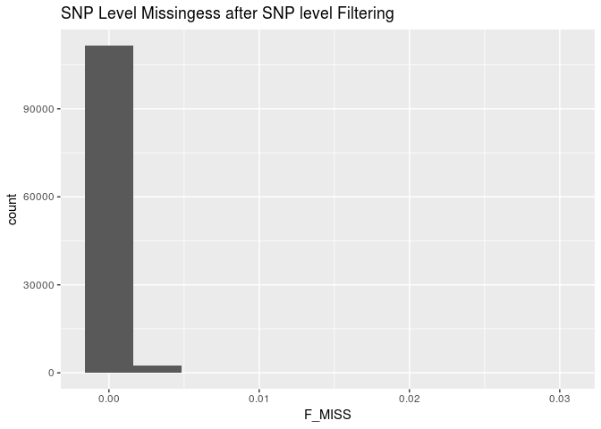

``` r
imiss <- read_table("qc_eur_cohort_split_ichip1t6.imiss")
imiss %>%
  ggplot(aes(x = F_MISS)) +
  geom_histogram(bins = 100) +
  labs(title = "Sample Level Missingess after Sample Level Filtering")
```

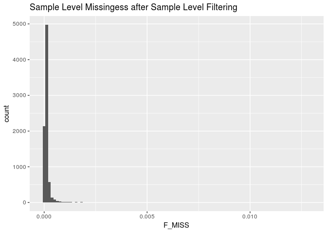 Batch effect resolved.

Re-Check Hets
-------------

``` bash
plink \
--bfile qc_eur_cohort_split_ichip1t6 \
--het \
--out qc_eur_cohort_split_ichip1t6
```

    ## PLINK v1.90b5.4 64-bit (10 Apr 2018)           www.cog-genomics.org/plink/1.9/
    ## (C) 2005-2018 Shaun Purcell, Christopher Chang   GNU General Public License v3
    ## Logging to qc_eur_cohort_split_ichip1t6.log.
    ## Options in effect:
    ##   --bfile qc_eur_cohort_split_ichip1t6
    ##   --het
    ##   --out qc_eur_cohort_split_ichip1t6
    ## 
    ## 128908 MB RAM detected; reserving 64454 MB for main workspace.
    ## 114148 variants loaded from .bim file.
    ## 8150 people (4125 males, 4025 females) loaded from .fam.
    ## Using 1 thread (no multithreaded calculations invoked).
    ## Before main variant filters, 8150 founders and 0 nonfounders present.
    ## Calculating allele frequencies... 0%1%2%3%4%5%6%7%8%9%10%11%12%13%14%15%16%17%18%19%20%21%22%23%24%25%26%27%28%29%30%31%32%33%34%35%36%37%38%39%40%41%42%43%44%45%46%47%48%49%50%51%52%53%54%55%56%57%58%59%60%61%62%63%64%65%66%67%68%69%70%71%72%73%74%75%76%77%78%79%80%81%82%83%84%85%86%87%88%89%90%91%92%93%94%95%96%97%98%99% done.
    ## Warning: 42 het. haploid genotypes present (see qc_eur_cohort_split_ichip1t6.hh
    ## ); many commands treat these as missing.
    ## Total genotyping rate is 0.999835.
    ## 114148 variants and 8150 people pass filters and QC.
    ## Note: No phenotypes present.
    ## --het: 113489 variants scanned, report written to
    ## qc_eur_cohort_split_ichip1t6.het .

``` r
imiss <- read_table("qc_eur_cohort_split_ichip1t6.imiss")
het <- read_table("qc_eur_cohort_split_ichip1t6.het") %>%
  mutate(obs_het_rate = (`N(NM)` - `O(HOM)`)/`E(HOM)`)
imiss_het <- left_join(imiss, het, by = "FID")

ggplot(imiss_het, aes(x = F_MISS, y = obs_het_rate)) +
  geom_point(color = densCols(log10(imiss_het$F_MISS), imiss_het$obs_het_rate)) +
  labs(x = "Proportion of missing genotypes", y = "Heterozygosity rate") +
  scale_x_log10(limits = c(0.001, 1), minor_breaks = c(0.01, 0.1)) +
  scale_y_continuous(limits = c(0, .5)) +
  geom_vline(xintercept = 0.03, color = "red") +
  geom_hline(yintercept = (mean(imiss_het$obs_het_rate)+(3*sd(imiss_het$obs_het_rate))), color = "red") +
  geom_hline(yintercept = (mean(imiss_het$obs_het_rate)-(3*sd(imiss_het$obs_het_rate))), color = "red")
```

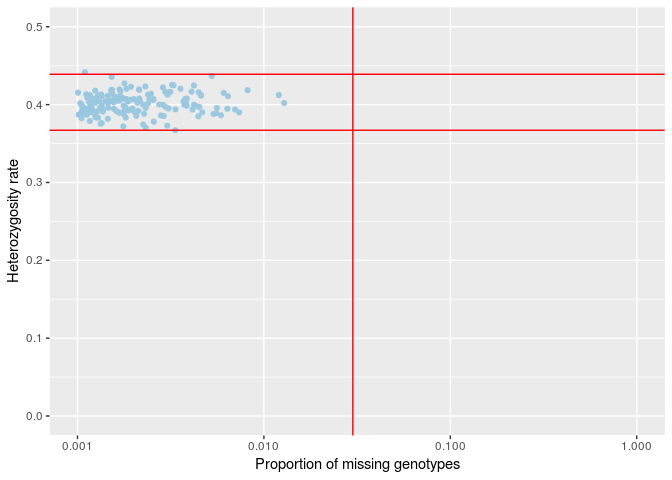 Looks great.

Calculate Overall project MAF Adter Filtering
---------------------------------------------

``` bash
plink \
--bfile qc_eur_cohort_split_ichip1t6 \
--freq \
--out qc_eur_cohort_split_ichip1t6
```

    ## PLINK v1.90b5.4 64-bit (10 Apr 2018)           www.cog-genomics.org/plink/1.9/
    ## (C) 2005-2018 Shaun Purcell, Christopher Chang   GNU General Public License v3
    ## Logging to qc_eur_cohort_split_ichip1t6.log.
    ## Options in effect:
    ##   --bfile qc_eur_cohort_split_ichip1t6
    ##   --freq
    ##   --out qc_eur_cohort_split_ichip1t6
    ## 
    ## 128908 MB RAM detected; reserving 64454 MB for main workspace.
    ## 114148 variants loaded from .bim file.
    ## 8150 people (4125 males, 4025 females) loaded from .fam.
    ## Using 1 thread (no multithreaded calculations invoked).
    ## Before main variant filters, 8150 founders and 0 nonfounders present.
    ## Calculating allele frequencies... 0%1%2%3%4%5%6%7%8%9%10%11%12%13%14%15%16%17%18%19%20%21%22%23%24%25%26%27%28%29%30%31%32%33%34%35%36%37%38%39%40%41%42%43%44%45%46%47%48%49%50%51%52%53%54%55%56%57%58%59%60%61%62%63%64%65%66%67%68%69%70%71%72%73%74%75%76%77%78%79%80%81%82%83%84%85%86%87%88%89%90%91%92%93%94%95%96%97%98%99% done.
    ## Warning: 42 het. haploid genotypes present (see qc_eur_cohort_split_ichip1t6.hh
    ## ); many commands treat these as missing.
    ## Total genotyping rate is 0.999835.
    ## --freq: Allele frequencies (founders only) written to
    ## qc_eur_cohort_split_ichip1t6.frq .

``` r
maffreq <- read_table2("qc_eur_cohort_split_ichip1t6.frq")
maffreq %>%
  ggplot(aes(x = MAF)) +
  geom_histogram(aes(y =..density..)) +
  geom_density(col=2) +
  labs(title = "Overall MAF After Filtering")
```

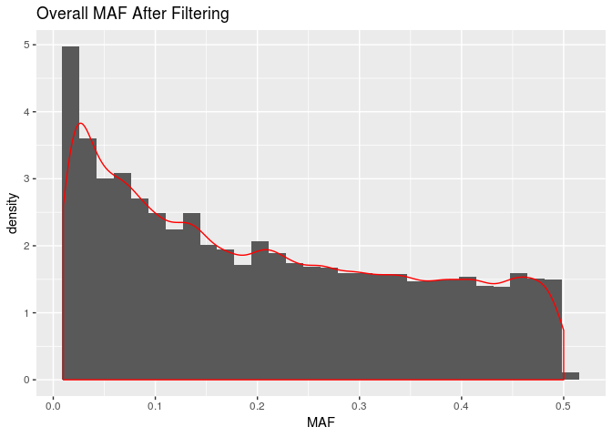

Identification of Duplicated or Related Individuals
---------------------------------------------------

-   Prune dataset for temporary use of calculating cryptic relatedness and PCA as both work best under assumption of no LD among SNPs
-   Prior to calcuating identity by state, IBS, prune SNPs to only independent SNPs and remove regions with extended linkage disequiblibirum such as HLA region. The below removes snps within a 50kb window, with an r2 &gt; .2 and variant count to shift the window at the end of each step of 5kb.

``` bash
plink \
--bfile qc_eur_cohort_split_ichip1t6 \
--exclude ../../original_data/highLDregions.txt \
--range \
--indep 50 5 1.8 \
--out qc_eur_cohort_split_ichip1t6 &>/dev/null
```

``` bash
plink \
--bfile qc_eur_cohort_split_ichip1t6 \
--extract qc_eur_cohort_split_ichip1t6.prune.in \
--genome \
--min 0.12 \
--out qc_eur_cohort_split_ichip1t6 &>/dev/null
```

``` r
genome <- read_table2("qc_eur_cohort_split_ichip1t6.genome")

genome <- genome %>%
  mutate(PI_HAT = as.double(PI_HAT)) %>%
  mutate(color = if_else(PI_HAT <.15, "~3rd degree",
                         if_else(PI_HAT >=.15 & PI_HAT <.35, "~2nd degree",
                                 if_else(PI_HAT >= .35 & PI_HAT < .65, "~1st degree",
                                         if_else(PI_HAT > .65, "~Replicates or twins", "???")))))

genome %>%
  ggplot(aes(x = as.double(Z0), y = as.double(Z1), color = color)) +
  geom_point(alpha = 1/20) +
  guides(colour = guide_legend(override.aes = list(alpha = 1)))+
  labs(x = "Z0 the proportion of loci where the pair shares zero alleles", 
       y = "Z1 the proportion of loci where the pair shares one allele") 
```

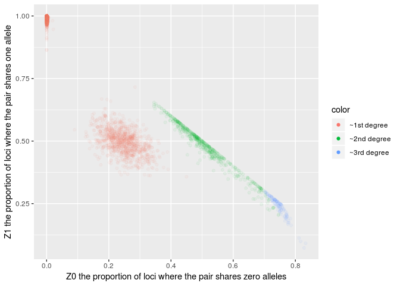

Replicates (purple) removed

``` r
genome %>%
  ggplot(aes(x = as.double(PI_HAT), fill = color)) +
  geom_histogram(bins = 100) +
  labs(title = "Distribution of PI_HAT for Related Individuals >0.12", x = "PI_HAT", y = "Count (non-unique)")
```

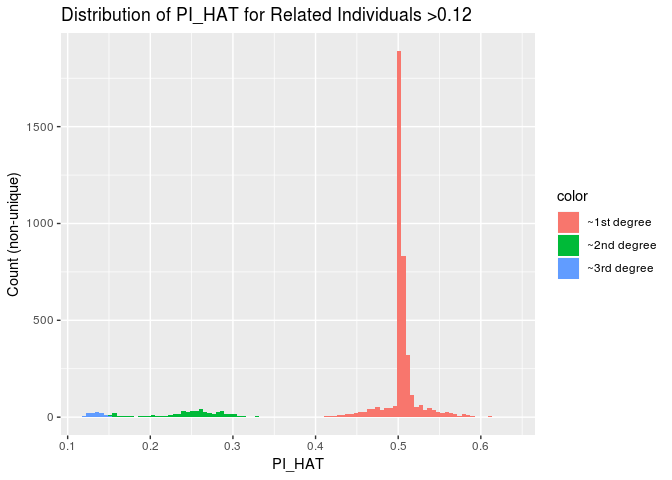

``` r
file.remove(list.files(pattern = "^temp", full.names = TRUE))
```

    ##  [1] TRUE TRUE TRUE TRUE TRUE TRUE TRUE TRUE TRUE TRUE TRUE TRUE TRUE TRUE
    ## [15] TRUE TRUE TRUE TRUE TRUE TRUE TRUE TRUE TRUE TRUE TRUE TRUE TRUE TRUE
    ## [29] TRUE TRUE TRUE TRUE
