iChip 7 All Ancestry QC
================
Translational Genomics Group
07 September, 2018

Set-up
------

This document is broken down into three parts. - Part 1 Identifies QC issues - Part 2 Fixes and applies QC parameters - Part 3 Re-Checks genotype data post QC Changes

Source Data
-----------

All Ancestry IBD IChip, Run 7, Illumina's TOP Allele Called, aligned to HG19.

Part 1 - Identify QC Issues
===========================

Identification of individuals with discordant sex information WITH --geno and --maf filters
-------------------------------------------------------------------------------------------

-   Plink uses chrX data to determine sex (based on heterozygosity rates).
-   Default PLINK thresholds of .2 for Females and .8 for Males when assessing homozygosity rates, but use .4 and .8.
-   When the homozygosity rate is more than 0.4 but less than 0.8, the genotype data are inconclusive regarding the sex of an individual and these are marked in column 4 with a 0.
-   maf and geno filter added with check-sex run
-   PEDSEX=sex as recorded in pedfile (1=male, 2=female)
-   SNPSEX=sex as predicted based on genetic data (1=male, 2=female, 0=unknown)
-   If needed, compare with GenomeStudio gender estimates to ID true problems
-   We suggest running --check-sex once without parameters, eyeballing the distribution of F estimates (there should be a clear gap between a very tight male clump at the right side of the distribution and the females everywhere else), and then rerunning with parameters corresponding to the empirical gap.

``` bash
plink \
--bfile ../1.split_cohorts/cohort_split_ichip7 \
--geno 0.03 \
--maf 0.05 \
--check-sex .4 .8 \
--out temp_cohort_split_ichip7
```

    ## PLINK v1.90b5.4 64-bit (10 Apr 2018)           www.cog-genomics.org/plink/1.9/
    ## (C) 2005-2018 Shaun Purcell, Christopher Chang   GNU General Public License v3
    ## Logging to temp_cohort_split_ichip7.log.
    ## Options in effect:
    ##   --bfile ../1.split_cohorts/cohort_split_ichip7
    ##   --check-sex .4 .8
    ##   --geno 0.03
    ##   --maf 0.05
    ##   --out temp_cohort_split_ichip7
    ## 
    ## 128908 MB RAM detected; reserving 64454 MB for main workspace.
    ## 247903 variants loaded from .bim file.
    ## 661 people (313 males, 314 females, 34 ambiguous) loaded from .fam.
    ## Ambiguous sex IDs written to temp_cohort_split_ichip7.nosex .
    ## Using 1 thread (no multithreaded calculations invoked).
    ## Before main variant filters, 661 founders and 0 nonfounders present.
    ## Calculating allele frequencies... 0%1%2%3%4%5%6%7%8%9%10%11%12%13%14%15%16%17%18%19%20%21%22%23%24%25%26%27%28%29%30%31%32%33%34%35%36%37%38%39%40%41%42%43%44%45%46%47%48%49%50%51%52%53%54%55%56%57%58%59%60%61%62%63%64%65%66%67%68%69%70%71%72%73%74%75%76%77%78%79%80%81%82%83%84%85%86%87%88%89%90%91%92%93%94%95%96%97%98%99% done.
    ## Warning: 10 het. haploid genotypes present (see temp_cohort_split_ichip7.hh );
    ## many commands treat these as missing.
    ## Warning: Nonmissing nonmale Y chromosome genotype(s) present; many commands
    ## treat these as missing.
    ## Total genotyping rate is 0.999632.
    ## 17 variants removed due to missing genotype data (--geno).
    ## 65379 variants removed due to minor allele threshold(s)
    ## (--maf/--max-maf/--mac/--max-mac).
    ## 182507 variants and 661 people pass filters and QC.
    ## Note: No phenotypes present.
    ## --check-sex: 792 Xchr and 0 Ychr variant(s) scanned, 41 problems detected.
    ## Report written to temp_cohort_split_ichip7.sexcheck .

Using 792 Xchr variants to check sex; 41 problems detected

``` r
sexcheck <- read_table2(file = "temp_cohort_split_ichip7.sexcheck")
sexcheck %>%
  filter(STATUS == "PROBLEM") %>%
  kable(caption = "List of Individuals with Sex Check Problems")
```

| FID        |  IID|  PEDSEX|  SNPSEX| STATUS  |        F|
|:-----------|----:|-------:|-------:|:--------|--------:|
| 0500928    |    1|       2|       0| PROBLEM |  0.42910|
| 1201279    |    1|       2|       0| PROBLEM |  0.41480|
| 1400212    |    1|       2|       0| PROBLEM |  0.43980|
| 1500017    |    1|       2|       0| PROBLEM |  0.40770|
| 1500049    |    1|       2|       0| PROBLEM |  0.40060|
| 1500141    |    1|       2|       0| PROBLEM |  0.42200|
| 1500353    |    1|       2|       0| PROBLEM |  0.40410|
| Control1   |    1|       0|       2| PROBLEM |  0.02591|
| Control2   |    1|       0|       2| PROBLEM |  0.02591|
| Control3   |    1|       0|       2| PROBLEM |  0.02591|
| Control4   |    1|       0|       2| PROBLEM |  0.02591|
| Control5   |    1|       0|       2| PROBLEM |  0.02591|
| Control6   |    1|       0|       2| PROBLEM |  0.02591|
| Control7   |    1|       0|       2| PROBLEM |  0.02496|
| Control8   |    1|       0|       2| PROBLEM |  0.02812|
| Control9   |    1|       0|       2| PROBLEM |  0.02591|
| Control10  |    1|       0|       2| PROBLEM |  0.02775|
| Control11  |    1|       0|       2| PROBLEM |  0.02591|
| Control12  |    1|       0|       2| PROBLEM |  0.02591|
| Control13  |    1|       0|       2| PROBLEM |  0.02591|
| Control14  |    1|       0|       2| PROBLEM |  0.02591|
| Control15  |    1|       0|       2| PROBLEM |  0.02591|
| Control16  |    1|       0|       2| PROBLEM |  0.02591|
| Control17  |    1|       0|       2| PROBLEM |  0.02591|
| Control18  |    1|       0|       2| PROBLEM |  0.02591|
| Control19  |    1|       0|       2| PROBLEM |  0.02591|
| Control20  |    1|       0|       2| PROBLEM |  0.02591|
| Control21  |    1|       0|       2| PROBLEM |  0.02591|
| Control22  |    1|       0|       2| PROBLEM |  0.02591|
| Control23  |    1|       0|       2| PROBLEM |  0.02591|
| Control24  |    1|       0|       2| PROBLEM |  0.02591|
| Control25  |    1|       0|       2| PROBLEM |  0.02591|
| Control26  |    1|       0|       2| PROBLEM |  0.02591|
| Control27  |    1|       0|       2| PROBLEM |  0.02591|
| Control29  |    1|       0|       2| PROBLEM |  0.02591|
| Control29R |    1|       0|       2| PROBLEM |  0.02496|
| Control30  |    1|       0|       2| PROBLEM |  0.02591|
| Control30R |    1|       0|       2| PROBLEM |  0.02591|
| Control31  |    1|       0|       2| PROBLEM |  0.02591|
| Control32  |    1|       0|       2| PROBLEM |  0.02591|
| Control33  |    1|       0|       2| PROBLEM |  0.02591|

41 problems detected, but this is beause many control samples are blank for Sex. Not real problems. 7 actual sex problems.

``` r
sexcheck %>%
  filter(STATUS == "PROBLEM") %>%
  filter(PEDSEX != 0) %>%
  kable(caption = "Sex Problems with a Reported Sex in Ped")
```

| FID     |  IID|  PEDSEX|  SNPSEX| STATUS  |       F|
|:--------|----:|-------:|-------:|:--------|-------:|
| 0500928 |    1|       2|       0| PROBLEM |  0.4291|
| 1201279 |    1|       2|       0| PROBLEM |  0.4148|
| 1400212 |    1|       2|       0| PROBLEM |  0.4398|
| 1500017 |    1|       2|       0| PROBLEM |  0.4077|
| 1500049 |    1|       2|       0| PROBLEM |  0.4006|
| 1500141 |    1|       2|       0| PROBLEM |  0.4220|
| 1500353 |    1|       2|       0| PROBLEM |  0.4041|

7 of 7 sex problems come from a reported PEDSEX of Female but an F &gt; 0.4.

``` r
sexcheck %>%
  ggplot(aes(x = F)) +
  geom_density() +
  labs(title = "Heterozygoisty Rates for Samples Filtered with geno/maf included") 
```

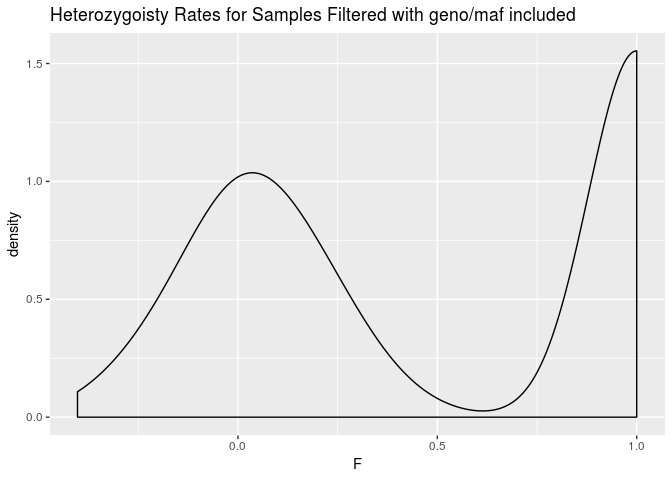

Plotting F from check-sex based on chrX heterozygosity rates (F&lt;0.4, M&gt;0.8 expected). We can see that they nicely seperate as expected.

Identification of individuals with elevated missing data rates or outlying heterozygosity rate
----------------------------------------------------------------------------------------------

### Number of missing SNPS and Proportion of Missings SNPs per Individual

-   no filters included here
-   {output.imiss} for individuals (F\_MISS will give proportion of missing SNPs per individual)
-   {output.lmiss} for snps (F\_MISS will give proportion of samples missing per SNP)
-   stricter missingness should apply for low MAF snps
-   evaluate SNP missingness rates per cohort, genotyping batch, case-control status

``` bash
plink \
--bfile ../1.split_cohorts/cohort_split_ichip7 \
--missing \
--out temp_cohort_split_ichip7 
```

    ## PLINK v1.90b5.4 64-bit (10 Apr 2018)           www.cog-genomics.org/plink/1.9/
    ## (C) 2005-2018 Shaun Purcell, Christopher Chang   GNU General Public License v3
    ## Logging to temp_cohort_split_ichip7.log.
    ## Options in effect:
    ##   --bfile ../1.split_cohorts/cohort_split_ichip7
    ##   --missing
    ##   --out temp_cohort_split_ichip7
    ## 
    ## 128908 MB RAM detected; reserving 64454 MB for main workspace.
    ## 247903 variants loaded from .bim file.
    ## 661 people (313 males, 314 females, 34 ambiguous) loaded from .fam.
    ## Ambiguous sex IDs written to temp_cohort_split_ichip7.nosex .
    ## Using 1 thread (no multithreaded calculations invoked).
    ## Before main variant filters, 661 founders and 0 nonfounders present.
    ## Calculating allele frequencies... 0%1%2%3%4%5%6%7%8%9%10%11%12%13%14%15%16%17%18%19%20%21%22%23%24%25%26%27%28%29%30%31%32%33%34%35%36%37%38%39%40%41%42%43%44%45%46%47%48%49%50%51%52%53%54%55%56%57%58%59%60%61%62%63%64%65%66%67%68%69%70%71%72%73%74%75%76%77%78%79%80%81%82%83%84%85%86%87%88%89%90%91%92%93%94%95%96%97%98%99% done.
    ## Warning: 10 het. haploid genotypes present (see temp_cohort_split_ichip7.hh );
    ## many commands treat these as missing.
    ## Warning: Nonmissing nonmale Y chromosome genotype(s) present; many commands
    ## treat these as missing.
    ## Total genotyping rate is 0.999632.
    ## --missing: Sample missing data report written to
    ## temp_cohort_split_ichip7.imiss, and variant-based missing data report written
    ## to temp_cohort_split_ichip7.lmiss.

Total genotyping rate is 0.999632.

``` r
lmiss <- read_table("temp_cohort_split_ichip7.lmiss")
lmiss %>%
  ggplot(aes(x = F_MISS)) +
  geom_density() +
  labs(title = "SNP Level Missingess")
```

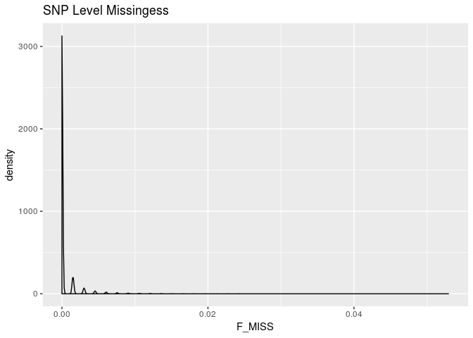

Low missingness across iChip7

``` r
imiss <- read_table("temp_cohort_split_ichip7.imiss")
imiss %>%
  ggplot(aes(x = F_MISS)) +
  geom_histogram(bins = 100) +
  labs(title = "Sample Level Missingess")
```

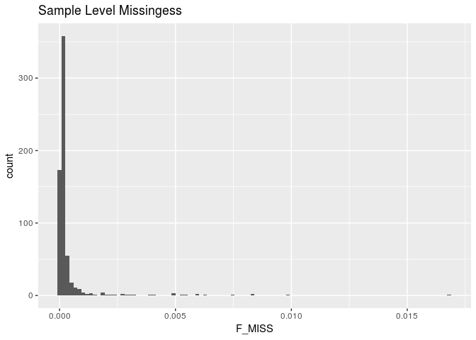

Small amount of missingness

``` r
imiss %>%
  filter(F_MISS >= 0.03) 
```

    ## # A tibble: 0 x 6
    ## # ... with 6 variables: FID <chr>, IID <int>, MISS_PHENO <chr>,
    ## #   N_MISS <int>, N_GENO <int>, F_MISS <dbl>

No samples with &gt; 3% missingness.

### Samples with outlying heterozygosity rates

-   To calculate individual inbreeding F / heterozygosity With whole genome data, can be applied to pruned subset plink output includes:
-   O(HOM) Observed number of homozygotes
-   E(HOM) Expected number of homozygotes
-   N(NM) Number of non-missing genotypes
-   F F inbreeding coefficient estimate
-   approx norm range: -0.2 to 0.2, mode around zero
-   Low heterozygosity (high F; positive value) may indicate inbreeding;
-   high heterozygosity (low F; negative value) may indicate contamination.

``` bash
plink \
--bfile ../1.split_cohorts/cohort_split_ichip7 \
--het \
--out temp_cohort_split_ichip7
```

    ## PLINK v1.90b5.4 64-bit (10 Apr 2018)           www.cog-genomics.org/plink/1.9/
    ## (C) 2005-2018 Shaun Purcell, Christopher Chang   GNU General Public License v3
    ## Logging to temp_cohort_split_ichip7.log.
    ## Options in effect:
    ##   --bfile ../1.split_cohorts/cohort_split_ichip7
    ##   --het
    ##   --out temp_cohort_split_ichip7
    ## 
    ## 128908 MB RAM detected; reserving 64454 MB for main workspace.
    ## 247903 variants loaded from .bim file.
    ## 661 people (313 males, 314 females, 34 ambiguous) loaded from .fam.
    ## Ambiguous sex IDs written to temp_cohort_split_ichip7.nosex .
    ## Using 1 thread (no multithreaded calculations invoked).
    ## Before main variant filters, 661 founders and 0 nonfounders present.
    ## Calculating allele frequencies... 0%1%2%3%4%5%6%7%8%9%10%11%12%13%14%15%16%17%18%19%20%21%22%23%24%25%26%27%28%29%30%31%32%33%34%35%36%37%38%39%40%41%42%43%44%45%46%47%48%49%50%51%52%53%54%55%56%57%58%59%60%61%62%63%64%65%66%67%68%69%70%71%72%73%74%75%76%77%78%79%80%81%82%83%84%85%86%87%88%89%90%91%92%93%94%95%96%97%98%99% done.
    ## Warning: 10 het. haploid genotypes present (see temp_cohort_split_ichip7.hh );
    ## many commands treat these as missing.
    ## Warning: Nonmissing nonmale Y chromosome genotype(s) present; many commands
    ## treat these as missing.
    ## Total genotyping rate is 0.999632.
    ## 247903 variants and 661 people pass filters and QC.
    ## Note: No phenotypes present.
    ## --het: 234259 variants scanned, report written to temp_cohort_split_ichip7.het
    ## .

``` r
het <- read_table("temp_cohort_split_ichip7.het") 
het <- het %>%
  mutate(obs_het_rate = (`N(NM)` - `O(HOM)`)/`E(HOM)`)
imiss_het <- left_join(imiss, het, by = "FID")

ggplot(imiss_het, aes(x = F_MISS, y = obs_het_rate)) +
  geom_point(color = densCols(log10(imiss_het$F_MISS), imiss_het$obs_het_rate)) +
  labs(x = "Proportion of missing genotypes", y = "Heterozygosity rate") +
  scale_x_log10(limits = c(0.001, 1), minor_breaks = c(0.01, 0.1)) +
  scale_y_continuous(limits = c(0, .5)) +
  geom_vline(xintercept = 0.03, color = "red") +
  geom_hline(yintercept = (mean(imiss_het$obs_het_rate)+(3*sd(imiss_het$obs_het_rate))), color = "red") +
  geom_hline(yintercept = (mean(imiss_het$obs_het_rate)-(3*sd(imiss_het$obs_het_rate))), color = "red")
```

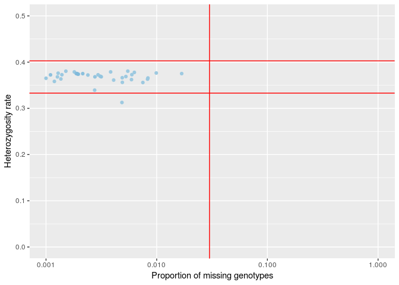

### Identify het outliers

``` r
imiss_het %>%
  filter(obs_het_rate >= (mean(imiss_het$obs_het_rate)+(3*sd(imiss_het$obs_het_rate))) |
           obs_het_rate <= (mean(imiss_het$obs_het_rate)-(3*sd(imiss_het$obs_het_rate)))) %>%
  kable(caption = "Samples That Fail Het Check")
```

| FID      |  IID.x| MISS\_PHENO |  N\_MISS|  N\_GENO|    F\_MISS|  IID.y|  O(HOM)|  E(HOM)|   N(NM)|        F|  obs\_het\_rate|
|:---------|------:|:------------|--------:|--------:|----------:|------:|-------:|-------:|-------:|--------:|---------------:|
| 0801110  |      1| Y           |       31|   247903|  0.0001250|      1|  180938|  170600|  234230|   0.1625|       0.3123798|
| 1300052  |      1| Y           |       19|   247903|  0.0000766|      1|  179719|  170600|  234245|   0.1432|       0.3196131|
| 1400019S |      1| Y           |      236|   246816|  0.0009562|      1|  178955|  170500|  234041|   0.1336|       0.3230850|
| 1400143  |      1| Y           |       87|   246816|  0.0003525|      1|  163671|  170600|  234180|  -0.1083|       0.4133001|
| 1400202  |      1| Y           |     1203|   247903|  0.0048530|      1|  180089|  169800|  233177|   0.1618|       0.3126502|
| 1400247  |      1| Y           |       24|   247903|  0.0000968|      1|  179602|  170600|  234236|   0.1415|       0.3202462|
| 1400249  |      1| Y           |       20|   247903|  0.0000807|      1|  179414|  170600|  234241|   0.1385|       0.3213775|
| 1500037  |      1| Y           |       39|   246816|  0.0001580|      1|  164987|  170600|  234225|  -0.0881|       0.4058499|
| 1500076  |      1| Y           |       45|   246816|  0.0001823|      1|  177422|  170600|  234215|   0.1075|       0.3329015|
| 1500090  |      1| Y           |       13|   246816|  0.0000527|      1|  180206|  170600|  234247|   0.1508|       0.3167702|
| 1500100  |      1| Y           |       27|   246816|  0.0001094|      1|  179545|  170600|  234235|   0.1406|       0.3205744|
| 1500190  |      1| Y           |       19|   247903|  0.0000766|      1|  180990|  170600|  234243|   0.1632|       0.3121512|
| 1500197  |      1| Y           |       11|   246816|  0.0000446|      1|  180201|  170600|  234248|   0.1507|       0.3168054|
| 1500198  |      1| Y           |       14|   246816|  0.0000567|      1|  180523|  170600|  234246|   0.1558|       0.3149062|
| 1500210  |      1| Y           |        9|   246816|  0.0000365|      1|  179554|  170600|  234251|   0.1406|       0.3206155|
| 1500213  |      1| Y           |       57|   247903|  0.0002299|      1|  164087|  170600|  234206|  -0.1020|       0.4110141|
| 1500343  |      1| Y           |       44|   246816|  0.0001783|      1|  179696|  170600|  234231|   0.1430|       0.3196659|
| 1500353  |      1| Y           |       47|   246816|  0.0001904|      1|  179958|  170600|  234218|   0.1472|       0.3180539|
| 1600092S |      1| Y           |       57|   246816|  0.0002309|      1|  177625|  170600|  234209|   0.1108|       0.3316764|

``` r
imiss_het %>%
  filter(obs_het_rate >= (mean(imiss_het$obs_het_rate)+(3*sd(imiss_het$obs_het_rate))) |
           obs_het_rate <= (mean(imiss_het$obs_het_rate)-(3*sd(imiss_het$obs_het_rate)))) %>%
  dplyr::select(FID, IID.x) %>%
  write_tsv("fail-het-outlier.txt", col_names = FALSE)
```

1 samples failed het check at +/- 4SD, 19 +/1 3SD. Only use 4SD with &gt; 1000 Samples.

Calculate Overall project MAF before Filtering
----------------------------------------------

``` bash
plink \
--bfile ../1.split_cohorts/cohort_split_ichip7 \
--freq \
--out temp_cohort_split_ichip7
```

    ## PLINK v1.90b5.4 64-bit (10 Apr 2018)           www.cog-genomics.org/plink/1.9/
    ## (C) 2005-2018 Shaun Purcell, Christopher Chang   GNU General Public License v3
    ## Logging to temp_cohort_split_ichip7.log.
    ## Options in effect:
    ##   --bfile ../1.split_cohorts/cohort_split_ichip7
    ##   --freq
    ##   --out temp_cohort_split_ichip7
    ## 
    ## 128908 MB RAM detected; reserving 64454 MB for main workspace.
    ## 247903 variants loaded from .bim file.
    ## 661 people (313 males, 314 females, 34 ambiguous) loaded from .fam.
    ## Ambiguous sex IDs written to temp_cohort_split_ichip7.nosex .
    ## Using 1 thread (no multithreaded calculations invoked).
    ## Before main variant filters, 661 founders and 0 nonfounders present.
    ## Calculating allele frequencies... 0%1%2%3%4%5%6%7%8%9%10%11%12%13%14%15%16%17%18%19%20%21%22%23%24%25%26%27%28%29%30%31%32%33%34%35%36%37%38%39%40%41%42%43%44%45%46%47%48%49%50%51%52%53%54%55%56%57%58%59%60%61%62%63%64%65%66%67%68%69%70%71%72%73%74%75%76%77%78%79%80%81%82%83%84%85%86%87%88%89%90%91%92%93%94%95%96%97%98%99% done.
    ## Warning: 10 het. haploid genotypes present (see temp_cohort_split_ichip7.hh );
    ## many commands treat these as missing.
    ## Warning: Nonmissing nonmale Y chromosome genotype(s) present; many commands
    ## treat these as missing.
    ## Total genotyping rate is 0.999632.
    ## --freq: Allele frequencies (founders only) written to
    ## temp_cohort_split_ichip7.frq .

``` r
maffreq <- read_table2("temp_cohort_split_ichip7.frq")
maffreq %>%
  ggplot(aes(x = MAF)) +
  geom_histogram(aes(y =..density..)) +
  geom_density(col=2) +
  labs(title = "Overall MAF Prior to Filtering")
```

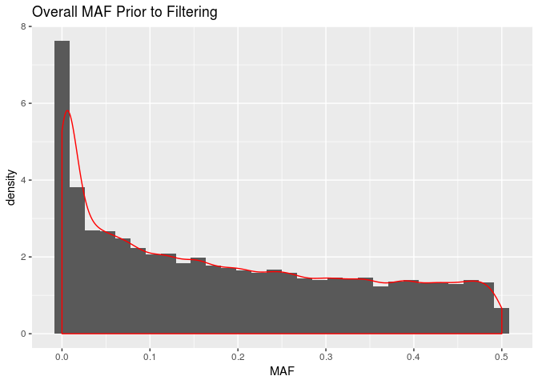

Identification of Duplicated or Related Individuals
---------------------------------------------------

-   Prune dataset for temporary use of calculating cryptic relatedness and PCA as both work best under assumption of no LD among SNPs
-   Prior to calcuating identity by state, IBS, prune SNPs to only independent SNPs and remove regions with extended linkage disequiblibirum such as HLA region. The below removes snps within a 50kb window, with an r2 &gt; .2 and variant count to shift the window at the end of each step of 5kb.

``` bash
plink \
--bfile ../1.split_cohorts/cohort_split_ichip7 \
--exclude range ../../original_data/highLDregions.txt \
--indep 50 5 1.8 \
--out temp_cohort_split_ichip7 &>/dev/null
```

Pruning complete. 12368 variants excluded removed in high ld. 77285 of 121314 variants removed. I will keep only the prune.in snps for the subsequent analysis.

-   Can add --min 0.12 to identify minimum pihat for genome output to manage size of output dataset (will only output pihat &gt;0.12)
-   PIHAT 1.0 = monozygotic twins or known replicates
-   PIHAT 0.5 = 1st degree relatives: P-C, sibs
-   PIHAT 0.25= 2nd degree relatives: half-sib, grandparents
-   PIHAT 0.125= 3rd degree relatives: full cousins

``` bash
plink \
--bfile ../1.split_cohorts/cohort_split_ichip7 \
--extract temp_cohort_split_ichip7.prune.in \
--genome \
--min 0.12 \
--out temp_cohort_split_ichip7 &>/dev/null
```

``` r
genome <- read_table2("temp_cohort_split_ichip7.genome")

genome <- genome %>%
  mutate(PI_HAT = as.double(PI_HAT)) %>%
  mutate(color = if_else(PI_HAT <.15, "~3rd degree",
                         if_else(PI_HAT >=.15 & PI_HAT <.35, "~2nd degree",
                                 if_else(PI_HAT >= .35 & PI_HAT < .65, "~1st degree",
                                         if_else(PI_HAT > .65, "~Replicates or twins", "???")))))

genome %>%
  ggplot(aes(x = as.double(Z0), y = as.double(Z1), color = color)) +
  geom_point(alpha = 1) +
  guides(colour = guide_legend(override.aes = list(alpha = 1)))+
  labs(x = "Z0 the proportion of loci where the pair shares zero alleles", 
       y = "Z1 the proportion of loci where the pair shares one allele") 
```

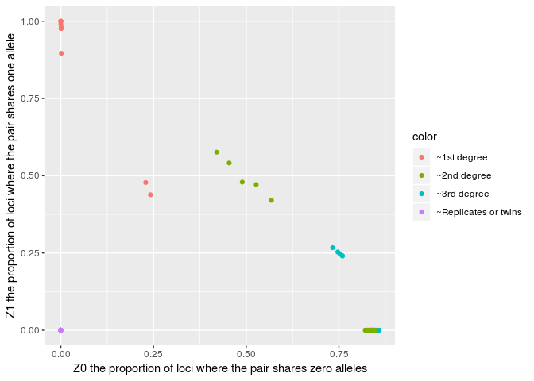

The above plot is restricted to samples with a PI\_HAT atleast 0.12. Samples can be represented more than once if multiple relations are found.

``` r
genome %>%
  ggplot(aes(x = as.double(PI_HAT), fill = color)) +
  geom_histogram(bins = 100) +
  labs(title = "Distribution of PI_HAT for Related Individuals >0.12", x = "PI_HAT", y = "Count (non-unique)")
```

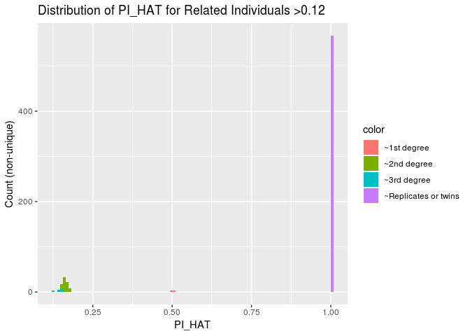

``` r
genome %>%
  filter(PI_HAT > 0.8)
```

    ## # A tibble: 567 x 15
    ##    FID1   IID1 FID2  IID2 RT    EZ       Z0    Z1    Z2 PI_HAT   PHE   DST
    ##    <chr> <int> <ch> <int> <chr> <chr> <dbl> <dbl> <dbl>  <dbl> <int> <dbl>
    ##  1 1400…     1 140…     1 UN    <NA>      0     0     1      1    -1     1
    ##  2 1400…     1 140…     1 UN    <NA>      0     0     1      1    -1     1
    ##  3 1500…     1 150…     1 UN    <NA>      0     0     1      1    -1     1
    ##  4 1500…     1 150…     1 UN    <NA>      0     0     1      1    -1     1
    ##  5 1500…     1 150…     1 UN    <NA>      0     0     1      1    -1     1
    ##  6 1500…     1 150…     1 UN    <NA>      0     0     1      1    -1     1
    ##  7 Cont…     1 Con…     1 UN    <NA>      0     0     1      1    -1     1
    ##  8 Cont…     1 Con…     1 UN    <NA>      0     0     1      1    -1     1
    ##  9 Cont…     1 Con…     1 UN    <NA>      0     0     1      1    -1     1
    ## 10 Cont…     1 Con…     1 UN    <NA>      0     0     1      1    -1     1
    ## # ... with 557 more rows, and 3 more variables: PPC <dbl>, RATIO <dbl>,
    ## #   color <chr>

``` r
genome %>%
  filter(PI_HAT > 0.8) %>%
  write_tsv("possible_duplicates.tsv")
```

Since I am only interested in removing duplicates, will set a PI-HAT threshold of 0.8. IN other analysis, we might want to restrict to non-relateds.

Part 2 Apply QC Filters and Fix Errors
======================================

Clean Sexes and remove samples and SNPs that fail heterozygoisty, genotyping, sex-checks and IBD &gt;= 0.8/
-----------------------------------------------------------------------------------------------------------

### Clean Sexs

#### First update sex for subjects with PEDSEX == 0 and approriate F stat

If PED sex 0 and F &lt; 0.4 updated PED to Female 2 (not needed in this set) If PED sex 0 and F &gt; 0.8 update PED to male 1 All samples with previously un-assigned PED SEX assigned

``` r
sexcheck %>%
  filter(PEDSEX == 0) %>%
  mutate(PEDSEX = ifelse(F < 0.4, 2,
                          ifelse(F > 0.8, 1, PEDSEX))) %>% 
  filter(PEDSEX != 0) %>%
  dplyr::select(FID, IID, PEDSEX)  %>%
  write_tsv("update-missing-sex.txt", col_names = FALSE)
  
sexcheck %>%
  filter(PEDSEX == 0) %>%
  mutate(PEDSEX = ifelse(F < 0.4, 2,
                          ifelse(F > 0.8, 1, PEDSEX))) %>% 
  filter(PEDSEX != 0) %>%
  dplyr::select(FID, IID, PEDSEX) %>%
  kable(caption = "Subjects to Update Sex")
```

| FID        |  IID|  PEDSEX|
|:-----------|----:|-------:|
| Control1   |    1|       2|
| Control2   |    1|       2|
| Control3   |    1|       2|
| Control4   |    1|       2|
| Control5   |    1|       2|
| Control6   |    1|       2|
| Control7   |    1|       2|
| Control8   |    1|       2|
| Control9   |    1|       2|
| Control10  |    1|       2|
| Control11  |    1|       2|
| Control12  |    1|       2|
| Control13  |    1|       2|
| Control14  |    1|       2|
| Control15  |    1|       2|
| Control16  |    1|       2|
| Control17  |    1|       2|
| Control18  |    1|       2|
| Control19  |    1|       2|
| Control20  |    1|       2|
| Control21  |    1|       2|
| Control22  |    1|       2|
| Control23  |    1|       2|
| Control24  |    1|       2|
| Control25  |    1|       2|
| Control26  |    1|       2|
| Control27  |    1|       2|
| Control29  |    1|       2|
| Control29R |    1|       2|
| Control30  |    1|       2|
| Control30R |    1|       2|
| Control31  |    1|       2|
| Control32  |    1|       2|
| Control33  |    1|       2|

#### Create List of Subjects that Fail Sex Check After Update

``` r
sexcheck %>%
  filter(PEDSEX == 1 & SNPSEX == 2 |
           PEDSEX == 2 & SNPSEX == 1 |
           PEDSEX == 2 & SNPSEX == 0 & F > 0.4 |
           PEDSEX == 1 & SNPSEX == 0 & F < 0.8) %>%
  kable(caption = "Subjects that Fail Sex Check")
```

| FID     |  IID|  PEDSEX|  SNPSEX| STATUS  |       F|
|:--------|----:|-------:|-------:|:--------|-------:|
| 0500928 |    1|       2|       0| PROBLEM |  0.4291|
| 1201279 |    1|       2|       0| PROBLEM |  0.4148|
| 1400212 |    1|       2|       0| PROBLEM |  0.4398|
| 1500017 |    1|       2|       0| PROBLEM |  0.4077|
| 1500049 |    1|       2|       0| PROBLEM |  0.4006|
| 1500141 |    1|       2|       0| PROBLEM |  0.4220|
| 1500353 |    1|       2|       0| PROBLEM |  0.4041|

``` r
sexcheck %>%
  filter(PEDSEX == 1 & SNPSEX == 2 |
           PEDSEX == 2 & SNPSEX == 1 |
           PEDSEX == 2 & SNPSEX == 0 & F > 0.4 |
           PEDSEX == 1 & SNPSEX == 0 & F < 0.8) %>%
  dplyr::select(FID, IID) %>%
  write_tsv(path = "fail-updated-sex-check.txt", col_names = FALSE)
```

These are 7 female samples, that have out of range but quasi-reasonable F. I will remove. Disucssed with Talin.

#### Update Sex in PLINK

``` bash
plink \
--bfile ../1.split_cohorts/cohort_split_ichip7 \
--update-sex update-missing-sex.txt \
--remove fail-updated-sex-check.txt \
--make-bed \
--out temp1_cohort_split_ichip7
```

    ## PLINK v1.90b5.4 64-bit (10 Apr 2018)           www.cog-genomics.org/plink/1.9/
    ## (C) 2005-2018 Shaun Purcell, Christopher Chang   GNU General Public License v3
    ## Logging to temp1_cohort_split_ichip7.log.
    ## Options in effect:
    ##   --bfile ../1.split_cohorts/cohort_split_ichip7
    ##   --make-bed
    ##   --out temp1_cohort_split_ichip7
    ##   --remove fail-updated-sex-check.txt
    ##   --update-sex update-missing-sex.txt
    ## 
    ## 128908 MB RAM detected; reserving 64454 MB for main workspace.
    ## 247903 variants loaded from .bim file.
    ## 661 people (313 males, 314 females, 34 ambiguous) loaded from .fam.
    ## Ambiguous sex IDs written to temp1_cohort_split_ichip7.nosex .
    ## --update-sex: 34 people updated.
    ## --remove: 654 people remaining.
    ## Using 1 thread (no multithreaded calculations invoked).
    ## Before main variant filters, 654 founders and 0 nonfounders present.
    ## Calculating allele frequencies... 0%1%2%3%4%5%6%7%8%9%10%11%12%13%14%15%16%17%18%19%20%21%22%23%24%25%26%27%28%29%30%31%32%33%34%35%36%37%38%39%40%41%42%43%44%45%46%47%48%49%50%51%52%53%54%55%56%57%58%59%60%61%62%63%64%65%66%67%68%69%70%71%72%73%74%75%76%77%78%79%80%81%82%83%84%85%86%87%88%89%90%91%92%93%94%95%96%97%98%99% done.
    ## Warning: 10 het. haploid genotypes present (see temp1_cohort_split_ichip7.hh );
    ## many commands treat these as missing.
    ## Warning: Nonmissing nonmale Y chromosome genotype(s) present; many commands
    ## treat these as missing.
    ## Total genotyping rate in remaining samples is 0.999629.
    ## 247903 variants and 654 people pass filters and QC.
    ## Note: No phenotypes present.
    ## --make-bed to temp1_cohort_split_ichip7.bed + temp1_cohort_split_ichip7.bim +
    ## temp1_cohort_split_ichip7.fam ... 0%1%2%3%4%5%6%7%8%9%10%11%12%13%14%15%16%17%18%19%20%21%22%23%24%25%26%27%28%29%30%31%32%33%34%35%36%37%38%39%40%41%42%43%44%45%46%47%48%49%50%51%52%53%54%55%56%57%58%59%60%61%62%63%64%65%66%67%68%69%70%71%72%73%74%75%76%77%78%79%80%81%82%83%84%85%86%87%88%89%90%91%92%93%94%95%96%97%98%99%done.

--update-sex: 34 people updated. --Removed 7 samples. Went from 661 to 654 subjects. All F

### Exclude Samples with IBD &gt; 0.8

For the purposes of this QC, I want to identify all pairs of individuals with an IBD &gt;=0.8 and then remove the individual in the pair with the lower genotyping rate. IN some cases, you will want to remove the individual with the lower genotyping rate dependent on the phenotype. The ID of the individuals with the lower genotype rate will be stored in ‘fail-IBD-QC.txt’ for subsequent removal.

``` r
relateds <- genome %>%
  filter(PI_HAT > 0.8)

compare_missingness <- function(FID1, IID1, FID2, IID2, imiss){
  output <- data.frame(fid1_miss = numeric(length(FID1)),
                       fid2_miss = numeric(length(FID1)))
  for(i in seq_along(FID1)) {
    fid1_miss <- imiss %>%
      filter(FID == FID1[[i]] & IID == IID1[[i]]) %>%
      select(F_MISS) %>%
      unlist() 
    
    fid2_miss <- imiss %>%
      filter(FID == FID2[[i]] & IID == IID2[[i]]) %>%
      select(F_MISS) %>%
      unlist()
    
    output[i,] <- c(fid1_miss, fid2_miss)
  }
  return(output)
}

output <- compare_missingness(relateds$FID1, relateds$IID1, relateds$FID2, relateds$IID2, imiss)

relateds <- relateds %>%
  bind_cols(., output) %>%
  mutate(better_sample = if_else(fid1_miss <= fid2_miss, paste("FID1"), paste("FID2")))

duplicates_to_remove <- relateds %>%
  mutate(remove_fid = if_else(better_sample == "FID1", FID2,
                              if_else(better_sample == "FID2", FID1, "Wilson"))) %>%
  mutate(remove_iid = ifelse(better_sample == "FID1", IID2,
                              ifelse(better_sample == "FID2", IID1, "Wilson"))) %>%
  select(remove_fid, remove_iid) %>%
  distinct() %>%
  write_tsv("fail-IBD-QC.tsv", col_names = FALSE)
```

``` bash
plink \
--bfile temp1_cohort_split_ichip7 \
--remove fail-IBD-QC.tsv \
--make-bed \
--out temp2_cohort_split_ichip7
```

    ## PLINK v1.90b5.4 64-bit (10 Apr 2018)           www.cog-genomics.org/plink/1.9/
    ## (C) 2005-2018 Shaun Purcell, Christopher Chang   GNU General Public License v3
    ## Logging to temp2_cohort_split_ichip7.log.
    ## Options in effect:
    ##   --bfile temp1_cohort_split_ichip7
    ##   --make-bed
    ##   --out temp2_cohort_split_ichip7
    ##   --remove fail-IBD-QC.tsv
    ## 
    ## 128908 MB RAM detected; reserving 64454 MB for main workspace.
    ## 247903 variants loaded from .bim file.
    ## 654 people (313 males, 341 females) loaded from .fam.
    ## --remove: 615 people remaining.
    ## Using 1 thread (no multithreaded calculations invoked).
    ## Before main variant filters, 615 founders and 0 nonfounders present.
    ## Calculating allele frequencies... 0%1%2%3%4%5%6%7%8%9%10%11%12%13%14%15%16%17%18%19%20%21%22%23%24%25%26%27%28%29%30%31%32%33%34%35%36%37%38%39%40%41%42%43%44%45%46%47%48%49%50%51%52%53%54%55%56%57%58%59%60%61%62%63%64%65%66%67%68%69%70%71%72%73%74%75%76%77%78%79%80%81%82%83%84%85%86%87%88%89%90%91%92%93%94%95%96%97%98%99% done.
    ## Warning: 10 het. haploid genotypes present (see temp2_cohort_split_ichip7.hh );
    ## many commands treat these as missing.
    ## Warning: Nonmissing nonmale Y chromosome genotype(s) present; many commands
    ## treat these as missing.
    ## Total genotyping rate in remaining samples is 0.999614.
    ## 247903 variants and 615 people pass filters and QC.
    ## Note: No phenotypes present.
    ## --make-bed to temp2_cohort_split_ichip7.bed + temp2_cohort_split_ichip7.bim +
    ## temp2_cohort_split_ichip7.fam ... 0%1%2%3%4%5%6%7%8%9%10%11%12%13%14%15%16%17%18%19%20%21%22%23%24%25%26%27%28%29%30%31%32%33%34%35%36%37%38%39%40%41%42%43%44%45%46%47%48%49%50%51%52%53%54%55%56%57%58%59%60%61%62%63%64%65%66%67%68%69%70%71%72%73%74%75%76%77%78%79%80%81%82%83%84%85%86%87%88%89%90%91%92%93%94%95%96%97%98%99%done.

654 people to 615 people. 39 duplicates removed.

### Failed SNPs missingness &gt;97% and MAF 1%, and HWE 10^-6, Sample missingnes 3%

``` bash
plink \
--bfile temp2_cohort_split_ichip7 \
--geno 0.03 \
--maf 0.01 \
--hwe 0.000001 \
--mind 0.03 \
--make-bed \
--out temp3_cohort_split_ichip7 
```

    ## PLINK v1.90b5.4 64-bit (10 Apr 2018)           www.cog-genomics.org/plink/1.9/
    ## (C) 2005-2018 Shaun Purcell, Christopher Chang   GNU General Public License v3
    ## Logging to temp3_cohort_split_ichip7.log.
    ## Options in effect:
    ##   --bfile temp2_cohort_split_ichip7
    ##   --geno 0.03
    ##   --hwe 0.000001
    ##   --maf 0.01
    ##   --make-bed
    ##   --mind 0.03
    ##   --out temp3_cohort_split_ichip7
    ## 
    ## 128908 MB RAM detected; reserving 64454 MB for main workspace.
    ## 247903 variants loaded from .bim file.
    ## 615 people (311 males, 304 females) loaded from .fam.
    ## 0 people removed due to missing genotype data (--mind).
    ## Using 1 thread (no multithreaded calculations invoked).
    ## Before main variant filters, 615 founders and 0 nonfounders present.
    ## Calculating allele frequencies... 0%1%2%3%4%5%6%7%8%9%10%11%12%13%14%15%16%17%18%19%20%21%22%23%24%25%26%27%28%29%30%31%32%33%34%35%36%37%38%39%40%41%42%43%44%45%46%47%48%49%50%51%52%53%54%55%56%57%58%59%60%61%62%63%64%65%66%67%68%69%70%71%72%73%74%75%76%77%78%79%80%81%82%83%84%85%86%87%88%89%90%91%92%93%94%95%96%97%98%99% done.
    ## Warning: 10 het. haploid genotypes present (see temp3_cohort_split_ichip7.hh );
    ## many commands treat these as missing.
    ## Warning: Nonmissing nonmale Y chromosome genotype(s) present; many commands
    ## treat these as missing.
    ## Total genotyping rate is 0.999614.
    ## 19 variants removed due to missing genotype data (--geno).
    ## Warning: --hwe observation counts vary by more than 10%, due to the X
    ## chromosome.  You may want to use a less stringent --hwe p-value threshold for X
    ## chromosome variants.
    ## --hwe: 142 variants removed due to Hardy-Weinberg exact test.
    ## 34018 variants removed due to minor allele threshold(s)
    ## (--maf/--max-maf/--mac/--max-mac).
    ## 213724 variants and 615 people pass filters and QC.
    ## Note: No phenotypes present.
    ## --make-bed to temp3_cohort_split_ichip7.bed + temp3_cohort_split_ichip7.bim +
    ## temp3_cohort_split_ichip7.fam ... 0%1%2%3%4%5%6%7%8%9%10%11%12%13%14%15%16%17%18%19%20%21%22%23%24%25%26%27%28%29%30%31%32%33%34%35%36%37%38%39%40%41%42%43%44%45%46%47%48%49%50%51%52%53%54%55%56%57%58%59%60%61%62%63%64%65%66%67%68%69%70%71%72%73%74%75%76%77%78%79%80%81%82%83%84%85%86%87%88%89%90%91%92%93%94%95%96%97%98%99%done.

19 variants removed due to missing genotype data (--geno). 142 variants removed due to Hardy-Weinberg exact test (--hwe) 34018 variants removed due to minor allele threshold(s)(--maf) 0 people removed due to missing genotype data (--mind)

### Remove samples that fail het check

``` bash
plink \
--bfile temp3_cohort_split_ichip7 \
--remove fail-het-outlier.txt \
--make-bed \
--out qc_all_cohort_split_ichip7
```

    ## PLINK v1.90b5.4 64-bit (10 Apr 2018)           www.cog-genomics.org/plink/1.9/
    ## (C) 2005-2018 Shaun Purcell, Christopher Chang   GNU General Public License v3
    ## Logging to qc_all_cohort_split_ichip7.log.
    ## Options in effect:
    ##   --bfile temp3_cohort_split_ichip7
    ##   --make-bed
    ##   --out qc_all_cohort_split_ichip7
    ##   --remove fail-het-outlier.txt
    ## 
    ## 128908 MB RAM detected; reserving 64454 MB for main workspace.
    ## 213724 variants loaded from .bim file.
    ## 615 people (311 males, 304 females) loaded from .fam.
    ## --remove: 597 people remaining.
    ## Using 1 thread (no multithreaded calculations invoked).
    ## Before main variant filters, 597 founders and 0 nonfounders present.
    ## Calculating allele frequencies... 0%1%2%3%4%5%6%7%8%9%10%11%12%13%14%15%16%17%18%19%20%21%22%23%24%25%26%27%28%29%30%31%32%33%34%35%36%37%38%39%40%41%42%43%44%45%46%47%48%49%50%51%52%53%54%55%56%57%58%59%60%61%62%63%64%65%66%67%68%69%70%71%72%73%74%75%76%77%78%79%80%81%82%83%84%85%86%87%88%89%90%91%92%93%94%95%96%97%98%99% done.
    ## Warning: 6 het. haploid genotypes present (see qc_all_cohort_split_ichip7.hh );
    ## many commands treat these as missing.
    ## Warning: Nonmissing nonmale Y chromosome genotype(s) present; many commands
    ## treat these as missing.
    ## Total genotyping rate in remaining samples is 0.999634.
    ## 213724 variants and 597 people pass filters and QC.
    ## Note: No phenotypes present.
    ## --make-bed to qc_all_cohort_split_ichip7.bed + qc_all_cohort_split_ichip7.bim +
    ## qc_all_cohort_split_ichip7.fam ... 0%1%2%3%4%5%6%7%8%9%10%11%12%13%14%15%16%17%18%19%20%21%22%23%24%25%26%27%28%29%30%31%32%33%34%35%36%37%38%39%40%41%42%43%44%45%46%47%48%49%50%51%52%53%54%55%56%57%58%59%60%61%62%63%64%65%66%67%68%69%70%71%72%73%74%75%76%77%78%79%80%81%82%83%84%85%86%87%88%89%90%91%92%93%94%95%96%97%98%99%done.

615 people to 597 people. 18 samples as ientified (of 19, one already removed)

Part 3 Re-Check File Post QC
============================

Recheck Missingess and Sex with Cleaned File
--------------------------------------------

``` bash
plink \
--bfile qc_all_cohort_split_ichip7 \
--missing \
--out qc_all_cohort_split_ichip7
```

    ## PLINK v1.90b5.4 64-bit (10 Apr 2018)           www.cog-genomics.org/plink/1.9/
    ## (C) 2005-2018 Shaun Purcell, Christopher Chang   GNU General Public License v3
    ## Logging to qc_all_cohort_split_ichip7.log.
    ## Options in effect:
    ##   --bfile qc_all_cohort_split_ichip7
    ##   --missing
    ##   --out qc_all_cohort_split_ichip7
    ## 
    ## 128908 MB RAM detected; reserving 64454 MB for main workspace.
    ## 213724 variants loaded from .bim file.
    ## 597 people (304 males, 293 females) loaded from .fam.
    ## Using 1 thread (no multithreaded calculations invoked).
    ## Before main variant filters, 597 founders and 0 nonfounders present.
    ## Calculating allele frequencies... 0%1%2%3%4%5%6%7%8%9%10%11%12%13%14%15%16%17%18%19%20%21%22%23%24%25%26%27%28%29%30%31%32%33%34%35%36%37%38%39%40%41%42%43%44%45%46%47%48%49%50%51%52%53%54%55%56%57%58%59%60%61%62%63%64%65%66%67%68%69%70%71%72%73%74%75%76%77%78%79%80%81%82%83%84%85%86%87%88%89%90%91%92%93%94%95%96%97%98%99% done.
    ## Warning: 6 het. haploid genotypes present (see qc_all_cohort_split_ichip7.hh );
    ## many commands treat these as missing.
    ## Warning: Nonmissing nonmale Y chromosome genotype(s) present; many commands
    ## treat these as missing.
    ## Total genotyping rate is 0.999634.
    ## --missing: Sample missing data report written to
    ## qc_all_cohort_split_ichip7.imiss, and variant-based missing data report written
    ## to qc_all_cohort_split_ichip7.lmiss.

``` r
lmiss <- read_table("qc_all_cohort_split_ichip7.lmiss")
lmiss %>%
  ggplot(aes(x = F_MISS)) +
  geom_histogram(bins = 10) +
  labs(title = "SNP Level Missingess after SNP level Filtering")
```

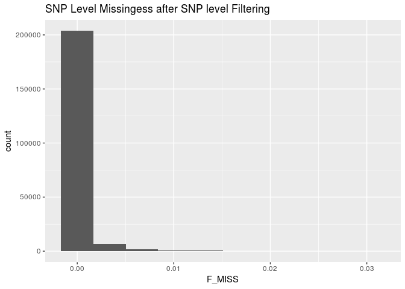

``` r
imiss <- read_table("qc_all_cohort_split_ichip7.imiss")
imiss %>%
  ggplot(aes(x = F_MISS)) +
  geom_histogram(bins = 100) +
  labs(title = "Sample Level Missingess after Sample Level Filtering")
```

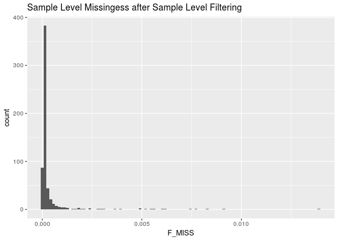 Batch effect resolved.

Re-Check Hets
-------------

``` bash
plink \
--bfile qc_all_cohort_split_ichip7 \
--het \
--out qc_all_cohort_split_ichip7
```

    ## PLINK v1.90b5.4 64-bit (10 Apr 2018)           www.cog-genomics.org/plink/1.9/
    ## (C) 2005-2018 Shaun Purcell, Christopher Chang   GNU General Public License v3
    ## Logging to qc_all_cohort_split_ichip7.log.
    ## Options in effect:
    ##   --bfile qc_all_cohort_split_ichip7
    ##   --het
    ##   --out qc_all_cohort_split_ichip7
    ## 
    ## 128908 MB RAM detected; reserving 64454 MB for main workspace.
    ## 213724 variants loaded from .bim file.
    ## 597 people (304 males, 293 females) loaded from .fam.
    ## Using 1 thread (no multithreaded calculations invoked).
    ## Before main variant filters, 597 founders and 0 nonfounders present.
    ## Calculating allele frequencies... 0%1%2%3%4%5%6%7%8%9%10%11%12%13%14%15%16%17%18%19%20%21%22%23%24%25%26%27%28%29%30%31%32%33%34%35%36%37%38%39%40%41%42%43%44%45%46%47%48%49%50%51%52%53%54%55%56%57%58%59%60%61%62%63%64%65%66%67%68%69%70%71%72%73%74%75%76%77%78%79%80%81%82%83%84%85%86%87%88%89%90%91%92%93%94%95%96%97%98%99% done.
    ## Warning: 6 het. haploid genotypes present (see qc_all_cohort_split_ichip7.hh );
    ## many commands treat these as missing.
    ## Warning: Nonmissing nonmale Y chromosome genotype(s) present; many commands
    ## treat these as missing.
    ## Total genotyping rate is 0.999634.
    ## 213724 variants and 597 people pass filters and QC.
    ## Note: No phenotypes present.
    ## --het: 212421 variants scanned, report written to
    ## qc_all_cohort_split_ichip7.het .

``` r
imiss <- read_table("qc_all_cohort_split_ichip7.imiss")
het <- read_table("qc_all_cohort_split_ichip7.het") %>%
  mutate(obs_het_rate = (`N(NM)` - `O(HOM)`)/`E(HOM)`)
imiss_het <- left_join(imiss, het, by = "FID")

ggplot(imiss_het, aes(x = F_MISS, y = obs_het_rate)) +
  geom_point(color = densCols(log10(imiss_het$F_MISS), imiss_het$obs_het_rate)) +
  labs(x = "Proportion of missing genotypes", y = "Heterozygosity rate") +
  scale_x_log10(limits = c(0.001, 1), minor_breaks = c(0.01, 0.1)) +
  scale_y_continuous(limits = c(0, .5)) +
  geom_vline(xintercept = 0.03, color = "red") +
  geom_hline(yintercept = (mean(imiss_het$obs_het_rate)+(3*sd(imiss_het$obs_het_rate))), color = "red") +
  geom_hline(yintercept = (mean(imiss_het$obs_het_rate)-(3*sd(imiss_het$obs_het_rate))), color = "red")
```

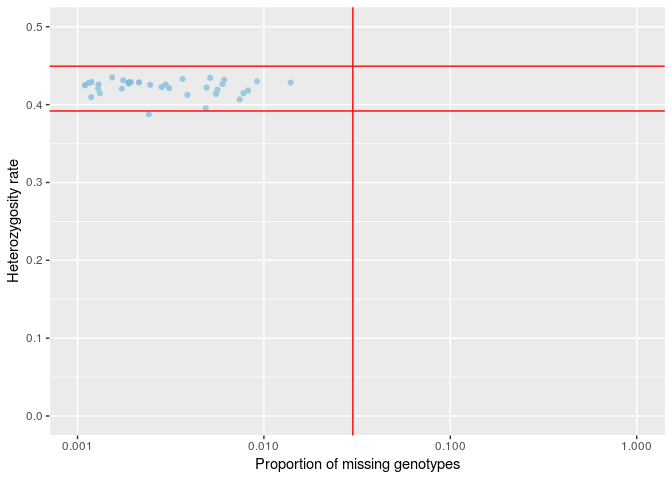 Looks great.

Calculate Overall project MAF Adter Filtering
---------------------------------------------

``` bash
plink \
--bfile qc_all_cohort_split_ichip7 \
--freq \
--out qc_all_cohort_split_ichip7
```

    ## PLINK v1.90b5.4 64-bit (10 Apr 2018)           www.cog-genomics.org/plink/1.9/
    ## (C) 2005-2018 Shaun Purcell, Christopher Chang   GNU General Public License v3
    ## Logging to qc_all_cohort_split_ichip7.log.
    ## Options in effect:
    ##   --bfile qc_all_cohort_split_ichip7
    ##   --freq
    ##   --out qc_all_cohort_split_ichip7
    ## 
    ## 128908 MB RAM detected; reserving 64454 MB for main workspace.
    ## 213724 variants loaded from .bim file.
    ## 597 people (304 males, 293 females) loaded from .fam.
    ## Using 1 thread (no multithreaded calculations invoked).
    ## Before main variant filters, 597 founders and 0 nonfounders present.
    ## Calculating allele frequencies... 0%1%2%3%4%5%6%7%8%9%10%11%12%13%14%15%16%17%18%19%20%21%22%23%24%25%26%27%28%29%30%31%32%33%34%35%36%37%38%39%40%41%42%43%44%45%46%47%48%49%50%51%52%53%54%55%56%57%58%59%60%61%62%63%64%65%66%67%68%69%70%71%72%73%74%75%76%77%78%79%80%81%82%83%84%85%86%87%88%89%90%91%92%93%94%95%96%97%98%99% done.
    ## Warning: 6 het. haploid genotypes present (see qc_all_cohort_split_ichip7.hh );
    ## many commands treat these as missing.
    ## Warning: Nonmissing nonmale Y chromosome genotype(s) present; many commands
    ## treat these as missing.
    ## Total genotyping rate is 0.999634.
    ## --freq: Allele frequencies (founders only) written to
    ## qc_all_cohort_split_ichip7.frq .

``` r
maffreq <- read_table2("qc_all_cohort_split_ichip7.frq")
maffreq %>%
  ggplot(aes(x = MAF)) +
  geom_histogram(aes(y =..density..)) +
  geom_density(col=2) +
  labs(title = "Overall MAF After Filtering")
```

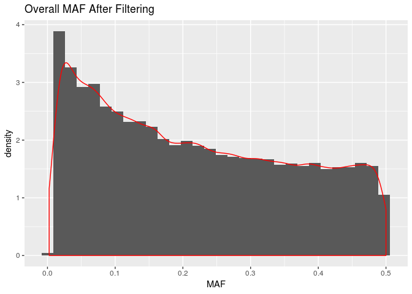

Identification of Duplicated or Related Individuals
---------------------------------------------------

-   Prune dataset for temporary use of calculating cryptic relatedness and PCA as both work best under assumption of no LD among SNPs
-   Prior to calcuating identity by state, IBS, prune SNPs to only independent SNPs and remove regions with extended linkage disequiblibirum such as HLA region. The below removes snps within a 50kb window, with an r2 &gt; .2 and variant count to shift the window at the end of each step of 5kb.

``` bash
plink \
--bfile qc_all_cohort_split_ichip7 \
--exclude ../../original_data/highLDregions.txt \
--range \
--indep 50 5 1.8 \
--out qc_all_cohort_split_ichip7 &>/dev/null
```

``` bash
plink \
--bfile qc_all_cohort_split_ichip7 \
--extract qc_all_cohort_split_ichip7.prune.in \
--genome \
--min 0.12 \
--out qc_all_cohort_split_ichip7 &>/dev/null
```

``` r
genome <- read_table2("qc_all_cohort_split_ichip7.genome")

genome <- genome %>%
  mutate(PI_HAT = as.double(PI_HAT)) %>%
  mutate(color = if_else(PI_HAT <.15, "~3rd degree",
                         if_else(PI_HAT >=.15 & PI_HAT <.35, "~2nd degree",
                                 if_else(PI_HAT >= .35 & PI_HAT < .65, "~1st degree",
                                         if_else(PI_HAT > .65, "~Replicates or twins", "???")))))

genome %>%
  ggplot(aes(x = as.double(Z0), y = as.double(Z1), color = color)) +
  geom_point(alpha =1 ) +
  guides(colour = guide_legend(override.aes = list(alpha = 1)))+
  labs(x = "Z0 the proportion of loci where the pair shares zero alleles", 
       y = "Z1 the proportion of loci where the pair shares one allele") 
```

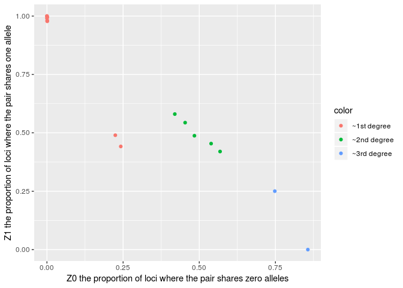

Replicates (purple) removed

``` r
genome %>%
  ggplot(aes(x = as.double(PI_HAT), fill = color)) +
  geom_histogram(bins = 100) +
  labs(title = "Distribution of PI_HAT for Related Individuals >0.12", x = "PI_HAT", y = "Count (non-unique)")
```

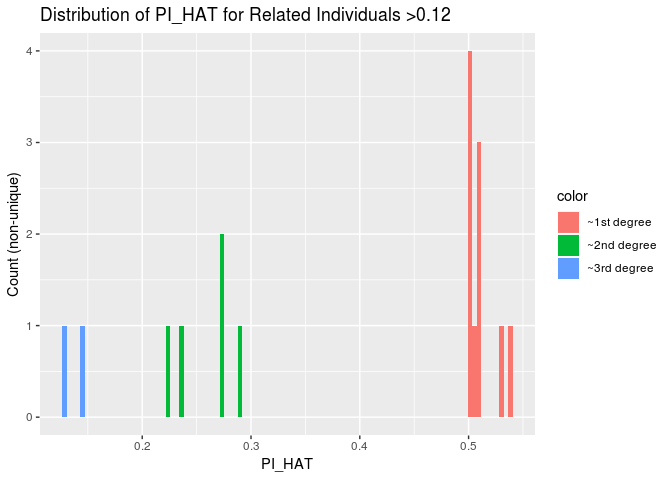

``` r
file.remove(list.files(pattern = "^temp", full.names = TRUE))
```

    ##  [1] TRUE TRUE TRUE TRUE TRUE TRUE TRUE TRUE TRUE TRUE TRUE TRUE TRUE TRUE
    ## [15] TRUE TRUE TRUE TRUE TRUE TRUE TRUE TRUE TRUE TRUE TRUE TRUE TRUE
