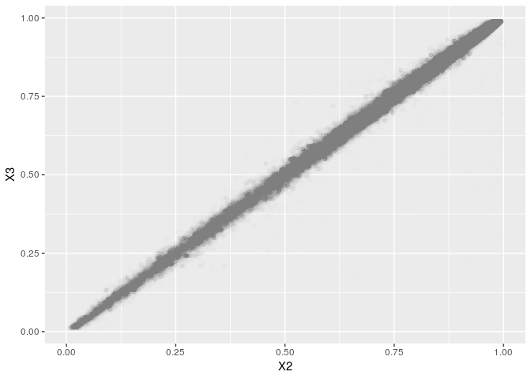

BBC Samples Prepare for Imputation Submission
================
Translational Genomics Group
06 March, 2019

Prepare VCF for Imputation Submission
-------------------------------------

### Download HRC Reference

This file has already been downloaded to a shared directory.

``` bash
wget -p /mnt/share6/SHARED_DATASETS/Haplotype_Reference_Consortium ftp://ngs.sanger.ac.uk/production/hrc/HRC.r1-1/HRC.r1-1.GRCh37.wgs.mac5.sites.tab.gz &>/dev/null
```

``` bash
gunzip -k /mnt/share6/SHARED_DATASETS/Haplotype_Reference_Consortium/HRC.r1-1.GRCh37.wgs.mac5.sites.tab.gz &>/dev/null
```

### Download HRC Check Tool

``` bash
wget http://www.well.ox.ac.uk/~wrayner/tools/HRC-1000G-check-bim-v4.2.9.zip -O temp.zip; unzip temp.zip; rm temp.zip
```

### Download Will Rayner Strand FIle to Align to Reference

Download Immuno\_BeadChip\_11419691\_B Strand Files for BBC and Ref/Alt File

``` bash
wget http://www.well.ox.ac.uk/~wrayner/strand/Immuno_BeadChip_11419691_B-b37-strand.zip -O temp.zip; unzip temp.zip; rm temp.zip &>/dev/null

wget http://www.well.ox.ac.uk/~wrayner/strand/RefAlt/Immuno_BeadChip_11419691_B-b37.strand.RefAlt.zip -O temp.zip; unzip temp.zip; rm temp.zip &>/dev/null
```

### B. Create List of SNPs to Flip

``` r
strand <- read_tsv("immuno_beadchip_11419691_b-b37.strand", 
                   col_names = c("SNP", "Chr", "BP", "Match", "Strand", "Allele"))

strand %>%
  filter(Strand == "-") %>%
  select(SNP) %>%
  write_tsv("temp_flip_bbc.tsv", col_names = FALSE)
```

### C. Flip SNPs to Convert TOP to Forward/Ref in Plink

``` bash
plink \
--bfile ../3.qc/qc_cohort_split_bbc \
--flip temp_flip_bbc.tsv \
--make-bed \
--out temp_bbc
```

    ## PLINK v1.90b6.9 64-bit (4 Mar 2019)            www.cog-genomics.org/plink/1.9/
    ## (C) 2005-2019 Shaun Purcell, Christopher Chang   GNU General Public License v3
    ## Logging to temp_bbc.log.
    ## Options in effect:
    ##   --bfile ../3.qc/qc_cohort_split_bbc
    ##   --flip temp_flip_bbc.tsv
    ##   --make-bed
    ##   --out temp_bbc
    ## 
    ## 128904 MB RAM detected; reserving 64452 MB for main workspace.
    ## 117098 variants loaded from .bim file.
    ## 4223 people (1983 males, 2240 females) loaded from .fam.
    ## 4223 phenotype values loaded from .fam.
    ## --flip: 58674 SNPs flipped, 39019 SNP IDs not present.
    ## Using 1 thread (no multithreaded calculations invoked).
    ## Before main variant filters, 4223 founders and 0 nonfounders present.
    ## Calculating allele frequencies... 0%1%2%3%4%5%6%7%8%9%10%11%12%13%14%15%16%17%18%19%20%21%22%23%24%25%26%27%28%29%30%31%32%33%34%35%36%37%38%39%40%41%42%43%44%45%46%47%48%49%50%51%52%53%54%55%56%57%58%59%60%61%62%63%64%65%66%67%68%69%70%71%72%73%74%75%76%77%78%79%80%81%82%83%84%85%86%87%88%89%90%91%92%93%94%95%96%97%98%99% done.
    ## Warning: 6094 het. haploid genotypes present (see temp_bbc.hh ); many commands
    ## treat these as missing.
    ## Total genotyping rate is 0.999884.
    ## 117098 variants and 4223 people pass filters and QC.
    ## Among remaining phenotypes, 0 are cases and 4223 are controls.
    ## --make-bed to temp_bbc.bed + temp_bbc.bim + temp_bbc.fam ... 0%1%2%3%4%5%6%7%8%9%10%11%12%13%14%15%16%17%18%19%20%21%22%23%24%25%26%27%28%29%30%31%32%33%34%35%36%37%38%39%40%41%42%43%44%45%46%47%48%49%50%51%52%53%54%55%56%57%58%59%60%61%62%63%64%65%66%67%68%69%70%71%72%73%74%75%76%77%78%79%80%81%82%83%84%85%86%87%88%89%90%91%92%93%94%95%96%97%98%99%done.

### D. Set Ref/Alt Allele

``` bash
plink \
--bfile temp_bbc \
--reference-allele Immuno_BeadChip_11419691_B-b37.strand.RefAlt  2 \
--chr 1-22 \
--make-bed \
--out temp1_bbc
```

    ## PLINK v1.90b6.9 64-bit (4 Mar 2019)            www.cog-genomics.org/plink/1.9/
    ## (C) 2005-2019 Shaun Purcell, Christopher Chang   GNU General Public License v3
    ## Logging to temp1_bbc.log.
    ## Options in effect:
    ##   --a1-allele Immuno_BeadChip_11419691_B-b37.strand.RefAlt 2
    ##   --bfile temp_bbc
    ##   --chr 1-22
    ##   --make-bed
    ##   --out temp1_bbc
    ## 
    ## 128904 MB RAM detected; reserving 64452 MB for main workspace.
    ## 116386 out of 117098 variants loaded from .bim file.
    ## 4223 people (1983 males, 2240 females) loaded from .fam.
    ## 4223 phenotype values loaded from .fam.
    ## Using 1 thread (no multithreaded calculations invoked).
    ## Before main variant filters, 4223 founders and 0 nonfounders present.
    ## Calculating allele frequencies... 0%1%2%3%4%5%6%7%8%9%10%11%12%13%14%15%16%17%18%19%20%21%22%23%24%25%26%27%28%29%30%31%32%33%34%35%36%37%38%39%40%41%42%43%44%45%46%47%48%49%50%51%52%53%54%55%56%57%58%59%60%61%62%63%64%65%66%67%68%69%70%71%72%73%74%75%76%77%78%79%80%81%82%83%84%85%86%87%88%89%90%91%92%93%94%95%96%97%98%99% done.
    ## Total genotyping rate is 0.999885.
    ## --a1-allele: 115359 assignments made.
    ## 116386 variants and 4223 people pass filters and QC.
    ## Among remaining phenotypes, 0 are cases and 4223 are controls.
    ## --make-bed to temp1_bbc.bed + temp1_bbc.bim + temp1_bbc.fam ... 0%1%2%3%4%5%6%7%8%9%10%11%12%13%14%15%16%17%18%19%20%21%22%23%24%25%26%27%28%29%30%31%32%33%34%35%36%37%38%39%40%41%42%43%44%45%46%47%48%49%50%51%52%53%54%55%56%57%58%59%60%61%62%63%64%65%66%67%68%69%70%71%72%73%74%75%76%77%78%79%80%81%82%83%84%85%86%87%88%89%90%91%92%93%94%95%96%97%98%99%done.

### E. Calcualte Allele Frequency

``` bash
plink \
--bfile temp1_bbc \
--keep-allele-order \
--freq \
--out temp1_bbc
```

    ## PLINK v1.90b6.9 64-bit (4 Mar 2019)            www.cog-genomics.org/plink/1.9/
    ## (C) 2005-2019 Shaun Purcell, Christopher Chang   GNU General Public License v3
    ## Logging to temp1_bbc.log.
    ## Options in effect:
    ##   --bfile temp1_bbc
    ##   --freq
    ##   --keep-allele-order
    ##   --out temp1_bbc
    ## 
    ## 128904 MB RAM detected; reserving 64452 MB for main workspace.
    ## 116386 variants loaded from .bim file.
    ## 4223 people (1983 males, 2240 females) loaded from .fam.
    ## 4223 phenotype values loaded from .fam.
    ## Using 1 thread (no multithreaded calculations invoked).
    ## Before main variant filters, 4223 founders and 0 nonfounders present.
    ## Calculating allele frequencies... 0%1%2%3%4%5%6%7%8%9%10%11%12%13%14%15%16%17%18%19%20%21%22%23%24%25%26%27%28%29%30%31%32%33%34%35%36%37%38%39%40%41%42%43%44%45%46%47%48%49%50%51%52%53%54%55%56%57%58%59%60%61%62%63%64%65%66%67%68%69%70%71%72%73%74%75%76%77%78%79%80%81%82%83%84%85%86%87%88%89%90%91%92%93%94%95%96%97%98%99% done.
    ## Total genotyping rate is 0.999885.
    ## --freq: Allele frequencies (founders only) written to temp1_bbc.frq .

### F. Final Checks

``` bash
perl HRC-1000G-check-bim.pl \
-b temp1_bbc.bim \
-f temp1_bbc.frq \
-r /mnt/share6/SHARED_DATASETS/Haplotype_Reference_Consortium/HRC.r1-1.GRCh37.wgs.mac5.sites.tab \
-h
```

-   6 markers, match by name to HRC but have a different position (same CHR), will exclude. rs1319548, rs9258651, rs6906128, rs6457508, rs6921236 rs2085508
-   62 markers are on the wrong strand when compared to HRC reference after strand flips from Will's files. Will re-flip possible difference references used.
-   904 with wrong ref assignemnt
-   654 dups plus 1846 palindromic plus 81 AF removed plus 235 no match to hrc

### Remove 6 SNPs with different positions

``` bash
plink \
--bfile temp1_bbc \
--exclude Position-temp1_bbc-HRC.txt \
--make-bed \
--out temp2_bbc
```

    ## PLINK v1.90b6.9 64-bit (4 Mar 2019)            www.cog-genomics.org/plink/1.9/
    ## (C) 2005-2019 Shaun Purcell, Christopher Chang   GNU General Public License v3
    ## Logging to temp2_bbc.log.
    ## Options in effect:
    ##   --bfile temp1_bbc
    ##   --exclude Position-temp1_bbc-HRC.txt
    ##   --make-bed
    ##   --out temp2_bbc
    ## 
    ## 128904 MB RAM detected; reserving 64452 MB for main workspace.
    ## 116386 variants loaded from .bim file.
    ## 4223 people (1983 males, 2240 females) loaded from .fam.
    ## 4223 phenotype values loaded from .fam.
    ## --exclude: 116380 variants remaining.
    ## Using 1 thread (no multithreaded calculations invoked).
    ## Before main variant filters, 4223 founders and 0 nonfounders present.
    ## Calculating allele frequencies... 0%1%2%3%4%5%6%7%8%9%10%11%12%13%14%15%16%17%18%19%20%21%22%23%24%25%26%27%28%29%30%31%32%33%34%35%36%37%38%39%40%41%42%43%44%45%46%47%48%49%50%51%52%53%54%55%56%57%58%59%60%61%62%63%64%65%66%67%68%69%70%71%72%73%74%75%76%77%78%79%80%81%82%83%84%85%86%87%88%89%90%91%92%93%94%95%96%97%98%99% done.
    ## Total genotyping rate is 0.999885.
    ## 116380 variants and 4223 people pass filters and QC.
    ## Among remaining phenotypes, 0 are cases and 4223 are controls.
    ## --make-bed to temp2_bbc.bed + temp2_bbc.bim + temp2_bbc.fam ... 0%1%2%3%4%5%6%7%8%9%10%11%12%13%14%15%16%17%18%19%20%21%22%23%24%25%26%27%28%29%30%31%32%33%34%35%36%37%38%39%40%41%42%43%44%45%46%47%48%49%50%51%52%53%54%55%56%57%58%59%60%61%62%63%64%65%66%67%68%69%70%71%72%73%74%75%76%77%78%79%80%81%82%83%84%85%86%87%88%89%90%91%92%93%94%95%96%97%98%99%done.

### Exclude SNPS

``` bash
plink \
--bfile temp2_bbc \
--exclude Exclude-temp1_bbc-HRC.txt \
--make-bed \
--out temp3_bbc
```

    ## PLINK v1.90b6.9 64-bit (4 Mar 2019)            www.cog-genomics.org/plink/1.9/
    ## (C) 2005-2019 Shaun Purcell, Christopher Chang   GNU General Public License v3
    ## Logging to temp3_bbc.log.
    ## Options in effect:
    ##   --bfile temp2_bbc
    ##   --exclude Exclude-temp1_bbc-HRC.txt
    ##   --make-bed
    ##   --out temp3_bbc
    ## 
    ## 128904 MB RAM detected; reserving 64452 MB for main workspace.
    ## 116380 variants loaded from .bim file.
    ## 4223 people (1983 males, 2240 females) loaded from .fam.
    ## 4223 phenotype values loaded from .fam.
    ## --exclude: 112231 variants remaining.
    ## Using 1 thread (no multithreaded calculations invoked).
    ## Before main variant filters, 4223 founders and 0 nonfounders present.
    ## Calculating allele frequencies... 0%1%2%3%4%5%6%7%8%9%10%11%12%13%14%15%16%17%18%19%20%21%22%23%24%25%26%27%28%29%30%31%32%33%34%35%36%37%38%39%40%41%42%43%44%45%46%47%48%49%50%51%52%53%54%55%56%57%58%59%60%61%62%63%64%65%66%67%68%69%70%71%72%73%74%75%76%77%78%79%80%81%82%83%84%85%86%87%88%89%90%91%92%93%94%95%96%97%98%99% done.
    ## Total genotyping rate is 0.999887.
    ## 112231 variants and 4223 people pass filters and QC.
    ## Among remaining phenotypes, 0 are cases and 4223 are controls.
    ## --make-bed to temp3_bbc.bed + temp3_bbc.bim + temp3_bbc.fam ... 0%1%2%3%4%5%6%7%8%9%10%11%12%13%14%15%16%17%18%19%20%21%22%23%24%25%26%27%28%29%30%31%32%33%34%35%36%37%38%39%40%41%42%43%44%45%46%47%48%49%50%51%52%53%54%55%56%57%58%59%60%61%62%63%64%65%66%67%68%69%70%71%72%73%74%75%76%77%78%79%80%81%82%83%84%85%86%87%88%89%90%91%92%93%94%95%96%97%98%99%done.

### Flip

``` bash
plink \
--bfile temp3_bbc \
--flip Strand-Flip-temp1_bbc-HRC.txt \
--make-bed \
--out temp4_bbc
```

    ## PLINK v1.90b6.9 64-bit (4 Mar 2019)            www.cog-genomics.org/plink/1.9/
    ## (C) 2005-2019 Shaun Purcell, Christopher Chang   GNU General Public License v3
    ## Logging to temp4_bbc.log.
    ## Options in effect:
    ##   --bfile temp3_bbc
    ##   --flip Strand-Flip-temp1_bbc-HRC.txt
    ##   --make-bed
    ##   --out temp4_bbc
    ## 
    ## 128904 MB RAM detected; reserving 64452 MB for main workspace.
    ## 112231 variants loaded from .bim file.
    ## 4223 people (1983 males, 2240 females) loaded from .fam.
    ## 4223 phenotype values loaded from .fam.
    ## --flip: 62 SNPs flipped.
    ## Using 1 thread (no multithreaded calculations invoked).
    ## Before main variant filters, 4223 founders and 0 nonfounders present.
    ## Calculating allele frequencies... 0%1%2%3%4%5%6%7%8%9%10%11%12%13%14%15%16%17%18%19%20%21%22%23%24%25%26%27%28%29%30%31%32%33%34%35%36%37%38%39%40%41%42%43%44%45%46%47%48%49%50%51%52%53%54%55%56%57%58%59%60%61%62%63%64%65%66%67%68%69%70%71%72%73%74%75%76%77%78%79%80%81%82%83%84%85%86%87%88%89%90%91%92%93%94%95%96%97%98%99% done.
    ## Total genotyping rate is 0.999887.
    ## 112231 variants and 4223 people pass filters and QC.
    ## Among remaining phenotypes, 0 are cases and 4223 are controls.
    ## --make-bed to temp4_bbc.bed + temp4_bbc.bim + temp4_bbc.fam ... 0%1%2%3%4%5%6%7%8%9%10%11%12%13%14%15%16%17%18%19%20%21%22%23%24%25%26%27%28%29%30%31%32%33%34%35%36%37%38%39%40%41%42%43%44%45%46%47%48%49%50%51%52%53%54%55%56%57%58%59%60%61%62%63%64%65%66%67%68%69%70%71%72%73%74%75%76%77%78%79%80%81%82%83%84%85%86%87%88%89%90%91%92%93%94%95%96%97%98%99%done.

### Set Ref/Alt

``` bash
plink \
--bfile temp4_bbc \
--reference-allele Force-Allele1-temp1_bbc-HRC.txt \
--make-bed \
--out bbc_qc_pre_impute
```

    ## PLINK v1.90b6.9 64-bit (4 Mar 2019)            www.cog-genomics.org/plink/1.9/
    ## (C) 2005-2019 Shaun Purcell, Christopher Chang   GNU General Public License v3
    ## Logging to bbc_qc_pre_impute.log.
    ## Options in effect:
    ##   --a1-allele Force-Allele1-temp1_bbc-HRC.txt
    ##   --bfile temp4_bbc
    ##   --make-bed
    ##   --out bbc_qc_pre_impute
    ## 
    ## 128904 MB RAM detected; reserving 64452 MB for main workspace.
    ## 112231 variants loaded from .bim file.
    ## 4223 people (1983 males, 2240 females) loaded from .fam.
    ## 4223 phenotype values loaded from .fam.
    ## Using 1 thread (no multithreaded calculations invoked).
    ## Before main variant filters, 4223 founders and 0 nonfounders present.
    ## Calculating allele frequencies... 0%1%2%3%4%5%6%7%8%9%10%11%12%13%14%15%16%17%18%19%20%21%22%23%24%25%26%27%28%29%30%31%32%33%34%35%36%37%38%39%40%41%42%43%44%45%46%47%48%49%50%51%52%53%54%55%56%57%58%59%60%61%62%63%64%65%66%67%68%69%70%71%72%73%74%75%76%77%78%79%80%81%82%83%84%85%86%87%88%89%90%91%92%93%94%95%96%97%98%99% done.
    ## Total genotyping rate is 0.999887.
    ## --a1-allele: 112231 assignments made.
    ## 112231 variants and 4223 people pass filters and QC.
    ## Among remaining phenotypes, 0 are cases and 4223 are controls.
    ## --make-bed to bbc_qc_pre_impute.bed + bbc_qc_pre_impute.bim +
    ## bbc_qc_pre_impute.fam ... 0%1%2%3%4%5%6%7%8%9%10%11%12%13%14%15%16%17%18%19%20%21%22%23%24%25%26%27%28%29%30%31%32%33%34%35%36%37%38%39%40%41%42%43%44%45%46%47%48%49%50%51%52%53%54%55%56%57%58%59%60%61%62%63%64%65%66%67%68%69%70%71%72%73%74%75%76%77%78%79%80%81%82%83%84%85%86%87%88%89%90%91%92%93%94%95%96%97%98%99%done.

``` r
freq_plot <- read_tsv("FreqPlot-temp1_bbc-HRC.txt", col_names = FALSE)
```

    ## Parsed with column specification:
    ## cols(
    ##   X1 = col_character(),
    ##   X2 = col_double(),
    ##   X3 = col_double(),
    ##   X4 = col_double(),
    ##   X5 = col_integer()
    ## )

``` r
freq_plot %>%
  ggplot(aes(x = X2, y = X3)) +
  geom_point(alpha = 1/500)
```



Convert to VCF using Plink
--------------------------

Using Plink1.9 becuase plink2 outputs VCFv4.3 which is not yet supported by the server. Plink1.9 on vcf recode defualts to A2 allele as reference, so forcing a2 allele to curent a1.

``` bash
for i in {1..22}; do
    plink --bfile bbc_qc_pre_impute \
    --chr ${i} \
    --real-ref-alleles \
    --recode vcf \
    --out bbc_vcfs/bbc_chr${i}
done
```

Create Sorted and Compressed VCF using VCFtools and tabix (including bgzip)
---------------------------------------------------------------------------

``` bash
for i in {1..22}; do
    vcf-sort bbc_vcfs/bbc_chr${i}.vcf | bgzip -c > bbc_vcfs/bbc_chr${i}.vcf.gz
done
```

``` r
file.remove(list.files(pattern = "^temp", full.names = TRUE))
```

    ##  [1] TRUE TRUE TRUE TRUE TRUE TRUE TRUE TRUE TRUE TRUE TRUE TRUE TRUE TRUE
    ## [15] TRUE TRUE TRUE TRUE TRUE TRUE TRUE TRUE TRUE

Submit to Michigan Imputation Server.
