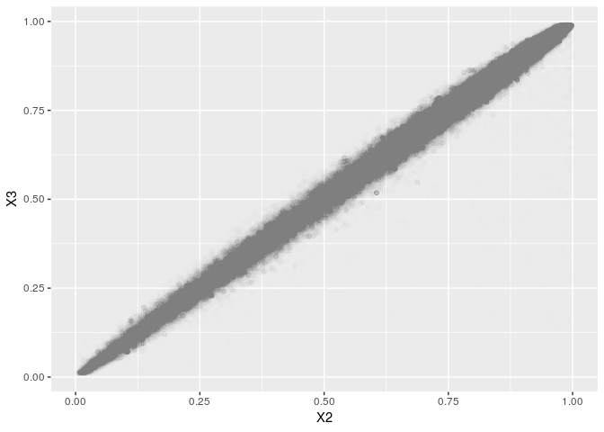

iChip 7 European Samples Prepare for Imputation Submission
================
Translational Genomics Group
01 November, 2018

Prepare VCF for Imputation Submission
-------------------------------------

### Download HRC Reference

This file has already been downloaded to a shared directory.

``` bash
wget -p /mnt/share6/SHARED_DATASETS/Haplotype_Reference_Consortium ftp://ngs.sanger.ac.uk/production/hrc/HRC.r1-1/HRC.r1-1.GRCh37.wgs.mac5.sites.tab.gz &>/dev/null
```

``` bash
gunzip -k /mnt/share6/SHARED_DATASETS/Haplotype_Reference_Consortium/HRC.r1-1.GRCh37.wgs.mac5.sites.tab.gz &>/dev/null
```

### Download HRC Check Tool

``` bash
wget http://www.well.ox.ac.uk/~wrayner/tools/HRC-1000G-check-bim-v4.2.9.zip -O temp.zip; unzip temp.zip; rm temp.zip
```

### Download Will Rayner Strand FIle to Align to Reference

Download InfiniumImmunoArray-24v2-0\_A-b37 Strand Files for iChip 7 and Ref/Alt File

``` bash
wget http://www.well.ox.ac.uk/~wrayner/strand/InfiniumImmunoArray-24v2-0_A-b37-strand.zip -O temp.zip; unzip temp.zip; rm temp.zip &>/dev/null

wget http://www.well.ox.ac.uk/~wrayner/strand/RefAlt/InfiniumImmunoArray-24v2-0_A-b37.strand.RefAlt.zip -O temp.zip; unzip temp.zip; rm temp.zip &>/dev/null
```

### B. Create List of SNPs to Flip

``` r
strand <- read_tsv("InfiniumImmunoArray-24v2-0_A-b37.strand", 
                   col_names = c("SNP", "Chr", "BP", "Match", "Strand", "Allele"))

strand %>%
  filter(Strand == "-") %>%
  select(SNP) %>%
  write_tsv("temp_flip_ichip7.tsv", col_names = FALSE)
```

### C. Flip SNPs to Convert TOP to Forward/Ref in Plink

``` bash
plink \
--bfile ../3.qc/qc_eur_cohort_split_ichip7 \
--flip temp_flip_ichip7.tsv \
--make-bed \
--out temp_ichip7
```

    ## PLINK v1.90b5.4 64-bit (10 Apr 2018)           www.cog-genomics.org/plink/1.9/
    ## (C) 2005-2018 Shaun Purcell, Christopher Chang   GNU General Public License v3
    ## Logging to temp_ichip7.log.
    ## Options in effect:
    ##   --bfile ../3.qc/qc_eur_cohort_split_ichip7
    ##   --flip temp_flip_ichip7.tsv
    ##   --make-bed
    ##   --out temp_ichip7
    ## 
    ## 128908 MB RAM detected; reserving 64454 MB for main workspace.
    ## 212125 variants loaded from .bim file.
    ## 531 people (266 males, 265 females) loaded from .fam.
    ## --flip: 106021 SNPs flipped, 19972 SNP IDs not present.
    ## Using 1 thread (no multithreaded calculations invoked).
    ## Before main variant filters, 531 founders and 0 nonfounders present.
    ## Calculating allele frequencies... 0%1%2%3%4%5%6%7%8%9%10%11%12%13%14%15%16%17%18%19%20%21%22%23%24%25%26%27%28%29%30%31%32%33%34%35%36%37%38%39%40%41%42%43%44%45%46%47%48%49%50%51%52%53%54%55%56%57%58%59%60%61%62%63%64%65%66%67%68%69%70%71%72%73%74%75%76%77%78%79%80%81%82%83%84%85%86%87%88%89%90%91%92%93%94%95%96%97%98%99% done.
    ## Warning: 10 het. haploid genotypes present (see temp_ichip7.hh ); many commands
    ## treat these as missing.
    ## Warning: Nonmissing nonmale Y chromosome genotype(s) present; many commands
    ## treat these as missing.
    ## Total genotyping rate is 0.999627.
    ## 212125 variants and 531 people pass filters and QC.
    ## Note: No phenotypes present.
    ## --make-bed to temp_ichip7.bed + temp_ichip7.bim + temp_ichip7.fam ... 0%1%2%3%4%5%6%7%8%9%10%11%12%13%14%15%16%17%18%19%20%21%22%23%24%25%26%27%28%29%30%31%32%33%34%35%36%37%38%39%40%41%42%43%44%45%46%47%48%49%50%51%52%53%54%55%56%57%58%59%60%61%62%63%64%65%66%67%68%69%70%71%72%73%74%75%76%77%78%79%80%81%82%83%84%85%86%87%88%89%90%91%92%93%94%95%96%97%98%99%done.

### D. Set Ref/Alt Allele

``` bash
plink \
--bfile temp_ichip7 \
--reference-allele InfiniumImmunoArray-24v2-0_A.b37.RefAlt  2 \
--chr 1-22 \
--make-bed \
--out temp1_ichip7
```

    ## PLINK v1.90b5.4 64-bit (10 Apr 2018)           www.cog-genomics.org/plink/1.9/
    ## (C) 2005-2018 Shaun Purcell, Christopher Chang   GNU General Public License v3
    ## Logging to temp1_ichip7.log.
    ## Options in effect:
    ##   --a1-allele InfiniumImmunoArray-24v2-0_A.b37.RefAlt 2
    ##   --bfile temp_ichip7
    ##   --chr 1-22
    ##   --make-bed
    ##   --out temp1_ichip7
    ## 
    ## 128908 MB RAM detected; reserving 64454 MB for main workspace.
    ## 210901 out of 212125 variants loaded from .bim file.
    ## 531 people (266 males, 265 females) loaded from .fam.
    ## Using 1 thread (no multithreaded calculations invoked).
    ## Before main variant filters, 531 founders and 0 nonfounders present.
    ## Calculating allele frequencies... 0%1%2%3%4%5%6%7%8%9%10%11%12%13%14%15%16%17%18%19%20%21%22%23%24%25%26%27%28%29%30%31%32%33%34%35%36%37%38%39%40%41%42%43%44%45%46%47%48%49%50%51%52%53%54%55%56%57%58%59%60%61%62%63%64%65%66%67%68%69%70%71%72%73%74%75%76%77%78%79%80%81%82%83%84%85%86%87%88%89%90%91%92%93%94%95%96%97%98%99% done.
    ## Total genotyping rate is 0.999629.
    ## --a1-allele: 206225 assignments made.
    ## 210901 variants and 531 people pass filters and QC.
    ## Note: No phenotypes present.
    ## --make-bed to temp1_ichip7.bed + temp1_ichip7.bim + temp1_ichip7.fam ... 0%1%2%3%4%5%6%7%8%9%10%11%12%13%14%15%16%17%18%19%20%21%22%23%24%25%26%27%28%29%30%31%32%33%34%35%36%37%38%39%40%41%42%43%44%45%46%47%48%49%50%51%52%53%54%55%56%57%58%59%60%61%62%63%64%65%66%67%68%69%70%71%72%73%74%75%76%77%78%79%80%81%82%83%84%85%86%87%88%89%90%91%92%93%94%95%96%97%98%99%done.

### E. Calcualte Allele Frequency

``` bash
plink \
--bfile temp1_ichip7 \
--keep-allele-order \
--freq \
--out temp1_ichip7
```

    ## PLINK v1.90b5.4 64-bit (10 Apr 2018)           www.cog-genomics.org/plink/1.9/
    ## (C) 2005-2018 Shaun Purcell, Christopher Chang   GNU General Public License v3
    ## Logging to temp1_ichip7.log.
    ## Options in effect:
    ##   --bfile temp1_ichip7
    ##   --freq
    ##   --keep-allele-order
    ##   --out temp1_ichip7
    ## 
    ## 128908 MB RAM detected; reserving 64454 MB for main workspace.
    ## 210901 variants loaded from .bim file.
    ## 531 people (266 males, 265 females) loaded from .fam.
    ## Using 1 thread (no multithreaded calculations invoked).
    ## Before main variant filters, 531 founders and 0 nonfounders present.
    ## Calculating allele frequencies... 0%1%2%3%4%5%6%7%8%9%10%11%12%13%14%15%16%17%18%19%20%21%22%23%24%25%26%27%28%29%30%31%32%33%34%35%36%37%38%39%40%41%42%43%44%45%46%47%48%49%50%51%52%53%54%55%56%57%58%59%60%61%62%63%64%65%66%67%68%69%70%71%72%73%74%75%76%77%78%79%80%81%82%83%84%85%86%87%88%89%90%91%92%93%94%95%96%97%98%99% done.
    ## Total genotyping rate is 0.999629.
    ## --freq: Allele frequencies (founders only) written to temp1_ichip7.frq .

### F. Final Checks

``` bash
perl HRC-1000G-check-bim.pl \
-b temp1_ichip7.bim \
-f temp1_ichip7.frq \
-r /mnt/share6/SHARED_DATASETS/Haplotype_Reference_Consortium/HRC.r1-1.GRCh37.wgs.mac5.sites.tab \
-h
```

-   1 markers, match by name to HRC but have a different position (same CHR), will exclude. rs9268208
-   70 markers are on the wrong strand when compared to HRC reference after strand flips from Will's files. Will re-flip possible difference references used.
-   3511 with wrong ref assignemnt
-   4320 dups plus 3069 palindromic plus 135 AF removed plus 2035 no match to hrc

### Remove 4 SNPs with different positions

``` bash
plink \
--bfile temp1_ichip7 \
--exclude Position-temp1_ichip7-HRC.txt \
--make-bed \
--out temp2_ichip7
```

    ## PLINK v1.90b5.4 64-bit (10 Apr 2018)           www.cog-genomics.org/plink/1.9/
    ## (C) 2005-2018 Shaun Purcell, Christopher Chang   GNU General Public License v3
    ## Logging to temp2_ichip7.log.
    ## Options in effect:
    ##   --bfile temp1_ichip7
    ##   --exclude Position-temp1_ichip7-HRC.txt
    ##   --make-bed
    ##   --out temp2_ichip7
    ## 
    ## 128908 MB RAM detected; reserving 64454 MB for main workspace.
    ## 210901 variants loaded from .bim file.
    ## 531 people (266 males, 265 females) loaded from .fam.
    ## --exclude: 210900 variants remaining.
    ## Using 1 thread (no multithreaded calculations invoked).
    ## Before main variant filters, 531 founders and 0 nonfounders present.
    ## Calculating allele frequencies... 0%1%2%3%4%5%6%7%8%9%10%11%12%13%14%15%16%17%18%19%20%21%22%23%24%25%26%27%28%29%30%31%32%33%34%35%36%37%38%39%40%41%42%43%44%45%46%47%48%49%50%51%52%53%54%55%56%57%58%59%60%61%62%63%64%65%66%67%68%69%70%71%72%73%74%75%76%77%78%79%80%81%82%83%84%85%86%87%88%89%90%91%92%93%94%95%96%97%98%99% done.
    ## Total genotyping rate is 0.999629.
    ## 210900 variants and 531 people pass filters and QC.
    ## Note: No phenotypes present.
    ## --make-bed to temp2_ichip7.bed + temp2_ichip7.bim + temp2_ichip7.fam ... 0%1%2%3%4%5%6%7%8%9%10%11%12%13%14%15%16%17%18%19%20%21%22%23%24%25%26%27%28%29%30%31%32%33%34%35%36%37%38%39%40%41%42%43%44%45%46%47%48%49%50%51%52%53%54%55%56%57%58%59%60%61%62%63%64%65%66%67%68%69%70%71%72%73%74%75%76%77%78%79%80%81%82%83%84%85%86%87%88%89%90%91%92%93%94%95%96%97%98%99%done.

### Exclude SNPS

``` bash
plink \
--bfile temp2_ichip7 \
--exclude Exclude-temp1_ichip7-HRC.txt \
--make-bed \
--out temp3_ichip7
```

    ## PLINK v1.90b5.4 64-bit (10 Apr 2018)           www.cog-genomics.org/plink/1.9/
    ## (C) 2005-2018 Shaun Purcell, Christopher Chang   GNU General Public License v3
    ## Logging to temp3_ichip7.log.
    ## Options in effect:
    ##   --bfile temp2_ichip7
    ##   --exclude Exclude-temp1_ichip7-HRC.txt
    ##   --make-bed
    ##   --out temp3_ichip7
    ## 
    ## 128908 MB RAM detected; reserving 64454 MB for main workspace.
    ## 210900 variants loaded from .bim file.
    ## 531 people (266 males, 265 females) loaded from .fam.
    ## --exclude: 200965 variants remaining.
    ## Using 1 thread (no multithreaded calculations invoked).
    ## Before main variant filters, 531 founders and 0 nonfounders present.
    ## Calculating allele frequencies... 0%1%2%3%4%5%6%7%8%9%10%11%12%13%14%15%16%17%18%19%20%21%22%23%24%25%26%27%28%29%30%31%32%33%34%35%36%37%38%39%40%41%42%43%44%45%46%47%48%49%50%51%52%53%54%55%56%57%58%59%60%61%62%63%64%65%66%67%68%69%70%71%72%73%74%75%76%77%78%79%80%81%82%83%84%85%86%87%88%89%90%91%92%93%94%95%96%97%98%99% done.
    ## Total genotyping rate is 0.999634.
    ## 200965 variants and 531 people pass filters and QC.
    ## Note: No phenotypes present.
    ## --make-bed to temp3_ichip7.bed + temp3_ichip7.bim + temp3_ichip7.fam ... 0%1%2%3%4%5%6%7%8%9%10%11%12%13%14%15%16%17%18%19%20%21%22%23%24%25%26%27%28%29%30%31%32%33%34%35%36%37%38%39%40%41%42%43%44%45%46%47%48%49%50%51%52%53%54%55%56%57%58%59%60%61%62%63%64%65%66%67%68%69%70%71%72%73%74%75%76%77%78%79%80%81%82%83%84%85%86%87%88%89%90%91%92%93%94%95%96%97%98%99%done.

### Flip

``` bash
plink \
--bfile temp3_ichip7 \
--flip Strand-Flip-temp1_ichip7-HRC.txt \
--make-bed \
--out temp4_ichip7
```

    ## PLINK v1.90b5.4 64-bit (10 Apr 2018)           www.cog-genomics.org/plink/1.9/
    ## (C) 2005-2018 Shaun Purcell, Christopher Chang   GNU General Public License v3
    ## Logging to temp4_ichip7.log.
    ## Options in effect:
    ##   --bfile temp3_ichip7
    ##   --flip Strand-Flip-temp1_ichip7-HRC.txt
    ##   --make-bed
    ##   --out temp4_ichip7
    ## 
    ## 128908 MB RAM detected; reserving 64454 MB for main workspace.
    ## 200965 variants loaded from .bim file.
    ## 531 people (266 males, 265 females) loaded from .fam.
    ## --flip: 74 SNPs flipped.
    ## Using 1 thread (no multithreaded calculations invoked).
    ## Before main variant filters, 531 founders and 0 nonfounders present.
    ## Calculating allele frequencies... 0%1%2%3%4%5%6%7%8%9%10%11%12%13%14%15%16%17%18%19%20%21%22%23%24%25%26%27%28%29%30%31%32%33%34%35%36%37%38%39%40%41%42%43%44%45%46%47%48%49%50%51%52%53%54%55%56%57%58%59%60%61%62%63%64%65%66%67%68%69%70%71%72%73%74%75%76%77%78%79%80%81%82%83%84%85%86%87%88%89%90%91%92%93%94%95%96%97%98%99% done.
    ## Total genotyping rate is 0.999634.
    ## 200965 variants and 531 people pass filters and QC.
    ## Note: No phenotypes present.
    ## --make-bed to temp4_ichip7.bed + temp4_ichip7.bim + temp4_ichip7.fam ... 0%1%2%3%4%5%6%7%8%9%10%11%12%13%14%15%16%17%18%19%20%21%22%23%24%25%26%27%28%29%30%31%32%33%34%35%36%37%38%39%40%41%42%43%44%45%46%47%48%49%50%51%52%53%54%55%56%57%58%59%60%61%62%63%64%65%66%67%68%69%70%71%72%73%74%75%76%77%78%79%80%81%82%83%84%85%86%87%88%89%90%91%92%93%94%95%96%97%98%99%done.

### Set Ref/Alt

``` bash
plink \
--bfile temp4_ichip7 \
--reference-allele Force-Allele1-temp1_ichip7-HRC.txt \
--make-bed \
--out ichip7_eur_qc_pre_impute
```

    ## PLINK v1.90b5.4 64-bit (10 Apr 2018)           www.cog-genomics.org/plink/1.9/
    ## (C) 2005-2018 Shaun Purcell, Christopher Chang   GNU General Public License v3
    ## Logging to ichip7_eur_qc_pre_impute.log.
    ## Options in effect:
    ##   --a1-allele Force-Allele1-temp1_ichip7-HRC.txt
    ##   --bfile temp4_ichip7
    ##   --make-bed
    ##   --out ichip7_eur_qc_pre_impute
    ## 
    ## 128908 MB RAM detected; reserving 64454 MB for main workspace.
    ## 200965 variants loaded from .bim file.
    ## 531 people (266 males, 265 females) loaded from .fam.
    ## Using 1 thread (no multithreaded calculations invoked).
    ## Before main variant filters, 531 founders and 0 nonfounders present.
    ## Calculating allele frequencies... 0%1%2%3%4%5%6%7%8%9%10%11%12%13%14%15%16%17%18%19%20%21%22%23%24%25%26%27%28%29%30%31%32%33%34%35%36%37%38%39%40%41%42%43%44%45%46%47%48%49%50%51%52%53%54%55%56%57%58%59%60%61%62%63%64%65%66%67%68%69%70%71%72%73%74%75%76%77%78%79%80%81%82%83%84%85%86%87%88%89%90%91%92%93%94%95%96%97%98%99% done.
    ## Total genotyping rate is 0.999634.
    ## --a1-allele: 200965 assignments made.
    ## 200965 variants and 531 people pass filters and QC.
    ## Note: No phenotypes present.
    ## --make-bed to ichip7_eur_qc_pre_impute.bed + ichip7_eur_qc_pre_impute.bim +
    ## ichip7_eur_qc_pre_impute.fam ... 0%1%2%3%4%5%6%7%8%9%10%11%12%13%14%15%16%17%18%19%20%21%22%23%24%25%26%27%28%29%30%31%32%33%34%35%36%37%38%39%40%41%42%43%44%45%46%47%48%49%50%51%52%53%54%55%56%57%58%59%60%61%62%63%64%65%66%67%68%69%70%71%72%73%74%75%76%77%78%79%80%81%82%83%84%85%86%87%88%89%90%91%92%93%94%95%96%97%98%99%done.

``` r
freq_plot <- read_tsv("FreqPlot-temp1_ichip7-HRC.txt", col_names = FALSE)
```

    ## Parsed with column specification:
    ## cols(
    ##   X1 = col_character(),
    ##   X2 = col_double(),
    ##   X3 = col_double(),
    ##   X4 = col_double(),
    ##   X5 = col_integer()
    ## )

``` r
freq_plot %>%
  ggplot(aes(x = X2, y = X3)) +
  geom_point(alpha = 1/500)
```



Convert to VCF using Plink
--------------------------

Using Plink1.9 becuase plink2 outputs VCFv4.3 which is not yet supported by the server. Plink1.9 on vcf recode defualts to A2 allele as reference, so forcing a2 allele to curent a1.

``` bash
for i in {1..22}; do
    plink --bfile ichip7_eur_qc_pre_impute \
    --chr ${i} \
    --real-ref-alleles \
    --recode vcf \
    --out ichip7_eur_vcfs/ichip7_eur_chr${i}
done
```

Create Sorted and Compressed VCF using VCFtools and tabix (including bgzip)
---------------------------------------------------------------------------

``` bash
for i in {1..22}; do
    vcf-sort ichip7_eur_vcfs/ichip7_eur_chr${i}.vcf | bgzip -c > ichip7_eur_vcfs/ichip7_eur_chr${i}.vcf.gz
done
```

``` r
file.remove(list.files(pattern = "^temp", full.names = TRUE))
```

    ##  [1] TRUE TRUE TRUE TRUE TRUE TRUE TRUE TRUE TRUE TRUE TRUE TRUE TRUE TRUE
    ## [15] TRUE TRUE TRUE TRUE TRUE TRUE TRUE TRUE TRUE

Submit to Michigan Imputation Server.
