iChip 1 - 6 European Samples Prepare for Imputation Submission
================
Translational Genomics Group
30 October, 2018

``` r
df %>%
  group_by(Chr, Genotyped) %>%
  summarise(n = n()) %>%
  ggplot(aes(x = as.factor(Chr), y = n , fill = Genotyped)) +
  geom_col() +
  facet_grid(Genotyped ~., scales="free_y") +
  labs(title = "Number of SNPs Genotyped and Imputed per Chromosome")
```

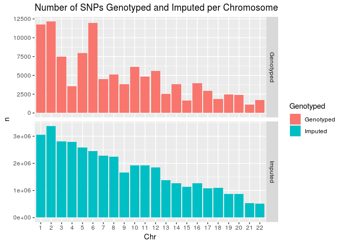

``` r
# total number of snps genotyped and imputed
df %>%
  group_by(Genotyped) %>%
  summarise(n = n()) %>%
  kable(caption = "Total Number of SNPs Genotyped and Imputed")
```

| Genotyped |        n|
|:----------|--------:|
| Genotyped |    23713|
| Imputed   |  5506329|

``` r
df %>%
  mutate(bin = cut(Rsq, breaks = 10)) %>%
  filter(Genotyped == "Imputed") %>%
  group_by(bin) %>%
  summarise(n = n()) %>%
  ggplot(aes(x = bin, y = n)) +
  geom_col() +
  geom_text(aes(label = n), vjust = -1) +
  labs(x = "Rsq Bins", y = "Number of Markers", title = "Total Number of Imputed Markers per Rsq Bin")
```

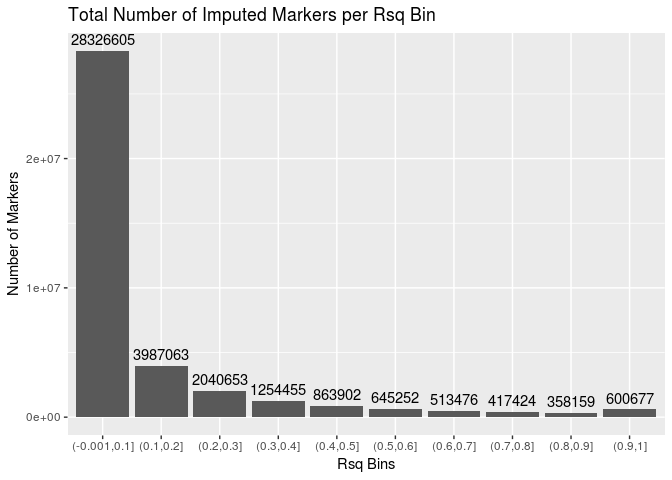

``` r
chrs <- c(1,6)
x2 <- list()

for(i in chrs) {
  x <- post_impute_qc(df, i)
  x2 <- list(x2, x)
}
```

``` r
x2
```

    ## [[1]]
    ## [[1]][[1]]
    ## list()
    ## 
    ## [[1]][[2]]
    ## [[1]][[2]][[1]]

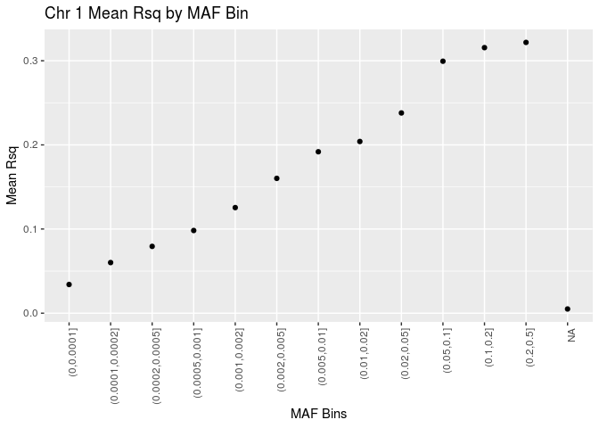

    ## 
    ## [[1]][[2]][[2]]

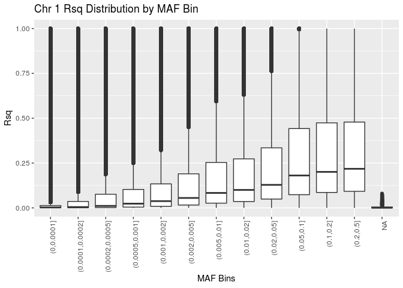

    ## 
    ## [[1]][[2]][[3]]


    ## 
    ## [[1]][[2]][[4]]
    ## 
    ## 
    ## Table: Chr 1 Number of Imputed and Genotyped Markers
    ## 
    ## Genotyped          n
    ## ----------  --------
    ## Genotyped      11740
    ## Imputed      3058191
    ## 
    ## [[1]][[2]][[5]]

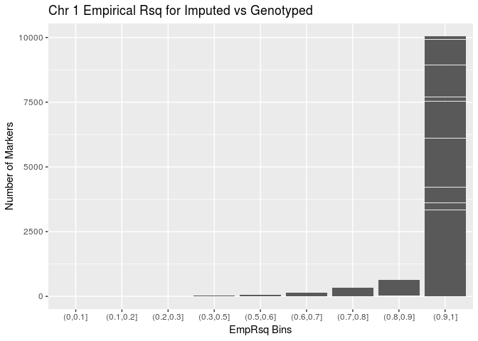

    ## 
    ## [[1]][[2]][[6]]

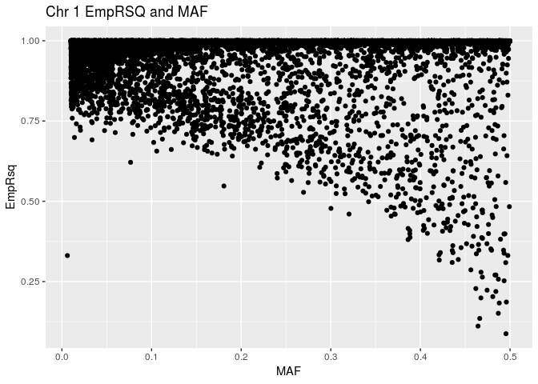

    ## 
    ## [[1]][[2]][[7]]

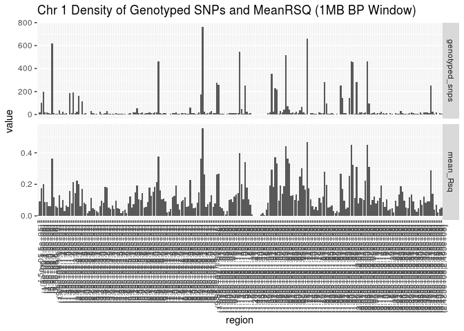

    ## 
    ## [[1]][[2]][[8]]


    ## 
    ## 
    ## 
    ## [[2]]
    ## [[2]][[1]]

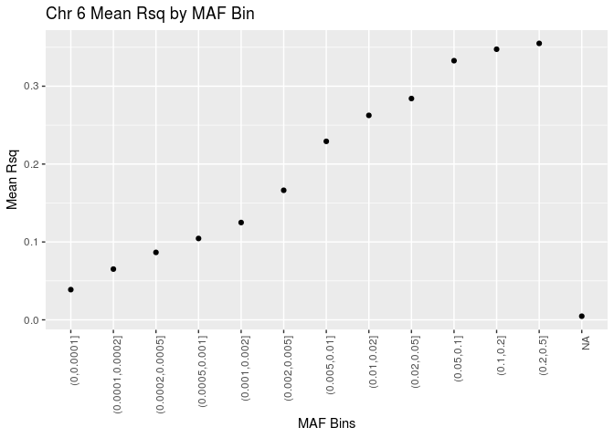

    ## 
    ## [[2]][[2]]

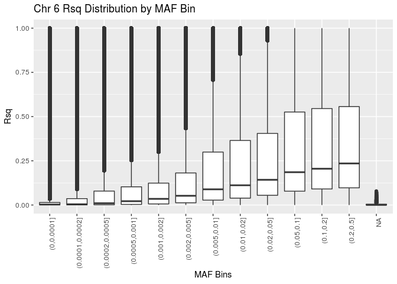

    ## 
    ## [[2]][[3]]

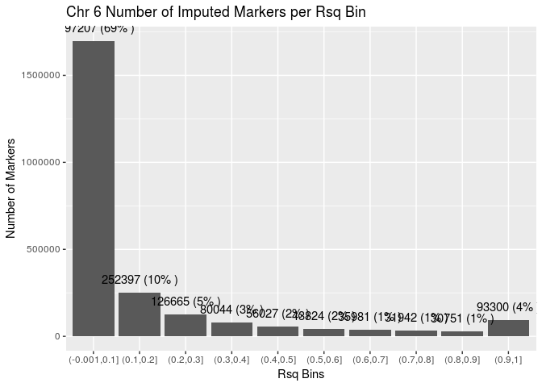

    ## 
    ## [[2]][[4]]
    ## 
    ## 
    ## Table: Chr 6 Number of Imputed and Genotyped Markers
    ## 
    ## Genotyped          n
    ## ----------  --------
    ## Genotyped      11973
    ## Imputed      2448138
    ## 
    ## [[2]][[5]]

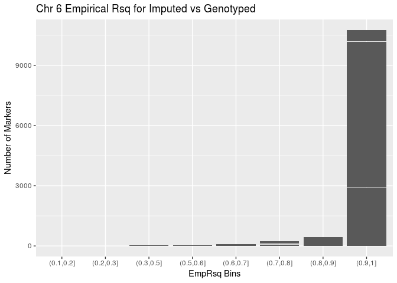

    ## 
    ## [[2]][[6]]

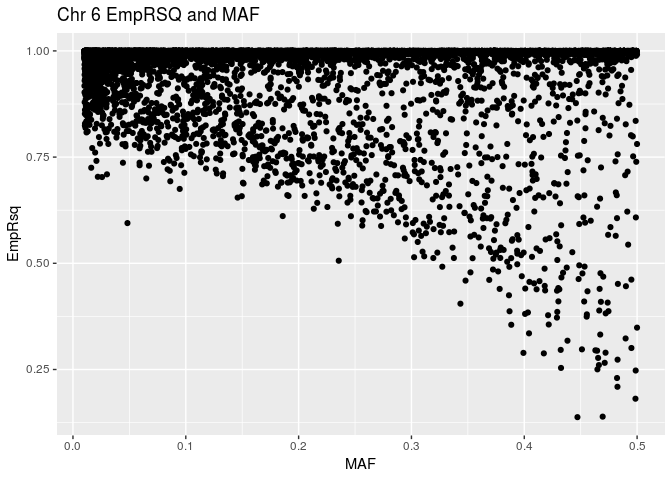

    ## 
    ## [[2]][[7]]

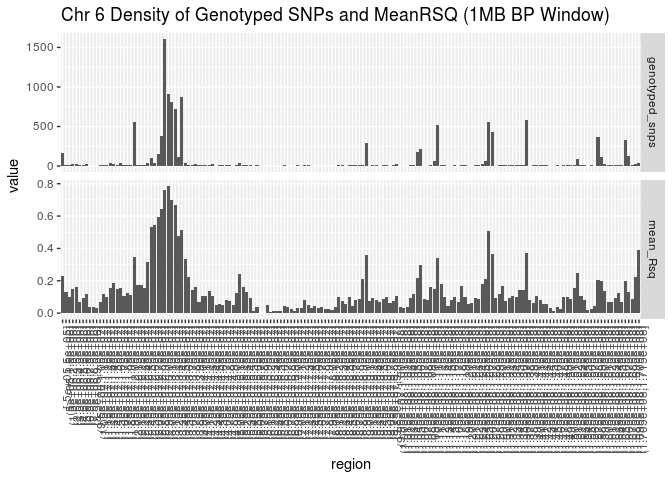

    ## 
    ## [[2]][[8]]

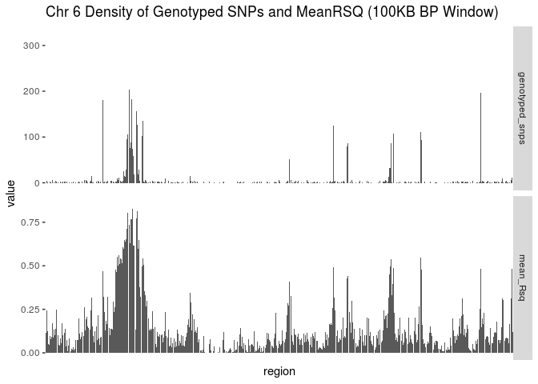
