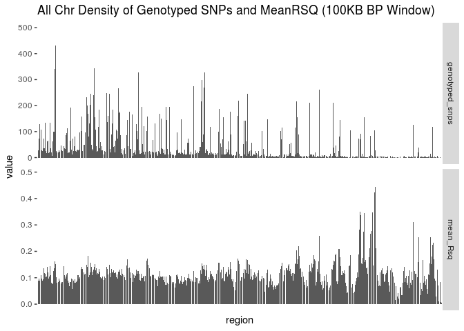

iChip 1 - 6 European Samples Prepare for Imputation Submission
================
Translational Genomics Group
20 February, 2019

``` r
df %>%
  group_by(Chr, Genotyped) %>%
  summarise(n = n()) %>%
  ggplot(aes(x = as.factor(Chr), y = n , fill = Genotyped)) +
  geom_col() +
  facet_grid(Genotyped ~., scales="free_y") +
  labs(title = "Number of SNPs Genotyped and Imputed per Chromosome", x = "Chr")
```


``` r
# total number of snps genotyped and imputed
df %>%
  group_by(Genotyped) %>%
  summarise(n = n()) %>%
  kable(caption = "Total Number of SNPs Genotyped and Imputed")
```

| Genotyped |         n|
|:----------|---------:|
| Genotyped |    109439|
| Imputed   |  39007666|

``` r
df %>%
  filter(Genotyped == "Imputed") %>%
  filter(Rsq > 0.3) %>%
  nrow()
```

    ## [1] 4653345

``` r
df %>%
  mutate(bin = cut(Rsq, breaks = 10)) %>%
  filter(Genotyped == "Imputed") %>%
  group_by(bin) %>%
  summarise(n = n()) %>%
  ggplot(aes(x = bin, y = n)) +
  geom_col() +
  geom_text(aes(label = n), vjust = -0.5) +
  labs(x = "Rsq Bins", y = "Number of Markers", title = "Total Number of Imputed Markers per Rsq Bin")
```


### QC On All Chromosomes

``` r
df_x <- df
  
df_x %>%
  mutate(bin = cut(MAF, breaks = c(0, 0.0001, 0.0002, 0.0005, 0.001, 0.002, 0.005,
                                       0.01, 0.02, 0.05, 0.1, 0.2, 0.5))) %>%
  filter(Genotyped == "Imputed") %>%
  group_by(bin) %>%
  summarise(n = n(), 
            mean = mean(Rsq)) %>%
  ggplot(aes(x = bin, y = mean)) +
  geom_point() +
  theme(axis.text.x = element_text(angle = 90, hjust = 1)) +
  labs(x = "MAF Bins", y = "Mean Rsq", title = paste("All Chr Mean Rsq by MAF Bin", sep = " "))
```


``` r
  # p2 <- df_x %>%
  # mutate(bin = cut(MAF, breaks = c(0, 0.0001, 0.0002, 0.0005, 0.001, 0.002, 0.005,
  #                                  0.01, 0.02, 0.05, 0.1, 0.2, 0.5))) %>%
  # filter(Genotyped == "Imputed") %>%
  # ggplot(aes(x = bin, y = Rsq)) +
  # geom_boxplot()+
  # theme(axis.text.x = element_text(angle = 90, hjust = 1)) +
  # labs(x = "MAF Bins", title = paste("All Chr Rsq Distribution by MAF Bin", sep = " "))
  
df_x %>%
  filter(Genotyped == "Imputed") %>%
  mutate(bin = cut(Rsq, breaks = 10)) %>%
  filter(Genotyped == "Imputed") %>%
  group_by(bin) %>%
  summarise(n = n()) %>%
  mutate(per = round((n / sum(n) * 100), 0)) %>%
  ggplot(aes(x = bin, y = n)) +
  geom_col() +
  geom_text(aes(label = paste0(n, " (", per, "% )")), vjust = -1) +
  labs(x = "Rsq Bins", y = "Number of Markers", title = paste("All Chr Number of Imputed Markers per Rsq Bin", sep = " "))
```


``` r
df_x %>%
    group_by(Genotyped) %>%
    summarise(n = n()) %>%
    kable(caption = paste("All Chr Number of Imputed and Genotyped Markers", sep = " "))
```

| Genotyped |         n|
|:----------|---------:|
| Genotyped |    109439|
| Imputed   |  39007666|

``` r
df_x %>%
    filter(Genotyped == "Genotyped") %>%
    mutate(bin = cut(EmpRsq, breaks = c(0, 0.1, 0.2, 0.3, 0.5, 0.6, 0.7, 0.8, 0.9, 1))) %>%
    ggplot(aes(x = bin, y = EmpRsq)) +
    geom_col() +
    labs(x = "EmpRsq Bins", y = "Number of Markers", title = paste("All Chr Empirical Rsq for Imputed vs Genotyped", sep = " "))
```


``` r
df_x %>%
    filter(Genotyped == "Genotyped") %>%
    ggplot(aes(x = MAF, y = EmpRsq)) +
    geom_point() +
    labs(title = paste("All Chr EmpRSQ and MAF", sep = " "))
```


``` r
  snps_per_region <- df_x %>%
    mutate(region = cut_width(BP, width = 1000000)) %>%
    group_by(region) %>%
    summarise(n_genotyped_snps = sum(Genotyped=="Genotyped"))
  
df_x %>%
    filter(Genotyped == "Imputed") %>%
    mutate(region = cut_width(BP, width = 1000000)) %>%
    left_join(., snps_per_region, by = "region") %>%
    group_by(region) %>%
    summarise(mean_Rsq = mean(Rsq),
            genotyped_snps = mean(n_genotyped_snps)) %>%
    gather(key = "stat", value = "value", -region) %>%
    ggplot(aes(x = region, y = value)) +
    geom_bar(position="dodge", stat="identity") +
    theme(axis.text.x = element_text(angle = 90, hjust = 1)) +
    facet_grid(stat ~., scales="free_y") +
    labs(title = paste("All Chr Density of Genotyped SNPs and MeanRSQ (1MB BP Window)", sep = " "))
```


``` r
  snps_per_region <- df_x %>%
    mutate(region = cut_width(BP, width = 100000)) %>%
    group_by(region) %>%
    summarise(n_genotyped_snps = sum(Genotyped=="Genotyped"))
  
df_x %>%
    filter(Genotyped == "Imputed") %>%
    mutate(region = cut_width(BP, width = 100000)) %>%
    left_join(., snps_per_region, by = "region") %>%
    group_by(region) %>%
    summarise(mean_Rsq = mean(Rsq),
            genotyped_snps = mean(n_genotyped_snps)) %>%
    gather(key = "stat", value = "value", -region) %>%
    ggplot(aes(x = region, y = value)) +
    geom_bar(position="dodge", stat="identity") +
    theme(axis.text.x = element_blank(), axis.ticks.x = element_blank()) +
    facet_grid(stat ~., scales="free_y") +
    labs(title = paste("All Chr Density of Genotyped SNPs and MeanRSQ (100KB BP Window)", sep = " "))
```



``` r
post_impute_qc <- function(df, chr){
  df_x <- df %>%
    filter(Chr == chr)
  
  df_x <- df
  
  p1 <- df_x %>%
  mutate(bin = cut(MAF, breaks = c(0, 0.0001, 0.0002, 0.0005, 0.001, 0.002, 0.005,
                                       0.01, 0.02, 0.05, 0.1, 0.2, 0.5))) %>%
  filter(Genotyped == "Imputed") %>%
  group_by(bin) %>%
  summarise(n = n(), 
            mean = mean(Rsq)) %>%
  ggplot(aes(x = bin, y = mean)) +
  geom_point() +
  theme(axis.text.x = element_text(angle = 90, hjust = 1)) +
  labs(x = "MAF Bins", y = "Mean Rsq", title = paste("Chr", chr, "Mean Rsq by MAF Bin", sep = " "))
  
  p2 <- df_x %>%
  mutate(bin = cut(MAF, breaks = c(0, 0.0001, 0.0002, 0.0005, 0.001, 0.002, 0.005,
                                   0.01, 0.02, 0.05, 0.1, 0.2, 0.5))) %>%
  filter(Genotyped == "Imputed") %>%
  ggplot(aes(x = bin, y = Rsq)) +
  geom_boxplot()+
  theme(axis.text.x = element_text(angle = 90, hjust = 1)) +
  labs(x = "MAF Bins", title = paste("Chr", chr, "Rsq Distribution by MAF Bin", sep = " "))
  
  p3 <- df_x %>%
  filter(Genotyped == "Imputed") %>%
  mutate(bin = cut(Rsq, breaks = 10)) %>%
  filter(Genotyped == "Imputed") %>%
  group_by(bin) %>%
  summarise(n = n()) %>%
  mutate(per = round((n / sum(n) * 100), 0)) %>%
  ggplot(aes(x = bin, y = n)) +
  geom_col() +
  geom_text(aes(label = paste0(n, " (", per, "% )")), vjust = -1) +
  labs(x = "Rsq Bins", y = "Number of Markers", title = paste("Chr", chr, "Number of Imputed Markers per Rsq Bin", sep = " "))
  
  p4 <- df_x %>%
    group_by(Genotyped) %>%
    summarise(n = n()) %>%
    kable(caption = paste("Chr", chr, "Number of Imputed and Genotyped Markers", sep = " "))
  
  p5 <- df_x %>%
    filter(Genotyped == "Genotyped") %>%
    mutate(bin = cut(EmpRsq, breaks = c(0, 0.1, 0.2, 0.3, 0.5, 0.6, 0.7, 0.8, 0.9, 1))) %>%
    ggplot(aes(x = bin, y = EmpRsq)) +
    geom_col() +
    labs(x = "EmpRsq Bins", y = "Number of Markers", title = paste("Chr", chr, "Empirical Rsq for Imputed vs Genotyped", sep = " "))
  
  p6 <- df_x %>%
    filter(Genotyped == "Genotyped") %>%
    ggplot(aes(x = MAF, y = EmpRsq)) +
    geom_point() +
    labs(title = paste("Chr", chr, "EmpRSQ and MAF", sep = " "))
  
  snps_per_region <- df_x %>%
    mutate(region = cut_width(BP, width = 1000000)) %>%
    group_by(region) %>%
    summarise(n_genotyped_snps = sum(Genotyped=="Genotyped"))
  
  p7 <- df_x %>%
    filter(Genotyped == "Imputed") %>%
    mutate(region = cut_width(BP, width = 1000000)) %>%
    left_join(., snps_per_region, by = "region") %>%
    group_by(region) %>%
    summarise(mean_Rsq = mean(Rsq),
            genotyped_snps = mean(n_genotyped_snps)) %>%
    gather(key = "stat", value = "value", -region) %>%
    ggplot(aes(x = region, y = value)) +
    geom_bar(position="dodge", stat="identity") +
    theme(axis.text.x = element_text(angle = 90, hjust = 1)) +
    facet_grid(stat ~., scales="free_y") +
    labs(title = paste("Chr", chr, "Density of Genotyped SNPs and MeanRSQ (1MB BP Window)", sep = " "))
  
  snps_per_region <- df_x %>%
    mutate(region = cut_width(BP, width = 100000)) %>%
    group_by(region) %>%
    summarise(n_genotyped_snps = sum(Genotyped=="Genotyped"))
  
  p8 <- df_x %>%
    filter(Genotyped == "Imputed") %>%
    mutate(region = cut_width(BP, width = 100000)) %>%
    left_join(., snps_per_region, by = "region") %>%
    group_by(region) %>%
    summarise(mean_Rsq = mean(Rsq),
            genotyped_snps = mean(n_genotyped_snps)) %>%
    gather(key = "stat", value = "value", -region) %>%
    ggplot(aes(x = region, y = value)) +
    geom_bar(position="dodge", stat="identity") +
    theme(axis.text.x = element_blank(), axis.ticks.x = element_blank()) +
    facet_grid(stat ~., scales="free_y") +
    labs(title = paste("Chr", chr, "Density of Genotyped SNPs and MeanRSQ (100KB BP Window)", sep = " "))
  
  images <- list(p1, p2, p3, p4, p5, p6, p7, p8)
  return(images)
}
```

``` r
chrs <- c(1:22)
x2 <- list()

for(i in chrs) {
  x <- post_impute_qc(df, i)
  x2 <- list(x2, x)
}
```

Entries with MAF == NA, were not seen in our dataset.
